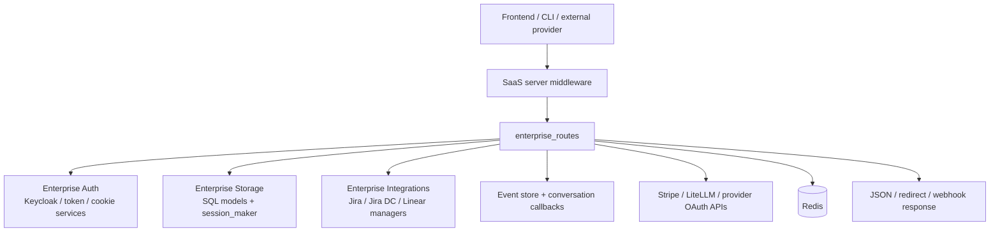
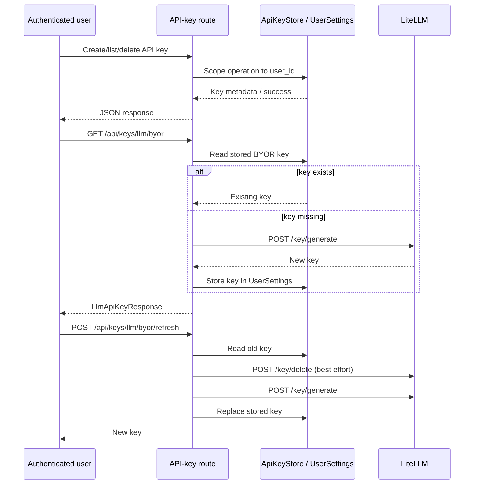
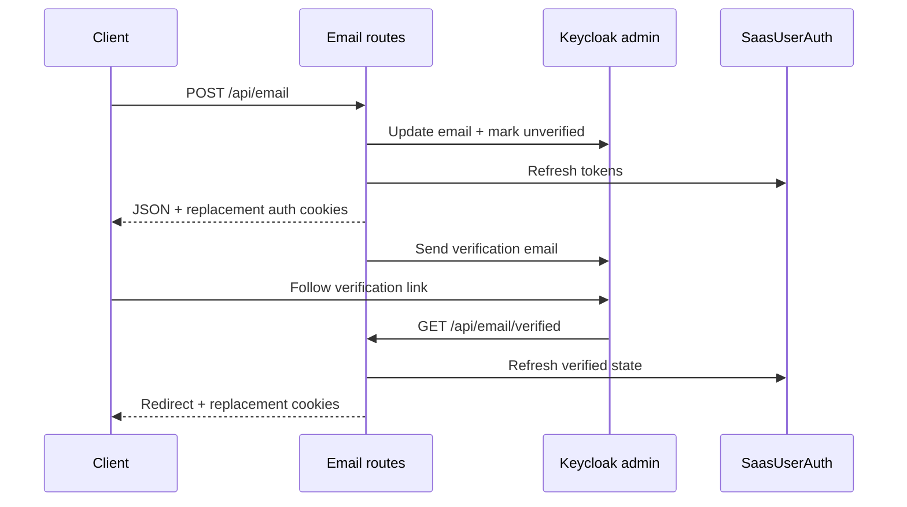
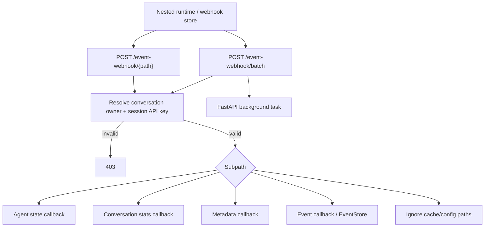
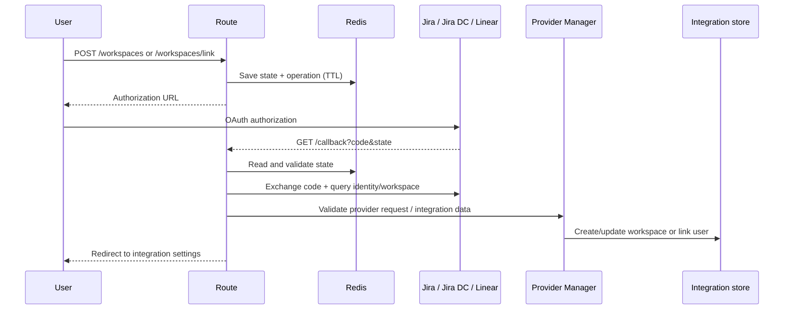

# Enterprise Routes

The `enterprise_routes` module exposes the hosted SaaS HTTP surface for user API keys,
credits and subscriptions, account email changes, conversation feedback, runtime event
webhooks, and external work-management integrations. It is a thin FastAPI orchestration
layer: authentication and cookies come from [Enterprise Auth](enterprise_auth.md),
database records and lifecycle enums come from [Enterprise Storage](enterprise_storage.md),
and provider-specific behavior is implemented by [Enterprise Integrations](enterprise_integrations.md).

## Position in the system



The module serves two interaction directions:

* **User-facing APIs** authenticate a user and return JSON or browser redirects.
* **Provider/runtime callbacks** authenticate a webhook or session key, enqueue work,
  and return quickly so external systems are not blocked by internal processing.

## Component map

| Route area | Main models and handlers | Responsibility |
| --- | --- | --- |
| API keys | `ApiKeyCreate`, `ApiKeyCreateResponse`, `LlmApiKeyResponse` | Create, list, and delete user API keys; provision and refresh a per-user BYOR LiteLLM key. |
| Billing | `BillingSessionType`, `CreateCheckoutSessionRequest`, `GetSessionStatusResponse`, `LiteLlmUserInfo` | Report credits and subscription access, create Stripe setup/payment/subscription sessions, process redirects, and handle subscription webhooks. |
| Email | `EmailUpdate` | Validate and update a Keycloak email, refresh auth tokens, set cookies, and send verification mail. |
| Feedback | `FeedbackRequest` | Store conversation/event ratings and return per-event feedback status. |
| Event webhook | `BatchMethod`, `BatchOperation` | Receive runtime file writes and batches for agent state, metadata, statistics, and events. |
| Jira Cloud | `JiraLinkCreate`, `JiraWorkspaceCreate` | OAuth workspace registration, user linking, validation, unlinking, and signed webhook intake. |
| Jira Data Center | `JiraDcLinkCreate`, `JiraDcWorkspaceCreate` | Jira DC equivalent with optional OAuth and direct-configuration mode. |
| Linear | `LinearLinkCreate`, `LinearWorkspaceCreate` | OAuth workspace registration, user linking, validation, unlinking, and signed webhook intake. |

## Router layout and endpoint contracts

The application mounts independent routers with the following prefixes:

| Router | Prefix | Representative endpoints |
| --- | --- | --- |
| `api_router` in `api_keys.py` | `/api/keys` | `POST /`, `GET /`, `DELETE /{key_id}`, `GET /llm/byor`, `POST /llm/byor/refresh` |
| `billing_router` | `/api/billing` | `/credits`, `/subscription-access`, checkout/session callbacks, `/stripe-webhook` |
| `api_router` in `email.py` | `/api/email` | `POST /`, `PUT /verify`, `GET /verified` |
| `router` in `feedback.py` | `/feedback` | `POST /conversation`, `GET /conversation/{conversation_id}/batch` |
| `event_webhook_router` | `/event-webhook` | `POST /batch`, `POST /{path}`, `DELETE /{path}` |
| `jira_integration_router` | `/integration/jira` | `/events`, `/workspaces`, `/workspaces/link`, `/callback`, validation/unlink endpoints |
| `jira_dc_integration_router` | `/integration/jira-dc` | Same workspace/link/webhook contract, with OAuth feature gating |
| `linear_integration_router` | `/integration/linear` | Same workspace/link/webhook contract, using Linear OAuth and GraphQL |

Models are Pydantic request/response boundaries. Common validation includes UTC-aware
non-expired API-key dates, ratings from 1 through 5, valid email addresses, and workspace
names restricted to letters, digits, `_`, `-`, and `.`. Integration secrets and service
account keys must not contain spaces and are encrypted before persistence.

## API-key and BYOR flows



The BYOR helpers bridge synchronous SQLAlchemy sessions into async routes via
`call_sync_from_async`. LiteLLM calls use the configured service API key and URL. A
refresh continues to generate a replacement even when deletion of the old key fails;
generation or storage failure returns HTTP 500.

## Billing and payment processing

`billing.py` coordinates three systems: Stripe for payment collection, LiteLLM for user
budgets/spend, and SQL billing/subscription records. `calculate_credits()` computes
`max_budget - spend`, clamped at zero. Direct payments update the LiteLLM maximum budget
after Stripe confirms a complete checkout. Subscription access is created by the
`invoice.paid` webhook and is valid for one month for the monthly subscription type.

```mermaid
flowchart LR
    User[User] --> Route[Billing route]
    Route --> Stripe[Stripe Checkout]
    Route --> BillingDB[(BillingSession)]
    Stripe -->|success redirect| Success[/success]
    Success --> Lite[LiteLLM user budget]
    Success --> BillingDB
    Stripe -->|invoice.paid| Webhook[/stripe-webhook]
    Webhook --> Access[(SubscriptionAccess)]
    Route -->|credits| Lite
    Route -->|subscription access| Access
```

Checkout endpoints persist an `in_progress` `BillingSession` keyed by Stripe session ID.
The success callback marks direct payments `completed`; cancellation marks them
`cancelled`. Subscription payments are intentionally processed by the webhook rather
than the browser success callback. Stripe webhook signatures are verified against the
raw request body and `STRIPE_WEBHOOK_SECRET`.

## Email and authentication state

`EmailUpdate` validates the submitted address before `update_email()` updates Keycloak.
The route refreshes `SaasUserAuth`, updates the local verification state, writes new
access/refresh tokens into the response cookie, and sends a verification message. The
verification callback refreshes auth state again and redirects to the user settings
page. Cookie creation and identity mechanics are documented in [Enterprise Auth](enterprise_auth.md).



## Conversation feedback and event webhooks

Feedback is stored as `ConversationFeedback`. Batch reads first verify that conversation
metadata belongs to the authenticated user, enumerate event IDs from `EventStore`, and
return an `event_id -> {exists, rating, reason}` map. The submission model supports an
optional event ID, reason, and arbitrary metadata.

Runtime event webhooks use paths shaped as `sessions/{conversation_id}/{subpath}`. The
session API key is looked up through `conversation_manager` and compared with the request
header. Supported writes are:

* `agent_state.pkl` — binary agent state;
* `conversation_stats.pkl` — binary statistics;
* `metadata.json` — conversation metadata;
* `events/*` — decoded events passed to callback processing;
* `event_cache*` and `exp_config.json` — acknowledged without action.



Batch requests return `202 Accepted` immediately and process each operation independently.
Batch authentication is rechecked when the conversation ID changes. Invalid or unknown
paths are logged; malformed paths receive HTTP 400. The callback utilities and common
event persistence are part of the server/event layers, not duplicated here.

## External integration flows

The Jira Cloud, Jira DC, and Linear route files intentionally share the same lifecycle:

1. Validate workspace and service-account fields.
2. Create a short-lived Redis integration session containing the operation (`workspace_integration` or `workspace_link`) and target workspace.
3. Redirect the user to provider OAuth when required.
4. Validate the OAuth `state`, exchange the code, and query provider identity/workspace data.
5. Create or update the workspace, encrypt stored secrets with `TokenManager`, and create/reactivate the user link.
6. Enforce one active workspace link per user; admins may update/deactivate their workspace.



Provider webhooks validate signatures through the corresponding manager, deduplicate
signatures in Redis with a short TTL, convert payloads into `Message` objects, and enqueue
`receive_message` as a FastAPI background task. Webhooks can be disabled by environment
flags. Jira Cloud and Linear always use the OAuth session flow; Jira DC can either use
OAuth or directly create/link against its configured base URL.

Provider manager and storage details are intentionally referenced rather than repeated:
see [Enterprise Integrations](enterprise_integrations.md) and [Enterprise Storage](enterprise_storage.md).

## Error handling and operational considerations

* Authenticated user routes obtain `user_id` from the shared auth dependency or
  `SaasUserAuth`; provider callbacks rely on a short-lived Redis state record and must
  reject state mismatches.
* Route-level exceptions are converted to stable HTTP responses, while unexpected
  failures are logged with contextual identifiers.
* Stripe and provider webhooks should be monitored for signature failures, duplicate
  delivery, and background-task failures; successful HTTP acknowledgement does not mean
  downstream processing completed.
* Redis state TTLs are deliberately short (typically 60 seconds for OAuth sessions and
  60–300 seconds for webhook deduplication). Retries after expiration require a new flow.
* API keys, OAuth secrets, service-account credentials, and LiteLLM keys are sensitive;
  logs should retain identifiers and lengths only, never full secrets.
* The feedback submission endpoint accepts a conversation ID from the request model and
  persists it; callers should use the authenticated batch endpoint when reading feedback
  so conversation ownership is enforced.

## Related modules

* [Enterprise Server](enterprise_server.md) — SaaS application configuration, middleware, and orchestration.
* [Enterprise Auth](enterprise_auth.md) — Keycloak identity, token management, and auth cookies.
* [Enterprise Storage](enterprise_storage.md) — billing, feedback, integration, and conversation metadata models.
* [Enterprise Integrations](enterprise_integrations.md) — provider managers, services, webhook validation, and messages.
* [Server Core](server_core.md) — common FastAPI middleware and server contracts.
* [Event System](event_system.md) — event streams, event stores, and event serialization.
* [Storage Backends](storage_backends.md) — file persistence and webhook-backed stores.
