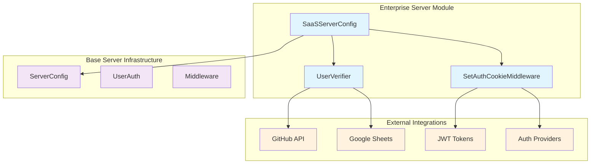
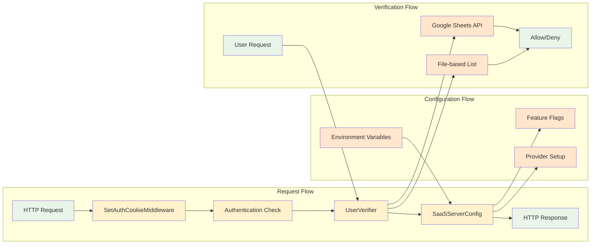
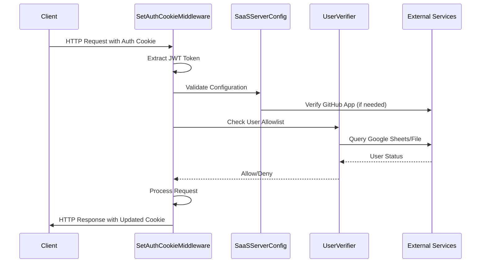

# Enterprise Server Module

## Overview

The `enterprise_server` module provides the enterprise-grade server configuration and authentication infrastructure for OpenHands SaaS deployments. This module extends the base server functionality with enterprise-specific features including advanced authentication, user verification, billing integration, and enhanced security middleware.

## Purpose

The enterprise server module serves as the foundation for OpenHands' Software-as-a-Service (SaaS) offering, providing:

- **Enterprise Configuration Management**: SaaS-specific server configuration with feature flags and provider integrations
- **Advanced Authentication**: Multi-provider authentication with JWT token management and user verification
- **Security Middleware**: Enhanced request processing with authentication state management and cookie handling
- **Integration Support**: Built-in support for GitHub, GitLab, Bitbucket, and enterprise SSO providers

## Architecture Overview

## Core Components

### Configuration Management
The enterprise server's configuration system provides SaaS-specific server settings, feature flag management, and multi-provider authentication setup. See **[Configuration Management](configuration_management.md)** for detailed implementation.

Key capabilities:
- SaaS-specific server configuration extending base OpenHands settings
- Dynamic feature flag management for billing, integrations, and UI customization
- Multi-provider authentication setup (GitHub, GitLab, Bitbucket, Enterprise SSO)
- GitHub App integration with automatic slug retrieval
- Maintenance window configuration and management

### Authentication System  
The user verification system manages access control through allowlist-based user management with support for multiple verification sources. See **[Authentication System](authentication_system.md)** for comprehensive details.

Key capabilities:
- File-based user allowlist management
- Google Sheets integration for dynamic user verification
- Case-insensitive username matching
- Configurable verification sources with fallback support
- Environment-based activation control

### Security Infrastructure
Advanced middleware providing comprehensive authentication state management, secure cookie handling, and request security enforcement. See **[Security Infrastructure](security_infrastructure.md)** for complete implementation details.

Key capabilities:
- JWT token validation and refresh management
- Secure cookie handling with proper security attributes
- Terms of Service enforcement and verification
- Email verification requirement enforcement
- Authentication error handling and cleanup
- GitLab repository synchronization on re-authentication

## Component Relationships

## Integration with Other Modules

The enterprise server module integrates closely with several other system modules:

### Server and API Module
- Extends base [server_and_api](server_and_api.md) functionality with enterprise-specific configurations
- Inherits from `ServerConfig` and `UserAuth` base classes
- Integrates with conversation management and session handling

### Git Integrations Module
- Leverages [git_integrations](git_integrations.md) for provider type definitions
- Supports GitHub, GitLab, and Bitbucket authentication flows
- Manages provider-specific client configurations

### Storage System Module
- Configures enterprise-specific storage implementations from [storage_system](storage_system.md)
- Uses SaaS-optimized conversation, settings, and secrets stores
- Supports clustered storage architectures

### Core Configuration Module
- Builds upon [core_configuration](core_configuration.md) patterns
- Implements enterprise security and authentication configurations
- Manages feature flags and deployment-specific settings

## Key Features

### Multi-Provider Authentication
- **GitHub Integration**: OAuth flow with GitHub Apps support
- **GitLab Integration**: GitLab OAuth with repository synchronization
- **Bitbucket Integration**: Bitbucket OAuth support
- **Enterprise SSO**: Custom enterprise single sign-on integration

### Advanced Security
- **JWT Token Management**: Secure token generation, validation, and refresh
- **Webhook Verification**: GitHub webhook signature verification
- **Cookie Security**: Secure cookie handling with domain and SameSite policies
- **Terms of Service Enforcement**: Automated TOS acceptance verification

### User Management
- **Allowlist Verification**: File-based and Google Sheets user verification
- **Email Verification**: Email verification enforcement
- **Maintenance Windows**: Configurable maintenance mode support
- **Billing Integration**: Optional billing system integration

### Configuration Flexibility
- **Feature Flags**: Runtime feature toggling for billing, LLM settings, and integrations
- **Environment-Based Config**: Comprehensive environment variable configuration
- **Provider Selection**: Dynamic provider configuration based on available credentials
- **Deployment Modes**: Support for different deployment architectures

## Data Flow

## Environment Configuration

The enterprise server module relies on extensive environment variable configuration:

### Authentication Configuration
- `GITHUB_APP_CLIENT_ID`: GitHub application client ID
- `GITHUB_APP_PRIVATE_KEY`: GitHub application private key
- `GITHUB_APP_WEBHOOK_SECRET`: GitHub webhook secret for signature verification
- `GITLAB_APP_CLIENT_ID`: GitLab application client ID
- `BITBUCKET_APP_CLIENT_ID`: Bitbucket application client ID

### Feature Flags
- `ENABLE_BILLING`: Enable billing system integration
- `HIDE_LLM_SETTINGS`: Hide LLM configuration from users
- `ENABLE_JIRA`: Enable Jira integration
- `ENABLE_JIRA_DC`: Enable Jira Data Center integration
- `ENABLE_LINEAR`: Enable Linear integration
- `ENABLE_ENTERPRISE_SSO`: Enable enterprise SSO support

### User Verification
- `GITHUB_USER_LIST_FILE`: Path to file-based user allowlist
- `GITHUB_USERS_SHEET_ID`: Google Sheets ID for user verification
- `DISABLE_WAITLIST`: Disable user verification entirely

### System Configuration
- `OPENHANDS_CONFIG_CLS`: Configuration class path
- `POSTHOG_CLIENT_KEY`: PostHog analytics client key
- `AUTH_URL`: Custom authentication URL
- `MAINTENANCE_START_TIME`: Maintenance window start time

## Security Considerations

### Token Security
- JWT tokens use secure signing algorithms (RS256 for GitHub, HS256 for internal)
- Token expiration and refresh mechanisms prevent long-lived access
- Secure cookie attributes (HttpOnly, Secure, SameSite) protect against XSS and CSRF

### Webhook Security
- HMAC-SHA256 signature verification for GitHub webhooks
- Constant-time comparison prevents timing attacks
- Proper error handling prevents information leakage

### User Verification
- Multiple verification methods (file-based, Google Sheets) provide flexibility
- Case-insensitive username matching prevents bypass attempts
- Graceful fallback when verification services are unavailable

## Deployment Considerations

### High Availability
- Supports clustered conversation management for horizontal scaling
- Stateless middleware design enables load balancing
- External service dependencies (GitHub, Google Sheets) have proper error handling

### Monitoring and Observability
- Comprehensive logging throughout authentication flows
- PostHog integration for analytics and user behavior tracking
- Error tracking and debugging support

### Maintenance and Updates
- Configurable maintenance windows with user notification
- Rolling update support through stateless design
- Environment-based configuration enables zero-downtime updates

## Related Documentation

- **[Configuration Management](configuration_management.md)**: Detailed SaaS server configuration
- **[Authentication System](authentication_system.md)**: User verification and allowlist management
- **[Security Infrastructure](security_infrastructure.md)**: Authentication middleware and security features
- **[Server and API](server_and_api.md)**: Base server infrastructure
- **[Git Integrations](git_integrations.md)**: Provider integration details
- **[Storage System](storage_system.md)**: Enterprise storage implementations