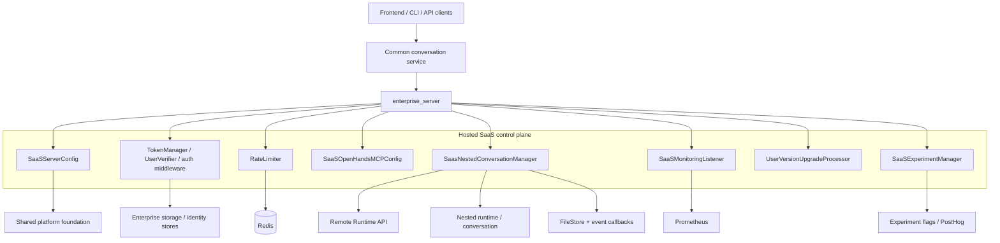
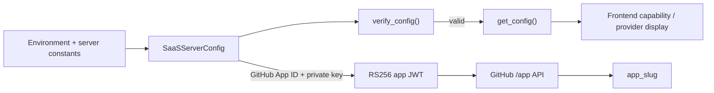
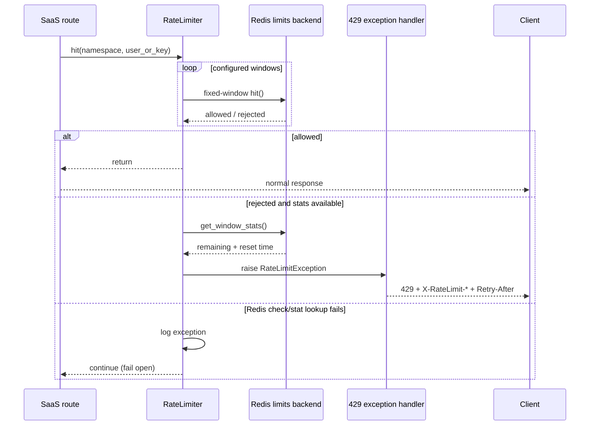
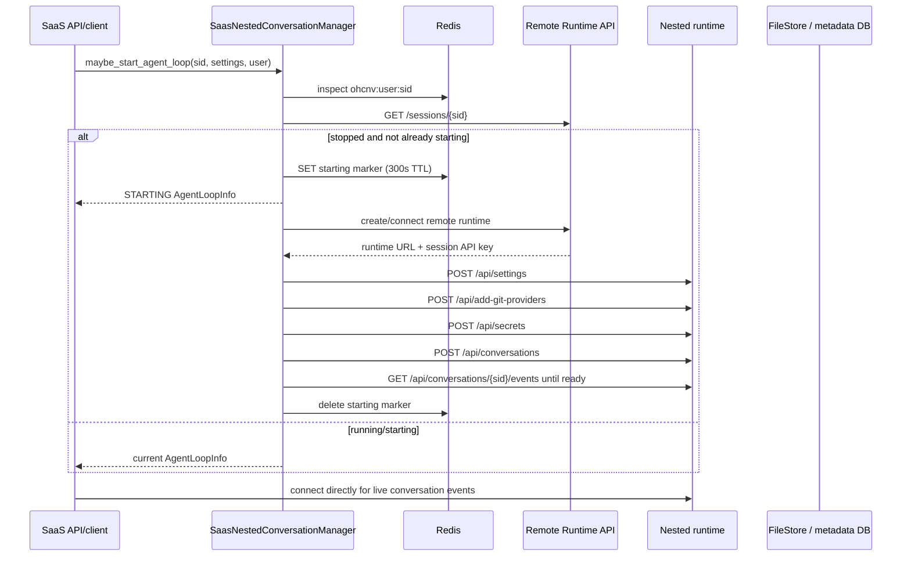
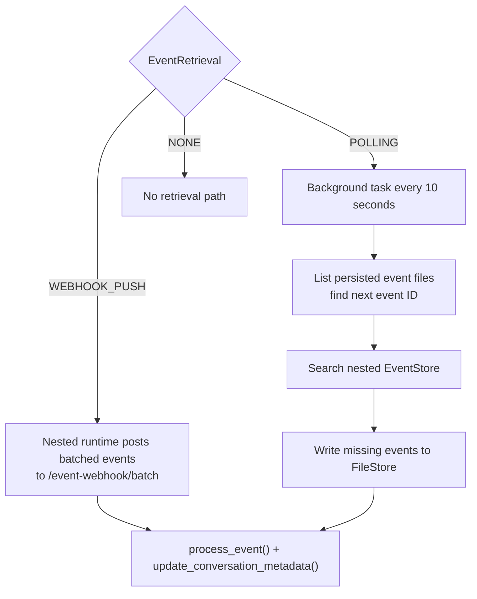
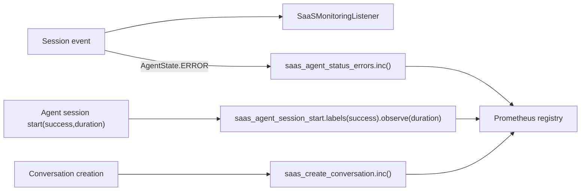
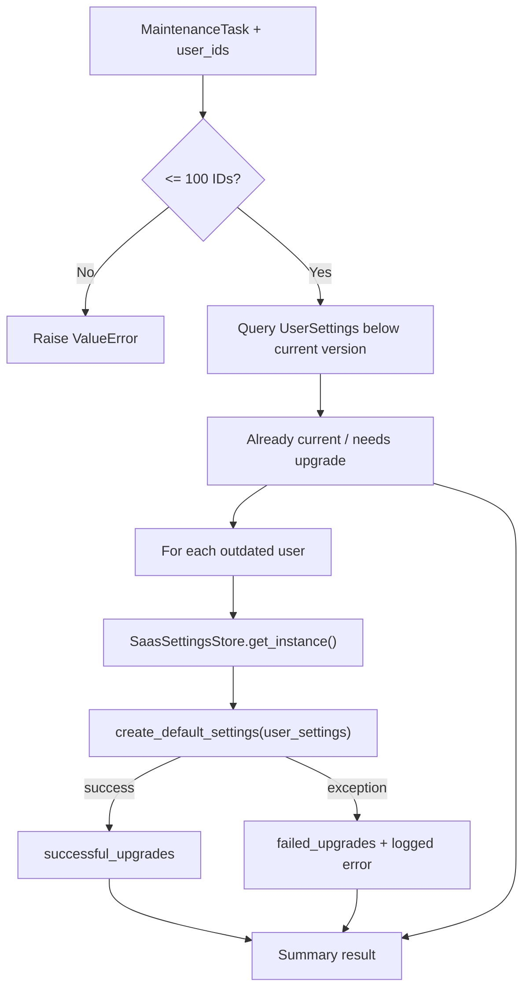
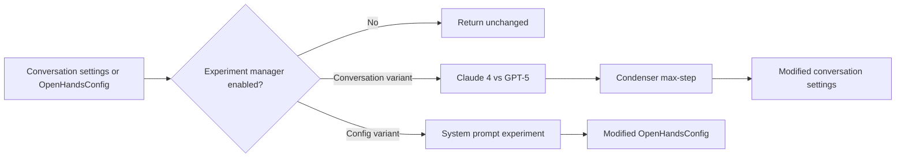
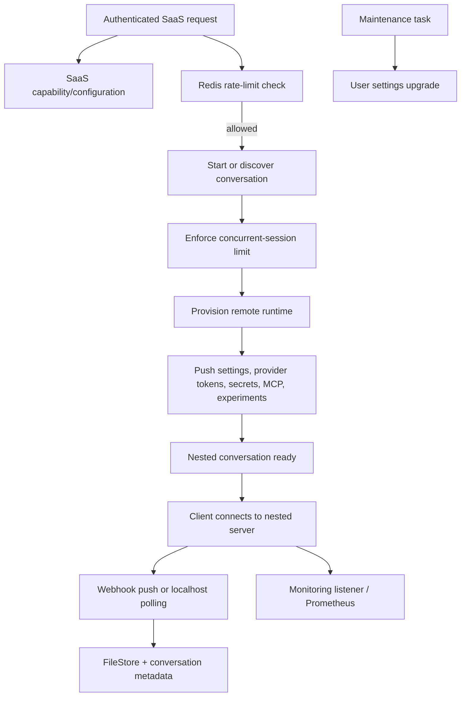

# Enterprise Server

The `enterprise_server` module is the hosted SaaS control-plane layer for OpenHands. It
specializes the shared conversation service with SaaS configuration, authentication and
webhook security, distributed rate limiting, remote/nested conversation orchestration,
Prometheus monitoring, maintenance-task processing, MCP provisioning, and experiment
assignment.

It is an overlay around the common platform rather than a replacement for the agent
runtime. Core HTTP/session contracts are described in [Server Core](server_core.md) and
[Server Sessions](server_sessions.md); sandbox execution is described in the
[Sandboxed Execution Layer](sandboxed_execution_layer.md); durable event and file
semantics are described in [Event System](event_system.md) and [Storage Backends](storage_backends.md).

## Position in the system

```mermaid
graph TB
    Clients["Frontend / CLI / API clients"] --> Common["Common conversation service"]
    Common --> ES["enterprise_server"]

    subgraph SaaS["Hosted SaaS control plane"]
        CFG["SaaSServerConfig"]
        AUTH["TokenManager / UserVerifier / auth middleware"]
        RL["RateLimiter"]
        MCP["SaaSOpenHandsMCPConfig"]
        CM["SaasNestedConversationManager"]
        MON["SaaSMonitoringListener"]
        MAINT["UserVersionUpgradeProcessor"]
        EXP["SaaSExperimentManager"]
    end

    ES --> CFG
    ES --> AUTH
    ES --> RL
    ES --> MCP
    ES --> CM
    ES --> MON
    ES --> MAINT
    ES --> EXP

    CFG --> Foundation["Shared platform foundation"]
    AUTH --> Stores["Enterprise storage / identity stores"]
    RL --> Redis[(Redis)]
    CM --> RuntimeAPI["Remote Runtime API"]
    CM --> Nested["Nested runtime / conversation"]
    CM --> Events["FileStore + event callbacks"]
    MON --> Prom["Prometheus"]
    EXP --> Flags["Experiment flags / PostHog"]
```

The module has two distinct planes:

* The **control plane** authenticates requests, advertises SaaS capabilities, applies
  quotas, provisions MCP credentials, starts and monitors remote conversations, and
  runs operational maintenance.
* The **execution plane** lives in remote runtime containers. The SaaS server passes
  settings and credentials to that runtime, then clients connect to the nested server
  for the live agent loop.

## Component map

| Area | Components | Responsibility |
| --- | --- | --- |
| SaaS configuration | `SaaSServerConfig`, `sign_token`, `verify_signature` | Select SaaS mode, expose feature/provider configuration, resolve the GitHub App slug, and validate webhook signatures. |
| Request protection | `RateLimiter`, `RateLimitResult`, `RateLimitException` | Enforce Redis-backed fixed-window quotas and emit standard response headers. |
| MCP access | `SaaSOpenHandsMCPConfig` | Provision or retrieve a per-user MCP API key and produce a stateless Streamable HTTP endpoint configuration. |
| Conversation orchestration | `SaasNestedConversationManager`, `EventRetrieval` | Create remote runtimes, initialize nested conversations, discover status, forward events, and retrieve events by webhook or polling. |
| Monitoring | `SaaSMonitoringListener` | Translate agent/session/conversation lifecycle signals into Prometheus counters and histograms. |
| Maintenance | `UserVersionUpgradeProcessor` | Upgrade up to 100 selected users whose stored settings version is older than the current version. |
| Experimentation | `SaaSExperimentManager` | Apply conversation- and configuration-scoped variants when the experiment manager is enabled. |

Routes, request models, billing, feedback, integration endpoints, and webhook batch
contracts belong to [Enterprise Routes](enterprise_routes.md). Persistence models and
status enums belong to [Enterprise Storage](enterprise_storage.md). Provider-specific
manager/service behavior belongs to [Enterprise Integrations](enterprise_integrations.md).

## SaaS configuration and security

`SaaSServerConfig` extends the shared `ServerConfig` contract and fixes `app_mode` to
`AppMode.SAAS`. Its class attributes are primarily populated from environment variables
and enterprise server constants. It selects SaaS implementations for settings, secrets,
conversations, monitoring, and authentication through import-path strings.

```mermaid
flowchart LR
    Env["Environment + server constants"] --> Config["SaaSServerConfig"]
    Config --> Verify["verify_config()"]
    Verify -->|valid| Public["get_config()"]
    Public --> Frontend["Frontend capability / provider display"]
    Config -->|GitHub App ID + private key| JWT["RS256 app JWT"]
    JWT --> GitHub["GitHub /app API"]
    GitHub --> Slug["app_slug"]
```

`verify_config()` requires a config class path and PostHog client key; when a GitHub App
is configured it also requires the GitHub client ID. During initialization,
`_get_app_slug()` signs a short-lived GitHub App JWT, calls `https://api.github.com/app`,
and stores the returned slug. Failure to retrieve a valid slug raises an exception and
therefore fails configuration initialization.

`get_config()` exposes only client-safe capability data: SaaS mode, app slug, GitHub
client ID, PostHog key, feature flags, configured identity providers, optional
maintenance start time, and optional auth URL. Secret keys and private signing material
are not included.

### Webhook signature verification

`verify_signature(payload, signature)` protects GitHub webhook payloads using the
`GITHUB_APP_WEBHOOK_SECRET`. It rejects a missing `x-hub-signature-256` value with HTTP
403, computes an HMAC-SHA256 digest, and compares the expected and supplied signatures
with `hmac.compare_digest`. The caller is responsible for passing the exact raw request
body; parsing and re-serializing JSON before verification would change the signed bytes.

### Authentication boundary

`TokenManager`, `UserVerifier`, GitHub-specific verification, and cookie middleware are
enterprise authentication services. Their detailed contracts are in
[Enterprise Auth](enterprise_auth.md). `enterprise_server` consumes their identity
boundary while `SaaSServerConfig.user_auth_class` selects the SaaS authentication
implementation.

## Distributed rate limiting

`create_redis_rate_limiter()` builds a `limits` fixed-window strategy over authenticated
Redis storage. A `RateLimiter` parses multiple windows such as `10/second; 100/minute`
and checks every window for a namespace/key pair.

```mermaid
sequenceDiagram
    participant Route as SaaS route
    participant Limiter as RateLimiter
    participant Redis as Redis limits backend
    participant Handler as 429 exception handler
    participant Client

    Route->>Limiter: hit(namespace, user_or_key)
    loop configured windows
        Limiter->>Redis: fixed-window hit()
        Redis-->>Limiter: allowed / rejected
    end
    alt allowed
        Limiter-->>Route: return
        Route-->>Client: normal response
    else rejected and stats available
        Limiter->>Redis: get_window_stats()
        Redis-->>Limiter: remaining + reset time
        Limiter->>Handler: raise RateLimitException
        Handler-->>Client: 429 + X-RateLimit-* + Retry-After
    else Redis check/stat lookup fails
        Limiter->>Limiter: log exception
        Limiter-->>Route: continue (fail open)
    end
```

For a rejected window, `RateLimitResult` supplies `X-RateLimit-Limit`,
`X-RateLimit-Remaining`, `X-RateLimit-Reset`, and, when exhausted, `Retry-After`.
Applications must call `setup_rate_limit_handler(app)` to install the JSON 429 handler.
Redis failures are logged and swallowed by design, so this protection fails open during
backend problems; deployments should monitor Redis availability separately.

## Nested remote conversation orchestration

`SaasNestedConversationManager` implements the conversation-manager contract for a
deployment where agent loops run inside remote runtime containers. The SaaS process
coordinates the runtime but does not attach clients to its own event stream. The methods
`attach_to_conversation`, `join_conversation`, `send_to_event_stream`, and related
connection methods intentionally raise `unsupported_operation`; clients connect to the
nested server URL returned in `AgentLoopInfo`.

```mermaid
sequenceDiagram
    participant User as SaaS API/client
    participant CM as SaasNestedConversationManager
    participant Redis
    participant RAPI as Remote Runtime API
    participant Runtime as Nested runtime
    participant Store as FileStore / metadata DB

    User->>CM: maybe_start_agent_loop(sid, settings, user)
    CM->>Redis: inspect ohcnv:user:sid
    CM->>RAPI: GET /sessions/{sid}
    alt stopped and not already starting
        CM->>Redis: SET starting marker (300s TTL)
        CM-->>User: STARTING AgentLoopInfo
        CM->>RAPI: create/connect remote runtime
        RAPI-->>CM: runtime URL + session API key
        CM->>Runtime: POST /api/settings
        CM->>Runtime: POST /api/add-git-providers
        CM->>Runtime: POST /api/secrets
        CM->>Runtime: POST /api/conversations
        CM->>Runtime: GET /api/conversations/{sid}/events until ready
        CM->>Redis: delete starting marker
    else running/starting
        CM-->>User: current AgentLoopInfo
    end
    User->>Runtime: connect directly for live conversation events
```

### Startup responsibilities

`_start_agent_loop()` first enforces the per-user concurrent-conversation limit, creates
a `RemoteRuntime`, connects it, obtains `X-Session-API-Key`, and starts the nested
conversation. Runtime environment variables force the nested process into standalone
conversation-manager mode, disable its frontend, configure workspace and service ports,
and preserve the conversation ID. The runtime image is cached after the first successful
connection when possible.

Settings are sent in separate stages to avoid transmitting values through the general
settings payload:

1. sanitized conversation settings;
2. Git provider tokens from `ProviderHandler`;
3. custom secrets;
4. experiment-derived configuration;
5. initial message, repository/branch metadata, MCP configuration, and replay data.

The manager provisions a user MCP API key through `ApiKeyStore`, merges it with any
conversation MCP settings, and gives the nested runtime the SaaS endpoint
`https://<web-host>/mcp/mcp`.

### Conversation limit enforcement

Before starting a runtime, `ensure_num_conversations_below_limit()` discovers active
loops for the user. If the configured maximum is exceeded, it loads metadata, sorts
conversations by last update (newest first), emits a client-visible error for the oldest
conversation, and pauses that session until the limit is satisfied.

### Event retrieval modes

```mermaid
flowchart TD
    Mode{"EventRetrieval"} -->|WEBHOOK_PUSH| Hook["Nested runtime posts batched events\nto /event-webhook/batch"]
    Hook --> Shared["process_event() + update_conversation_metadata()"]
    Mode -->|POLLING| Poll["Background task every 10 seconds"]
    Poll --> List["List persisted event files\nfind next event ID"]
    List --> Search["Search nested EventStore"]
    Search --> Write["Write missing events to FileStore"]
    Write --> Shared
    Mode -->|NONE| Noop["No retrieval path"]
```

In hosted environments, `get_instance()` selects `WEBHOOK_PUSH`; localhost selects
`POLLING` because remote webhook callbacks may be unavailable. Webhook push is preferred
for distributed deployments because it avoids long-lived connections and allows replicas
to remain stateless. Polling is a fallback/debug path and runs only while the process
shutdown predicate permits it.

Runtime discovery combines Redis startup markers with Runtime API session listings.
`get_agent_loop_info()` also queries the nested runtime for its finer-grained
`RuntimeStatus`, while conversation lifecycle is normalized to shared
`ConversationStatus` values. See [Remote Runtime](runtime_implementations_orchestrated_remote_runtime.md)
and [Conversation Status](storage_backends_conversation_status.md) for the lower-level
contracts.

## Monitoring and operational signals

`SaaSMonitoringListener` adapts common monitoring callbacks to Prometheus metrics:

| Metric | Type | Trigger |
| --- | --- | --- |
| `saas_agent_status_errors` | Counter | An `AgentStateChangedObservation` enters `AgentState.ERROR`. |
| `saas_create_conversation` | Counter | Conversation creation begins. |
| `saas_agent_session_start` | Histogram, `success` label | Agent session startup completes, with observed duration. |

```mermaid
flowchart LR
    Event["Session event"] --> Listener["SaaSMonitoringListener"]
    Event -->|AgentState.ERROR| Error["saas_agent_status_errors.inc()"]
    Start["Agent session start(success,duration)"] --> Hist["saas_agent_session_start.labels(success).observe(duration)"]
    Create["Conversation creation"] --> Count["saas_create_conversation.inc()"]
    Error --> Prom["Prometheus registry"]
    Hist --> Prom
    Count --> Prom
```

The create-conversation counter records attempts, not outcome. The listener also emits
structured logs with a signal name, allowing logs and metrics to be correlated.

## Maintenance task: user settings upgrades

`UserVersionUpgradeProcessor` processes an explicit list of user IDs and upgrades only
rows below `CURRENT_USER_SETTINGS_VERSION`. It rejects batches larger than 100 IDs,
loads the current OpenHands configuration, queries settings once, and upgrades users
individually through `SaasSettingsStore.create_default_settings()`.

```mermaid
flowchart TD
    Task["MaintenanceTask + user_ids"] --> Limit{"<= 100 IDs?"}
    Limit -->|No| Reject["Raise ValueError"]
    Limit -->|Yes| Query["Query UserSettings below current version"]
    Query --> Split["Already current / needs upgrade"]
    Split --> Each["For each outdated user"]
    Each --> Store["SaasSettingsStore.get_instance()"]
    Store --> Upgrade["create_default_settings(user_settings)"]
    Upgrade -->|success| Good["successful_upgrades"]
    Upgrade -->|exception| Bad["failed_upgrades + logged error"]
    Good --> Result["Summary result"]
    Bad --> Result
    Split --> Result
```

The processor is partially successful: one user failure does not prevent other users
from being attempted. Its result distinguishes already-current users, successful
upgrades, and failures, which makes task retries and operational diagnosis explicit.

## Experiment assignment

`SaaSExperimentManager` wraps the shared `ExperimentManager` and delegates variant logic
to experiment-version handlers. When `ENABLE_EXPERIMENT_MANAGER` is false, both entry
points return their input unchanged.

```mermaid
flowchart LR
    Input["Conversation settings or OpenHandsConfig"] --> Enabled{"Experiment manager enabled?"}
    Enabled -->|No| Same["Return unchanged"]
    Enabled -->|Conversation variant| C1["Claude 4 vs GPT-5"]
    C1 --> C2["Condenser max-step"]
    C2 --> Out["Modified conversation settings"]
    Enabled -->|Config variant| S["System prompt experiment"]
    S --> ConfigOut["Modified OpenHandsConfig"]
```

Conversation-scoped tests may alter model or condenser settings. Configuration-scoped
tests modify the full OpenHands configuration, currently through the system-prompt
experiment. The nested conversation manager invokes the configuration path before
posting experiment configuration to the remote runtime.

## End-to-end SaaS process flow

```mermaid
flowchart TB
    Request["Authenticated SaaS request"] --> Config["SaaS capability/configuration"]
    Request --> Quota["Redis rate-limit check"]
    Quota -->|allowed| Start["Start or discover conversation"]
    Start --> Limit["Enforce concurrent-session limit"]
    Limit --> Runtime["Provision remote runtime"]
    Runtime --> Init["Push settings, provider tokens, secrets, MCP, experiments"]
    Init --> Ready["Nested conversation ready"]
    Ready --> Live["Client connects to nested server"]
    Live --> Events["Webhook push or localhost polling"]
    Events --> Durable["FileStore + conversation metadata"]
    Live --> Metrics["Monitoring listener / Prometheus"]
    Maintenance["Maintenance task"] --> Upgrade["User settings upgrade"]
```

## Configuration and failure considerations

* SaaS mode depends on environment-driven credentials and feature constants; run
  `verify_config()` during startup so missing required configuration fails early.
* GitHub App initialization performs a live API request. Network, key, clock-skew, or
  missing-slug failures prevent successful configuration construction.
* Webhook signature validation must use the raw body and the configured shared secret.
* Rate-limit Redis errors fail open by implementation. Alert on the logged lookup errors
  if quota enforcement is a security or availability requirement.
* The nested manager uses a short-lived Redis startup marker to deduplicate concurrent
  starts. The five-minute TTL prevents a crashed starter from blocking a conversation
  forever, but a slow startup beyond the TTL may still need idempotent runtime handling.
* Provider tokens and custom secrets are transmitted to the nested runtime over an
  authenticated session API key. Runtime/network logging must avoid exposing those
  payloads.
* Polling event retrieval is intended for localhost/debug operation. Production
  deployments should provide the webhook path and shared event-processing logic.

## Related modules

* [Enterprise Routes](enterprise_routes.md) — SaaS HTTP endpoints and request models.
* [Enterprise Auth](enterprise_auth.md) — identity verification, tokens, and auth cookies.
* [Enterprise Storage](enterprise_storage.md) — SaaS persistence models and lifecycle enums.
* [Enterprise Integrations](enterprise_integrations.md) — GitHub, GitLab, Bitbucket, Jira, Linear, and Slack services.
* [Enterprise Solvability](enterprise_solvability.md) — issue solvability classification and features.
* [Server Core](server_core.md) — common middleware and server contracts.
* [Server Sessions](server_sessions.md) — non-nested conversation/session lifecycle.
* [Remote Runtime](runtime_implementations_orchestrated_remote_runtime.md) — remote sandbox control and action execution.
* [Event System](event_system.md) — event streams, serialization, and subscribers.
* [Storage Backends](storage_backends.md) — FileStore implementations and webhook decorators.
