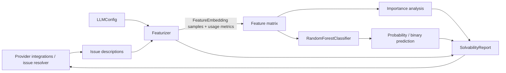
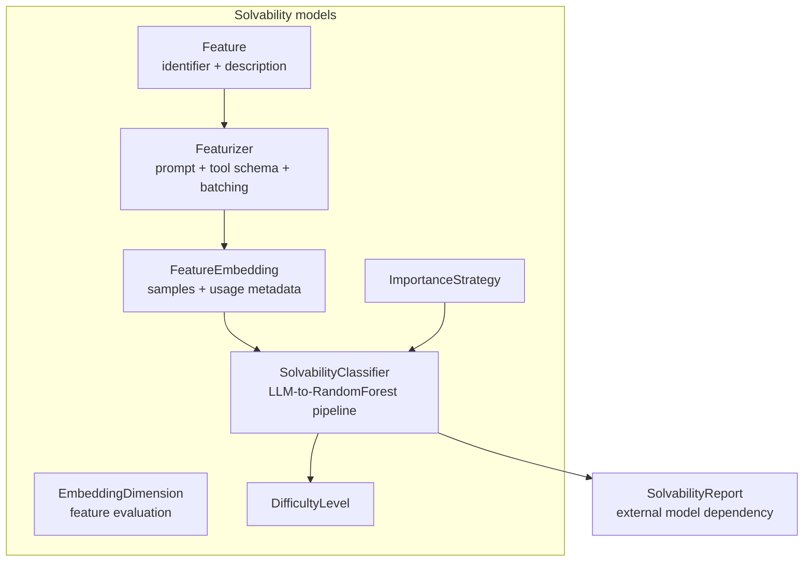
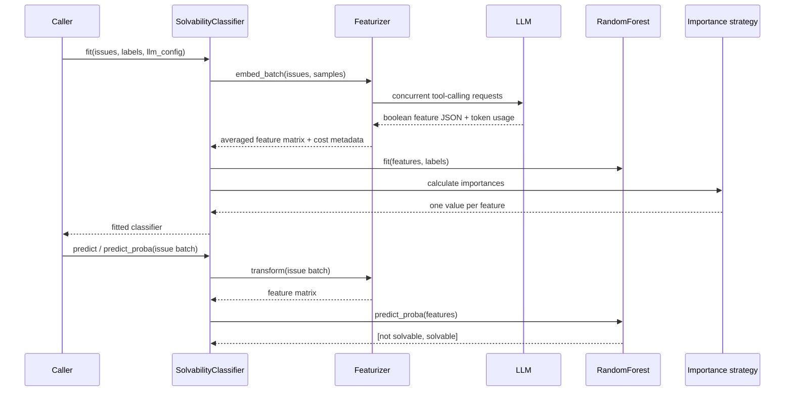

# Enterprise Solvability

The `enterprise/integrations/solvability` module predicts whether an issue—primarily a GitHub issue—is likely to be solvable by OpenHands. It combines LLM-based semantic feature extraction with a scikit-learn `RandomForestClassifier`, then exposes probabilities, binary predictions, feature importance, cost/latency metadata, and a user-facing solvability report.

## Position in the system

The module is a model layer inside the enterprise integrations boundary. Provider-specific integrations and resolver workflows can supply issue text and consume a score or report; the module itself does not fetch issues, execute agent tasks, or decide which provider is used. It depends on the shared LLM configuration and LLM client, and its feature/cost output can be attached to higher-level integration or resolver records.

## Architecture

The runtime flow is:

## Sub-modules

- [Classifier and feature extraction](enterprise_solvability_classifier_featurizer.md) — the main LLM-to-ML pipeline, embedding representation, batching, model lifecycle, serialization, and report generation.
- [Scoring and explanation policies](enterprise_solvability_scoring.md) — feature-importance choices and conversion of solvability scores into display-oriented difficulty levels.

## Public responsibilities

| Component | Responsibility |
|---|---|
| `Featurizer` | Defines prompts and boolean feature tool schema; calls the LLM repeatedly and concurrently; aggregates samples and usage metrics. |
| `FeatureEmbedding` | Converts repeated boolean evaluations into continuous coefficients and exposes entropy/metadata. |
| `SolvabilityClassifier` | Transforms issue text, trains/predicts with a random forest, calculates importances, and creates reports. |
| `ImportanceStrategy` | Selects SHAP, permutation, or impurity-based explanations. |
| `DifficultyLevel` | Maps a score to `EASY`, `MEDIUM`, or `HARD` using descending thresholds. |
| `SolvabilityReport` | Report DTO imported by the classifier; implementation was not included in the supplied module tree. |

## Operational considerations

Each issue can trigger `samples` LLM calls (default `10`); a batch additionally runs issues concurrently. This improves throughput but increases LLM cost and rate-limit pressure. `cost_` retains prompt/completion token counts and latency for the latest transformation. The classifier requires fitting before `solvability_report()` can be called.

Adding or removing features changes the random forest input shape and therefore requires retraining. Random-state validation keeps the top-level setting and the underlying forest aligned for reproducibility.

The random forest is serialized as a base64-encoded pickle through Pydantic field hooks. Treat serialized models as trusted data: unpickling arbitrary input is unsafe.

## Related modules

The module is consumed conceptually by the enterprise integration layer documented in [enterprise_integrations_shared.md](enterprise_integrations_shared.md), while shared LLM configuration and clients are described in [core_configuration.md](core_configuration.md) and [llm_layer_clients_sync_core.md](llm_layer_clients_sync_core.md). These references describe surrounding contracts; solvability-specific behavior remains in the documents above.
