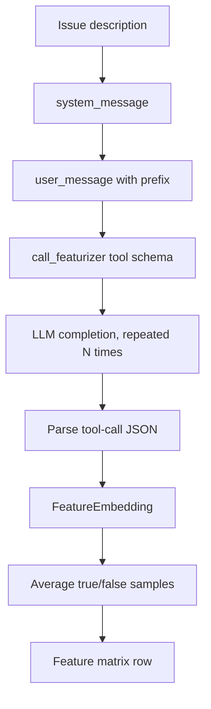
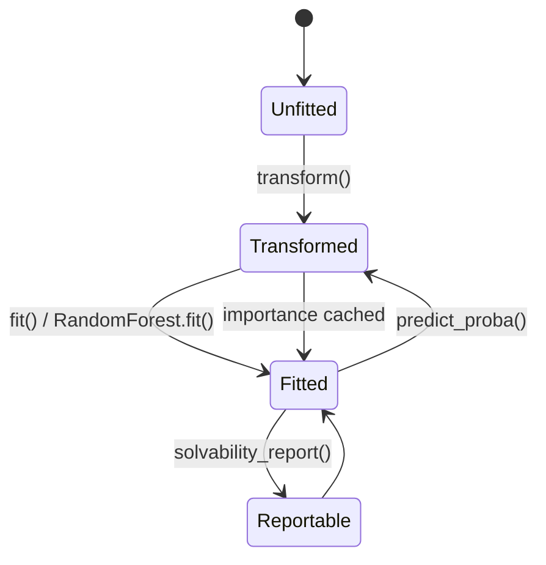

# Enterprise Solvability: Classifier and Feature Extraction

This sub-module contains the data representation and execution pipeline that turns issue text into solvability predictions.

## Feature model

`Feature` is a Pydantic model with a unique `identifier` and an LLM-facing `description`. The identifier becomes a DataFrame column and must remain stable across training and inference. `to_tool_description_field` exposes each feature as a required-by-schema conceptual boolean field for the `call_featurizer` tool.

`EmbeddingDimension` represents one feature evaluation (`feature_id`, `result`). The current embedding implementation uses the simpler `EmbeddingSample` mapping (`dict[str, bool]`) internally. `FeatureEmbedding` stores repeated samples plus aggregate prompt tokens, completion tokens, and response latency.

For a dimension, `coefficient()` is the proportion of samples evaluating it as true. Thus a feature matrix contains values in `[0, 1]`, not merely booleans. `sample_entropy()` measures response variability: zero means consistent evaluations, while higher values indicate ambiguity or LLM instability.

## Featurizer workflow

`embed()` creates an `LLM` client using `LLMConfig` and service id `solvability`. Every request forces the `call_featurizer` tool through `tool_choice`, so the expected response is structured JSON. When `samples > 1`, the user message enables ephemeral caching; single-sample calls disable it to avoid cache overhead.

`embed_batch()` submits one `embed()` task per issue to a `ThreadPoolExecutor`. Completed futures are written back by original index, preserving input order even though requests finish out of order.

## Classifier lifecycle

`SolvabilityClassifier.transform()` calls `Featurizer.embed_batch()`, builds a DataFrame, stores feature columns in `features_`, and stores non-feature metadata in `cost_`. `fit()` trains the forest and caches labels and feature importance. `predict_proba()` re-transforms new issues and returns an `(n, 2)` array; column 1 is the solvable probability. `predict()` applies a `0.5` threshold to that column.

The private cache is intentionally not serialized. Consequently, `features_`, `cost_`, labels, and importances describe only the most recent in-memory operation and are unavailable until the corresponding method has run after loading.

## Importance and reports

Importance computation is delegated to `_importance()` and selected by `ImportanceStrategy`. Permutation importance needs labels; SHAP uses a tree explainer; impurity uses the forest's native values. `solvability_report()` requires a fitted model, predicts one issue, combines the feature identifiers with importance values, and passes prediction, feature values, cost metadata, configuration, and caller metadata to `SolvabilityReport`.

## Invariants and pitfalls

- Feature identifiers should be unique; collisions would overwrite tool-schema or DataFrame fields.
- Feature changes after fitting invalidate the forest's expected input shape; retrain before predicting.
- Permutation explanation on an unfitted or unlabeled context cannot be performed.
- LLM tool-call presence and usage fields are assumed by `embed()`; malformed provider responses raise during parsing or metric access.
- Concurrent batch extraction can amplify provider rate-limit usage.
