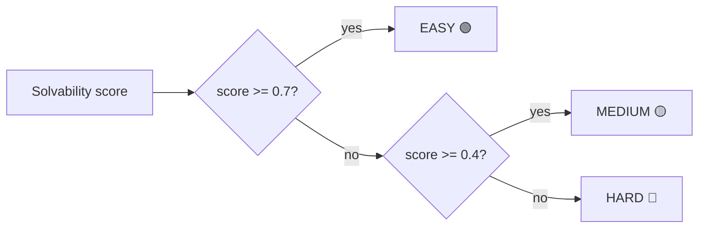
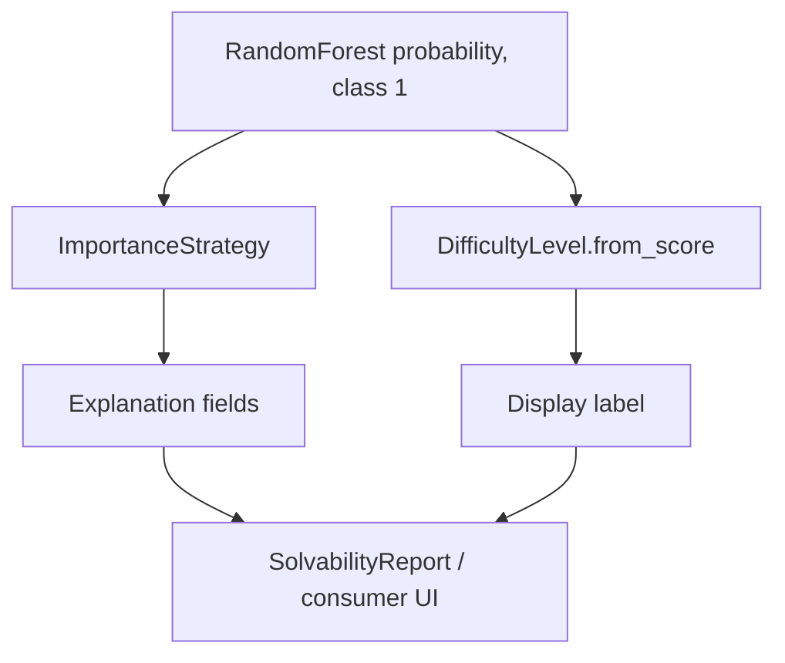

# Enterprise Solvability: Scoring and Explanation Policies

This sub-module defines the policy objects used after feature extraction: how the classifier explains predictions and how a numeric score is displayed as a difficulty level.

## ImportanceStrategy

`ImportanceStrategy` is a string enum accepted by `SolvabilityClassifier`:

| Value | Meaning | Main requirement |
|---|---|---|
| `impurity` | Random forest split-based importance (`feature_importances_`). | Fitted forest. |
| `permutation` | Mean performance change after shuffling each feature ten times. | Ground-truth labels. |
| `shap` | Tree SHAP contribution values, averaged for the positive class. | Fitted tree model and SHAP support. |

These values answer different questions. Impurity is fast and model-native; permutation is performance-oriented but depends on an evaluation label set; SHAP is contribution-oriented and can be more expensive. The classifier stores one importance value per configured feature, but the semantic interpretation depends on the selected strategy.

## DifficultyLevel

`DifficultyLevel.from_score(score)` maps a solvability score to the highest threshold not exceeding the score:

The thresholds are:

| Level | Threshold | Display marker |
|---|---:|---|
| `EASY` | 0.7 | 🟢 |
| `MEDIUM` | 0.4 | 🟡 |
| `HARD` | 0.0 | 🔴 |

Scores at a boundary belong to that boundary's level (`0.7` is `EASY`, `0.4` is `MEDIUM`). `format_display()` returns Markdown-style text such as `🟢 **Solvability: EASY**`. The naming is solvability-oriented: a high score means the issue is easier/more solvable.

## End-to-end relationship

`DifficultyLevel` is independent of model training and can be used anywhere a normalized solvability score is available. `ImportanceStrategy`, by contrast, is coupled to classifier state and its feature matrix.
