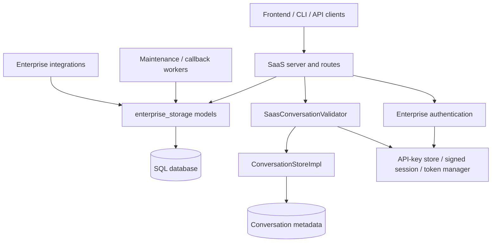
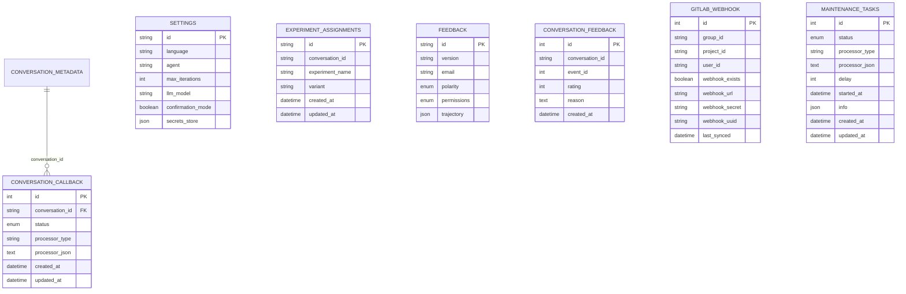
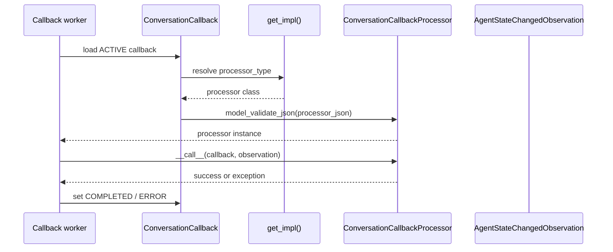
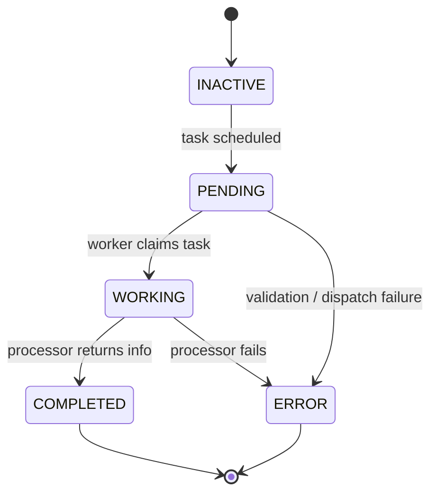
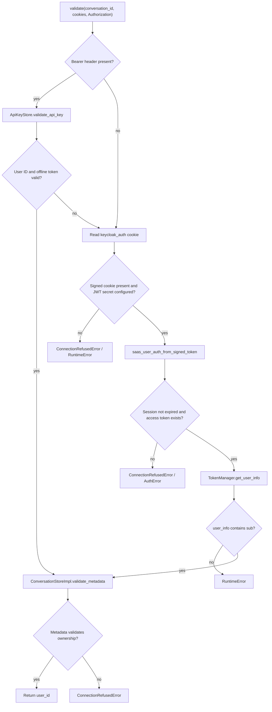
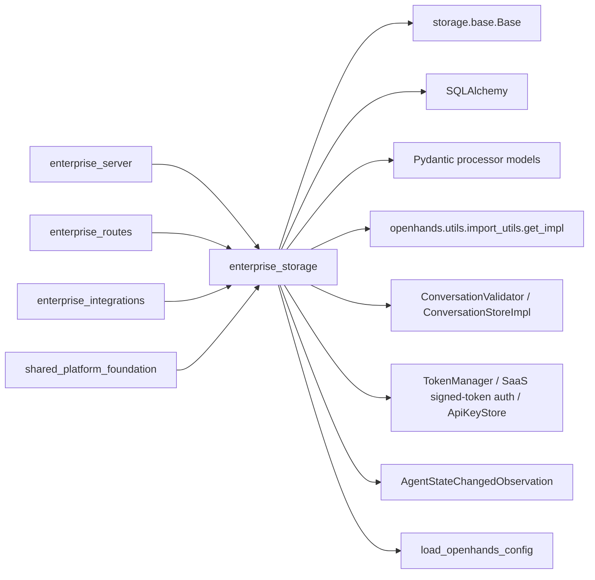

# Enterprise Storage

The `enterprise_storage` module defines the hosted SaaS persistence models and
state contracts used by OpenHands. It stores user settings, conversation callbacks,
maintenance work, experiment assignments, feedback, GitLab webhook metadata, and the
small enums that coordinate billing and subscription access. It also supplies the
conversation validator that protects SaaS conversations at the WebSocket/API boundary.

The module is a persistence and authorization boundary, not a complete storage
backend. Database connectivity and the shared declarative `Base` are supplied by the
platform storage layer; SaaS routes, authentication services, background processors,
and provider integrations consume these models. See [Storage Backends](storage_backends.md)
for shared storage abstractions, [Enterprise Server](enterprise_server.md) for SaaS
orchestration, [Enterprise Routes](enterprise_routes.md) for HTTP contracts, and
[Enterprise Auth](enterprise_auth.md) for token and allowlist behavior.

## Position in the system

The module has two related responsibilities:

* **Durable domain state:** SQLAlchemy models use the shared `storage.base.Base`
  and map SaaS records to database tables.
* **Access enforcement:** `SaasConversationValidator` authenticates a caller and
  verifies ownership of the requested conversation before allowing a connection.

## Component map

| Component | Persistence/API role | Main consumers |
| --- | --- | --- |
| `StoredSettings` | Legacy per-user settings row in `settings` | SaaS settings and migration code; prefer the newer `UserSettings` model |
| `SaasConversationValidator` | API-key or cookie authentication plus conversation ownership check | SaaS conversation/session boundary |
| `ConversationCallback` | Callback registration and status tracking | Conversation event processors |
| `CallbackStatus` | `ACTIVE`, `COMPLETED`, or `ERROR` callback state | Callback workers and routes |
| `BillingSessionType` | Distinguishes one-time payment from monthly subscription | Billing routes and billing services |
| `SubscriptionAccessStatus` | `ACTIVE` or `DISABLED` access state | Subscription/access checks |
| `ExperimentAssignment` | Conversation-to-experiment variant assignment | Experiment manager and analytics |
| `Feedback`, `ConversationFeedback` | Product feedback and conversation ratings | Feedback routes and analytics |
| `GitlabWebhook` | GitLab group/project webhook configuration and sync metadata | GitLab integration services |
| `MaintenanceTask` | Queued background work with serialized processor and execution state | Maintenance task processor |
| `MaintenanceTaskStatus` | Maintenance state machine | Maintenance workers and monitoring |

## Persistence model

All ORM models inherit from the shared SQLAlchemy `Base`. The module deliberately
keeps most associations lightweight: conversation IDs and user IDs are stored as
indexed strings unless a database foreign key is explicitly needed. This allows SaaS
services to use records across independently managed subsystems while still making
conversation and user lookups efficient.

### `StoredSettings`

`StoredSettings` maps the legacy `settings` table. It stores model/provider fields,
agent behavior, runtime image overrides, condenser preference, analytics consent,
notifications, and a JSON secrets store. Most fields are nullable to support older
rows and gradual configuration. `confirmation_mode` defaults to `False`,
`enable_default_condenser` to `True`, and `enable_sound_notifications` to `False`.
The class docstring marks this model deprecated: new code should use `UserSettings`.

Because `llm_api_key` and `secrets_store` can contain sensitive material, callers
must apply the SaaS secret-handling rules described in [Enterprise Auth](enterprise_auth.md)
and [Enterprise Server](enterprise_server.md); the model itself does not encrypt or
redact values.

### Conversation callbacks

`ConversationCallback` persists a callback attached to a conversation. Its
`conversation_id` has a foreign key to `conversation_metadata.conversation_id` and
an index for event-driven lookup. `status` starts as `ACTIVE`; processors can move it
to `COMPLETED` or `ERROR`. `created_at` and `updated_at` are database-managed.

`ConversationCallbackProcessor` is an abstract Pydantic model rather than an ORM row.
It is intentionally configured with `extra='allow'` and
`arbitrary_types_allowed=True`, allowing processor implementations to evolve without
changing the table schema. `set_processor()` stores the fully qualified Python class
name and JSON payload; `get_processor()` resolves that class with `get_impl()` and
reconstructs it using Pydantic validation.

The callback processor invocation is asynchronous and is triggered by an
`AgentStateChangedObservation`. Error handling and retry policy belong to the worker;
the model only records the callback definition and status.

### Maintenance tasks

`MaintenanceTask` uses the same serialized-processor pattern as callbacks. Its
`MaintenanceTaskProcessor.__call__()` returns a dictionary that can be stored in the
JSON `info` column. The status lifecycle is:

`delay` provides a server-side delay value, while `started_at` records execution
start. `updated_at` is refreshed on changes. The model does not itself claim tasks,
execute processors, or provide locking; those concerns belong to the maintenance
processor in [Enterprise Server](enterprise_server.md).

## SaaS conversation validation

`SaasConversationValidator` extends the shared `ConversationValidator` contract. It
accepts either a bearer API key or the SaaS `keycloak_auth` cookie, resolves a user
identity, then asks `ConversationStoreImpl.validate_metadata()` whether that user may
access the conversation.

### API-key path

For `Authorization: Bearer <key>`, `_validate_api_key()` uses the singleton
`ApiKeyStore` to map the key to a user ID and then requires an offline token from
`TokenManager`. Invalid keys, missing offline tokens, and unexpected validation
errors are logged and treated as an unsuccessful API-key attempt. The validator then
falls back to cookie authentication.

### Cookie path

The fallback parses the `keycloak_auth` cookie, requires a configured JWT secret,
validates the signed SaaS session, obtains its access token, and calls
`TokenManager.get_user_info()`. The `sub` claim becomes the user ID. Expired sessions
are translated into `ConnectionRefusedError('SESSION$TIMEOUT_MESSAGE')`; missing
credentials and malformed identity data produce explicit authentication or connection
errors.

### Conversation ownership check

After either authentication path yields a user ID, `_validate_conversation_access()`
loads the configured `ConversationStoreImpl` for that user and validates conversation
metadata. Failure raises `socketio.exceptions.ConnectionRefusedError`, preventing the
caller from joining another user’s conversation. Authentication and metadata
validation are separate steps: a valid identity alone is not sufficient access.

## Supporting enums and records

* `BillingSessionType` has `DIRECT_PAYMENT` and `MONTHLY_SUBSCRIPTION`, providing a
  stable domain value for billing workflows.
* `SubscriptionAccessStatus` has `ACTIVE` and `DISABLED`, representing whether a
  subscription currently grants access.
* `ExperimentAssignment` records the selected `variant` for an `experiment_name`.
  A unique constraint prevents more than one assignment for a conversation and
  experiment pair. `conversation_id` is nullable, allowing broader assignments.
* `Feedback` stores product-level feedback, including positive/negative polarity,
  public/private permissions, version, email, and optional JSON trajectory.
  `ConversationFeedback` separately stores an integer rating and optional reason,
  optionally tied to an event ID.
* `WebhookStatus` is an `IntEnum`: `PENDING` (0), `VERIFIED` (1), `RATE_LIMITED`
  (2), and `INVALID` (3). `GitlabWebhook` stores group/project scope, user ownership,
  installation data, scopes, and last synchronization time. In tests, `scopes` uses
  `Text` for SQLite compatibility; production uses PostgreSQL `ARRAY(Text)`.

## Dependency and ownership boundaries

The module owns schema declarations and validation orchestration. It does not own:

* database engine/session construction (`storage.base` and application configuration);
* API endpoint definitions ([Enterprise Routes](enterprise_routes.md));
* authentication token issuance or allowlist policy ([Enterprise Auth](enterprise_auth.md));
* event stream mechanics ([Event System](event_system.md)); or
* GitHub, GitLab, Jira, Linear, Bitbucket, and Slack API behavior
  ([Enterprise Integrations](enterprise_integrations.md)).

## Operational considerations

1. Treat `StoredSettings.llm_api_key` and settings secrets as sensitive data. Avoid
   logging ORM rows or serializing them into client responses.
2. Register every callback and maintenance processor with the import-resolution
   mechanism used by `get_impl()`. Persisted fully qualified class names make module
   renames and package moves a migration concern.
3. Keep callback and maintenance processor JSON backward compatible. Existing rows
   are reconstructed at runtime with Pydantic validation.
4. Preserve the `ExperimentAssignment` uniqueness invariant when implementing
   assignment upserts; concurrent writers should rely on the database constraint.
5. Use PostgreSQL-compatible migrations for `ARRAY(Text)` in production and retain
   the SQLite test accommodation for `GitlabWebhook.scopes`.
6. Conversation validation should run before opening a live event connection. A
   successful API-key or cookie authentication result must always be followed by the
   metadata ownership check.

## Related documentation

* [Enterprise Server](enterprise_server.md) — SaaS configuration, maintenance,
  conversation orchestration, and monitoring.
* [Enterprise Auth](enterprise_auth.md) — token lifecycle, user verification, and
  request authentication.
* [Enterprise Routes](enterprise_routes.md) — billing, feedback, webhook, and
  integration API models.
* [Enterprise Integrations](enterprise_integrations.md) — provider services that use
  GitLab webhook and related SaaS records.
* [Server Sessions](server_sessions.md) — conversation/session ownership and runtime
  interaction.
* [Event System](event_system.md) — event observations and event stream contracts.
* [Storage Backends](storage_backends.md) — shared persistence abstractions and
  backend implementations.
