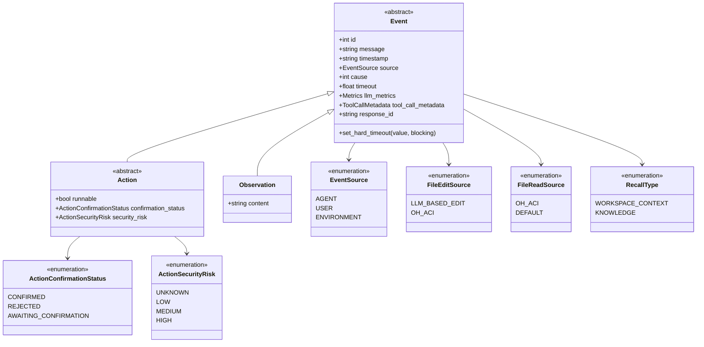
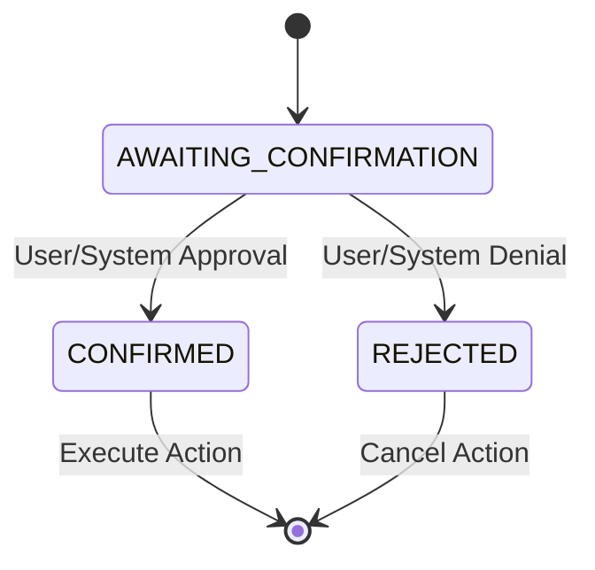
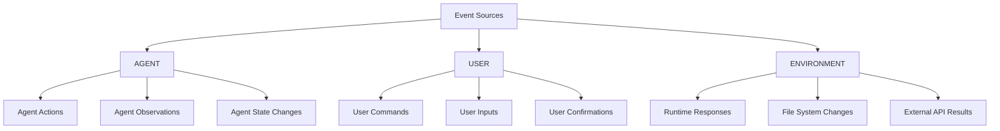
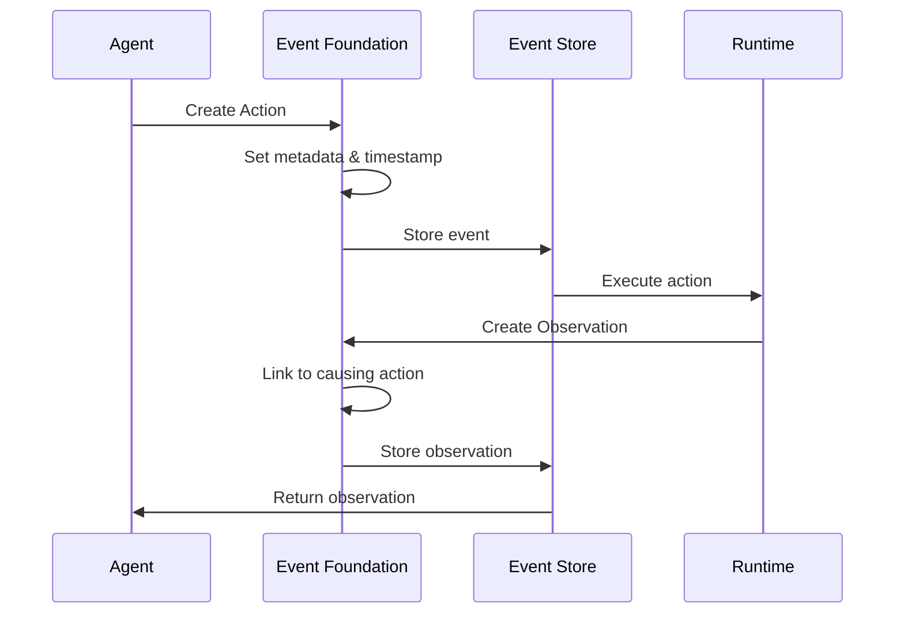

# Event Foundation Module

The event_foundation module provides the core event system architecture for OpenHands, establishing the fundamental building blocks for all system interactions through a unified event-driven paradigm.

## Overview

The event_foundation module defines the base classes and enums that form the foundation of OpenHands' event-driven architecture. It provides three primary abstractions:

- **Event**: The base class for all system events with metadata, timing, and source tracking
- **Action**: Events that represent executable operations initiated by agents or users
- **Observation**: Events that capture environmental responses and system state changes

This module serves as the cornerstone for the broader [events_and_actions](events_and_actions.md) system, enabling loose coupling between system components while maintaining comprehensive event tracking and metadata management.

## Architecture

## Core Components

### Event Base Class

The `Event` class serves as the foundational abstraction for all system events, providing:

**Core Properties:**
- `id`: Unique identifier for event tracking and correlation
- `message`: Human-readable description of the event
- `timestamp`: ISO format timestamp for temporal ordering
- `source`: Origin classification (AGENT, USER, ENVIRONMENT)
- `cause`: Reference to triggering event for causality chains

**Metadata Support:**
- `llm_metrics`: Cost and performance metrics for LLM operations
- `tool_call_metadata`: Detailed information about tool invocations
- `response_id`: LLM response correlation identifier

**Timeout Management:**
- `timeout`: Configurable execution timeout
- `set_hard_timeout()`: Blocking timeout configuration

### Action Class

Actions represent executable operations within the system:

**Security Integration:**
- Risk assessment through `ActionSecurityRisk` levels
- Confirmation workflow via `ActionConfirmationStatus`
- Integration with [security_system](security_system.md) for risk analysis

### Observation Class

Observations capture environmental responses and system state:

- **Content Storage**: Flexible content field for various data types
- **Truncation Support**: Automatic content truncation for large observations
- **Event Inheritance**: Full event metadata and tracking capabilities

## Event Source Classification

## Integration Points

### Core Agent System
- Events flow through [core_agent_system](core_agent_system.md) for processing
- Action parsing and response handling via [action_processing](action_processing.md)
- State management integration through [state_management](state_management.md)

### Event Streaming
- Foundation for [event_streaming](event_streaming.md) infrastructure
- Event store persistence through `EventStoreABC` implementations
- Real-time event distribution via `EventStreamSubscriber`

### Type System Integration
- Concrete action types defined in [type_definitions](type_definitions.md)
- `ActionType` and `ObservationType` enumerations
- Type-safe event creation and handling

## Data Flow

## Specialized Event Types

### File Operations
- `FileEditSource`: Tracks edit operation origins (LLM vs ACI)
- `FileReadSource`: Categorizes file read operations
- Integration with [storage_system](storage_system.md) for persistence

### Microagent Integration
- `RecallType`: Defines retrievable information categories
- Workspace context and knowledge retrieval
- Connection to [microagent_system](microagent_system.md)

## Event Lifecycle Management

## Best Practices

### Event Creation
- Always set appropriate `EventSource` for proper routing
- Include meaningful messages for debugging and logging
- Set timeouts for long-running operations

### Metadata Management
- Attach LLM metrics for cost tracking and optimization
- Use tool call metadata for debugging and analysis
- Maintain causality chains through proper `cause` setting

### Security Considerations
- Classify action security risks appropriately
- Implement confirmation workflows for high-risk operations
- Integration with [security_system](security_system.md) for comprehensive analysis

## Performance Considerations

- **Memory Management**: Large observation content is automatically truncated
- **Metadata Overhead**: Optional metadata fields minimize memory footprint
- **Timestamp Efficiency**: ISO format strings balance readability and performance
- **ID Management**: Integer IDs provide efficient event correlation

## Related Modules

- **[events_and_actions](events_and_actions.md)**: Complete event system architecture
- **[event_streaming](event_streaming.md)**: Real-time event distribution
- **[type_definitions](type_definitions.md)**: Concrete event type implementations
- **[core_agent_system](core_agent_system.md)**: Event processing and routing
- **[security_system](security_system.md)**: Event security analysis
- **[microagent_system](microagent_system.md)**: Specialized event handling

The event_foundation module provides the essential building blocks that enable OpenHands' event-driven architecture, ensuring consistent event handling, comprehensive metadata tracking, and seamless integration across all system components.