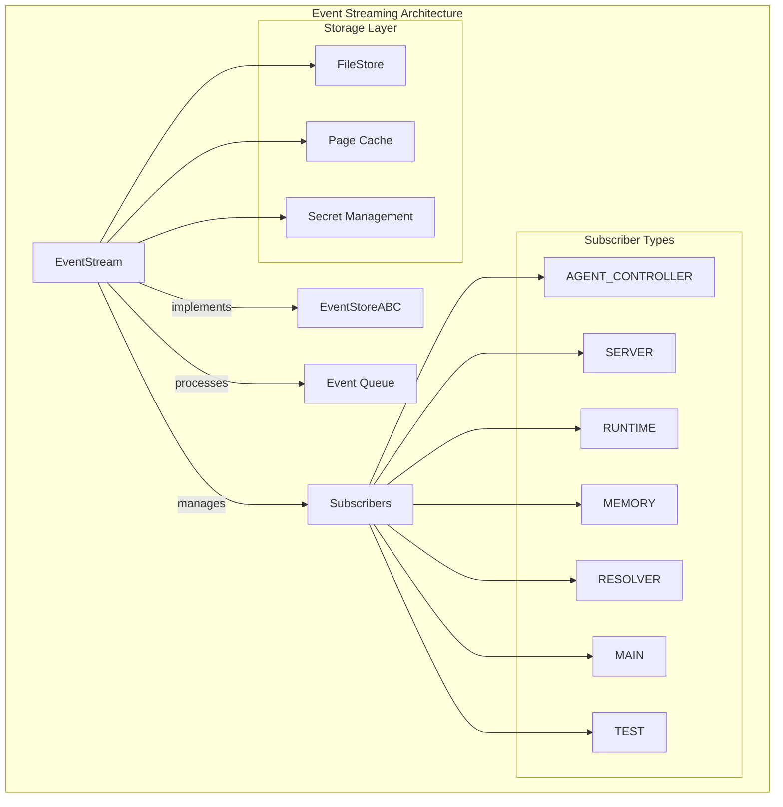
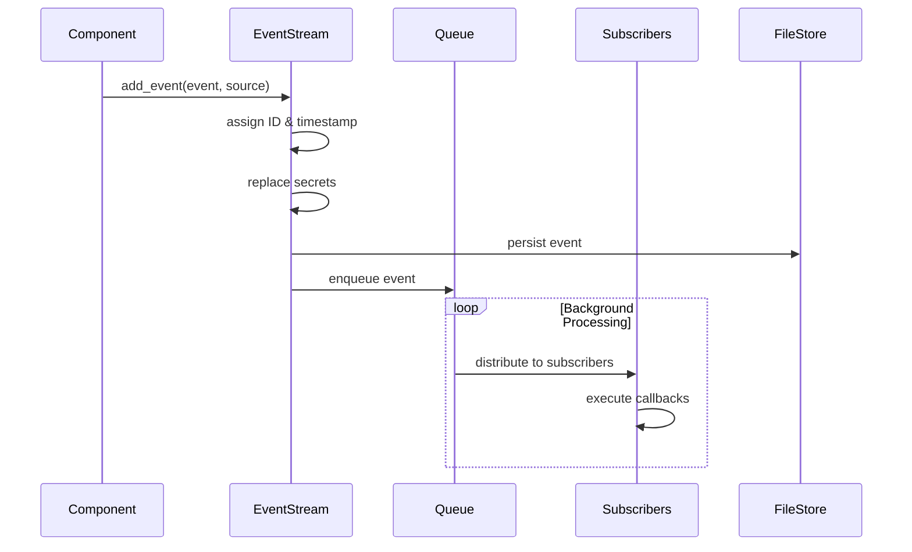
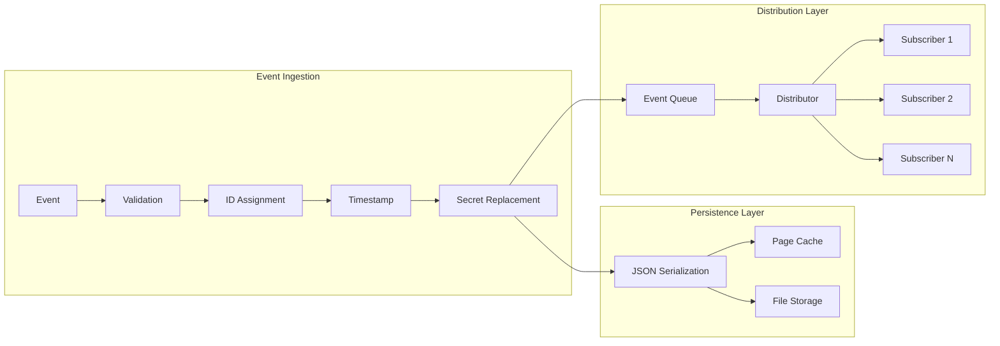
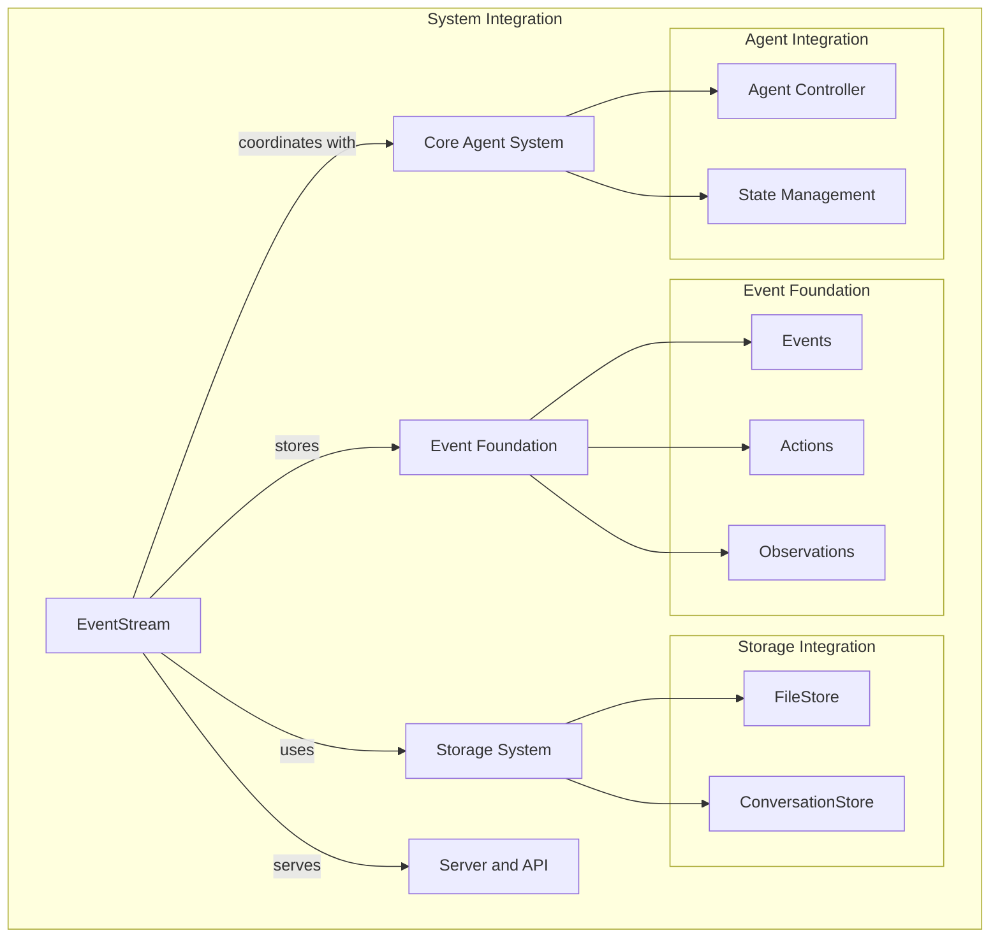

# Event Streaming Module

## Overview

The event_streaming module provides the core infrastructure for real-time event distribution and persistent storage within the OpenHands system. It implements a publish-subscribe pattern with asynchronous event processing, enabling decoupled communication between system components while maintaining event persistence and ordering guarantees.

This module serves as the backbone for system-wide event coordination, handling everything from agent actions to runtime observations, ensuring all components can react to system state changes in real-time while maintaining a complete audit trail.

## Architecture

The event streaming system is built around two primary abstractions:

- **EventStreamSubscriber**: Defines subscriber types and manages real-time event distribution
- **EventStoreABC**: Provides the abstract interface for event persistence and retrieval



## Core Components

### EventStreamSubscriber

An enumeration defining the different types of subscribers in the system:

- **AGENT_CONTROLLER**: Handles agent lifecycle and coordination events
- **SERVER**: Processes web server and API-related events  
- **RUNTIME**: Manages runtime environment events
- **MEMORY**: Handles memory and state persistence events
- **RESOLVER**: Processes resolution and conflict management events
- **MAIN**: Handles main application flow events
- **TEST**: Manages testing and validation events

### EventStoreABC

Abstract base class defining the interface for event storage and retrieval:

```python
class EventStoreABC:
    def search_events(self, start_id: int = 0, end_id: int | None = None, 
                     reverse: bool = False, filter: EventFilter | None = None,
                     limit: int | None = None) -> Iterable[Event]
    
    def get_event(self, id: int) -> Event
    def get_latest_event(self) -> Event
    def get_latest_event_id(self) -> int
```

### EventStream Implementation

The concrete implementation provides:

- **Real-time Event Distribution**: Asynchronous pub-sub with thread-safe operations
- **Persistent Storage**: File-based event persistence with caching
- **Secret Management**: Automatic secret redaction in stored events
- **Queue Processing**: Background thread for event processing
- **Subscriber Management**: Dynamic subscription/unsubscription with cleanup

## Event Flow Architecture



## Data Flow Patterns



## Component Interactions



## Key Features

### Thread-Safe Event Processing

The EventStream uses multiple synchronization mechanisms:

- **Threading.Lock**: Protects critical sections during event addition
- **Queue.Queue**: Thread-safe event queuing
- **ThreadPoolExecutor**: Isolated callback execution per subscriber
- **Event Loop Management**: Separate async loops for each callback

### Caching Strategy

Events are cached in pages to optimize read performance:

- **Write Page Cache**: Accumulates events before writing to storage
- **Cache Size Management**: Configurable page sizes for memory efficiency
- **Lazy Loading**: Cache pages are loaded on-demand during reads

### Secret Management

Automatic secret redaction ensures sensitive data doesn't persist:

- **Configurable Secrets**: Dynamic secret dictionary updates
- **Recursive Replacement**: Deep traversal of event data structures
- **Protected Fields**: System metadata fields are preserved

### Error Handling

Robust error handling across async operations:

- **Callback Isolation**: Errors in one subscriber don't affect others
- **Resource Cleanup**: Automatic cleanup of threads and event loops
- **Graceful Shutdown**: Coordinated shutdown with pending task completion

## Integration Points

### With Event Foundation
- Consumes [Event](event_foundation.md) objects for processing
- Handles [Action](event_foundation.md) and [Observation](event_foundation.md) events
- Maintains event ordering and causality chains

### With Storage System
- Uses [FileStore](storage_system.md) for persistent event storage
- Integrates with [ConversationStore](storage_system.md) for session management
- Provides event retrieval for conversation reconstruction

### With Core Agent System
- Distributes events to [Agent Controllers](core_agent_system.md)
- Coordinates with [State Management](core_agent_system.md) for consistency
- Supports agent lifecycle events

### With Server and API
- Provides real-time event streams to [WebSession](server_and_api.md)
- Supports [ConversationManager](server_and_api.md) event coordination
- Enables real-time UI updates

## Usage Patterns

### Basic Subscription

```python
# Subscribe to events
event_stream.subscribe(
    EventStreamSubscriber.AGENT_CONTROLLER,
    callback=handle_agent_event,
    callback_id="agent_handler"
)

# Add events
event_stream.add_event(action_event, EventSource.AGENT)
```

### Event Filtering and Search

```python
# Search with filters
events = event_stream.search_events(
    start_id=100,
    filter=EventFilter(
        include_types=(ActionEvent,),
        source=EventSource.AGENT
    ),
    limit=50
)
```

### Session Management

```python
# Check session existence
exists = await session_exists(session_id, file_store, user_id)

# Initialize event stream for session
stream = EventStream(session_id, file_store, user_id)
```

## Performance Considerations

### Scalability Features

- **Asynchronous Processing**: Non-blocking event distribution
- **Page-based Caching**: Efficient bulk operations for large event streams
- **Thread Pool Management**: Controlled resource usage per subscriber
- **Queue-based Decoupling**: Prevents slow subscribers from blocking producers

### Memory Management

- **Bounded Queues**: Prevents unbounded memory growth
- **Cache Eviction**: Automatic cleanup of old cache pages
- **Resource Cleanup**: Proper disposal of threads and event loops
- **Secret Scrubbing**: Prevents sensitive data accumulation

## Configuration

The module supports various configuration options:

- **Cache Size**: Configurable page sizes for performance tuning
- **Thread Pool Sizes**: Adjustable concurrency per subscriber
- **Queue Timeouts**: Configurable blocking behavior
- **Secret Patterns**: Dynamic secret replacement rules

## Error Scenarios and Recovery

### Common Error Patterns

1. **Subscriber Callback Failures**: Isolated error handling prevents cascade failures
2. **Storage Failures**: Graceful degradation with in-memory fallback
3. **Thread Pool Exhaustion**: Automatic resource management and cleanup
4. **Queue Overflow**: Backpressure mechanisms and monitoring

### Recovery Mechanisms

- **Automatic Retry**: Built-in retry logic for transient failures
- **Circuit Breaker**: Protection against cascading failures
- **Graceful Degradation**: Continued operation with reduced functionality
- **Resource Cleanup**: Automatic cleanup of failed components

## Monitoring and Observability

The module provides extensive logging and metrics:

- **Event Processing Metrics**: Throughput and latency tracking
- **Subscriber Health**: Callback success/failure rates
- **Storage Performance**: File I/O and cache hit rates
- **Resource Usage**: Thread pool and memory utilization

This event streaming infrastructure enables the OpenHands system to maintain real-time coordination between all components while ensuring complete event persistence and auditability.