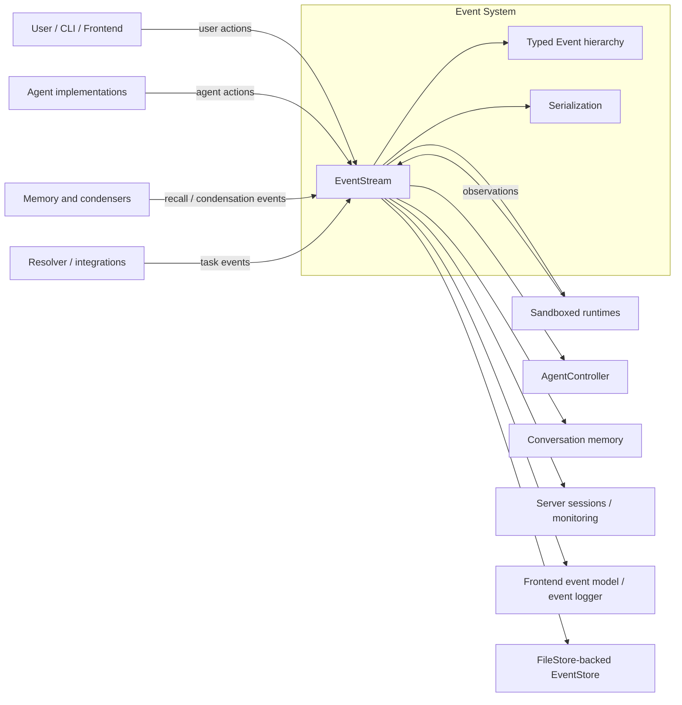
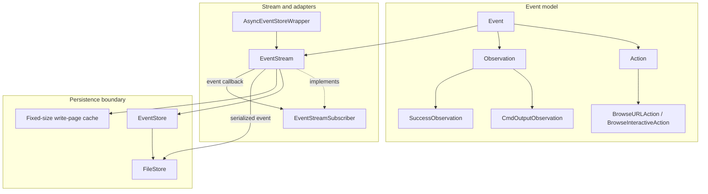
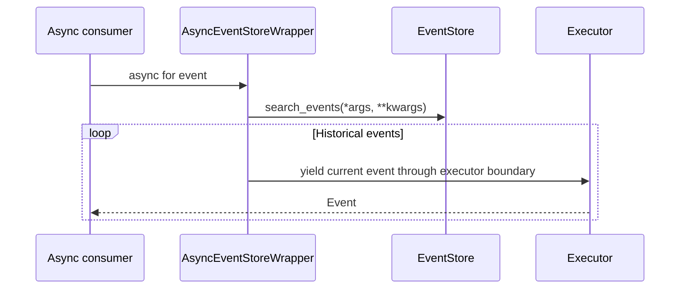
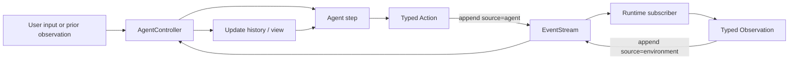
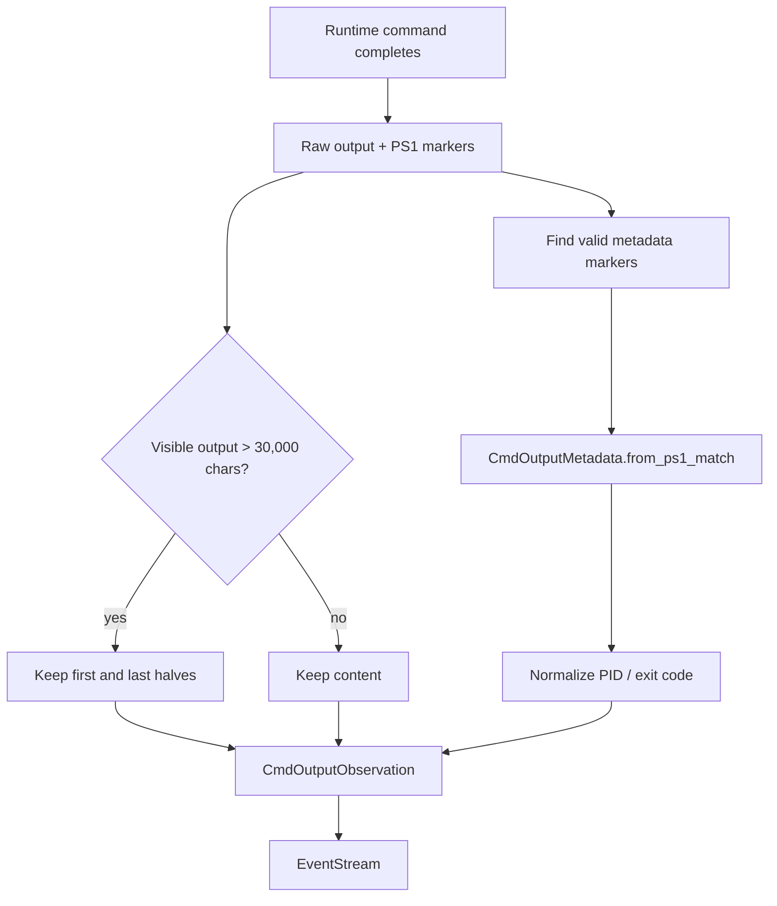
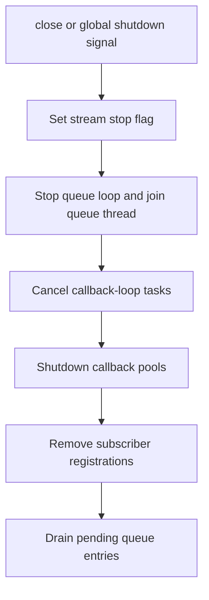

# Event System

## Introduction

The `event_system` module is OpenHands’ durable, ordered communication backbone. It
represents user requests, agent decisions, runtime results, and system metadata as
typed `Event` objects; persists them through an `EventStore`/`FileStore`; and fans each
new event out to interested subscribers. The same stream is therefore both the
conversation history and the live integration point between the agent controller,
runtime, memory, server, resolver, and clients.

The module is intentionally small at its public boundary:

* `Event` supplies common identity, causality, timestamp, source, timeout, and
  observability metadata.
* `EventStream` assigns IDs, redacts configured secrets, persists events, and dispatches
  them asynchronously to named subscribers.
* Action and observation classes carry typed intent and results. The supplied examples
  include browser actions, command output, and successful-action observations.
* `AsyncEventStoreWrapper` adapts blocking event searches to asynchronous consumers.

For the orchestration loop that consumes this stream, see [Agent Controller](agent_controller.md).
For how history is recalled, condensed, and converted into LLM messages, see
[Memory and Condensers](memory_and_condensers.md), [Conversation Memory](memory_and_condensers_conversation_memory.md),
and [Condenser Framework](memory_and_condensers_condenser_framework.md).

## Position in the system

The event system sits between producers and consumers across the platform. Producers
append events; the stream persists and publishes them; consumers update state, execute
actions, build prompts, expose events to users, or perform monitoring.



The controller and runtime are decoupled: an agent action is appended to the stream,
the runtime observes it and executes it, and the runtime appends an observation. The
controller reacts to that observation and may request the next agent step.

## Architecture



### Components

| Component | Location | Responsibility |
| --- | --- | --- |
| `Event` | `openhands/events/event.py` | Common event contract and optional metadata. |
| `EventSource` | `openhands/events/event.py` | Identifies whether an event came from an agent, user, or environment. |
| `FileEditSource`, `FileReadSource` | `openhands/events/event.py` | Classify file operations performed by the LLM or OpenHands ACI/default tooling. |
| `RecallType` | `openhands/events/event.py` | Distinguishes workspace context from knowledge recalled through microagents. |
| `Action` | `openhands/events/action/action.py` | Base for executable agent intent; non-runnable by default. |
| `ActionConfirmationStatus` | `openhands/events/action/action.py` | Confirmation lifecycle: awaiting, confirmed, or rejected. |
| `ActionSecurityRisk` | `openhands/events/action/action.py` | Unknown/low/medium/high risk classification for action policy. |
| `BrowseURLAction` / `BrowseInteractiveAction` | `openhands/events/action/browse.py` | Represent URL navigation and browser interaction requests. |
| `Observation` | `openhands/events/observation/observation.py` | Base for environment or tool results. |
| `CmdOutputObservation` | `openhands/events/observation/commands.py` | Command output plus exit status, process, host, directory, and interpreter metadata. |
| `SuccessObservation` | `openhands/events/observation/success.py` | Generic successful result whose message is its content. |
| `EventStreamSubscriber` | `openhands/events/stream.py` | Stable subscriber categories used for dispatch and diagnostics. |
| `EventStream` | `openhands/events/stream.py` | Assigns IDs, persists, redacts, queues, and dispatches events. |
| `AsyncEventStoreWrapper` | `openhands/events/async_event_store_wrapper.py` | Exposes synchronous search results through `async for`. |

## Event model

### Identity and metadata

`Event` is a dataclass intended to be subclassed. Internal fields are populated as an
event enters the stream rather than necessarily at construction time:

| Field/property | Meaning |
| --- | --- |
| `id` | Monotonically allocated stream ID; `-1` means not yet persisted. |
| `timestamp` | ISO-formatted creation timestamp. `EventStream.add_event` sets it. |
| `source` | `AGENT`, `USER`, or `ENVIRONMENT`; assigned by the caller of `add_event`. |
| `cause` | Optional ID linking an event to the event that caused it. |
| `timeout` | Optional hard timeout in seconds. `set_hard_timeout` also enables blocking when supported by the subclass. |
| `llm_metrics` | Optional cost/token metadata from the LLM layer; see [LLM Metrics](llm_layer_metrics.md). |
| `tool_call_metadata` | Optional metadata for tool calls. |
| `response_id` | Optional provider response identifier. |
| `message` | Human-readable event summary; subclasses can override it. |

The stream protects the event’s top-level system fields during secret redaction:
`timestamp`, `id`, `source`, `cause`, `action`, `observation`, and `message` are not
rewritten at the top level. Nested string values are redacted recursively.

### Actions

Actions are agent-issued intent. `Action.runnable` defaults to `False`; concrete
actions opt in when a runtime can execute them. The action module also supplies risk
and confirmation enums used by the controller and security analyzers.

`BrowseURLAction` contains a URL, optional model thought, the `BROWSE` action type,
security risk, and an optional accessibility-tree return flag. Its interactive sibling
contains a browser action program and optional user-facing browser message. Both expose
an informative `message` and `__str__` representation for logs and prompts.

### Observations

Observations are results emitted by runtimes or services in response to actions.
`CmdOutputObservation` is deliberately defensive:

1. It parses shell prompt metadata delimited by `###PS1JSON###` and `###PS1END###`.
2. It normalizes PID and exit-code values, using `-1` when parsing fails.
3. It truncates visible output over 30,000 characters by preserving both ends.
4. It exposes `error`, `success`, `command_id`, and `exit_code` convenience properties.
5. It can mark output as `hidden`; hidden output is not truncated because it does not
   pass through the LLM/event-stream presentation path.

`SuccessObservation` is the minimal successful result: its event type is
`ObservationType.SUCCESS` and its message is the observation content.

The complete event vocabulary is broader than the supplied core examples. The
frontend’s corresponding public event shapes are listed under the
`user_facing_clients/frontend_event_types` entries in the module tree; event
serialization is the boundary that keeps persisted Python events and client-facing
representations compatible.

## Event lifecycle and persistence

```mermaid
sequenceDiagram
    participant P as Producer
    participant ES as EventStream
    participant S as Serializer
    participant FS as FileStore
    participant Q as Dispatch queue
    participant C as Subscriber callback

    P->>ES: add_event(event, source)
    ES->>ES: reject event with existing ID
    ES->>ES: timestamp + source
    ES->>ES: lock; allocate cur_id; advance ID
    ES->>S: event_to_dict(event)
    S-->>ES: dict
    ES->>ES: recursively replace configured secrets
    ES->>S: event_from_dict(dict)
    S-->>ES: sanitized Event
    ES->>FS: write event JSON by event ID
    ES->>FS: write full cache page when page is complete
    ES->>Q: enqueue sanitized event
    Q->>C: submit callback(event) in dedicated pool
```

`EventStream` extends the `EventStore` abstraction and receives a conversation ID
(`sid`), a `FileStore`, and an optional user ID. Each event is written under the
conversation’s storage location. A write-page cache groups a configured number of
serialized event dictionaries; individual event files remain the source of truth, and
an incomplete page is intentionally not stored. If a cache page is absent during a
read, the store can fall back to individual event files.

The event is serialized and reconstructed before dispatch. Consequently, callbacks
receive the normalized, redacted representation rather than an object that may still
contain raw secrets or transient construction state.

## Subscriber dispatch and concurrency

```mermaid
flowchart TD
    ADD[add_event] --> Q[Thread-safe queue]
    Q --> LOOP[Dedicated queue thread / asyncio loop]
    LOOP --> ORDER[Sort subscriber categories]
    ORDER --> CALLBACKS[Snapshot callback IDs]
    CALLBACKS --> POOL[One max-worker ThreadPoolExecutor per callback]
    POOL --> INVOKE[Invoke callback(event)]
    INVOKE --> ERR[done callback checks future.result]
    ERR --> LOG[Log callback failure and re-raise]
```

Subscribers are grouped by `EventStreamSubscriber`: `AGENT_CONTROLLER`, `RESOLVER`,
`SERVER`, `RUNTIME`, `MEMORY`, `MAIN`, and `TEST`. A category can have multiple
callbacks, identified by a caller-supplied `callback_id`.

Important execution properties:

* Each callback gets a single-worker pool, preserving that callback’s event order while
  allowing different callbacks to run independently.
* Subscriber categories are processed in sorted key order for deterministic submission.
* Callback IDs are copied before iteration so callbacks can unsubscribe safely while an
  event is being dispatched.
* Duplicate callback IDs within one subscriber category are rejected.
* Callback exceptions are surfaced through a future completion handler and logged with
  the callback and subscriber identifiers.
* `close()` stops and joins the queue thread, cancels callback-loop tasks, shuts down
  pools, removes registrations, and drains queued events.

The stream uses a lock only around ID allocation and write-page cache bookkeeping.
Persistence occurs outside that lock because storage writes may block. This permits
concurrent producers while maintaining a single event-ID sequence and page boundary.

## Search and asynchronous consumption

`AsyncEventStoreWrapper` accepts any `EventStore` plus the arguments used by
`search_events`. Its async iterator traverses the synchronous search result and yields
each event after handing the blocking boundary to the running event loop’s executor.
This is useful for async server or monitoring code that needs to consume historical
events without directly blocking its loop.



This wrapper adapts iteration; it does not add persistence, subscription, buffering, or
new event semantics.

## End-to-end process flows

### Agent action to runtime result



See [Agent Controller Core](agent_controller_core.md) for turn gating, confirmation,
limits, and state transitions, and [Runtime Implementations](runtime_implementations.md)
for execution backends.

### Command-output handling



### Shutdown



The dispatch loop also checks the process-wide `should_continue()` shutdown signal.
Shutdown therefore has two safeguards: a stream-local stop flag and the shared process
shutdown mechanism.

## Cross-module contracts

| Neighbor | Relationship |
| --- | --- |
| [Agent Controller](agent_controller.md) | Subscribes to events, appends actions, and uses observations to advance the agent state machine. |
| [Memory and Condensers](memory_and_condensers.md) | Reads event history, emits recall/condensation events, and derives the LLM-visible view without deleting persisted history. |
| [Conversation Memory](memory_and_condensers_conversation_memory.md) | Converts surviving events into LLM messages. |
| [Runtime Implementations](runtime_implementations.md) | Consumes runnable actions and emits observations such as command results. |
| [Runtime Plugins](runtime_plugins.md) | Adds execution capabilities whose results travel through the same event boundary. |
| Shared storage foundation | Supplies the `FileStore` used by `EventStore`/`EventStream` for event and cache-page persistence. The concrete local, memory, cloud, S3, webhook, and batched-webhook stores are listed under `shared_platform_foundation` in the module tree. |
| [Core Schema and Runtime Support](core_schema_and_runtime_support.md) | Provides `ActionType`, `ObservationType`, JSON encoding, logging, and shared schemas. |
| [LLM Metrics](llm_layer_metrics.md) | Supplies optional `Metrics` attached to events for cost and token accounting. |
| Frontend event types and state | Defines client-side action/observation shapes and presentation of the stream; see the `user_facing_clients` entries in the module tree. |
| Conversation service tier | Owns sessions and server-facing consumers of conversation events; see the `conversation_service_tier` entries in the module tree. |
| [Security Analyzers](security_analyzers.md) | Evaluates risky actions before or around publication and confirmation. |

## Operational considerations

* Always add a newly constructed event with `id == Event.INVALID_ID`; re-adding a
  persisted event is rejected to prevent accidental feedback loops.
* Register callback IDs deterministically and unsubscribe them before closing long-lived
  streams to avoid retaining pools and event loops.
* Treat event IDs as conversation-local sequence numbers, not globally unique IDs.
* Configure secrets before publishing events that may contain credentials. Redaction is
  applied to nested string fields, but protected top-level metadata is intentionally
  preserved.
* Keep command output bounded. The built-in truncation protects the stream and LLM
  context, while `hidden=True` is reserved for output that intentionally bypasses the
  visible event path.
* Persisted event JSON is the durable audit trail. Cache pages are an optimization and
  may be absent or incomplete.
* Callbacks should be idempotent where possible: a callback can perform external work,
  and stream shutdown or process failure can interrupt delivery after persistence but
  before every consumer finishes.

## Summary

The event system provides one ordered, durable, observable protocol for OpenHands. Its
typed event model gives agents and runtimes a common language; `EventStream` turns that
language into persistent fan-out with per-callback ordering; and the async wrapper lets
non-blocking consumers search the same history. Most higher-level behavior—agent turns,
runtime execution, memory condensation, server updates, and client rendering—depends on
this boundary while remaining independently implementable.
