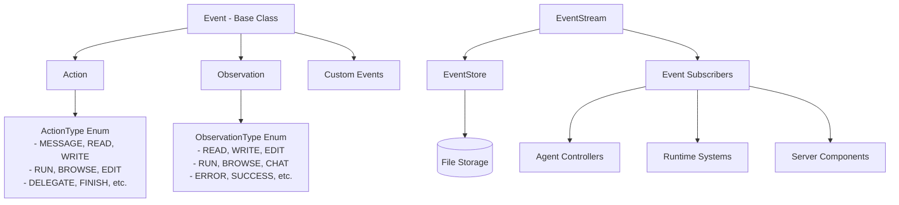
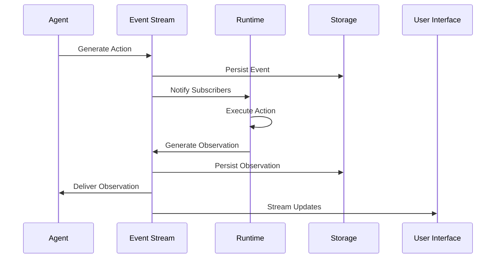

# Events and Actions Module

## Overview

The `events_and_actions` module is the foundational event-driven architecture component of the OpenHands system. It provides the core abstractions and infrastructure for handling all system interactions through a unified event model. This module defines the base classes for events, actions, and observations, along with the streaming and storage mechanisms that enable real-time communication between different system components.

## Purpose

The events_and_actions module serves as the central nervous system of OpenHands, enabling:

- **Event-Driven Architecture**: All system interactions are modeled as events, providing a consistent and traceable communication pattern
- **Real-time Streaming**: Live event streaming capabilities for real-time system monitoring and interaction
- **Action-Observation Pattern**: A structured approach where actions trigger observations, creating a clear cause-and-effect relationship
- **Event Persistence**: Comprehensive event storage and retrieval mechanisms for system state management and debugging
- **Type Safety**: Strongly typed event system with enumerated action and observation types

## Architecture Overview

The module follows a hierarchical event model with three main categories:



## Core Components

### Event Hierarchy

The module implements a three-tier event hierarchy:

1. **Base Event Class**: Provides common properties and metadata for all events
2. **Action Events**: Represent requests or commands to be executed
3. **Observation Events**: Represent responses or results from executed actions

### Event Streaming System

The event streaming system enables real-time event distribution across the system:

- **EventStream**: Central event distribution hub with subscriber management
- **EventStreamSubscriber**: Enumerated subscriber types for different system components
- **Event Storage**: Persistent storage with caching and retrieval capabilities

### Type System

Strongly typed enumerations define all possible actions and observations:

- **ActionType**: 25+ predefined action types covering file operations, execution, browsing, and system control
- **ObservationType**: Corresponding observation types for action results and system feedback

## Sub-modules

This module consists of several focused sub-components that work together to provide the complete event-driven architecture:

### [Event Foundation](event_foundation.md)
Core event classes and base functionality including the Event base class, Action and Observation hierarchies, EventSource types, and comprehensive metadata handling. This sub-module provides the fundamental building blocks for all system events.

### [Event Streaming](event_streaming.md)
Real-time event distribution system featuring the EventStream class with subscriber management, event queuing, asynchronous processing capabilities, and the EventStoreABC interface for event persistence. This sub-module enables live communication across system components.

### [Type Definitions](type_definitions.md)
Comprehensive type system defining all ActionType and ObservationType enumerations, security classifications, and confirmation statuses. This sub-module ensures type safety and provides the complete catalog of supported operations.

## Integration with Other Modules

The events_and_actions module serves as the communication backbone for the entire OpenHands system:

- **[core_agent_system](core_agent_system.md)**: Agents generate actions and consume observations through this module
- **[runtime_system](runtime_system.md)**: Runtime environments execute actions and produce observations
- **[server_and_api](server_and_api.md)**: Web interface subscribes to event streams for real-time updates
- **[llm_integration](llm_integration.md)**: LLM interactions are tracked through event metadata and metrics
- **[storage_system](storage_system.md)**: Event persistence leverages the storage system for conversation history

## Event Flow Architecture



## Key Features

### Event Metadata
- **Timestamps**: ISO format timestamps for all events
- **Source Tracking**: Events tagged with source (agent, user, environment)
- **Causality**: Events can reference causing events for traceability
- **LLM Metrics**: Cost and performance tracking for AI-generated events
- **Tool Metadata**: Detailed information about tool calls and executions

### Security and Privacy
- **Secret Redaction**: Automatic replacement of sensitive information in stored events
- **Security Risk Assessment**: Events can be classified by security risk level
- **Confirmation System**: High-risk actions can require user confirmation

### Performance Optimization
- **Event Caching**: Page-based caching system for efficient event retrieval
- **Asynchronous Processing**: Non-blocking event processing with thread pools
- **Stream Filtering**: Efficient event filtering and search capabilities

## Usage Patterns

### Basic Event Creation
```python
from openhands.events.action.action import Action
from openhands.events.event import EventSource

# Create and add an action to the event stream
action = SomeAction(...)
event_stream.add_event(action, EventSource.AGENT)
```

### Event Subscription
```python
from openhands.events.stream import EventStreamSubscriber

# Subscribe to events
event_stream.subscribe(
    EventStreamSubscriber.AGENT_CONTROLLER,
    callback_function,
    "unique_callback_id"
)
```

### Event Filtering and Search
```python
# Search for specific events
events = event_store.search_events(
    start_id=0,
    filter=EventFilter(include_types=(ActionType.READ,))
)
```

This module is essential for understanding how OpenHands components communicate and coordinate their activities through the event-driven architecture.