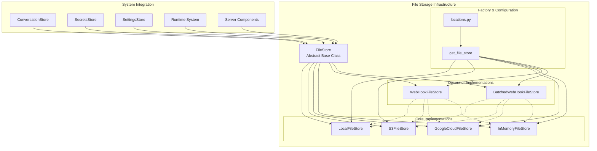
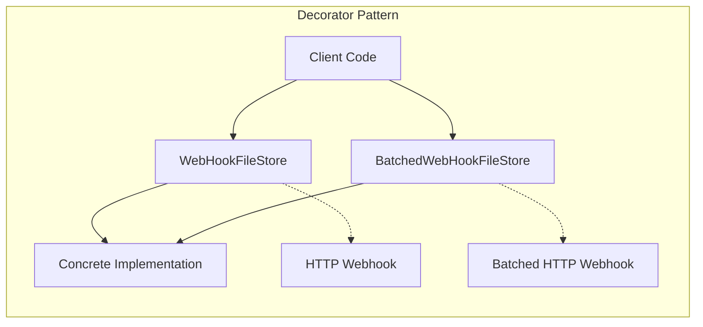
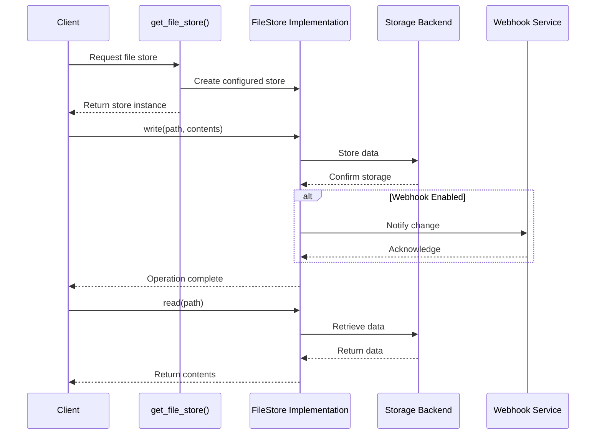
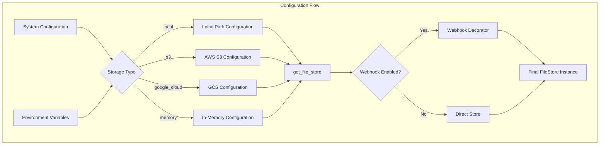
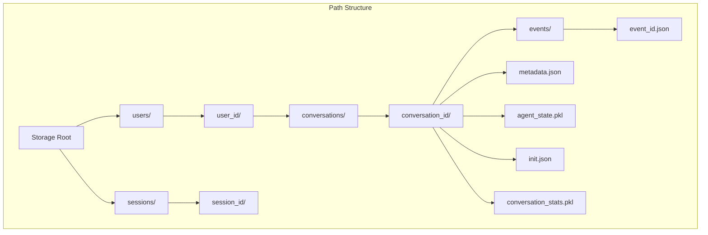
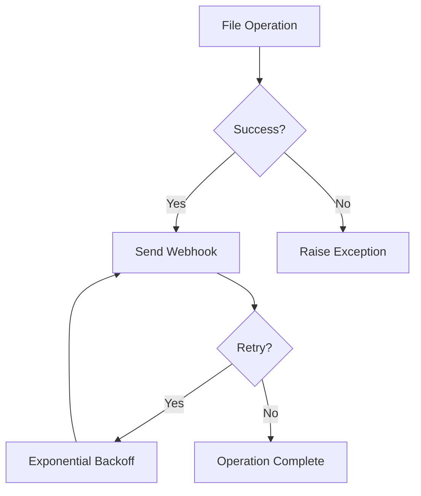

# File Storage Infrastructure

## Overview

The File Storage Infrastructure module provides a unified, pluggable file storage abstraction layer for the OpenHands system. It enables seamless switching between different storage backends (local filesystem, cloud storage, in-memory) while maintaining a consistent interface for file operations across the entire system.

This module serves as the foundation for persistent data storage in OpenHands, supporting conversation data, agent states, configuration files, and other system artifacts. The architecture follows the Strategy pattern, allowing runtime selection of storage implementations based on deployment requirements and configuration.

## Architecture

### Core Components

The file storage infrastructure is built around several key components:

- **FileStore (Abstract Base)**: Defines the contract for all storage implementations
- **Concrete Implementations**: Local, S3, Google Cloud, and In-Memory storage providers
- **Decorator Pattern**: WebHook and Batched WebHook wrappers for event notifications
- **Factory Pattern**: Centralized store instantiation and configuration



### Storage Implementations

#### Local File Store
- **Purpose**: Filesystem-based storage for development and single-node deployments
- **Features**: Directory creation, path normalization, recursive operations
- **Use Cases**: Development environments, standalone deployments

#### S3 File Store
- **Purpose**: AWS S3 compatible object storage
- **Features**: Boto3 integration, configurable endpoints, SSL support
- **Use Cases**: Production cloud deployments, scalable storage

#### Google Cloud File Store
- **Purpose**: Google Cloud Storage integration
- **Features**: Native GCS client, authentication via service accounts
- **Use Cases**: Google Cloud Platform deployments

#### In-Memory File Store
- **Purpose**: Volatile storage for testing and temporary operations
- **Features**: Dictionary-based storage, fast access
- **Use Cases**: Unit testing, temporary data, development

### Decorator Pattern Implementation

The module implements webhook notifications using the Decorator pattern:



## Data Flow

### File Operations Flow



### Configuration and Instantiation Flow



## Integration Points

### Storage System Integration

The file storage infrastructure integrates with other storage system components:

- **[Conversation Management](conversation_management.md)**: Stores conversation metadata, events, and agent states
- **[User Data Management](user_data_management.md)**: Provides backend for secrets and settings storage
- **[Server and API](server_and_api.md)**: Supports session data and conversation orchestration
- **[Runtime System](runtime_system.md)**: Stores runtime artifacts and temporary files

### Path Management

The module uses standardized path conventions defined in `locations.py`:



## Configuration

### Environment Variables

#### Local Storage
- `FILE_STORE_PATH`: Root directory for local storage

#### S3 Storage
- `AWS_ACCESS_KEY_ID`: AWS access key
- `AWS_SECRET_ACCESS_KEY`: AWS secret key
- `AWS_S3_BUCKET`: S3 bucket name
- `AWS_S3_ENDPOINT`: Custom S3 endpoint (optional)
- `AWS_S3_SECURE`: Enable SSL (default: true)

#### Google Cloud Storage
- `GOOGLE_APPLICATION_CREDENTIALS`: Service account credentials file
- `GOOGLE_CLOUD_BUCKET_NAME`: GCS bucket name

#### Webhook Configuration
- `SESSION_API_KEY`: API key for webhook authentication

### Factory Configuration

```python
store = get_file_store(
    file_store_type='s3',  # 'local', 's3', 'google_cloud', 'memory'
    file_store_path='my-bucket',
    file_store_web_hook_url='https://api.example.com/webhook',
    file_store_web_hook_headers={'Authorization': 'Bearer token'},
    file_store_web_hook_batch=True
)
```

## Error Handling

### Exception Hierarchy

All storage implementations handle errors consistently:

- **FileNotFoundError**: File or path does not exist
- **PermissionError**: Access denied or insufficient permissions
- **ConnectionError**: Network or service connectivity issues
- **ConfigurationError**: Invalid configuration or missing credentials

### Retry Logic

Webhook implementations include retry logic with exponential backoff:



## Performance Considerations

### Caching Strategy

- **Local Storage**: Relies on OS filesystem caching
- **Cloud Storage**: Implements connection pooling and request batching
- **In-Memory**: Direct dictionary access for maximum speed

### Scalability Features

- **Concurrent Operations**: Thread-safe implementations
- **Batch Operations**: Webhook batching for high-throughput scenarios
- **Connection Pooling**: Reused connections for cloud storage providers

### Monitoring and Observability

The module integrates with the OpenHands logging system:

- **Operation Logging**: All file operations are logged with appropriate levels
- **Error Tracking**: Detailed error information for debugging
- **Performance Metrics**: Operation timing and success rates

## Security

### Access Control

- **Path Sanitization**: Prevents directory traversal attacks
- **User Isolation**: User-specific path prefixes for multi-tenant deployments
- **Credential Management**: Secure handling of cloud storage credentials

### Data Protection

- **Encryption in Transit**: HTTPS/TLS for cloud storage operations
- **Encryption at Rest**: Leverages cloud provider encryption features
- **Access Logging**: Comprehensive audit trail for file operations

## Testing Strategy

### Unit Testing

- **Mock Implementations**: In-memory store for fast unit tests
- **Interface Compliance**: All implementations tested against common interface
- **Error Scenarios**: Comprehensive error condition testing

### Integration Testing

- **Multi-Backend Testing**: Tests across all storage implementations
- **Webhook Testing**: End-to-end webhook notification testing
- **Performance Testing**: Load testing for scalability validation

## Future Enhancements

### Planned Features

- **Compression Support**: Automatic compression for large files
- **Versioning**: File version management and history
- **Replication**: Multi-region storage replication
- **Caching Layer**: Distributed caching for frequently accessed files

### Extension Points

- **Custom Backends**: Plugin architecture for additional storage providers
- **Middleware Pipeline**: Configurable processing pipeline for file operations
- **Event System**: Enhanced event notifications beyond webhooks

## Related Documentation

- [Storage System](storage_system.md) - Parent module overview
- [Conversation Management](conversation_management.md) - Primary consumer of file storage
- [User Data Management](user_data_management.md) - Secrets and settings storage
- [Server and API](server_and_api.md) - Web server integration
- [Runtime System](runtime_system.md) - Runtime artifact storage
- [Core Configuration](core_configuration.md) - System configuration management