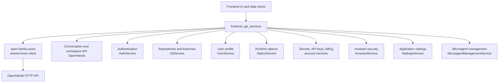
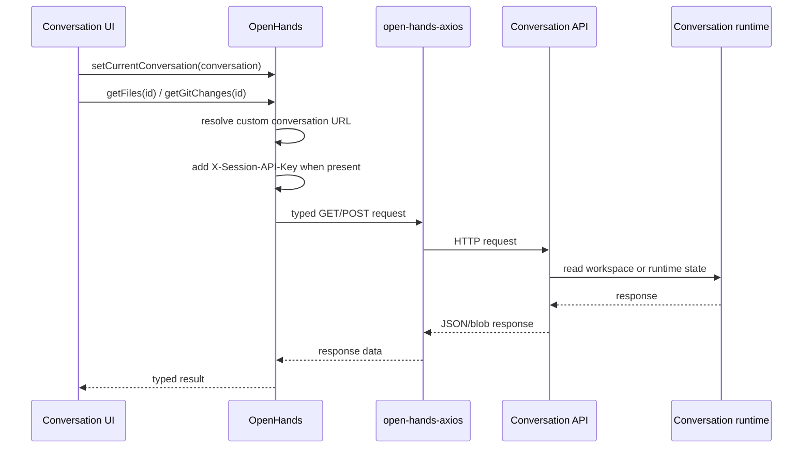
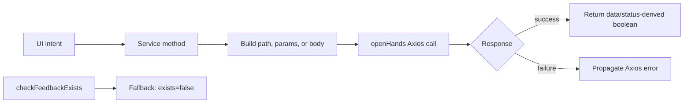

# Frontend API Services

The `frontend_api_services` module is the browser-side HTTP boundary for OpenHands. It turns UI and state-management requests into typed Axios calls, centralizes conversation-aware routing, and exposes small service classes for authentication, repositories, settings, secrets, security, billing, and microagent management.

The services are intentionally thin: server-side authorization, conversation lifecycle, repository-provider behavior, and persistence remain in the backend modules such as [Conversation Service Tier](conversation_service_tier.md), [Code Host Automation](code_host_automation.md), and [Shared Platform Foundation](shared_platform_foundation.md).

## Architecture overview

`open-hands-axios` is the transport seam shared by all services. The service classes do not create Axios instances or manage global application state, except for `OpenHands.currentConversation`, which stores the selected conversation's custom URL and session API key.

## Service boundaries

| Area | Primary components | Responsibility | Documentation |
|---|---|---|---|
| Conversation and workspace | `OpenHands`, API response types | Conversation lifecycle, feedback, billing, runtime links, trajectory, Git changes, workspace files, and conversation microagents | [Conversation and Workspace](frontend_api_services_conversation_workspace.md) |
| Authentication | `AuthService`, authentication types | SaaS authentication, Keycloak/GitHub callback exchange, and logout endpoint selection | [Authentication](frontend_api_services_authentication.md) |
| Git and repository discovery | `GitService` | Repository and branch search, provider installations, and repository microagent content | [Git and Repository Services](frontend_api_services_git_repository.md) |
| User and runtime options | `UserService`, `OptionService`, `SuggestionsService` | Current Git identity, available models/agents/security analyzers, server configuration, and suggested tasks | [User and Options](frontend_api_services_user_options.md) |
| Account and security | `SecretsService`, `ApiKeysClient`, `InvariantService` | Custom secrets, provider tokens, user API keys, security policy, severity, and trace export | [Account and Security](frontend_api_services_account_security.md) |
| Settings and microagent UI | `SettingsService`, `MicroagentManagementService` | Persist application settings and find conversations used by microagent management screens | [Settings and Microagent Management](frontend_api_services_settings_microagents.md) |

## Conversation-aware routing

For the active conversation, `getConversationUrl()` prefers `Conversation.url`; otherwise it falls back to `/api/conversations/{conversationId}`. Conversation-scoped calls also use `getConversationHeaders()`, which adds `X-Session-API-Key` when the conversation carries a session key. This allows hosted or remote conversation runtimes to be addressed without changing each endpoint method.

## Common request patterns

- Methods generally return `response.data`, not the Axios response.
- Pagination is represented either by `ResultSet.next_page_id` for conversations or by provider `Link`-header parsing in `GitService`.
- Uploads use `FormData` and explicitly set `multipart/form-data`.
- Mutating methods commonly return a boolean derived from an expected HTTP status (`201`, `200`) or return the backend payload directly.
- Most errors propagate to query/mutation callers. `OpenHands.checkFeedbackExists()` is an intentional exception and converts lookup failures into `{ exists: false }`.

## Integration with the rest of the frontend

The returned contracts are consumed by frontend event, state, and domain types. Conversation responses contain `ConversationStatus` and `RuntimeStatus`; provider fields use the shared `Provider` and `ProviderToken` types; Git methods use shared repository and branch types. Conversation events flow through the [Event System](event_system.md), while shared schemas and serialization are provided by [Shared Platform Foundation](shared_platform_foundation.md).

## Sub-module documentation

- [Conversation and Workspace](frontend_api_services_conversation_workspace.md)
- [Authentication](frontend_api_services_authentication.md)
- [Git and Repository Services](frontend_api_services_git_repository.md)
- [User and Options](frontend_api_services_user_options.md)
- [Account and Security](frontend_api_services_account_security.md)
- [Settings and Microagent Management](frontend_api_services_settings_microagents.md)

## Maintenance notes

When adding an endpoint, keep endpoint construction and response normalization in the relevant service. Add or update a response interface beside the service when the payload is stable, and preserve the conversation URL/header helper for all runtime-scoped endpoints. If an endpoint changes its pagination or status semantics, update the corresponding sub-module page and its flow diagram.
