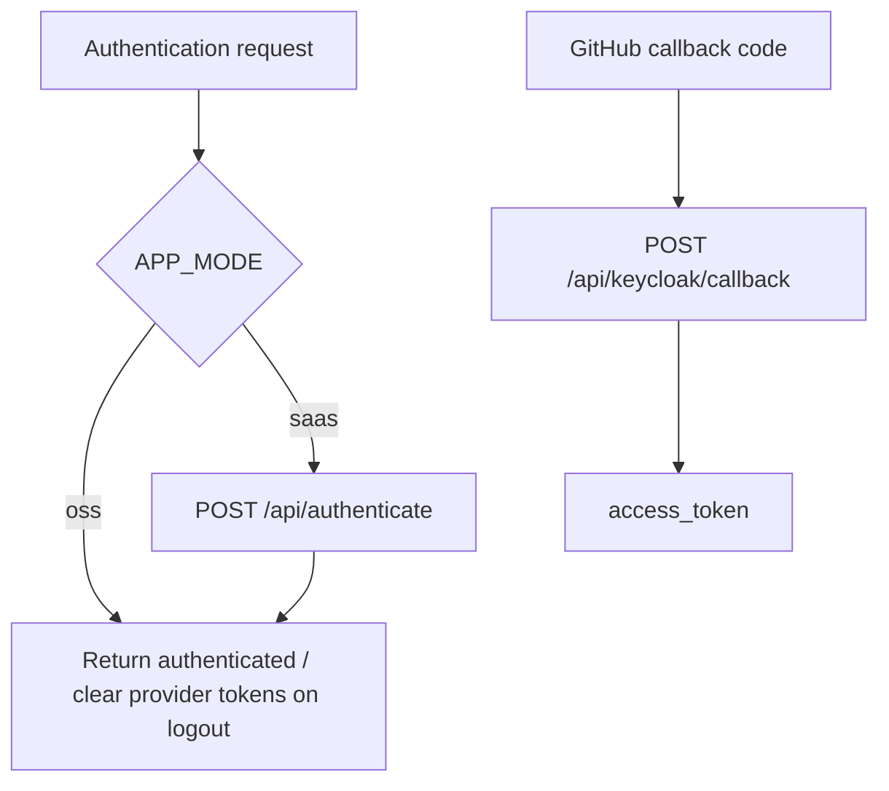

# Frontend API Services: Authentication

`AuthService` contains the small authentication adapter used by the frontend. It selects the correct backend behavior for OSS versus SaaS mode and hides endpoint details from UI components.

## Operations

| Method | Endpoint | Behavior |
|---|---|---|
| `authenticate(appMode)` | `POST /api/authenticate` | Returns `true` immediately in OSS mode; in SaaS mode, success means the request completed without an exception. |
| `getGitHubAccessToken(code)` | `POST /api/keycloak/callback` | Exchanges a callback code for `GitHubAccessTokenResponse`. |
| `logout(appMode)` | `POST /api/logout` or `POST /api/unset-provider-tokens` | Uses SaaS logout or OSS provider-token cleanup. |

`AuthenticateResponse` permits an optional message or error, while `GitHubAccessTokenResponse` contains the returned access token. HTTP failures are deliberately allowed to propagate so the caller can show the appropriate authentication state.
