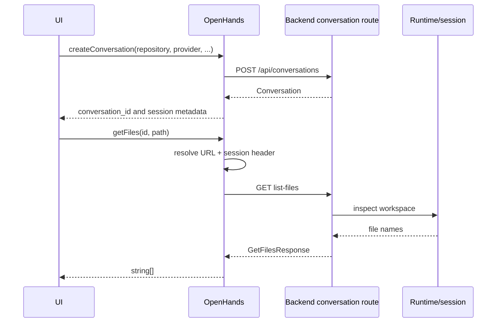

# Frontend API Services: Conversation and Workspace

`OpenHands` is the largest client service. It provides conversation lifecycle operations and the runtime-scoped APIs used by the main conversation UI.

## Responsibilities

- Stores the active `Conversation` reference and resolves its custom URL.
- Adds `X-Session-API-Key` for remote or hosted conversation sessions.
- Creates, lists, searches, updates, starts, stops, and deletes conversations.
- Retrieves workspace archives, files, Git changes, trajectories, web hosts, runtime IDs, VS Code links, and conversation microagents.
- Submits individual, Likert-scale, and batch feedback.
- Exposes billing/session helpers and microagent prompt retrieval.
- Uploads files using multipart form data.

```mermaid
flowchart TB
    UI[Conversation UI] --> OH[OpenHands]
    OH --> Resolve{Conversation matches active?}
    Resolve -->|yes + custom URL| URL[Conversation.url]
    Resolve -->|otherwise| Fallback[/api/conversations/{id}]
    URL --> Headers[Optional X-Session-API-Key]
    Fallback --> Headers
    Headers --> Runtime[Conversation/runtime endpoints]
    OH --> Global[Global API endpoints\nlist, create, feedback, billing]
```

## Contract groups

| Group | Representative methods | Result |
|---|---|---|
| Lifecycle | `createConversation`, `getConversation`, `startConversation`, `stopConversation`, `updateConversation`, `deleteUserConversation` | `Conversation`, nullable conversation, or boolean/void |
| Discovery | `getUserConversations`, `searchConversations` | `ResultSet<Conversation>` or array |
| Runtime | `getRuntimeId`, `getWebHosts`, `getVSCodeUrl`, `getWorkspaceZip` | runtime metadata, URLs, or `Blob` |
| Workspace | `getFiles`, `getFile`, `uploadFiles` | file list/content/upload report |
| Review | `getGitChanges`, `getGitChangeDiff`, `getTrajectory` | change, diff, and trajectory data |
| Feedback | `submitFeedback`, `submitConversationFeedback`, `checkFeedbackExists`, `getBatchFeedback` | feedback payloads or existence map |
| Microagents | `getMicroagents`, `getMicroagentPrompt` | microagent metadata or prompt text |

## Data flow



The response models are declared in `open-hands.types.ts`, including `Conversation`, `ResultSet`, `GitChange`, `GitChangeDiff`, `GetFilesResponse`, `GetFileResponse`, `GetTrajectoryResponse`, and upload/feedback contracts. `Conversation` connects this service to shared frontend status and provider types.
