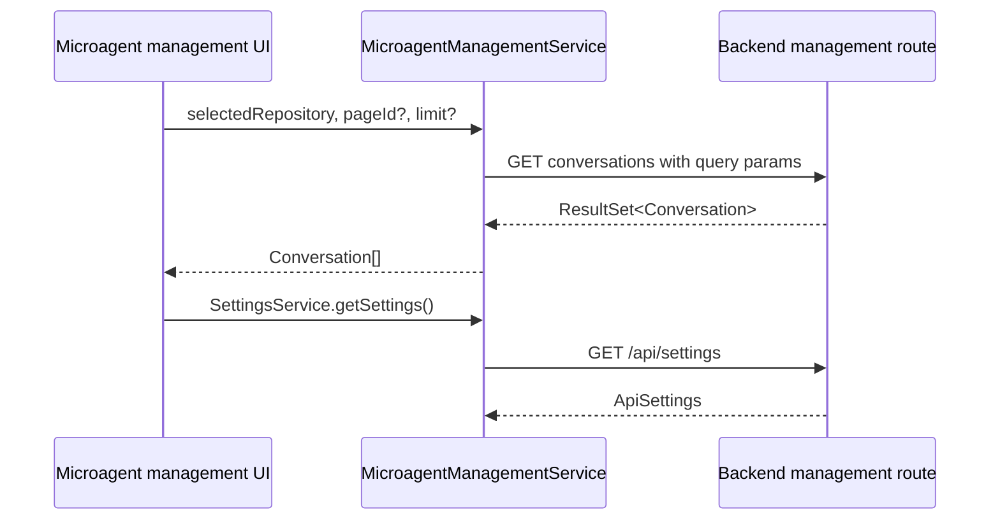

# Frontend API Services: Settings and Microagent Management

## SettingsService

`SettingsService` provides two application-settings operations:

- `getSettings()` calls `GET /api/settings` and returns `ApiSettings`.
- `saveSettings(settings)` calls `POST /api/settings` with a partial `PostApiSettings` object and returns `true` only for HTTP 200.

Only valid settings are expected to be persisted by the backend. The service does not merge defaults or validate fields locally.

## MicroagentManagementService

`getMicroagentManagementConversations(selectedRepository, pageId, limit)` calls `/api/microagent-management/conversations`, always filters by repository, and optionally passes a continuation page ID. It unwraps `ResultSet<Conversation>` and returns only `data.results`.

The service uses the same `Conversation` and `ResultSet` contracts as `OpenHands`, but its endpoint is a dedicated management view rather than a runtime-scoped conversation endpoint.
