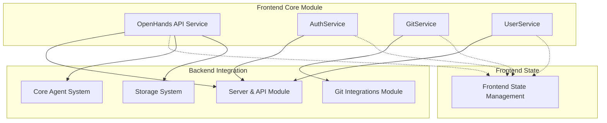
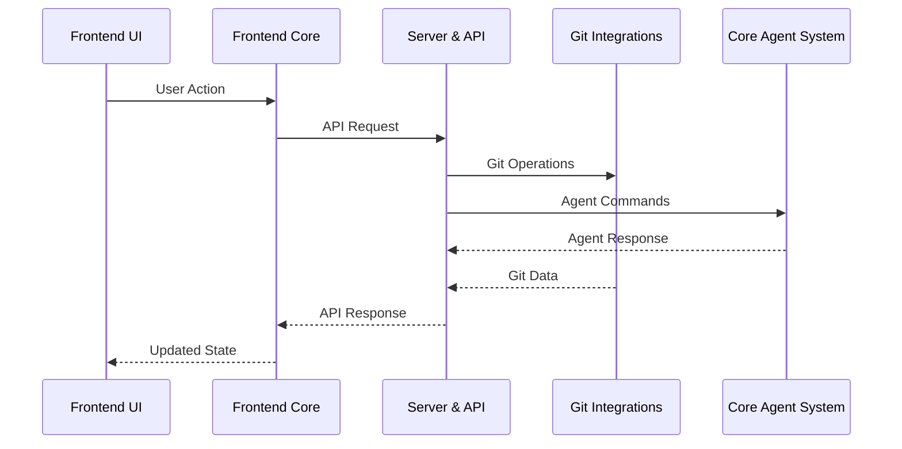

# Frontend Core Module

## Overview

The `frontend_core` module serves as the primary API layer for the OpenHands frontend application, providing a comprehensive set of services for interacting with the backend systems. This module acts as the bridge between the React frontend and various backend services, handling authentication, conversation management, Git operations, and user interactions.

## Purpose

The frontend_core module centralizes all API communications and provides:
- **Unified API Interface**: Single point of access for all backend services
- **Authentication Management**: Handles user authentication and session management
- **Git Integration**: Provides comprehensive Git repository and branch management
- **Conversation Orchestration**: Manages AI agent conversations and interactions
- **User Management**: Handles user profile and preference operations

## Architecture Overview

## Core Components

The frontend_core module is organized into specialized API services, each handling specific aspects of the system interaction. For detailed implementation information, see [API Services Documentation](api_services.md).

### 1. OpenHands API Service (`frontend.src.api.open-hands.OpenHands`)

The central API service that handles:
- **Conversation Management**: Create, start, stop, and manage AI agent conversations
- **Feedback System**: Submit and retrieve user feedback for conversations
- **Workspace Operations**: File management, workspace downloads, and VSCode integration
- **Billing Integration**: Handle subscription and payment operations
- **Microagent Operations**: Manage and interact with specialized AI agents

### 2. Authentication Service (`frontend.src.api.auth-service.auth-service.api.AuthService`)

Handles all authentication-related operations:
- **Multi-mode Authentication**: Supports both SaaS and OSS authentication modes
- **GitHub Integration**: OAuth flow management for GitHub access tokens
- **Session Management**: Login/logout operations across different app modes

### 3. Git Service (`frontend.src.api.git-service.git-service.api.GitService`)

Comprehensive Git operations management:
- **Repository Discovery**: Search and browse user repositories across providers
- **Branch Management**: List, search, and manage repository branches
- **Installation Handling**: Manage GitHub App installations and permissions
- **Microagent Integration**: Repository-specific microagent discovery and content retrieval

### 4. User Service (`frontend.src.api.user-service.user-service.api.UserService`)

User profile and information management:
- **Profile Retrieval**: Get current user's Git profile information
- **User Context**: Maintain user identity across sessions

## Integration Points

### Backend Module Dependencies

The frontend_core module integrates with several backend modules:

- **[server_and_api](server_and_api.md)**: Primary backend API endpoints for conversations, authentication, and user management
- **[git_integrations](git_integrations.md)**: Git provider services for repository and branch operations
- **[core_agent_system](core_agent_system.md)**: Agent conversation management and control
- **[storage_system](storage_system.md)**: Persistent storage for conversations, files, and user data

### Frontend State Integration

Works closely with **[frontend_state_management](frontend_state_management.md)** to:
- Synchronize API responses with application state
- Manage loading states and error handling
- Cache frequently accessed data
- Provide real-time updates to UI components

## Data Flow Architecture

## Key Features

### Conversation Management
- Create and manage AI agent conversations
- Real-time conversation state tracking
- Session-based API key management
- Conversation history and search

### File Operations
- Workspace file listing and retrieval
- Multi-file upload support
- Workspace zip download
- Real-time file change tracking

### Git Integration
- Multi-provider repository access
- Branch discovery and management
- Installation-based repository filtering
- Microagent repository integration

### Feedback System
- Conversation rating and feedback
- Event-specific feedback tracking
- Batch feedback operations
- Metadata-rich feedback storage

### Development Tools
- VSCode integration URLs
- Runtime configuration access
- Trajectory analysis and debugging
- Git change visualization

## Error Handling

The module implements comprehensive error handling:
- **Network Resilience**: Automatic retry mechanisms for failed requests
- **Authentication Errors**: Graceful handling of expired sessions
- **Provider Failures**: Fallback mechanisms for Git provider issues
- **Validation Errors**: Client-side validation before API calls

## Security Considerations

- **Session Management**: Secure API key handling per conversation
- **Provider Tokens**: Encrypted storage of Git provider tokens
- **CORS Handling**: Proper cross-origin request management
- **Input Validation**: Sanitization of user inputs before API calls

## Performance Optimizations

- **Request Caching**: Intelligent caching of frequently accessed data
- **Pagination Support**: Efficient handling of large datasets
- **Lazy Loading**: On-demand loading of repository and branch data
- **Batch Operations**: Grouped API calls for improved performance

## Future Enhancements

- **WebSocket Integration**: Real-time conversation updates
- **Offline Support**: Cached operations for offline scenarios
- **Advanced Search**: Enhanced repository and conversation search
- **Multi-tenant Support**: Enterprise-grade multi-tenancy features

---

*This module serves as the foundation for all frontend-backend communication in the OpenHands system, providing a robust and scalable API layer that supports the full range of AI agent interactions and development workflows.*