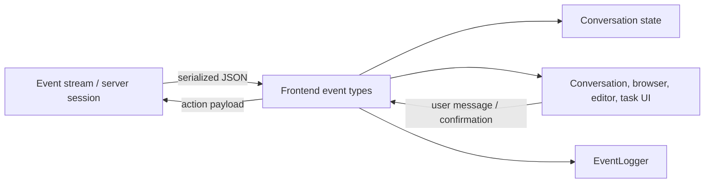
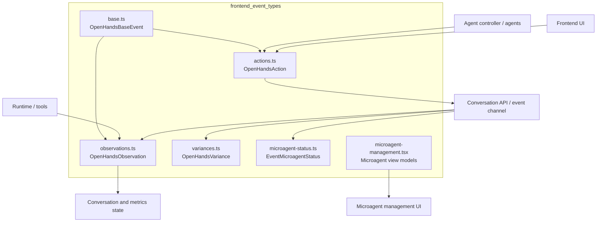
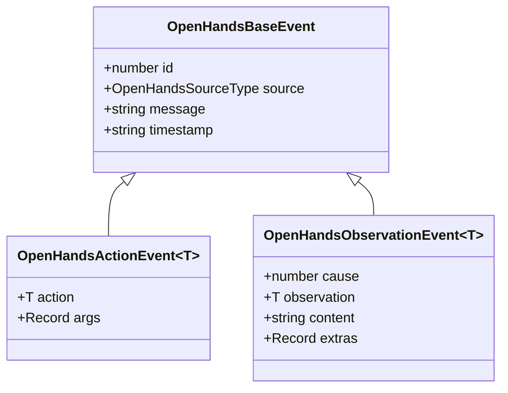
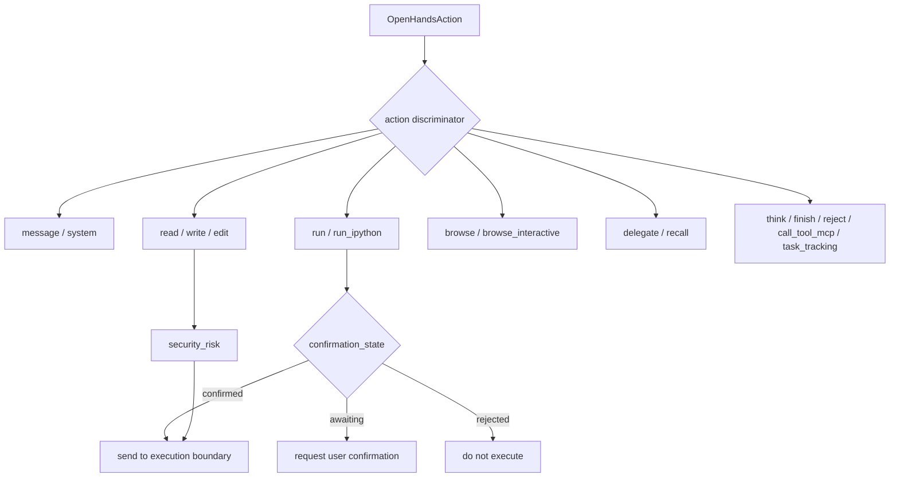
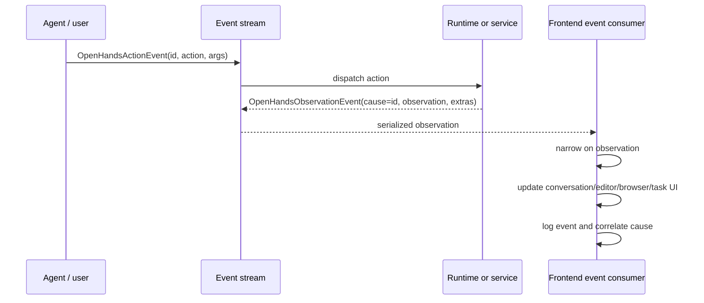
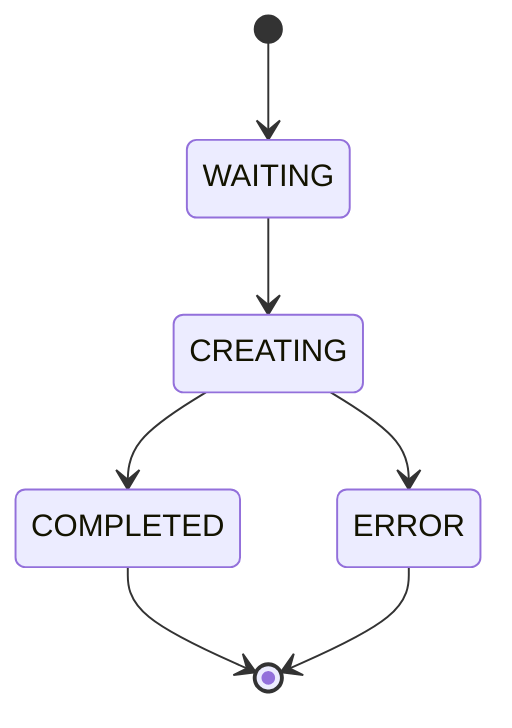
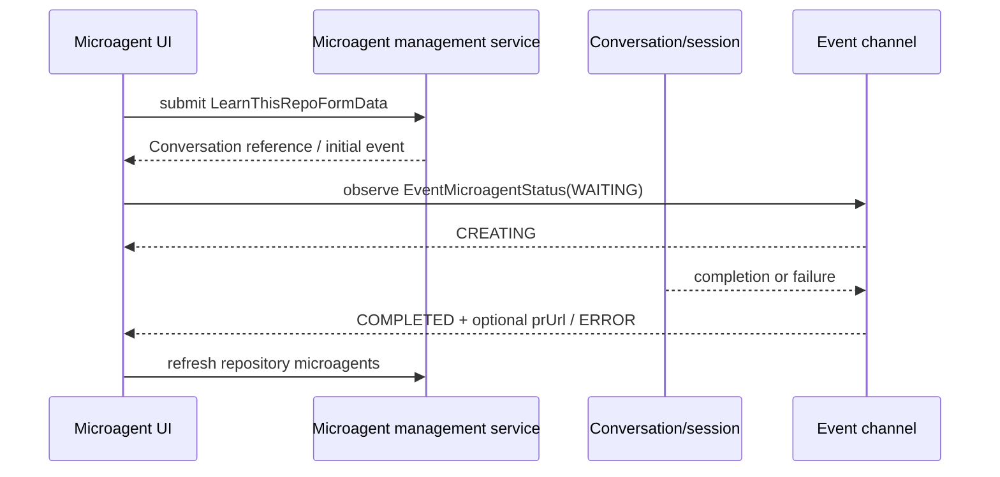
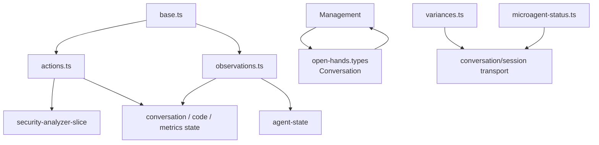

# Frontend Event Types

## Introduction

The `frontend_event_types` module defines the TypeScript contracts used by the
OpenHands frontend to receive, render, and submit conversation events. It models
agent intent as actions, runtime or service results as observations, and a small
set of out-of-band protocol messages used during initialization, authentication,
status reporting, and microagent management.

The module is a client-facing representation of the platform event stream. The
backend event lifecycle and persistence model are documented in
[Event System](event_system.md). Conversation transport and endpoint behavior are
documented in [Frontend API Services: Conversation and Workspace](frontend_api_services_conversation_workspace.md).

## Purpose and boundaries

The module owns:

- the common identity and envelope fields for action and observation events;
- discriminated unions for supported action and observation payloads;
- protocol variants that do not follow the normal event envelope;
- microagent creation status and microagent-management view models.

It does not own event persistence, reducer behavior, API request orchestration,
or backend execution. Those responsibilities belong to the event system,
the frontend state slices, and [Frontend API Services](frontend_api_services.md),
respectively.

## Architecture

### Contract layers

| Layer | Files | Role |
| --- | --- | --- |
| Event envelope | `types/core/base.ts` | Shared IDs, source, message, timestamp, and action/observation discriminators. |
| Actions | `types/core/actions.ts` | Agent or user intent, including commands, file operations, browsing, delegation, recall, MCP, and task tracking. |
| Observations | `types/core/observations.ts` | Results and state changes associated with actions. |
| Protocol variances | `types/core/variances.ts` | Initialization, token configuration, local user messages, and status updates that do not carry the full event envelope. |
| Microagent status | `types/microagent-status.ts` | Asynchronous lifecycle notifications for microagent creation. |
| Microagent management | `types/microagent-management.tsx` | Repository microagent metadata and form/view models. |

## Common event envelope

`OpenHandsBaseEvent` is the shared structural contract:

| Field | Type | Meaning |
| --- | --- | --- |
| `id` | `number` | Event identifier, used for ordering and correlation. |
| `source` | `"agent" \| "user" \| "environment"` | Producer of the event. |
| `message` | `string` | Human-readable event text. |
| `timestamp` | `string` | ISO 8601 timestamp. |

`OpenHandsActionEvent<T>` adds `action: T` and an open-ended `args` object.
`OpenHandsObservationEvent<T>` adds `cause: number`, `observation: T`,
`content`, and an open-ended `extras` object. The `cause` field links an
observation to the action or event that produced it.

`OpenHandsEventType` is the discriminator vocabulary. It includes message and
system events, state changes, execution (`run`, `run_ipython`), file operations,
browsing, reasoning, completion, errors, recall, MCP, task tracking, and user
rejection. The action and observation unions intentionally expose only the
variants implemented in their respective files; the string union is broader
than either union so transport can recognize additional event kinds.

## Action contracts

Actions describe intent sent by a user or agent. `OpenHandsAction` is the
discriminated union consumed by UI and transport code.

| Action family | Types | Important payload |
| --- | --- | --- |
| Conversation messages | `UserMessageAction`, `AssistantMessageAction`, `SystemMessageAction` | Text, images/files, wait behavior, tools, version, and agent metadata. |
| Execution | `CommandAction`, `IPythonAction` | Command/code, thought, security risk, and confirmation state. |
| Reasoning and completion | `ThinkAction`, `FinishAction`, `RejectAction` | Thought text, final outputs, or rejection rationale. |
| Files | `FileReadAction`, `FileWriteAction`, `FileEditAction` | Path plus read range, content, edit operation, diff inputs, and risk metadata. |
| Browser | `BrowseAction`, `BrowseInteractiveAction` | URL or browser action program, thought, timeout, and user-facing browser message. |
| Orchestration | `DelegateAction`, `RecallAction` | Delegated agent inputs/timeout or workspace/knowledge query. |
| Integrations | `MCPAction` | Tool name, argument object, and optional thought. |
| Planning | `TaskTrackingAction` | Task-list command and items in `todo`, `in_progress`, or `done` state. |

Security-sensitive command, Python, read, and edit actions carry
`ActionSecurityRisk` from the security analyzer state. Confirmation is modeled
as `confirmed`, `rejected`, or `awaiting_confirmation`; UI confirmation flows
must preserve that distinction rather than treating an absent value as safe.

Notable payload details:

- `FileEditAction` supports multiple edit representations (`command`, complete
  `content`, `old_str`/`new_str`, line insertion, and start/end offsets). Consumers
  should inspect the fields relevant to the selected edit implementation.
- Browser observations use `focused_element_bid` and structured DOM/accessibility
  fields; these are opaque records to the type layer and should be interpreted by
  browser-specific UI code.
- `MCPAction` uses `call_tool_mcp`, while its result uses `mcp`; this is an
  intentional action/result discriminator difference.

## Observation contracts

Observations describe results returned by runtimes, tools, or server-side event
processing. `OpenHandsObservation` is the union used by event consumers.

| Observation family | Types | Payload highlights |
| --- | --- | --- |
| Agent state and reasoning | `AgentStateChangeObservation`, `AgentThinkObservation` | `AgentState`, optional reason, and thought text. See [Core Schema and Runtime Support](core_schema_and_runtime_support.md). |
| Execution | `CommandObservation`, `IPythonObservation` | Command metadata, hidden flag, code, and optional images. |
| Files | `ReadObservation`, `WriteObservation`, `EditObservation` | Path, implementation source, content, or rendered diff. |
| Browser | `BrowseObservation`, `BrowseInteractiveObservation` | URL, screenshot, open pages, active page, DOM/accessibility data, and last-action status. |
| Delegation and recall | `DelegateObservation`, `RecallObservation` | Delegate outputs or recalled repository, runtime, instruction, secret-description, and microagent knowledge fields. |
| Integrations | `MCPObservation` | Tool name and argument object. |
| Control/error | `ErrorObservation`, `UserRejectedObservation` | Optional error ID or extensible rejection details. |
| Planning | `TaskTrackingObservation` | Updated task command and task items. |

Most observation payloads are in `extras`, while displayable text is in
`content`. The frontend should use `observation` for narrowing before reading
variant-specific fields.

## Protocol variances

`OpenHandsVariance` covers messages that are related to the conversation protocol
but do not conform to `OpenHandsBaseEvent`.

| Type | Purpose | Discriminator |
| --- | --- | --- |
| `TokenConfigSuccess` / `TokenConfigError` | Token setup response; success carries a token, while `401` represents unauthorized configuration. | `status` |
| `InitConfig` | Initial frontend/session configuration, including agent, language, confirmation mode, model, and API-key presence. | `action: "initialize"` |
| `LocalUserMessageAction` | Minimal client-originated message payload. | `action: "message"` |
| `StatusUpdate` | Immediate informational or error status outside the event stream. | `status_update: true` and `type` |

These shapes are deliberately separate from `OpenHandsAction`. In particular,
`LocalUserMessageAction` has no base event metadata and `InitConfig` uses an
`initialize` discriminator that is not part of `OpenHandsEventType`.

## Microagent status and management models

`EventMicroagentStatus` is an asynchronous status message identified by both
`eventId` and `conversationId`. Its `MicroagentStatus` lifecycle is:

`COMPLETED` may include `prUrl`, allowing the UI to expose the generated pull
request. `IMicroagentItem` optionally combines repository microagent metadata
with its related `Conversation`; it therefore supports list entries that have
only one side available while data is loading.

`microagent-management.tsx` also defines:

- `TabType`: `personal`, `repositories`, or `organizations`;
- `RepositoryMicroagent`: name, creation time, Git provider, and path;
- `MicroagentFormData`: query, triggers, and target path;
- `LearnThisRepoFormData`: the repository-learning query.

For API retrieval and settings behavior, see
[Frontend API Services: Settings and Microagent Management](frontend_api_services_settings_microagents.md).
For the conceptual microagent subsystem, see [Microagents](microagents.md).

## End-to-end process flows

### Action execution and observation rendering

```mermaid
flowchart LR
    Compose[UI composes action] --> Validate[Type narrowing / validation]
    Validate --> Send[Conversation transport]
    Send --> Controller[Agent controller or runtime]
    Controller --> Result[Observation or error]
    Result --> Correlate[Match observation.cause to action.id]
    Correlate --> Reduce[Update frontend state]
    Reduce --> Render[Render transcript and tool result]

    click Controller "agent_controller.md"
```

### Microagent creation

## Consumer guidance and compatibility notes

1. Narrow unions by `action` or `observation` before accessing `args` or
   `extras`; the base envelope intentionally keeps those records generic.
2. Preserve `id`, `timestamp`, `source`, and `cause` when transforming events.
   They are required for ordering, provenance, and action/result correlation.
3. Treat security risk and confirmation state as independent fields. A confirmed
   action can still carry a non-low risk classification for display and auditing.
4. Treat browser structures, MCP arguments, finish outputs, and task notes as
   extensible records; do not assume their keys are exhaustive.
5. Handle protocol variances before normal event-union dispatch because they do
   not necessarily have `id`, `source`, or `observation` fields.
6. Keep backend event semantics aligned with [Event System](event_system.md);
   this module describes the serialized frontend boundary, not the Python event
   class hierarchy.

## Dependency summary

The direct imports are intentionally narrow: action types depend on security
classification, observation types depend on agent state, and management models
depend on the API `Conversation` model. Runtime, controller, server, and storage
modules communicate with these contracts through serialized events rather than
being imported directly by the type definitions.
