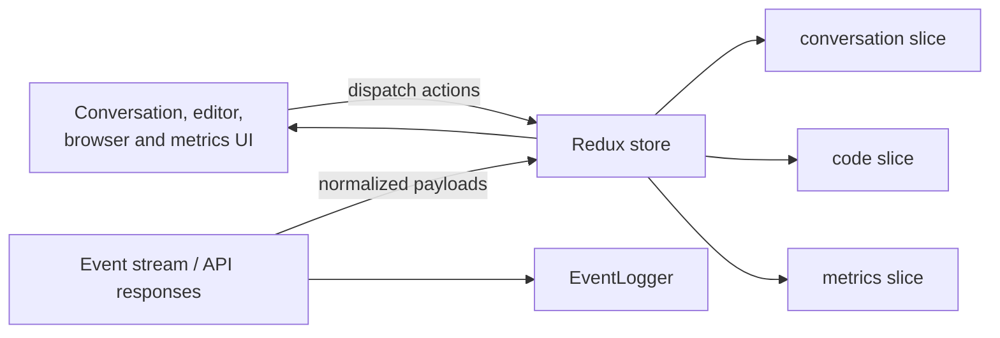
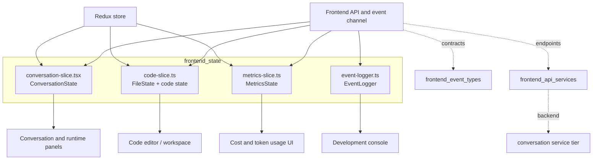
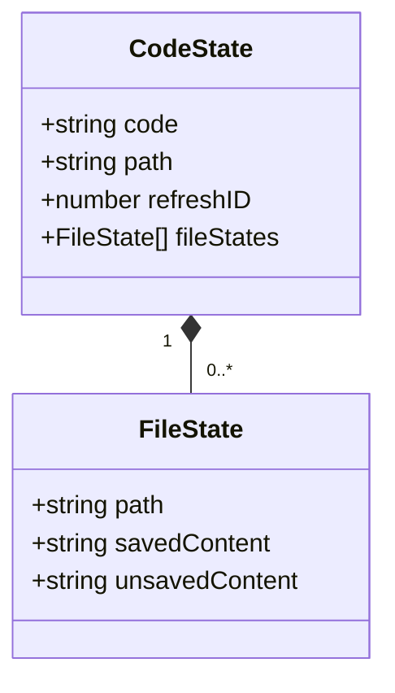
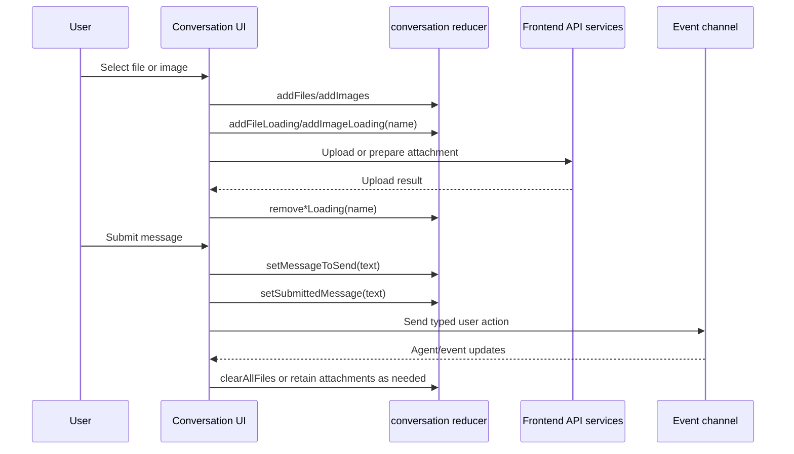
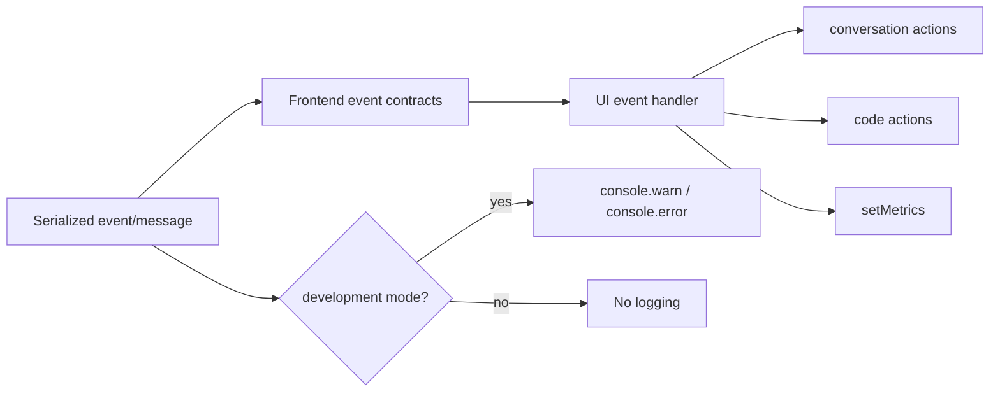

# Frontend State

## Introduction

The `frontend_state` module is the Redux Toolkit state layer for the OpenHands
web client. It coordinates transient conversation UI state, editor file
buffers, and LLM usage metrics, while `EventLogger` provides development-only
diagnostics for browser events. The slices are intentionally presentation and
session state; server persistence, event contracts, and HTTP orchestration are
owned by [Frontend API Services](frontend_api_services.md), [Frontend Event
Types](frontend_event_types.md), and the server/session modules.

## Purpose and boundaries



The module owns:

- panel and embedded-runtime tab selection;
- attachment queues and their per-name loading indicators;
- message submission hand-off flags and agent-loading presentation state;
- the active editor file, refresh counter, and saved/unsaved file snapshots;
- cost and token-usage metrics displayed to the user;
- development-mode logging of raw messages, events, warnings, and errors.

It does not own the canonical conversation event model, file upload transport,
workspace persistence, agent execution, or production telemetry. See [Frontend
API Services: Conversation and Workspace](frontend_api_services_conversation_workspace.md)
for transport operations and [Event System](event_system.md) for backend event
delivery and persistence.

## Architecture



The slices use Immer-backed Redux Toolkit reducers. Reducers may appear to
mutate `state` (`push`, `splice`, or direct assignment), but Redux Toolkit
produces immutable updates for subscribers.

## State model

### Conversation state

`ConversationState` is the short-lived UI coordinator for the main conversation
screen.

| Field | Shape | Meaning |
| --- | --- | --- |
| `isRightPanelShown` | `boolean` | Whether the right-side workspace panel is visible. Defaults to `true`. |
| `selectedTab` | `ConversationTab \| null` | Active workspace view: `editor`, `browser`, `jupyter`, `served`, `vscode`, or `terminal`. |
| `images`, `files` | `File[]` | Attachments staged by the user. |
| `loadingFiles`, `loadingImages` | `string[]` | Names currently being processed. Entries are deduplicated. |
| `messageToSend` | `IMessageToSend \| null` | Message hand-off object containing text and a generated millisecond timestamp. |
| `shouldShownAgentLoading` | `boolean` | Whether the UI should show agent activity/loading. |
| `submittedMessage` | `string \| null` | Last submitted message value. |
| `shouldHideSuggestions` | `boolean` | Hides suggestions when the input expands; reset to `false` by `resetConversationState`. |
| `hasRightPanelToggled` | `boolean` | Tracks whether the panel has been explicitly toggled. Defaults to `true`. |

The reducer's initial object also contains `shouldStopConversation` and
`shouldStartConversation`. These flags are not declared in the shown
`ConversationState` interface, so maintainers should either add them to the
interface or remove the fields; otherwise the runtime shape and the static
contract can diverge.

### Code state

The code slice stores the active editor buffer and a per-path comparison of
saved and unsaved content.



`code` is the currently displayed editor content, `path` identifies the active
file, and `refreshID` is a numeric invalidation value that consumers can change
to force an editor refresh. `fileStates` preserves independent buffers by path,
allowing unsaved edits to coexist with the last saved content.

`addOrUpdateFileState` replaces any existing entry with the same path and then
appends the new snapshot. Consequently, the array behaves as a path-keyed
collection even though it is represented as a list. `removeFileState` removes
all entries matching the supplied path.

### Metrics state

`MetricsState` contains nullable task-level budget data and one nullable usage
record:

| Field | Shape | Meaning |
| --- | --- | --- |
| `cost` | `number \| null` | Accumulated or reported task cost. |
| `max_budget_per_task` | `number \| null` | Configured task budget. |
| `usage` | object \| null | Prompt, completion, cache read/write, context-window, and per-turn token counts. |

Metrics are a display-oriented projection of backend/LLM accounting. The
backend metric semantics are documented in [LLM Layer Metrics](llm_layer_metrics.md);
the frontend slice simply replaces all three fields through `setMetrics`.

## Reducer and action reference

### Conversation actions

| Action | Effect |
| --- | --- |
| `setIsRightPanelShown` | Sets panel visibility. |
| `setSelectedTab` | Selects a supported workspace tab or `null`. |
| `setShouldShownAgentLoading` | Sets agent-loading visibility. |
| `setShouldHideSuggestions` | Sets suggestion visibility state. |
| `addImages`, `addFiles` | Appends attachment objects. |
| `removeImage`, `removeFile` | Removes by numeric array index. |
| `clearImages`, `clearFiles` | Clears one attachment category. |
| `clearAllFiles` | Clears both attachment arrays and both loading arrays. |
| `addFileLoading`, `addImageLoading` | Adds a filename if it is not already queued. |
| `removeFileLoading`, `removeImageLoading` | Removes every matching filename. |
| `clearAllLoading` | Clears file and image loading queues only. |
| `setMessageToSend` | Creates `{ text, timestamp: Date.now() }`. |
| `setSubmittedMessage` | Stores the submitted text or `null`. |
| `resetConversationState` | Currently resets only `shouldHideSuggestions`. It is not a full slice reset. |
| `setHasRightPanelToggled` | Sets explicit panel-toggle tracking. |

### Code and metrics actions

| Slice | Action | Effect |
| --- | --- | --- |
| Code | `setCode` | Replaces active editor content. |
| Code | `setActiveFilepath` | Replaces active file path. |
| Code | `setRefreshID` | Replaces refresh/invalidation counter. |
| Code | `setFileStates` | Replaces all file snapshots. |
| Code | `addOrUpdateFileState` | Upserts a snapshot by `path`. |
| Code | `removeFileState` | Removes a snapshot by `path`. |
| Metrics | `setMetrics` | Atomically replaces cost, budget, and usage from a typed `MetricsState` payload. |

Action creators are exported from each slice, and each default export is the
corresponding reducer. The conversation and code reducers currently leave
action payloads inferred as broad values, while `setMetrics` explicitly uses
`PayloadAction<MetricsState>`; adding payload types to the other reducers would
make index/path/tab misuse easier to catch.

## Core process flows

### Attachment processing and submission



The slice does not upload files itself. It only tracks staged `File` objects and
client-side progress names; the API layer owns multipart requests and
conversation-scoped routing.

### Editor buffer lifecycle

```mermaid
flowchart TD
    Open[Open workspace file] --> API[OpenHands.getFile / workspace API]
    API --> Load[setActiveFilepath + setCode]
    Load --> Snapshot[addOrUpdateFileState(savedContent, unsavedContent)]
    Snapshot --> Edit[User edits editor]
    Edit --> Dirty[Update code and unsavedContent]
    Dirty --> Save[Save through API]
    Save --> Synced[Update savedContent and unsavedContent]
    Dirty --> Switch[Switch file]
    Switch --> Restore[Read matching FileState by path]

    click API "frontend_api_services_conversation_workspace.md"
```

`FileState` is a client-side dirty-buffer model, not a persistence guarantee.
Saving, fetching, and conflict handling remain API/backend responsibilities.

### Event observation and metrics projection



`EventLogger.message` parses `MessageEvent.data` as JSON and pretty-prints it;
malformed message data can therefore throw during development logging. The
other methods log the supplied event or text only when
`process.env.NODE_ENV === "development"`. There is no production output or
remote logging in this utility.

## Dependencies and integration points

| Dependency or consumer | Relationship |
| --- | --- |
| [Frontend Event Types](frontend_event_types.md) | Defines action, observation, status, and message contracts that handlers translate into slice actions. |
| [Frontend API Services](frontend_api_services.md) | Performs conversation, workspace, upload, and settings operations represented by local state transitions. |
| [Frontend API Services: Conversation and Workspace](frontend_api_services_conversation_workspace.md) | Supplies file/workspace and conversation endpoints used by editor and submission flows. |
| [LLM Layer](llm_layer.md) and [LLM Layer Metrics](llm_layer_metrics.md) | Produce the accounting values projected into `MetricsState`. |
| [Event System](event_system.md) | Backend event stream and persistence corresponding to frontend event handling. |
| [Shared Platform Foundation](shared_platform_foundation.md) | Shared schemas, serialization, logging, and event primitives used across the system. |
| [Conversation Service Tier](conversation_service_tier.md) | Server-side session and conversation boundary behind frontend requests. |

## Maintenance considerations

- Keep `ConversationState` synchronized with its initial state; in particular,
  decide whether start/stop flags are part of the public contract.
- Preserve filename deduplication in loading queues unless the UI changes to
  support multiple simultaneous operations for the same name. A name-only key
  cannot distinguish two same-named files from different directories.
- Treat `removeImage` and `removeFile` payloads as indexes. If callers migrate
  to stable IDs, change the reducers and all consumers together.
- Treat `resetConversationState` as a narrow UI reset, not a conversation
  teardown. A complete teardown must explicitly clear attachments, loading
  state, messages, editor state, and metrics as appropriate.
- Keep metric field names aligned with the backend wire format, especially
  `max_budget_per_task` and the cache token counters.
- Keep `EventLogger` development-only. Do not pass secrets, raw credentials, or
  sensitive conversation payloads to new logging calls without reviewing the
  console exposure risk.

