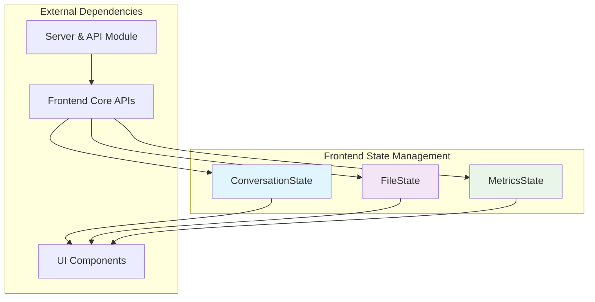
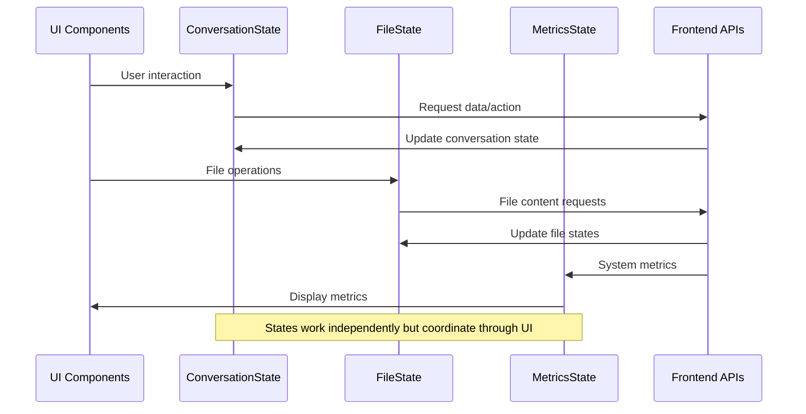

# Frontend State Management Module

## Overview

The Frontend State Management module is a critical component of the OpenHands system that manages the client-side application state using Redux Toolkit. This module provides centralized state management for the frontend application, handling conversation interactions, code editing, and system metrics tracking.

## Purpose

This module serves as the single source of truth for frontend application state, enabling:
- **Conversation Management**: Managing chat interactions, file uploads, and UI panel states
- **Code Editor State**: Tracking file contents, editor states, and unsaved changes
- **Metrics Tracking**: Monitoring system usage, costs, and token consumption
- **UI State Coordination**: Synchronizing various UI components and their states

## Architecture Overview

The module follows Redux Toolkit patterns with three main state slices that work together to provide comprehensive state management:



## Core Components

### 1. ConversationState
**Location**: `frontend.src.state.conversation-slice.ConversationState`

Manages all conversation-related state including:
- **Panel Management**: Right panel visibility and tab selection
- **File Handling**: Image and file uploads with loading states
- **Message Flow**: Message composition and submission tracking
- **UI Behavior**: Suggestion visibility and agent loading states

**Key Features**:
- Multi-tab support (editor, browser, jupyter, served, vscode, terminal)
- Asynchronous file upload tracking
- Message queuing and submission management
- Dynamic UI state coordination

### 2. FileState
**Location**: `frontend.src.state.code-slice.FileState`

Handles code editor and file management state:
- **File Content Tracking**: Saved vs unsaved content management
- **Active File Management**: Current file path and content
- **Multi-file Support**: Managing multiple open files simultaneously
- **Change Detection**: Tracking modifications and refresh states

**Key Features**:
- Differential content tracking (saved vs unsaved)
- Multi-file state management
- Refresh mechanism for content synchronization
- Path-based file identification

### 3. MetricsState
**Location**: `frontend.src.state.metrics-slice.MetricsState`

Tracks system performance and usage metrics:
- **Cost Tracking**: Real-time cost monitoring
- **Budget Management**: Task-based budget limits
- **Token Usage**: Comprehensive token consumption metrics
- **Performance Monitoring**: Context window and per-turn token tracking

**Key Features**:
- Real-time cost calculation
- Token usage breakdown (prompt, completion, cache)
- Budget constraint monitoring
- Performance analytics

## State Flow Architecture



## Integration with Other Modules

### Frontend Core Module
The state management module works closely with the [frontend_core](frontend_core.md) module:
- **API Services**: Receives data updates from OpenHands, AuthService, GitService, and UserService
- **State Synchronization**: Maintains consistency between frontend state and backend data

### Server and API Module
Integrates with the [server_and_api](server_and_api.md) module for:
- **Real-time Updates**: WebSocket connections for live state updates
- **Session Management**: Coordinating with server-side session state
- **Conversation Orchestration**: Synchronizing with backend conversation management

## State Management Patterns

### Redux Toolkit Implementation
- **Immutable Updates**: Using Redux Toolkit's Immer integration
- **Action Creators**: Automatically generated action creators for type safety
- **Slice-based Organization**: Modular state management with clear boundaries

### Async State Handling
- **Loading States**: Comprehensive loading state management for files and images
- **Error Boundaries**: Graceful error handling in state updates
- **Optimistic Updates**: UI responsiveness through optimistic state changes

## Key Features

### 1. Conversation Management
- Multi-tab interface support
- File and image upload handling
- Message composition and submission
- Agent interaction states
- UI panel coordination

### 2. Code Editor Integration
- Multi-file editing support
- Unsaved changes tracking
- Content synchronization
- Path-based file management

### 3. System Monitoring
- Real-time cost tracking
- Token usage analytics
- Budget management
- Performance metrics

## Usage Patterns

### State Updates
```typescript
// Conversation state updates
dispatch(setSelectedTab('editor'));
dispatch(addFiles(uploadedFiles));
dispatch(setShouldShownAgentLoading(true));

// File state updates
dispatch(setActiveFilepath('/path/to/file'));
dispatch(addOrUpdateFileState({
  path: '/path/to/file',
  savedContent: 'original',
  unsavedContent: 'modified'
}));

// Metrics updates
dispatch(setMetrics({
  cost: 0.05,
  usage: { prompt_tokens: 100, completion_tokens: 50 }
}));
```

### State Selection
```typescript
// Accessing state in components
const isRightPanelShown = useSelector(state => state.conversation.isRightPanelShown);
const fileStates = useSelector(state => state.code.fileStates);
const currentCost = useSelector(state => state.metrics.cost);
```

## Performance Considerations

### State Normalization
- Efficient file state management through path-based indexing
- Minimal re-renders through selective state updates
- Optimized loading state tracking

### Memory Management
- Automatic cleanup of unused file states
- Efficient image and file handling
- Garbage collection of temporary states

## Future Enhancements

### Planned Features
- **Persistent State**: Local storage integration for state persistence
- **Undo/Redo**: History management for editor operations
- **Collaborative Editing**: Multi-user state synchronization
- **Advanced Metrics**: Enhanced analytics and reporting

### Scalability Improvements
- **State Partitioning**: Further modularization for large applications
- **Lazy Loading**: On-demand state initialization
- **Caching Strategies**: Improved performance through intelligent caching

## Related Documentation

- [Frontend Core Module](frontend_core.md) - API services and core frontend functionality
- [Server and API Module](server_and_api.md) - Backend integration and session management
- [Events and Actions Module](events_and_actions.md) - Event-driven architecture integration