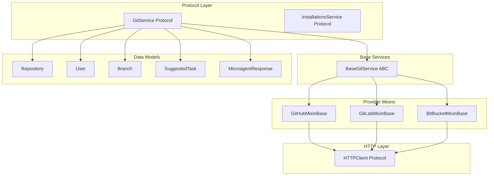
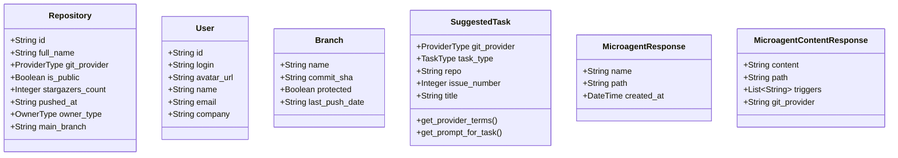
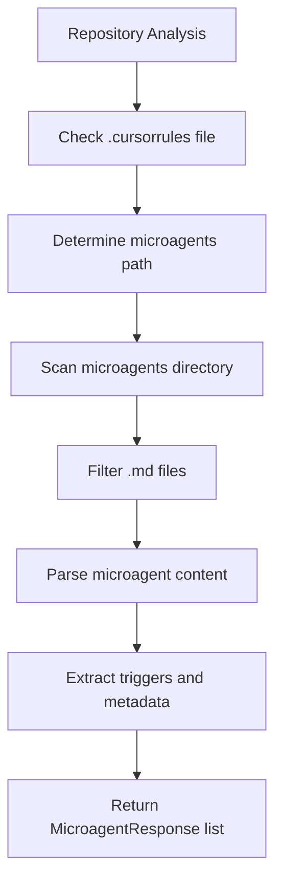
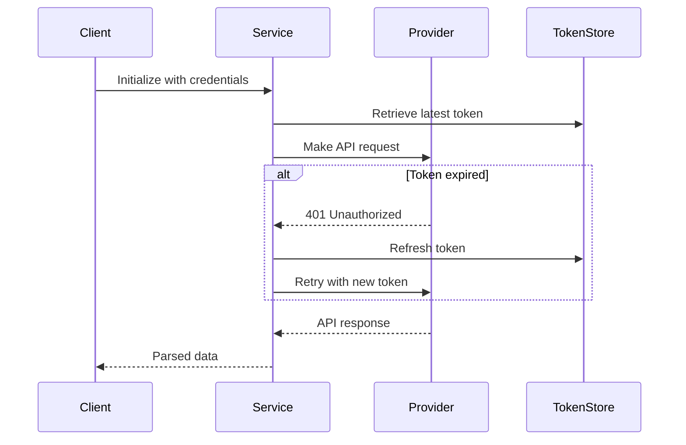
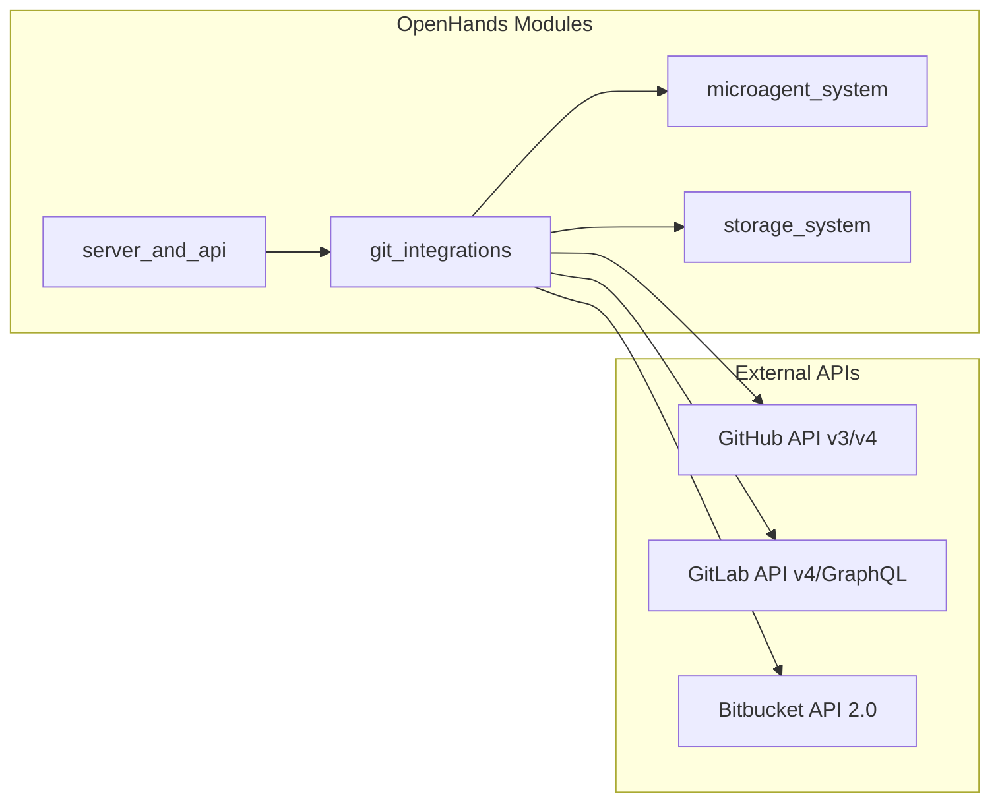

# Git Integrations Module

## Overview

The `git_integrations` module provides a unified interface for integrating with multiple Git service providers (GitHub, GitLab, and Bitbucket). It implements a common protocol-based architecture that enables OpenHands to interact with different Git platforms through a standardized API, facilitating repository management, microagent discovery, and Git-based task automation.

## Architecture

The module follows a layered architecture with abstract base classes and provider-specific implementations:



## Core Components

The git_integrations module is organized into several key sub-modules that provide specialized functionality:

### Service Foundation
The foundational layer defines the core protocols and base classes that establish the common interface for all Git service providers. This includes the GitService protocol that standardizes operations across providers, and the BaseGitService abstract class that provides shared functionality like microagent discovery and content parsing.

**→ See detailed documentation: [Service Foundation](service_foundation.md)**

### Provider Implementations  
Provider-specific mixin classes that handle the unique aspects of each Git platform's API, authentication methods, and data formats. Each provider mixin extends the base service with platform-specific implementations while maintaining the common interface.

**→ See detailed documentation: [Provider Implementations](provider_implementations.md)**

### Data Models and Types
The module defines comprehensive data models and type definitions that represent Git concepts consistently across all providers, including repositories, users, branches, tasks, and microagent responses.

## Data Models

### Core Data Structures



### Enumeration Types

- **ProviderType**: GitHub, GitLab, Bitbucket, Enterprise SSO
- **TaskType**: Merge conflicts, failing checks, unresolved comments, open issues/PRs
- **OwnerType**: User or Organization ownership
- **RequestMethod**: GET/POST HTTP methods

## Key Functionality

### Microagent Discovery System

The module implements a sophisticated microagent discovery system that works across all Git providers:



#### Discovery Process
1. **Root File Check**: Scans for `.cursorrules` file in repository root
2. **Directory Detection**: Determines microagent directory path based on repository structure
3. **File Filtering**: Identifies valid `.md` microagent files (excluding README.md)
4. **Content Parsing**: Uses BaseMicroagent infrastructure to parse content and extract triggers
5. **Response Generation**: Creates structured responses with metadata

### Authentication and Token Management



### Repository Operations

The module provides comprehensive repository management capabilities:

- **Repository Search**: Query-based repository discovery with filtering
- **Pagination Support**: Efficient handling of large repository lists
- **Branch Management**: Branch listing, searching, and pagination
- **Details Retrieval**: Complete repository metadata and configuration

## Integration Points

### Dependencies on Other Modules

The git_integrations module has several key dependencies within the OpenHands system:

- **[microagent_system](microagent_system.md)**: Uses BaseMicroagent for content parsing and trigger extraction
- **[storage_system](storage_system.md)**: Integrates with token and settings storage for authentication management
- **[server_and_api](server_and_api.md)**: Provides services consumed by web API endpoints
- **[frontend_core](frontend_core.md)**: Supports frontend Git service API calls

### External Integration Points



## Error Handling

The module implements comprehensive error handling for various failure scenarios:

- **AuthenticationError**: Invalid or expired authentication credentials
- **RateLimitError**: API rate limit exceeded
- **ResourceNotFoundError**: Requested resources (files, repositories) not found
- **MicroagentParseError**: Errors parsing microagent file content
- **UnknownException**: General communication or processing errors

## Configuration and Setup

### Authentication Configuration

Each provider supports multiple authentication methods:

```python
# GitHub
service = GitHubService(
    user_id="user_123",
    token=SecretStr("ghp_token"),
    external_auth_id="oauth_id",
    external_token_manager=True
)

# GitLab (including self-hosted)
service = GitLabService(
    user_id="user_123", 
    token=SecretStr("glpat_token"),
    base_domain="gitlab.company.com"
)

# Bitbucket
service = BitBucketService(
    user_id="user_123",
    token=SecretStr("username:app_password")
)
```

### Microagent Path Configuration

The module automatically determines microagent paths based on repository structure:

- **Standard repositories**: `.openhands/microagents/`
- **OpenHands config repositories**: `microagents/`
- **Custom paths**: Configurable through repository settings

## Usage Examples

### Repository Discovery
```python
# Search public repositories
repositories = await git_service.search_repositories(
    query="machine learning",
    per_page=50,
    sort="stars",
    order="desc",
    public=True
)

# Get user's repositories
user_repos = await git_service.get_all_repositories(
    sort="updated",
    app_mode=AppMode.SaaS
)
```

### Microagent Management
```python
# Discover microagents
microagents = await git_service.get_microagents("owner/repo")

# Get microagent content with triggers
content = await git_service.get_microagent_content(
    repository="owner/repo",
    file_path=".openhands/microagents/task_agent.md"
)
```

### Task Automation
```python
# Get suggested tasks
tasks = await git_service.get_suggested_tasks()

# Check PR status
is_open = await git_service.is_pr_open("owner/repo", 123)
```

## Performance Considerations

### Optimization Strategies

1. **Lazy Loading**: Microagent content loaded on-demand, not during discovery
2. **Pagination**: Efficient handling of large data sets
3. **Token Caching**: Reduced authentication overhead
4. **Error Retry**: Automatic handling of temporary failures

### Resource Management

- **Connection Pooling**: Reuses HTTP connections where possible
- **Rate Limiting**: Respects provider API limits
- **Caching**: Repository and user data caching strategies
- **Batch Operations**: Efficient bulk data retrieval

## Future Enhancements

- **Additional Providers**: Support for more Git hosting platforms
- **Enhanced Caching**: More sophisticated caching strategies
- **Webhook Support**: Real-time repository event handling
- **Advanced Search**: Enhanced repository and content discovery
- **Bulk Operations**: Mass repository management capabilities

This git_integrations module serves as the foundation for OpenHands' multi-platform Git integration capabilities, providing a unified interface that abstracts provider-specific details while maintaining full feature compatibility across different Git hosting platforms.