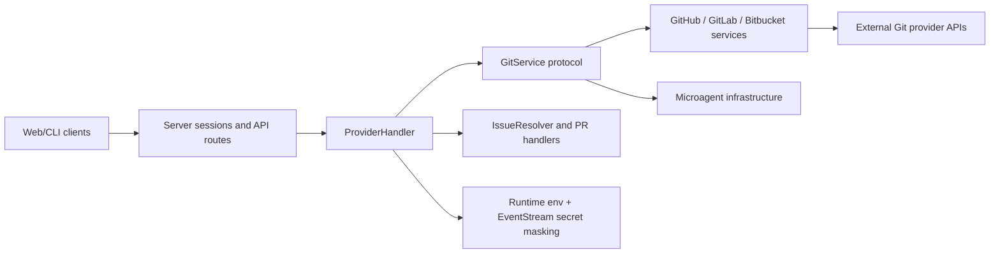
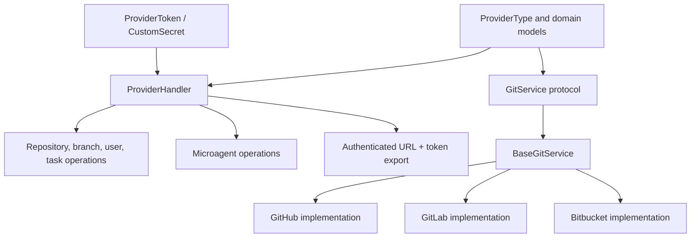
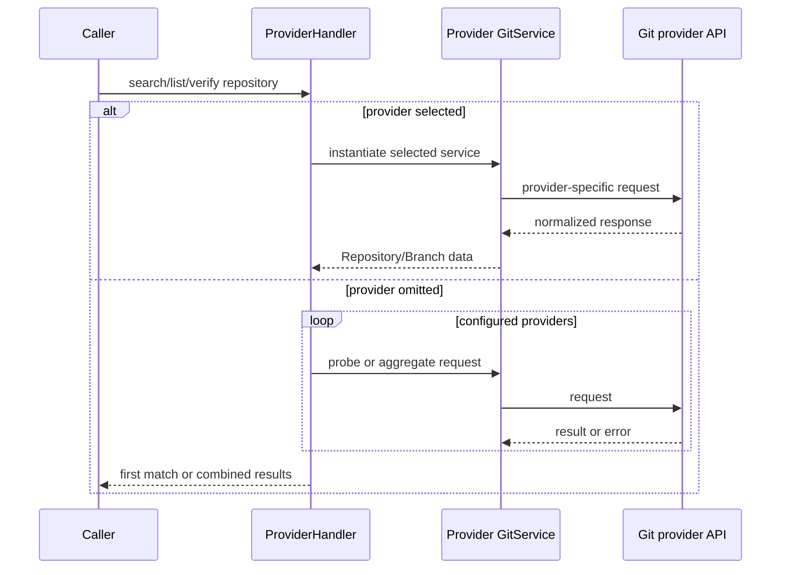

# Git provider integrations

The `git_provider_integrations` module is the provider-neutral integration boundary for OpenHands' code-host automation. It lets the rest of the system authenticate against GitHub, GitLab, or Bitbucket, discover repositories and branches, retrieve microagents, generate authenticated Git URLs, and inspect pull/merge request state without embedding provider-specific API logic in callers.

## Position in the system

The module belongs to the broader [code_host_automation.md](code_host_automation.md) area. Its primary downstream consumer is the resolver layer, documented in [issue_resolver.md](issue_resolver.md). It uses shared event, server, logging, and microagent types rather than owning those subsystems.

## Architecture

The design separates orchestration from contracts. The generated documentation index is:

- [git_provider_integrations_provider_handler.md](git_provider_integrations_provider_handler.md) documents `ProviderHandler`, credential flow, provider selection, aggregation, and runtime integration.
- [git_provider_integrations_service_contracts.md](git_provider_integrations_service_contracts.md) documents `GitService`, `BaseGitService`, shared models/enums, exceptions, and microagent normalization.

## Core flows

### Repository and branch access

### Microagent discovery

Microagent listing checks `.cursorrules` and provider-specific repository directories. Content retrieval parses the file through the shared microagent loader and returns content plus trigger metadata. Missing files are treated as a cross-provider lookup opportunity; parsing and provider errors are retained for final diagnostics.

## Operational characteristics

- All provider calls are asynchronous.
- Provider failures are logged and commonly isolated so another configured provider can succeed.
- Explicit provider requests require pagination parameters where the underlying API requires them.
- Secret values are represented with `SecretStr` until deliberately exported, then masked in the event stream.
- Custom enterprise hosts are supported through the token's `host` field and are used in repository URL detection and Git remote construction.
- PR status lookup fails safe by treating an unknown status as open.

## Change checklist

When modifying this module, keep the provider-neutral protocol, facade mapping, shared response models, token-export behavior, and resolver expectations aligned. A new provider should be added consistently to `ProviderType`, service construction, domains, environment-key mapping, URL construction, and tests for aggregation/fallback behavior.
