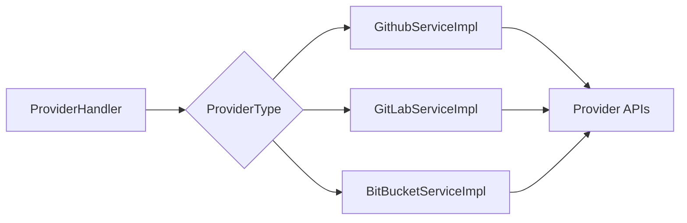
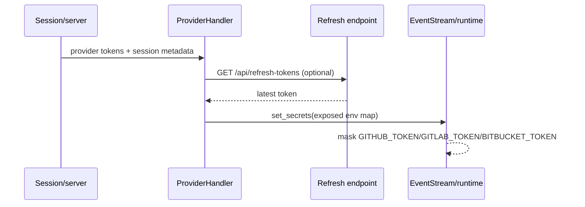

# ProviderHandler

`ProviderHandler` is the runtime-facing facade for authenticated GitHub, GitLab, and Bitbucket access. It owns the configured provider-token map, selects the provider-specific service implementation, aggregates results when no provider is selected, and exports credentials safely to the runtime/event stream.

## Responsibilities

- Validate and retain immutable `ProviderToken` and `CustomSecret` values.
- Map `ProviderType` values to `GithubServiceImpl`, `GitLabServiceImpl`, or `BitBucketServiceImpl`.
- Resolve users, repositories, branches, installations, suggested tasks, and microagents.
- Determine a provider by probing repository access when the caller did not specify one.
- Construct authenticated Git remote URLs for provider-specific token formats.
- Refresh tokens through the web application when session refresh metadata is available.
- Detect provider-token references in shell commands and configure event-stream secret masking.

## Service selection

`_get_service()` reads the token, optional custom host, and external-auth fields for the selected provider and passes them into the provider implementation. The handler does not implement provider API details; those belong to the concrete services.

## Provider selection patterns

The facade uses three selection modes:

1. Explicit selection: repository and branch operations use the requested provider directly.
2. Aggregation: repository search/list and suggested-task retrieval iterate over every configured provider and combine successful results.
3. Discovery by access: `verify_repo_provider()` probes configured services until one can resolve the repository. This is used by branch search and authenticated URL generation.

Most multi-provider reads are failure-tolerant: an individual provider failure is logged and other providers continue. Authentication-sensitive methods raise `AuthenticationError` after all candidates fail.

## Credential lifecycle

`get_env_vars(expose_secrets=False)` returns typed `SecretStr` values. Export is explicit through `expose_env_vars()` or `get_env_vars(expose_secrets=True)`, which maps providers to lowercase runtime keys such as `github_token`. `set_event_stream_secrets()` installs those values for masking.

## Notable behavior and maintenance considerations

- `REFRESH_TOKEN_URL` is enabled only when `WEB_HOST` is set; refresh failures fall back to the existing token.
- `get_authenticated_git_url()` uses GitHub's direct token form, GitLab's `oauth2:` form, and Bitbucket's username/app-password or `x-token-auth` form.
- `is_pr_open()` returns `True` if status lookup fails, intentionally keeping the conversation eligible for processing.
- Repository de-duplication is intended to use repository identity; callers should preserve the current behavior carefully when changing the implementation.
- Tokens are held in immutable Pydantic models, but callers must still avoid logging exposed values.

## Consumers

The issue/PR automation layer consumes this facade through resolver handlers; see [issue_resolver.md](issue_resolver.md) for orchestration and provider-specific issue/PR processing.
