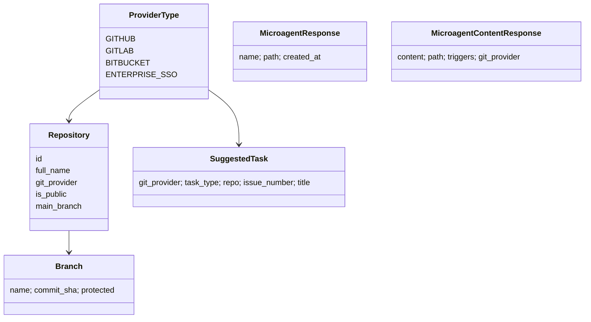

# Git provider service contracts

The service-contract layer in `openhands/integrations/service_types.py` defines the vocabulary and provider-neutral protocols used by `ProviderHandler` and concrete Git services.

## Domain vocabulary



Key enums are `ProviderType`, `TaskType`, `OwnerType`, and `RequestMethod`. Shared models include `User`, `Repository`, `Branch`, `PaginatedBranchesResponse`, `Comment`, `SuggestedTask`, `CreateMicroagent`, and `TokenResponse`. Shared exceptions distinguish authentication, rate limiting, missing resources, communication failures, and microagent parsing failures.

## `GitService` protocol

Concrete services implement a common asynchronous surface for:

- authenticated user lookup;
- repository search, listing, and pagination;
- suggested-task discovery;
- repository details and branch retrieval/search;
- pull/merge request details and open-state checks;
- microagent listing and content retrieval.

`ProviderHandler` relies on this protocol rather than concrete classes, which keeps provider selection centralized and makes provider implementations substitutable.

## `BaseGitService` shared microagent workflow

Concrete services inherit reusable logic while implementing URL, request, and response-shape hooks.

```mermaid
flowchart TD
    A[get_microagents(repository)] --> B[determine path]
    B --> C[check .cursorrules]
    B --> D[request microagents directory]
    D --> E[normalize API response items]
    E --> F[filter valid files]
    F --> G[create MicroagentResponse list]
    H[get_microagent_content] --> I[fetch file]
    I --> J[BaseMicroagent.load]
    J --> K[extract content + triggers]
    K --> L[MicroagentContentResponse]
```

The default directory is `.openhands/microagents`; `.openhands` and `openhands-config` repositories use `microagents`. Directory responses support list-like data plus Bitbucket `values` and GraphQL-style `nodes`. Parsing delegates to `BaseMicroagent.load`, converting failures to `MicroagentParseError`.

## Suggested-task prompting

`SuggestedTask.get_provider_terms()` supplies provider-specific terminology and token names. `get_prompt_for_task()` loads a Jinja template from `openhands/integrations/templates/suggested_task` and supports merge conflicts, failing checks, unresolved comments, and open issues. Unsupported task types raise `ValueError`.

## Extension guidance

To add a provider, extend `ProviderType`, implement `GitService` (usually through `BaseGitService`), add the implementation to `ProviderHandler.service_class_map`, define its domain/auth URL rules, and cover provider-specific response normalization. Keep shared models provider-neutral so resolver code remains unchanged.

See [git_provider_integrations_provider_handler.md](git_provider_integrations_provider_handler.md) for facade behavior.
