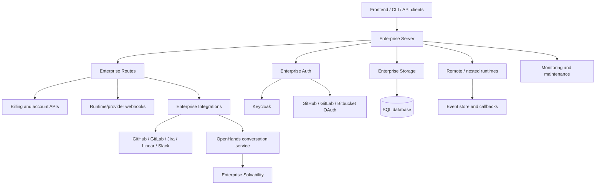
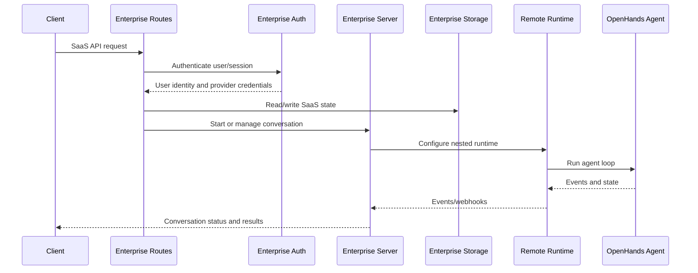

# Hosted SaaS Overlay

The `hosted_saas_overlay` module is the enterprise SaaS layer for OpenHands. It extends the shared conversation platform with hosted-service concerns: authentication, HTTP routes, persistence, remote runtime orchestration, billing, provider integrations, monitoring, maintenance, and solvability prediction.

It acts primarily as a control plane. Agent execution remains in the shared agent/runtime layers or in remotely managed runtimes.

## Architecture



### Request and conversation flow



## Module components

- `enterprise/server` — SaaS server configuration, authentication integration, rate limiting, nested conversation management, MCP provisioning, monitoring, experiments, and maintenance.
- `enterprise/server/routes` — FastAPI routes for API keys, billing, email, feedback, runtime event webhooks, Jira, Jira Data Center, and Linear.
- `enterprise/server/auth` — Keycloak sessions, signed cookies, token refresh and encryption, provider OAuth tokens, GitHub allowlists, and request enforcement.
- `enterprise/storage` — SQLAlchemy models and enums for settings, callbacks, billing, subscriptions, feedback, experiments, webhooks, and maintenance tasks; also enforces conversation ownership.
- `enterprise/integrations` — Provider webhook orchestration and conversation automation for GitHub, GitLab, Jira, Jira DC, Linear, Slack, and Bitbucket.
- `enterprise/integrations/solvability/models` — LLM-based issue featurization and Random Forest solvability prediction.

## Repository structure

```text
enterprise/
├── server/
│   ├── auth/
│   └── routes/
├── storage/
└── integrations/
    └── solvability/models/
```

## Core component documentation

- [Enterprise Server](enterprise_server.md)
- [Enterprise Routes](enterprise_routes.md)
- [Enterprise Auth](enterprise_auth.md)
- [Enterprise Storage](enterprise_storage.md)
- [Enterprise Integrations](enterprise_integrations.md)
- [Enterprise Solvability](enterprise_solvability.md)

These components depend on and integrate with the platform’s core documentation:

- [Conversation Service Tier](conversation_service_tier.md)
- [Sandboxed Execution Layer](sandboxed_execution_layer.md)
- [Event System](event_system.md)
- [Storage Backends](storage_backends.md)
- [LLM Layer](llm_layer_clients_sync_core.md)
- [Code Host Automation](code_host_automation.md)