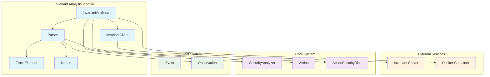
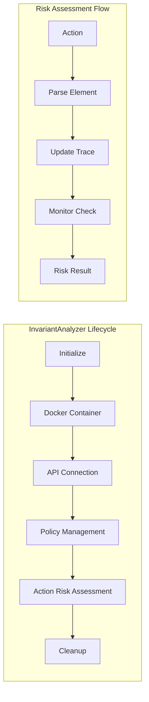
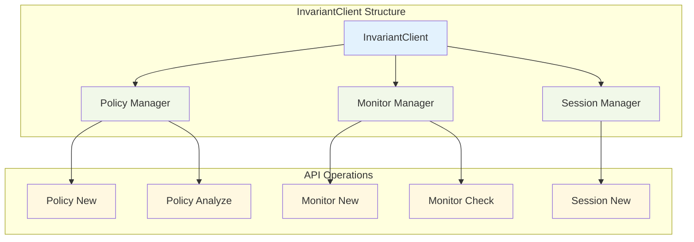
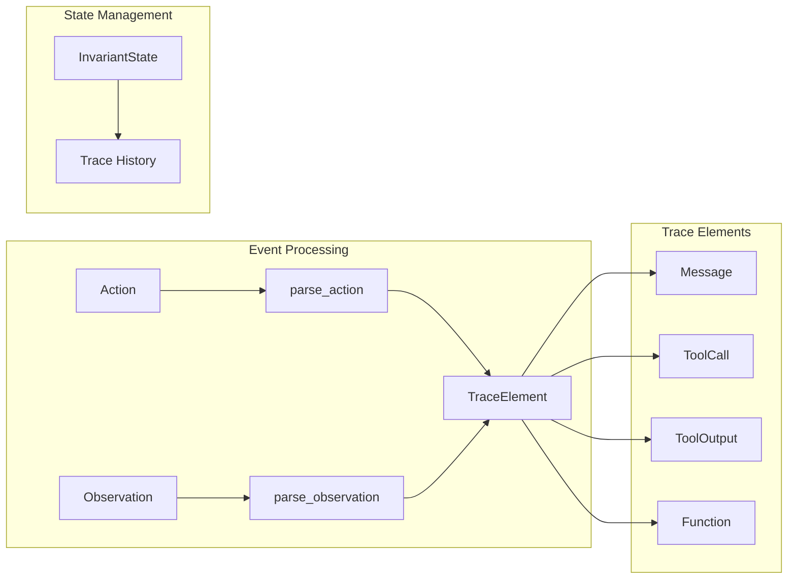
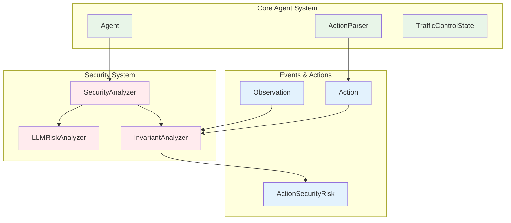
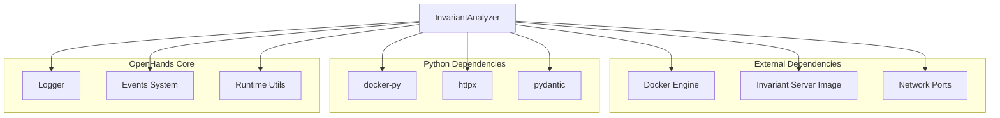
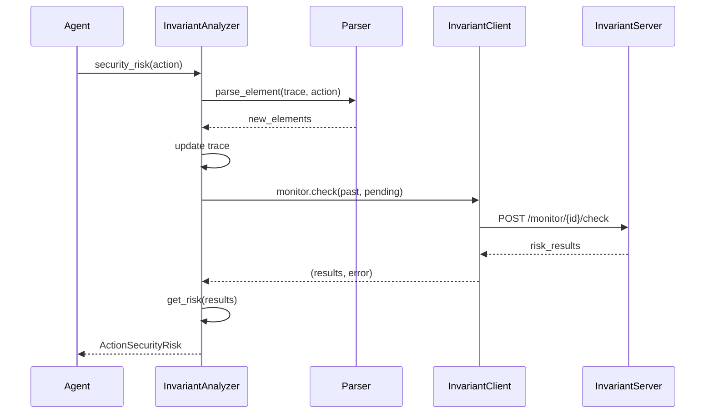
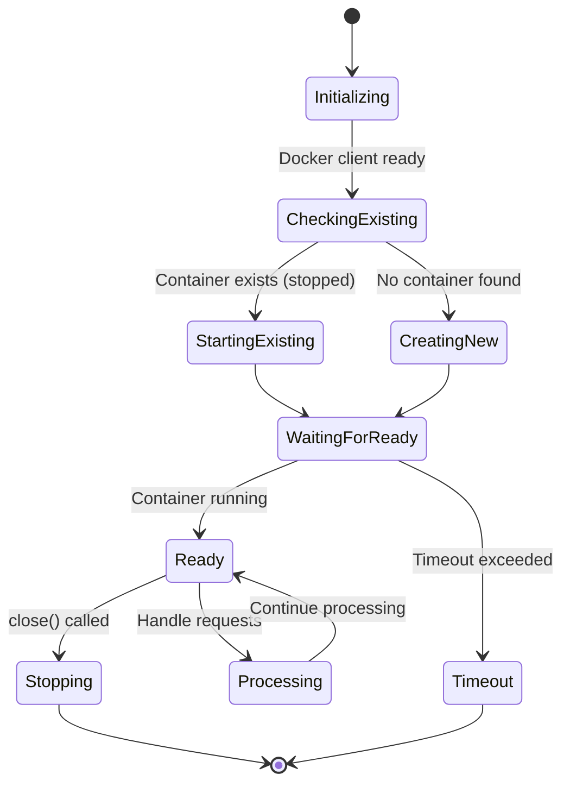
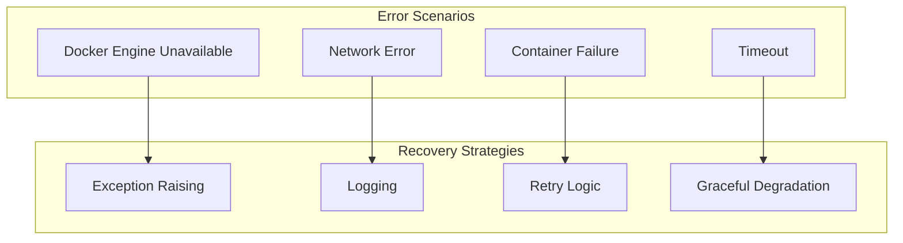

# Invariant Analysis Module

The invariant_analysis module provides advanced security analysis capabilities for OpenHands by integrating with Invariant Labs' security analysis platform. This module enables real-time monitoring and risk assessment of agent actions through policy-based security analysis.

## Overview

The invariant_analysis module is a specialized security component within the broader [security_system](security_system.md) that leverages external security analysis services to evaluate agent actions against predefined security policies. It provides containerized security analysis through Docker integration and maintains persistent monitoring sessions for comprehensive security oversight.

## Architecture



## Core Components

### InvariantAnalyzer

The main security analyzer that orchestrates the security analysis process:



**Key Features:**
- Docker-based containerized security analysis
- Session-based monitoring with persistent state
- Policy-driven risk assessment
- Real-time action evaluation

**Risk Assessment Process:**
1. Parses incoming actions into trace elements
2. Maintains cumulative trace history
3. Evaluates actions against security policies
4. Returns structured risk assessments

### InvariantClient

HTTP client for communicating with the Invariant security service:



**Capabilities:**
- Session lifecycle management
- Policy creation and template retrieval
- Monitor setup and real-time checking
- Error handling and timeout management

### Parser System

Converts OpenHands events into Invariant-compatible trace elements:



**Supported Conversions:**
- **MessageAction** → Message nodes (user/assistant roles)
- **Actions with tools** → ToolCall + Function nodes
- **Observations** → ToolOutput nodes
- **State changes** → Filtered appropriately

## Integration Points

### Security System Integration



### Runtime Dependencies



## Data Flow

### Security Analysis Pipeline



### Container Lifecycle



## Configuration and Setup

### Docker Requirements

The module requires Docker to be running and accessible:

```python
# Container configuration
container_name = 'openhands-invariant-server'
image_name = 'ghcr.io/invariantlabs-ai/server:openhands'
api_host = 'http://localhost'
timeout = 180  # seconds
```

### Policy Management

Security policies can be:
- **Template-based**: Retrieved from Invariant service defaults
- **Custom**: Provided during analyzer initialization
- **Dynamic**: Updated through the Policy API

### Session Management

Each analyzer instance maintains:
- **Unique session ID**: For isolation between analysis sessions
- **Persistent trace**: Cumulative action history
- **Monitor state**: Policy evaluation context

## Error Handling

### Container Management Errors



### API Communication Errors

- **Network timeouts**: Configurable timeout with retry logic
- **HTTP errors**: Proper error propagation and logging
- **Service unavailability**: Graceful degradation to unknown risk level

## Performance Considerations

### Resource Management

- **Container reuse**: Existing containers are restarted rather than recreated
- **Port allocation**: Dynamic port finding to avoid conflicts
- **Memory efficiency**: Trace elements use Pydantic models for optimal serialization

### Scalability Factors

- **Session isolation**: Multiple analyzer instances can run concurrently
- **Stateful analysis**: Trace history enables context-aware security analysis
- **Async compatibility**: Designed for async/await patterns

## Security Implications

### Isolation

- **Containerized execution**: Security analysis runs in isolated Docker environment
- **Network boundaries**: Communication limited to HTTP API calls
- **Session separation**: Each analysis session maintains independent state

### Data Privacy

- **Local processing**: Sensitive data processed within controlled environment
- **Configurable policies**: Security rules can be customized per deployment
- **Audit trail**: Complete trace history maintained for security review

## Usage Examples

### Basic Security Analysis

```python
# Initialize analyzer with default policy
analyzer = InvariantAnalyzer()

# Evaluate action security risk
risk = await analyzer.security_risk(action)

# Cleanup resources
await analyzer.close()
```

### Custom Policy Analysis

```python
# Initialize with custom security policy
custom_policy = "..."
analyzer = InvariantAnalyzer(policy=custom_policy)

# Process multiple actions
for action in actions:
    risk = await analyzer.security_risk(action)
    if risk == ActionSecurityRisk.HIGH:
        # Handle high-risk action
        pass
```

## Related Documentation

- [security_system](security_system.md) - Overall security architecture
- [events_and_actions](events_and_actions.md) - Event system integration
- [core_agent_system](core_agent_system.md) - Agent integration points
- [runtime_system](runtime_system.md) - Docker and container management

## Future Enhancements

### Planned Features

- **Policy versioning**: Support for policy evolution and rollback
- **Batch analysis**: Efficient processing of multiple actions
- **Custom risk metrics**: Extended risk assessment capabilities
- **Integration APIs**: Enhanced integration with external security tools

### Optimization Opportunities

- **Connection pooling**: Reuse HTTP connections for better performance
- **Caching strategies**: Cache policy evaluations for repeated patterns
- **Streaming analysis**: Real-time analysis of action streams
- **Distributed deployment**: Support for distributed security analysis