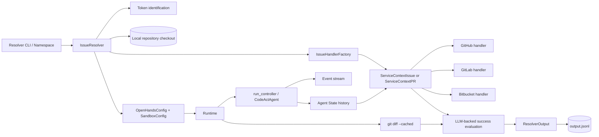
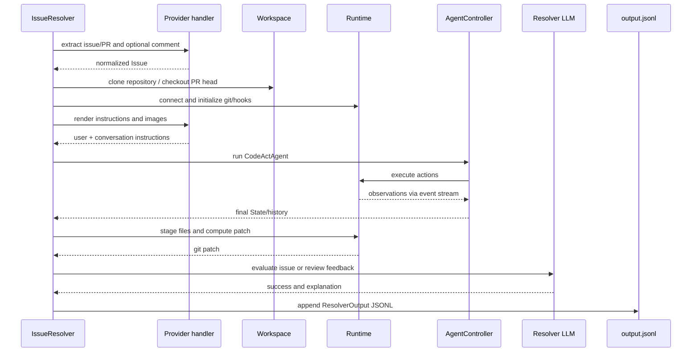

# Issue Resolver

The `issue_resolver` module is the code-host automation entry point for resolving a single GitHub, GitLab, or Bitbucket issue or pull/merge request with an OpenHands CodeAct agent. It translates provider data into the shared `Issue` model, prepares an isolated workspace and runtime, runs the agent, evaluates the resulting history and patch, and appends a machine-readable `ResolverOutput` record.

The module sits alongside provider discovery and authentication types in [`git_provider_integrations.md`](git_provider_integrations.md); agent execution, LLM access, runtime isolation, and events are documented by [`agent_controller.md`](agent_controller.md), [`llm_layer_clients.md`](llm_layer_clients.md), [`runtime_implementations.md`](runtime_implementations.md), and [`event_system.md`](event_system.md).

## Architecture

### Responsibilities

| Component | Responsibility | Detail |
|---|---|---|
| `IssueResolver` | Lifecycle orchestration | Validates credentials, configures execution, clones/checks out code, runs the agent, captures the patch, and persists output. See [`issue_resolver_orchestration.md`](issue_resolver_orchestration.md). |
| `IssueHandlerFactory` | Provider/type selection | Maps `(platform, issue_type)` to a concrete provider handler wrapped by the appropriate service context. See [`issue_resolver_factory.md`](issue_resolver_factory.md). |
| `ServiceContextIssue` / `ServiceContextPR` | Stable domain API | Converts provider payloads, renders prompts, exposes provider operations, and judges success. See [`issue_resolver_context.md`](issue_resolver_context.md). |
| Provider handlers | API and repository integration | Encapsulate URL construction, authentication, pagination, metadata conversion, comments, branches, and pull-request operations. See [`issue_resolver_providers.md`](issue_resolver_providers.md). |

## End-to-end flow

## Supported modes and invariants

- `issue_type` must be `issue` or `pr`; unsupported values fail during factory creation.
- `selected_repo` must be `owner/repository`, and both a username and token are required. A token may come from the command line or `GITHUB_TOKEN`, `GITLAB_TOKEN`, or `BITBUCKET_TOKEN`.
- GitHub and GitLab PR handlers collect unresolved review threads, review comments, thread comments, closing issues, and the head branch. Bitbucket currently supplies a more limited PR/issue representation; several comment and branch methods are placeholders.
- The resolver uses `CodeActAgent`, disables the `github` microagent, defaults to Docker unless another runtime is supplied, and applies a five-minute sandbox timeout.
- Workspaces are isolated at `output_dir/workspace/{issue_type}_{issue_number}`. Existing instance workspaces are removed and recreated for each processing attempt.
- Results are append-only JSON Lines. An issue number already present in `output.jsonl` is skipped.
- Success is heuristic: the context asks an LLM to compare the issue or review feedback with the final agent message and staged patch. It is not equivalent to a test-suite pass.

## Failure and recovery behavior

Provider/API failures, invalid credentials, missing issues, clone failures, checkout failures, and runtime setup failures raise errors. Agent `ValueError` and `RuntimeError` failures are captured into a failed `ResolverOutput`, after which the resolver still attempts to collect the patch. Git diff collection retries up to five times, increasing the command timeout and waiting between attempts.

## Related documentation

- [`agent_controller.md`](agent_controller.md) — controller state and agent loop.
- [`runtime_implementations.md`](runtime_implementations.md) — runtime and sandbox implementations.
- [`llm_layer_clients.md`](llm_layer_clients.md) — completion clients and metrics.
- [`event_system.md`](event_system.md) — actions, observations, and event subscriptions.
- [`git_provider_integrations.md`](git_provider_integrations.md) — provider abstractions and shared service types.
