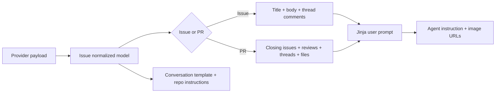

# Issue Resolver: service contexts

Source: `openhands/resolver/interfaces/issue_definitions.py` (`ServiceContext`, `ServiceContextIssue`, `ServiceContextPR`).

The contexts implement the Strategy pattern. Provider-specific handlers perform API work; contexts provide a stable resolver-facing API and normalize prompt/evaluation behavior.

## Prompt generation

`ServiceContextIssue.get_instruction()` combines title, body, and thread comments. `ServiceContextPR.get_instruction()` separately formats closing issues, review comments, file-level review threads, and thread context. Both extract image URLs and return `(user_instruction, conversation_instructions, images)`.

## Success evaluation

The issue context renders `issue-success-check.jinja` and parses a strict `--- success / --- explanation` response. The PR context selects one evaluator per feedback shape: review threads, thread comments, or review comments. Each evaluator supplies issue context, feedback, the final agent message, and the staged patch to an LLM. PR success requires every evaluated feedback item to be successful and returns a Boolean list plus JSON explanations.

The contexts delegate repository operations such as cloning, branch management, comments, pull requests, and issue conversion to the strategy. They do not implement provider HTTP details.
