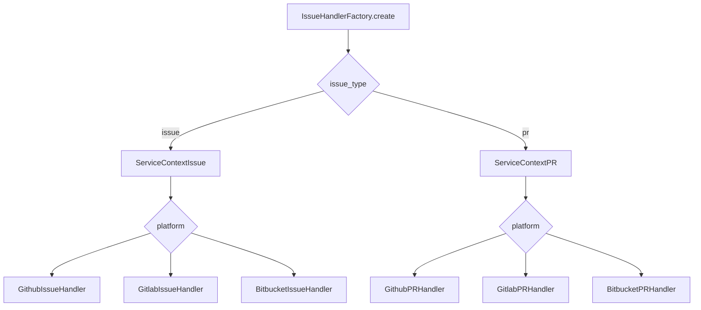

# Issue Resolver: handler factory

Source: `openhands/resolver/issue_handler_factory.py` (`IssueHandlerFactory`).

The factory isolates provider selection from orchestration. It receives repository identity, credentials, provider type, domain, issue mode, and `LLMConfig`, then returns a service context around a concrete handler.

Each branch constructs the handler with owner, repository, token, username, and base domain. Issue contexts and PR contexts expose the common operations needed by `IssueResolver`; the PR context additionally evaluates review feedback.

Invalid issue types and unsupported platforms raise `ValueError`. This makes provider support explicit and prevents the resolver from running with a partially configured handler.
