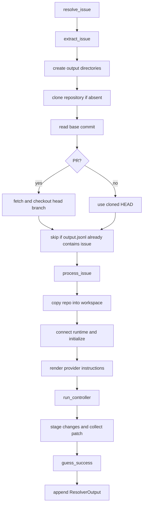

# Issue Resolver: orchestration

Source: `openhands/resolver/issue_resolver.py` (`IssueResolver`).

`IssueResolver` owns the complete single-instance lifecycle. Construction prepares provider context and OpenHands execution configuration; `resolve_issue()` performs repository preparation and idempotency checks; `process_issue()` runs the agent and materializes the result.

## Initialization

The constructor parses `selected_repo`, resolves credentials, identifies the provider from the token/base domain, loads issue- or PR-specific Jinja templates, creates a deterministic workspace path, and builds a provider context through `IssueHandlerFactory`.

`update_openhands_config()` fixes the default agent to `CodeActAgent`, selects the runtime, sets the iteration and task budget, mounts the per-issue workspace, and disables the GitHub microagent. `update_sandbox_config()` rejects simultaneous base/runtime image arguments and configures sandbox networking, linting, timeout, and GitLab CI-specific identity behavior.

## Resolution lifecycle

## Runtime hooks

`initialize_runtime()` changes to `/workspace`, configures Git's pager, optionally fixes GitLab CI ownership, runs `.openhands/setup.sh`, and installs `.openhands/pre-commit.sh` hooks. `complete_runtime()` repeats safe Git setup, stages all changes, and obtains `git diff --no-color --cached {base_commit}`. The returned patch is included in the persisted result.

## Output contract

The resolver serializes event history with `dataclasses.asdict`, collects metrics from the final state, and stores issue metadata, prompt instruction, base commit, patch, success flags, explanations, and error information in `ResolverOutput`. The file is `output_dir/output.jsonl`; logs are under `output_dir/infer_logs`.

## Important operational details

- `process_issue()` deletes and recreates the per-instance workspace, while preserving the source checkout under `output_dir/repo`.
- Event logging uses an `EventStreamSubscriber.MAIN` subscription.
- A missing final state is converted into a failed output rather than silently discarded.
- A PR's `head_branch` is mandatory for checkout.
