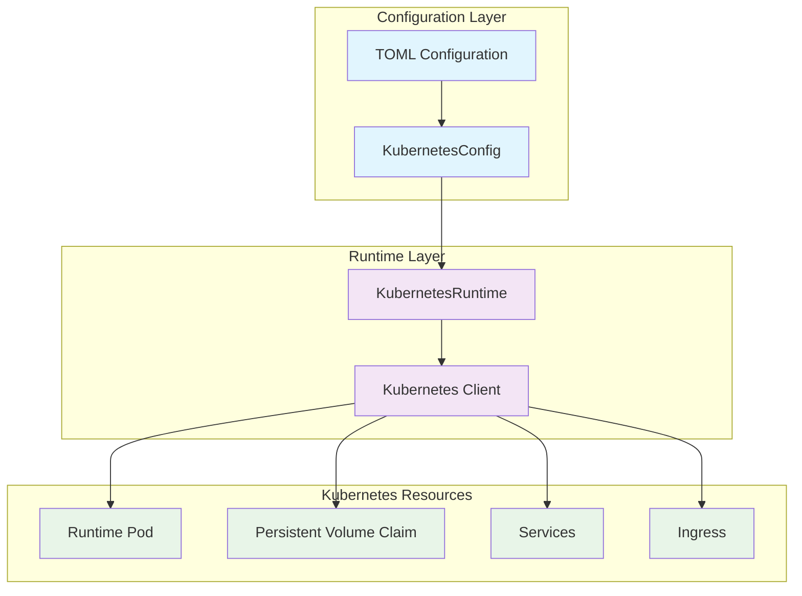
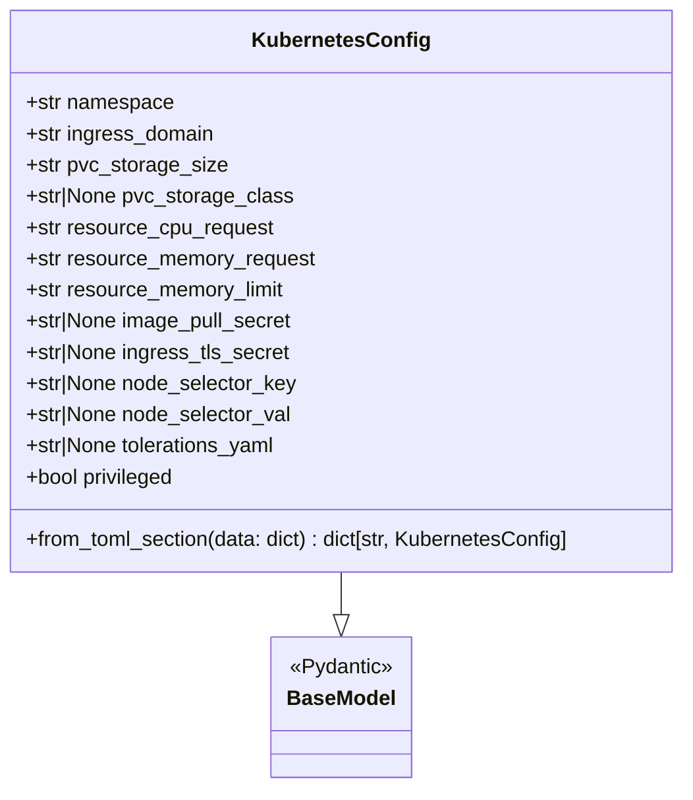
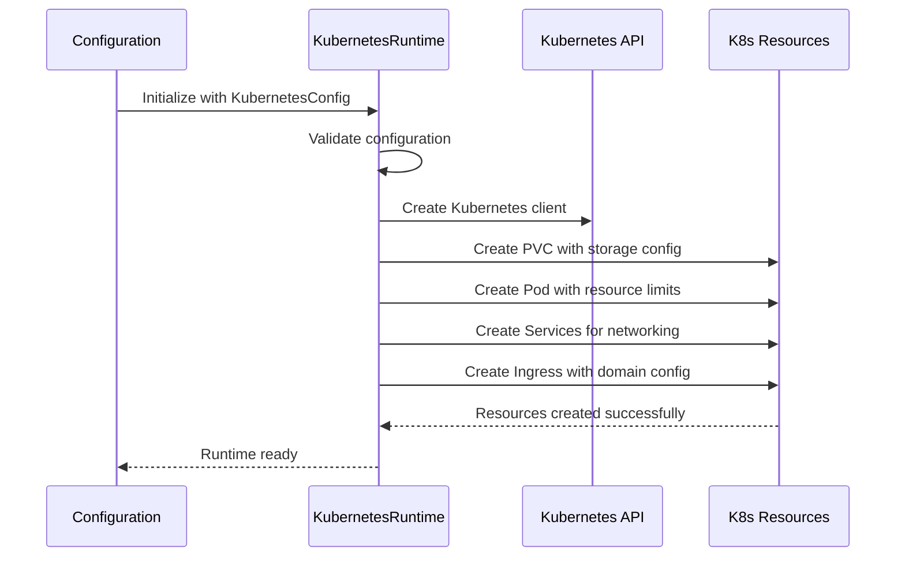
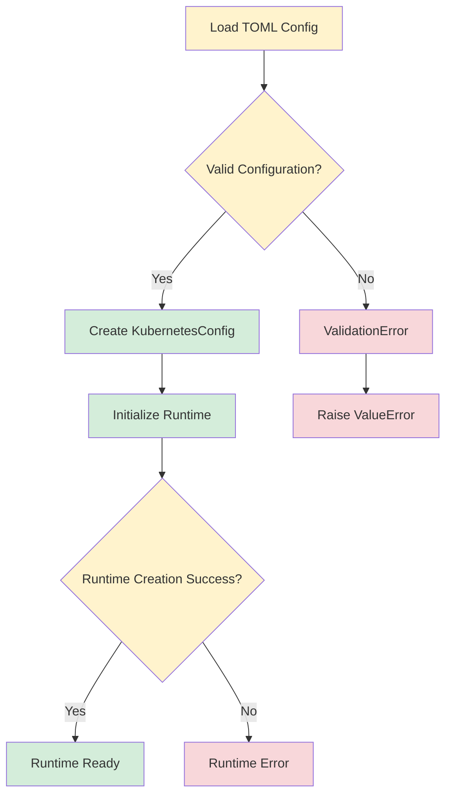

# Kubernetes Configuration Module

## Overview

The `kubernetes_configuration` module provides configuration management for Kubernetes-based runtime environments in OpenHands. This module defines the `KubernetesConfig` class, which encapsulates all necessary parameters for deploying and managing OpenHands runtime pods in Kubernetes clusters.

The module serves as the configuration foundation for the [kubernetes_runtime](runtime_implementations.md#kubernetes-runtime) implementation, enabling containerized execution environments with full Kubernetes orchestration capabilities including resource management, networking, storage, and security configurations.

## Architecture



## Core Components

### KubernetesConfig

The `KubernetesConfig` class is a Pydantic model that defines all configuration parameters required for Kubernetes runtime deployment:

#### Resource Management
- **CPU and Memory**: Configurable resource requests and limits for runtime pods
- **Storage**: Persistent volume claim configuration with customizable size and storage class
- **Privileged Mode**: Support for Docker-in-Docker scenarios

#### Networking Configuration
- **Ingress**: Domain configuration and TLS secret management
- **Service Discovery**: Internal cluster networking setup
- **Port Management**: Container and service port configuration

#### Security and Access Control
- **Image Pull Secrets**: Support for private container registries
- **Node Scheduling**: Node selector and toleration configurations
- **TLS Configuration**: Secure ingress with certificate management

#### Namespace Management
- **Multi-tenancy**: Configurable Kubernetes namespace isolation
- **Resource Organization**: Logical grouping of related resources

## Configuration Schema



## Configuration Parameters

### Core Settings

| Parameter | Type | Default | Description |
|-----------|------|---------|-------------|
| `namespace` | `str` | `'default'` | Kubernetes namespace for OpenHands resources |
| `ingress_domain` | `str` | `'localhost'` | Base domain for ingress resources |
| `privileged` | `bool` | `False` | Enable privileged mode for Docker-in-Docker |

### Resource Configuration

| Parameter | Type | Default | Description |
|-----------|------|---------|-------------|
| `resource_cpu_request` | `str` | `'1'` | CPU request for runtime pods |
| `resource_memory_request` | `str` | `'1Gi'` | Memory request for runtime pods |
| `resource_memory_limit` | `str` | `'2Gi'` | Memory limit for runtime pods |

### Storage Configuration

| Parameter | Type | Default | Description |
|-----------|------|---------|-------------|
| `pvc_storage_size` | `str` | `'2Gi'` | Size of persistent volume claim |
| `pvc_storage_class` | `str \| None` | `None` | Storage class for PVCs |

### Security Configuration

| Parameter | Type | Default | Description |
|-----------|------|---------|-------------|
| `image_pull_secret` | `str \| None` | `None` | Secret for private registries |
| `ingress_tls_secret` | `str \| None` | `None` | TLS secret for ingress |

### Scheduling Configuration

| Parameter | Type | Default | Description |
|-----------|------|---------|-------------|
| `node_selector_key` | `str \| None` | `None` | Node selector key for pod scheduling |
| `node_selector_val` | `str \| None` | `None` | Node selector value for pod scheduling |
| `tolerations_yaml` | `str \| None` | `None` | YAML string defining pod tolerations |

## Integration with Runtime System



## Configuration Loading

The module supports loading configuration from TOML files through the `from_toml_section` class method:

```python
# Example TOML configuration
[kubernetes]
namespace = "openhands-dev"
ingress_domain = "dev.example.com"
pvc_storage_size = "5Gi"
pvc_storage_class = "fast-ssd"
resource_cpu_request = "2"
resource_memory_request = "2Gi"
resource_memory_limit = "4Gi"
image_pull_secret = "registry-secret"
ingress_tls_secret = "tls-secret"
privileged = true
```

## Error Handling and Validation



## Dependencies

The kubernetes_configuration module integrates with several other system components:

- **[runtime_system](runtime_system.md)**: Provides the base runtime infrastructure
- **[kubernetes_runtime](runtime_implementations.md#kubernetes-runtime)**: Implements the actual Kubernetes runtime using this configuration
- **[core_configuration](core_configuration.md)**: Part of the broader configuration management system
- **[security_configuration](security_configuration.md)**: Works alongside security settings for comprehensive runtime security

## Usage Examples

### Basic Configuration

```python
from openhands.core.config.kubernetes_config import KubernetesConfig

# Create basic configuration
config = KubernetesConfig(
    namespace="my-namespace",
    ingress_domain="my-app.example.com",
    pvc_storage_size="10Gi"
)
```

### Advanced Configuration with Security

```python
# Advanced configuration with security and scheduling
config = KubernetesConfig(
    namespace="production",
    ingress_domain="prod.example.com",
    pvc_storage_size="50Gi",
    pvc_storage_class="premium-ssd",
    resource_cpu_request="4",
    resource_memory_request="8Gi",
    resource_memory_limit="16Gi",
    image_pull_secret="prod-registry-secret",
    ingress_tls_secret="prod-tls-cert",
    node_selector_key="workload-type",
    node_selector_val="openhands",
    privileged=True
)
```

### Loading from TOML

```python
# Load from TOML configuration
toml_data = {
    "namespace": "staging",
    "ingress_domain": "staging.example.com",
    "pvc_storage_size": "20Gi",
    "resource_cpu_request": "2",
    "resource_memory_request": "4Gi"
}

config_mapping = KubernetesConfig.from_toml_section(toml_data)
kubernetes_config = config_mapping["kubernetes"]
```

## Best Practices

### Resource Planning
- **CPU Requests**: Set based on expected workload requirements
- **Memory Limits**: Configure to prevent resource exhaustion
- **Storage Size**: Plan for workspace and temporary file requirements

### Security Considerations
- **Image Pull Secrets**: Always use for production deployments with private registries
- **TLS Configuration**: Enable TLS for all external-facing ingress resources
- **Privileged Mode**: Only enable when Docker-in-Docker functionality is required

### Operational Excellence
- **Namespace Isolation**: Use dedicated namespaces for different environments
- **Node Scheduling**: Leverage node selectors and tolerations for workload placement
- **Storage Classes**: Choose appropriate storage classes based on performance requirements

## Monitoring and Observability

The configuration enables comprehensive monitoring through:

- **Resource Metrics**: CPU, memory, and storage utilization tracking
- **Network Monitoring**: Ingress and service connectivity metrics
- **Security Auditing**: Access control and privilege escalation monitoring
- **Operational Metrics**: Pod lifecycle and scheduling effectiveness

This module forms the foundation for robust, scalable, and secure Kubernetes-based runtime environments in the OpenHands system.