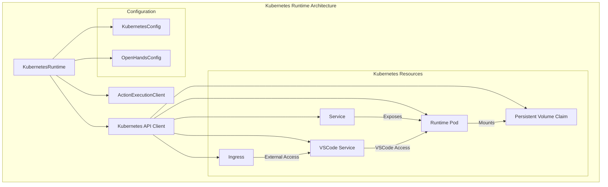
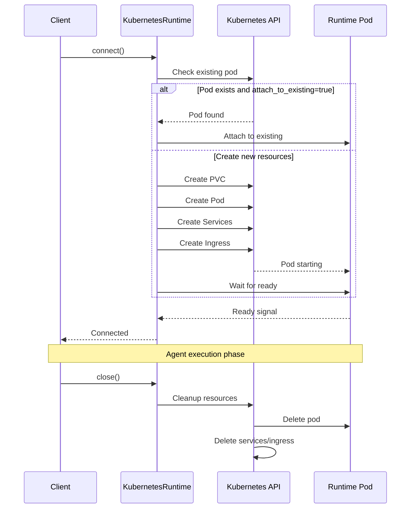
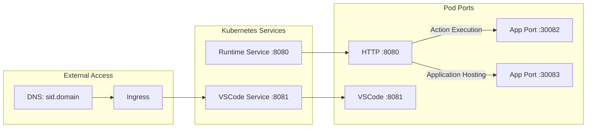
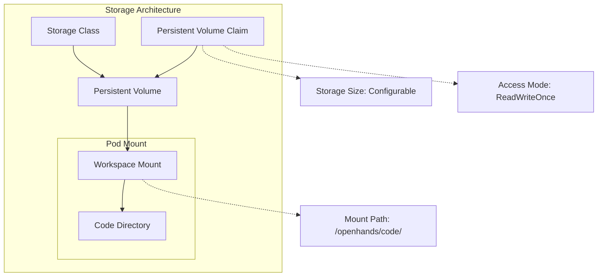
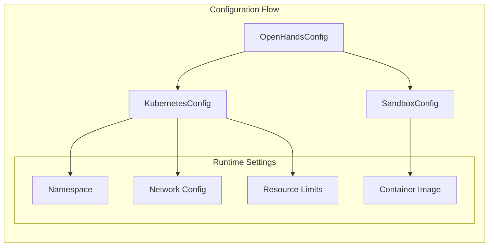
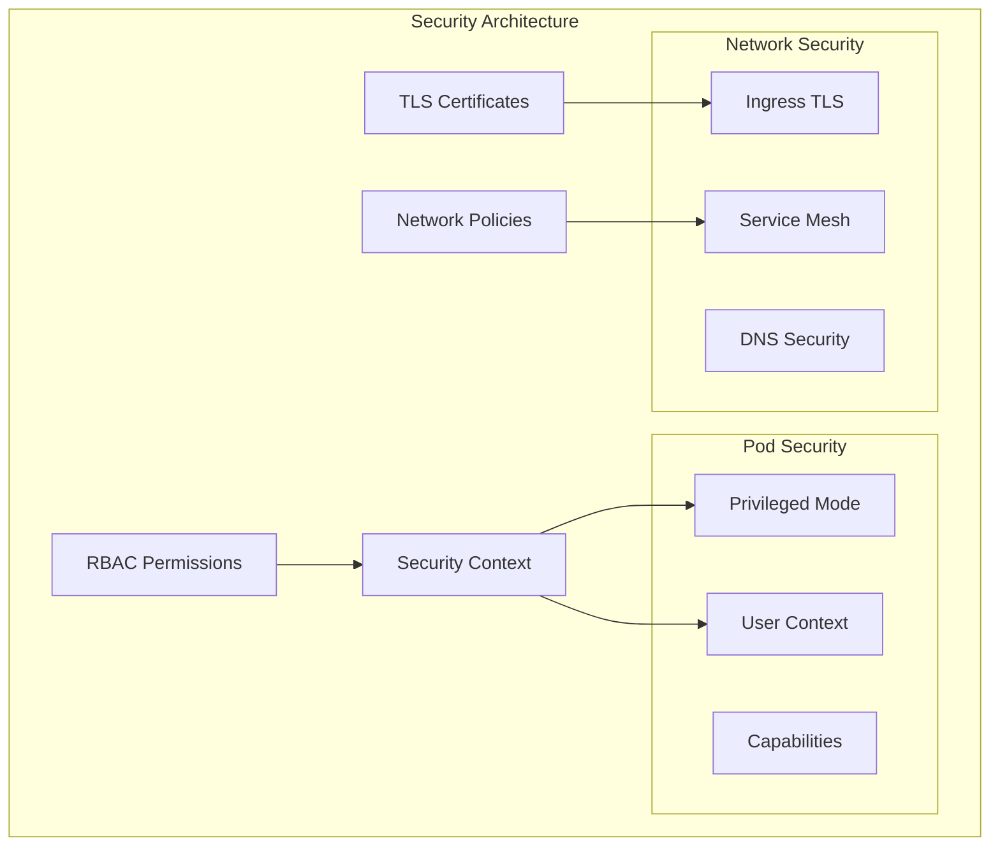

# Kubernetes Runtime Module

## Overview

The Kubernetes Runtime module provides a cloud-native runtime implementation for OpenHands that deploys and manages agent execution environments as Kubernetes pods. This module enables scalable, containerized execution of OpenHands agents in Kubernetes clusters, supporting both local development (Kind) and production deployments.

## Architecture

The KubernetesRuntime extends the ActionExecutionClient to provide Kubernetes-native runtime capabilities, managing the complete lifecycle of containerized agent environments including pod creation, service exposure, ingress configuration, and resource cleanup.



## Core Components

### KubernetesRuntime Class

The main runtime implementation that orchestrates Kubernetes resources for agent execution environments.

**Key Responsibilities:**
- Pod lifecycle management (creation, monitoring, cleanup)
- Service and ingress configuration for external access
- Persistent volume management for workspace data
- VSCode server integration for development workflows
- Resource cleanup and garbage collection

**Configuration Dependencies:**
- Requires `[kubernetes]` section in OpenHands configuration
- Integrates with [core_configuration](core_configuration.md) for cluster settings
- Uses [runtime_system](runtime_system.md) base classes and interfaces

## Resource Management

### Kubernetes Resource Lifecycle



### Resource Naming Convention

The module uses consistent naming patterns for Kubernetes resources:

- **Pod**: `openhands-runtime-{session_id}`
- **Service**: `{pod_name}-svc`
- **VSCode Service**: `{pod_name}-svc-code`
- **Ingress**: `{pod_name}-ingress-code`
- **PVC**: `{pod_name}-pvc`

## Network Configuration

### Port Management



### Service Architecture

- **Runtime Service**: ClusterIP service exposing the action execution server
- **VSCode Service**: ClusterIP service for development environment access
- **Ingress**: External access to VSCode with TLS support and custom domains
- **Internal URLs**: Service discovery via Kubernetes DNS

## Data Persistence

### Workspace Management



## Integration Points

### Runtime System Integration

The KubernetesRuntime integrates with several system components:

- **[runtime_system](runtime_system.md)**: Extends base Runtime and ActionExecutionClient classes
- **[core_configuration](core_configuration.md)**: Uses KubernetesConfig for cluster-specific settings
- **[events_and_actions](events_and_actions.md)**: Processes events through EventStream integration
- **[llm_integration](llm_integration.md)**: Provides LLM access within containerized environments

### Configuration Dependencies



## Operational Features

### Health Monitoring

The runtime implements comprehensive health checking:

- **Pod Readiness**: Kubernetes readiness probes on `/alive` endpoint
- **Connection Retry**: Tenacity-based retry logic with exponential backoff
- **Status Callbacks**: Real-time status updates to client applications
- **Graceful Shutdown**: Proper resource cleanup on termination

### Development Support

- **VSCode Integration**: Full IDE access with token-based authentication
- **Port Forwarding**: Automatic exposure of application ports
- **Debug Mode**: Enhanced logging and debugging capabilities
- **Attach Mode**: Connect to existing pods for development workflows

### Security Features



## Error Handling

### Exception Management

The module provides robust error handling for common failure scenarios:

- **AgentRuntimeDisconnectedError**: Pod connection failures or network issues
- **AgentRuntimeNotFoundError**: Resource creation or initialization failures
- **Kubernetes API Exceptions**: Cluster connectivity and permission issues
- **Timeout Handling**: Configurable timeouts for pod startup and readiness

### Recovery Mechanisms

- **Automatic Retry**: Built-in retry logic for transient failures
- **Resource Cleanup**: Automatic cleanup on failure to prevent resource leaks
- **Graceful Degradation**: Fallback behaviors for non-critical failures
- **Status Reporting**: Detailed error reporting through status callbacks

## Performance Considerations

### Resource Optimization

- **Resource Requests/Limits**: Configurable CPU and memory constraints
- **Node Selection**: Support for node selectors and tolerations
- **Storage Classes**: Optimized storage backend selection
- **Image Pull Optimization**: Support for image pull secrets and caching

### Scalability Features

- **Multi-tenant Support**: Session-based resource isolation
- **Cluster Integration**: Native Kubernetes scaling and scheduling
- **Resource Pooling**: Efficient resource utilization across sessions
- **Cleanup Automation**: Automatic resource garbage collection

## Usage Patterns

### Basic Runtime Creation

```python
runtime = KubernetesRuntime(
    config=config,
    event_stream=event_stream,
    llm_registry=llm_registry,
    sid='session-123',
    plugins=plugins,
    env_vars=env_vars
)

await runtime.connect()
# Runtime is now available for agent execution
```

### Development Workflow

```python
# Attach to existing pod for development
runtime = KubernetesRuntime(
    config=config,
    event_stream=event_stream,
    llm_registry=llm_registry,
    sid='dev-session',
    attach_to_existing=True
)

# Access VSCode URL for development
vscode_url = runtime.vscode_url
```

## Monitoring and Observability

### Logging Integration

The runtime provides comprehensive logging through the OpenHands logging system:

- **Structured Logging**: JSON-formatted logs with contextual information
- **Debug Mode**: Enhanced logging for troubleshooting
- **Performance Metrics**: Resource usage and timing information
- **Audit Trail**: Complete lifecycle event logging

### Health Endpoints

- **Readiness Probe**: `/alive` endpoint for Kubernetes health checks
- **Status Callbacks**: Real-time status updates for monitoring systems
- **Resource Metrics**: Pod and container resource utilization

## Best Practices

### Configuration Management

1. **Resource Limits**: Always configure appropriate CPU and memory limits
2. **Storage Planning**: Size PVCs appropriately for workspace requirements
3. **Network Security**: Use TLS certificates for production ingress
4. **Node Placement**: Configure node selectors for workload isolation

### Operational Guidelines

1. **Cleanup Strategy**: Configure appropriate cleanup policies for resource management
2. **Monitoring Setup**: Implement comprehensive monitoring for pod health
3. **Backup Procedures**: Regular backup of persistent volume data
4. **Security Hardening**: Follow Kubernetes security best practices

## Related Documentation

- **[runtime_system](runtime_system.md)**: Base runtime architecture and interfaces
- **[core_configuration](core_configuration.md)**: Configuration management and KubernetesConfig
- **[local_runtime](local_runtime.md)**: Local development runtime comparison
- **[cli_runtime](cli_runtime.md)**: CLI-based runtime alternative
- **[events_and_actions](events_and_actions.md)**: Event processing and action execution