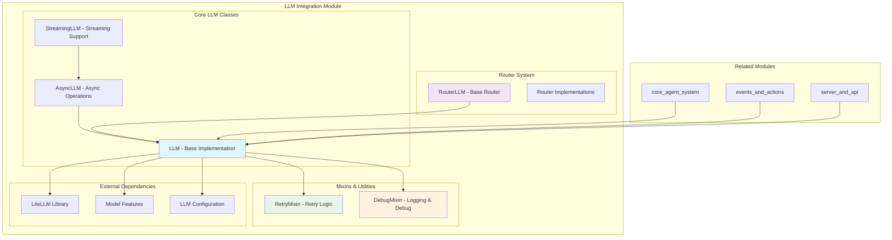

# LLM Integration Module

## Overview

The LLM Integration module serves as the core language model abstraction layer for the OpenHands system, providing a unified interface for interacting with various Large Language Models (LLMs). This module handles model communication, response processing, cost tracking, token management, and advanced features like function calling, vision capabilities, and streaming responses.

## Purpose

The module abstracts the complexity of working with different LLM providers and models, offering:

- **Unified Interface**: Single API for multiple LLM providers (OpenAI, Anthropic, Google, etc.)
- **Advanced Features**: Function calling, vision processing, streaming responses, and prompt caching
- **Cost Management**: Automatic cost tracking and token usage monitoring
- **Reliability**: Built-in retry mechanisms and error handling
- **Flexibility**: Support for synchronous, asynchronous, and streaming operations
- **Routing**: Intelligent model selection based on task requirements

## Architecture Overview



## Sub-modules

### Core LLM Implementation
The foundational LLM classes providing different operational modes. See **[Core LLM Implementation](core_llm_implementation.md)** for detailed documentation:
- **Base LLM**: Synchronous LLM operations with comprehensive feature support including function calling, vision, and cost tracking
- **Async LLM**: Asynchronous LLM operations for non-blocking calls with cancellation support
- **Streaming LLM**: Real-time streaming response handling for continuous output generation

### Router System
Intelligent model routing capabilities for optimized LLM selection. See **[Router System](router_system.md)** for detailed documentation:
- **Router Base**: Abstract base class for implementing custom routing logic with multi-LLM support
- **Router Implementations**: Concrete router implementations for different routing strategies and use cases

### Utility Mixins
Reusable components providing cross-cutting functionality. See **[Utility Mixins](utility_mixins.md)** for detailed documentation:
- **Retry Mixin**: Configurable retry logic with exponential backoff and intelligent error handling
- **Debug Mixin**: Comprehensive logging and debugging capabilities with structured message formatting

## Key Features

### Multi-Provider Support
- **OpenAI**: GPT models with function calling and vision
- **Anthropic**: Claude models with prompt caching and reasoning
- **Google**: Gemini models with multimodal capabilities
- **Local Models**: Ollama and other local deployments
- **Custom Providers**: Extensible architecture for new providers

### Advanced Capabilities
- **Function Calling**: Native and mock function calling support
- **Vision Processing**: Image analysis and multimodal interactions
- **Prompt Caching**: Optimized token usage with cache management
- **Streaming Responses**: Real-time response generation
- **Cost Tracking**: Automatic cost calculation and monitoring

### Reliability Features
- **Retry Logic**: Configurable retry with exponential backoff
- **Error Handling**: Comprehensive exception management
- **Rate Limiting**: Built-in rate limit handling
- **Timeout Management**: Configurable request timeouts

## Integration Points

### With Core Agent System
The LLM Integration module is tightly integrated with the [core_agent_system](core_agent_system.md):
- **Agent Management**: Agents use LLM instances for decision making and response generation
- **Action Processing**: Action parsers leverage LLM capabilities for parsing agent responses and converting between formats
- **State Management**: State management systems coordinate with LLM operations for maintaining conversation context

### With Events and Actions
Integration with [events_and_actions](events_and_actions.md) enables:
- **Event-Driven Interactions**: LLM responses trigger events that flow through the system
- **Action-Based Processing**: LLM outputs are converted to structured actions for agent execution
- **Observation Handling**: System observations are formatted and fed back to LLMs for context

### With Server and API
The [server_and_api](server_and_api.md) module utilizes LLM integration for:
- **WebSocket Streaming**: Real-time streaming responses through WebSocket connections
- **API Endpoints**: RESTful API operations powered by LLM capabilities
- **Session Management**: Persistent LLM state across user sessions and conversations

### With Agent Implementations
Various [agent_implementations](agent_implementations.md) depend on LLM integration:
- **CodeAct Agents**: Use LLMs for code generation and execution planning
- **Browsing Agents**: Leverage vision-capable LLMs for web interaction
- **Specialized Agents**: Each agent type utilizes specific LLM features optimized for their tasks

### With Configuration System
The [core_configuration](core_configuration.md) module provides:
- **LLM Configuration**: Centralized configuration management for all LLM settings
- **Security Settings**: API key management and security configurations
- **Environment-Specific Settings**: Different configurations for development, testing, and production

## Configuration

The module supports extensive configuration through `LLMConfig`:

```python
# Example configuration
llm_config = LLMConfig(
    model="gpt-4",
    api_key="your-api-key",
    temperature=0.7,
    max_output_tokens=4096,
    native_tool_calling=True,
    caching_prompt=True,
    num_retries=3
)
```

## Usage Examples

### Basic LLM Usage
```python
from openhands.llm.llm import LLM
from openhands.core.config import LLMConfig

# Initialize LLM
config = LLMConfig(model="gpt-4")
llm = LLM(config=config, service_id="main")

# Make completion
response = llm.completion(
    messages=[{"role": "user", "content": "Hello!"}]
)
```

### Async Operations
```python
from openhands.llm.async_llm import AsyncLLM

async_llm = AsyncLLM(config=config, service_id="async")
response = await async_llm.async_completion(
    messages=[{"role": "user", "content": "Hello!"}]
)
```

### Streaming Responses
```python
from openhands.llm.streaming_llm import StreamingLLM

streaming_llm = StreamingLLM(config=config, service_id="stream")
async for chunk in streaming_llm.async_streaming_completion(
    messages=[{"role": "user", "content": "Tell me a story"}]
):
    print(chunk['choices'][0]['delta'].get('content', ''), end='')
```

## Metrics and Monitoring

The module provides comprehensive metrics tracking:
- **Cost Tracking**: Per-request and accumulated costs
- **Token Usage**: Input, output, and cached token counts
- **Latency Monitoring**: Response time tracking
- **Error Rates**: Retry and failure statistics

## Security Considerations

- **API Key Management**: Secure handling of authentication credentials
- **Content Filtering**: Support for safety settings and content moderation
- **Rate Limiting**: Built-in protection against API abuse
- **Input Validation**: Comprehensive message and parameter validation

## Performance Optimization

- **Prompt Caching**: Reduces token costs for repeated prompts
- **Connection Pooling**: Efficient HTTP connection management
- **Batch Processing**: Support for batch operations where available
- **Model Routing**: Intelligent model selection for optimal performance

## Error Handling

The module implements robust error handling:
- **Retry Logic**: Automatic retry for transient failures
- **Graceful Degradation**: Fallback mechanisms for service unavailability
- **Detailed Logging**: Comprehensive error reporting and debugging
- **User-Friendly Messages**: Clear error communication

## Future Enhancements

- **Multi-Modal Expansion**: Enhanced support for audio and video processing
- **Advanced Routing**: ML-based model selection optimization
- **Caching Improvements**: More sophisticated caching strategies
- **Performance Analytics**: Advanced performance monitoring and optimization