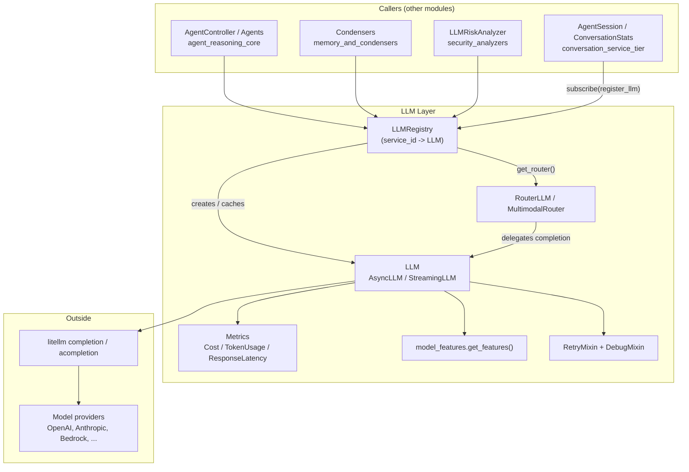
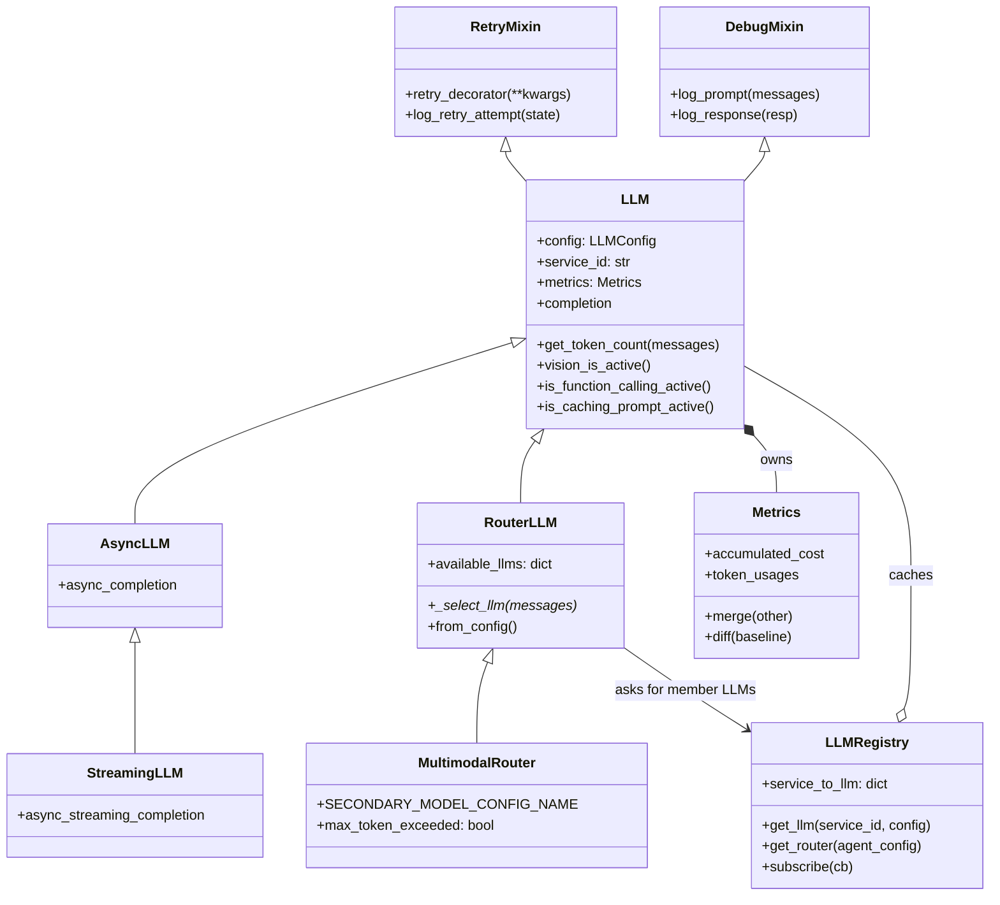
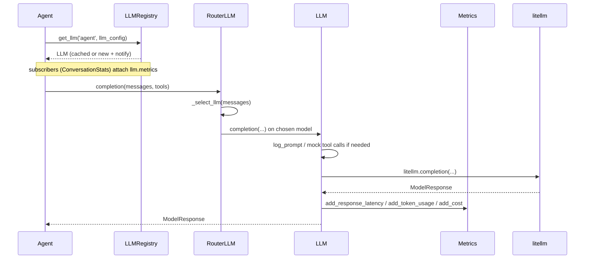
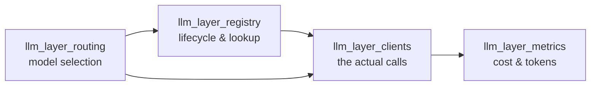
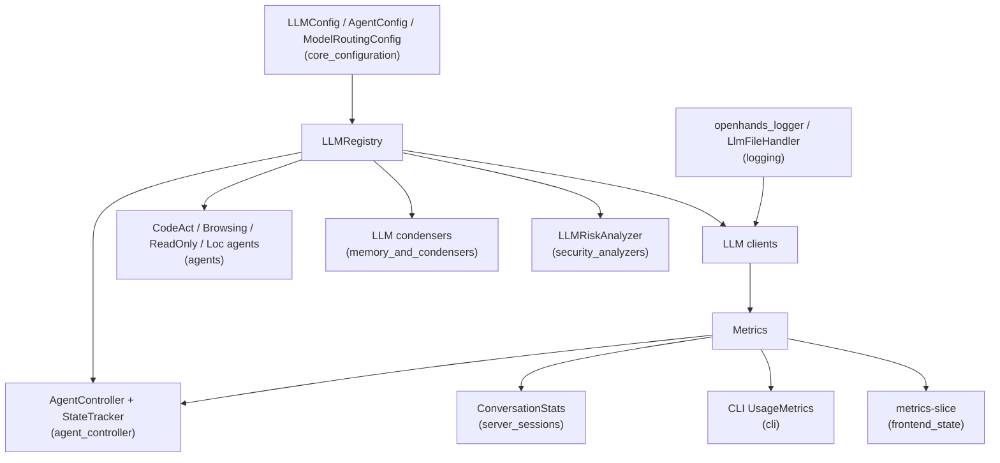

# LLM Layer

## 1. Purpose

The **LLM Layer** is the single door between OpenHands and any large language model
provider. Everything that needs to "talk to a model" — agents, condensers, security
analyzers, the issue resolver, the enterprise overlay — goes through this layer instead
of calling a provider SDK directly.

It gives the rest of the system four things:

| Need | Answer in this layer |
| --- | --- |
| "Give me a model client for X" | `LLMRegistry` — one named client per *service id*, created once and reused |
| "Call the model, safely" | `LLM` / `AsyncLLM` / `StreamingLLM` — retries, logging, provider quirks, tool-call shims |
| "How much did that cost?" | `Metrics` — cost, tokens, cache hits, latency |
| "Use the cheap model when you can" | `RouterLLM` / `MultimodalRouter` — pick a model per request |

The layer is built on top of [LiteLLM](https://docs.litellm.ai/), so it speaks to
OpenAI, Anthropic, Bedrock, Azure, Gemini, OpenRouter, local Ollama/SGLang servers and
the hosted OpenHands proxy through one common call shape.

Design ideas worth remembering:

- **One instance per service id.** A "service id" is a logical caller (`agent`,
  `condenser`, `draft_editor`, `llm_for_routing.secondary_model`, …). The registry keeps
  exactly one `LLM` per id so cost and token counters stay coherent.
- **The config is copied, never shared.** `LLM.__init__` deep-copies its `LLMConfig`, so
  per-model fixups (rewriting `openhands/...` to the proxy, filling in
  `max_output_tokens`) never leak back into global config.
- **Metrics live on the client, not on the caller.** Whoever wants totals subscribes to
  the registry and reads `llm.metrics`.
- **A router *is* an `LLM`.** `RouterLLM` subclasses `LLM`, so callers cannot tell a
  routed model from a plain one.

## 2. Architecture

### 2.1 Class relationships

### 2.2 One completion, end to end

## 3. Sub-modules

The layer splits into four cohesive pieces. Each has its own page.

| Sub-module page | Source files covered | In one line |
| --- | --- | --- |
| [llm_layer_registry.md](llm_layer_registry.md) | `openhands/llm/llm_registry.py` | Creates, caches and announces model clients per service id |
| [llm_layer_clients.md](llm_layer_clients.md) | `openhands/llm/llm.py`, `async_llm.py`, `streaming_llm.py`, `retry_mixin.py`, `debug_mixin.py`, `model_features.py` | Makes the actual provider call: retries, logging, quirks, streaming |
| [llm_layer_routing.md](llm_layer_routing.md) | `openhands/llm/router/base.py`, `router/rule_based/impl.py` | Picks which model handles each request, behind one `LLM` face |
| [llm_layer_metrics.md](llm_layer_metrics.md) | `openhands/llm/metrics.py` | Records cost, tokens, cache hits and latency |

### 3.1 Registry — [llm_layer_registry.md](llm_layer_registry.md)

`LLMRegistry` is the factory and cache. It owns `service_to_llm`, resolves an
`AgentConfig` to an `LLMConfig`, creates the "active agent LLM" at construction time,
and emits a `RegistryEvent` whenever a client is born so observers can attach metrics
storage. It also offers `request_extraneous_completion()` for one-off, listener-free
calls (title generation, small helper prompts) and `get_router()` as the entry point
into routing.

Key rule enforced here: asking for the *same* service id with a *different* config is an
error — callers must pick a new id instead of silently swapping models under an existing
counter.

### 3.2 Clients — [llm_layer_clients.md](llm_layer_clients.md)

`LLM` (sync), `AsyncLLM` (awaitable) and `StreamingLLM` (async generator of chunks),
plus the `RetryMixin` / `DebugMixin` behaviour and the `model_features` capability
table. This is where every provider quirk lives: Azure's `max_tokens`, Gemini thinking
budgets, Anthropic Opus `top_p`/`thinking` constraints, Bedrock credentials, the
`openhands/*` → `litellm_proxy/*` rewrite, prompt-cache and vision detection, and the
non-native function-calling emulation that converts tool schemas into prompt text and
back. Streaming adds mid-stream cancellation via `on_cancel_requested_fn`.

### 3.3 Routing — [llm_layer_routing.md](llm_layer_routing.md)

`RouterLLM` is an abstract `LLM` that holds several member clients (`primary` plus
everything in `model_routing.llms_for_routing`) and overrides `completion` to pick one
per call; `__getattr__` forwards everything else to the currently selected client.
`MultimodalRouter` is the concrete rule-based policy: send the request to the primary
model when the messages contain an image or exceed the secondary model's
`max_input_tokens` (a sticky decision), otherwise use the cheaper secondary model.
Routers self-register in `ROUTER_LLM_REGISTRY` under a name matched against
`AgentConfig.model_routing.router_name`.

### 3.4 Metrics — [llm_layer_metrics.md](llm_layer_metrics.md)

`Metrics` plus its records `Cost`, `TokenUsage` and `ResponseLatency`. It accumulates
cost, per-call token usage (prompt / completion / cache read / cache write / context
window), and latency; supports `merge()` for combining services, `diff(baseline)` for
attributing a delegate's spend, and `get()` for serialization. `max_budget_per_task`
lives here, which is what the controller's budget control flag reads.

## 4. How this layer connects to the rest of the system

- **[core_configuration](core_configuration.md)** supplies `LLMConfig`, `AgentConfig`
  and `ModelRoutingConfig`; the registry is constructed from an `OpenHandsConfig` and
  uses its agent→LLM config map.
- **[agent_controller](agent_controller.md)** / **[agent_controller_state](agent_controller_state.md)**
  hold the registry for a conversation and read `Metrics.accumulated_cost` against
  budget control flags.
- **[agents](agents.md)** receive a ready `LLM` (or router) and only call `completion`.
- **[memory_and_condensers](memory_and_condensers.md)** uses registry clients for
  LLM-driven summarizing/attention condensers.
- **[security_analyzers](security_analyzers.md)** uses a client for risk classification.
- **[server_sessions](server_sessions.md)** — `ConversationStats.register_llm` is the
  canonical registry subscriber; it restores pickled per-service `Metrics` and re-attaches
  them to freshly created clients so cost survives a conversation restart.
- **[logging](logging.md)** provides the prompt/response debug loggers and the
  sensitive-data filter used by `DebugMixin`.
- **[cli](cli.md)**, **[frontend_state](frontend_state.md)** and
  **[enterprise_routes](enterprise_routes.md)** display or bill against the numbers this
  layer produces.

## 5. Reading order for newcomers

1. [llm_layer_registry.md](llm_layer_registry.md) — how a client is obtained.
2. [llm_layer_clients.md](llm_layer_clients.md) — what happens during a call.
3. [llm_layer_metrics.md](llm_layer_metrics.md) — what a call records.
4. [llm_layer_routing.md](llm_layer_routing.md) — how several models pretend to be one.
