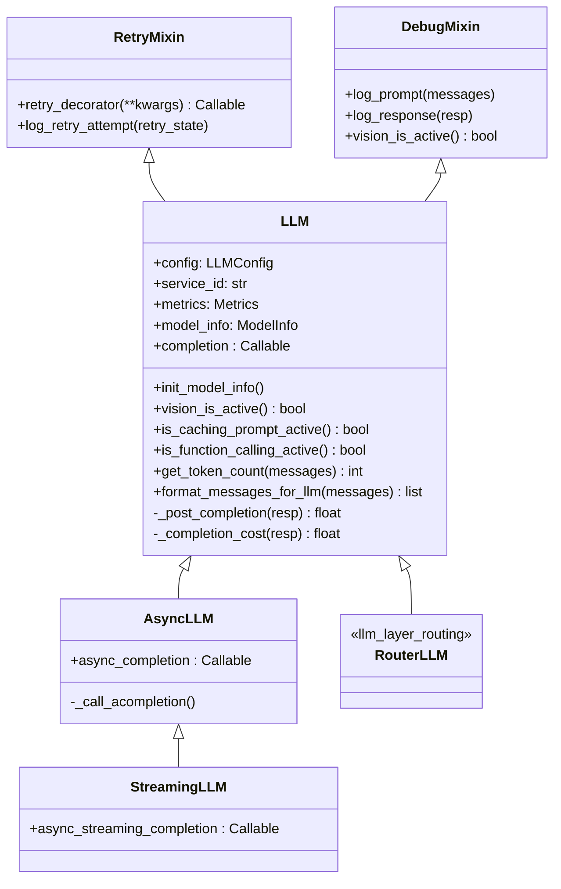
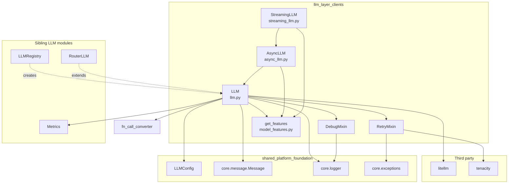
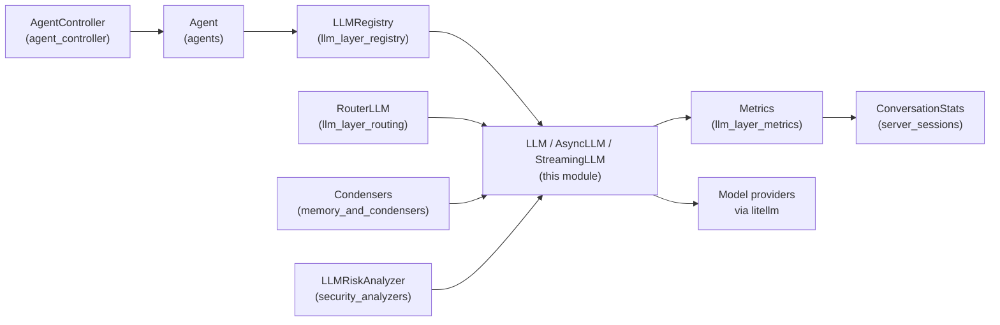
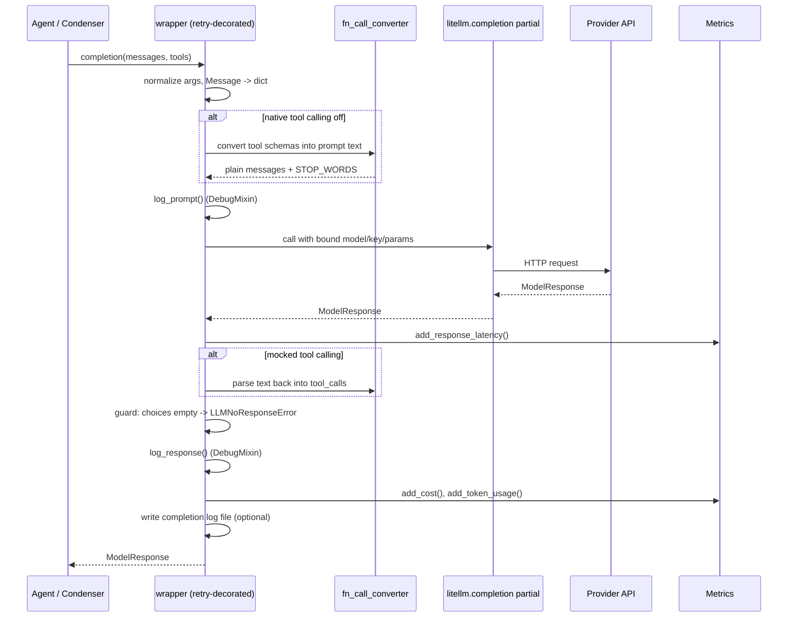

# LLM Layer — Clients

## 1. What this module does

`llm_layer_clients` is the part of OpenHands that actually talks to language models.
Every prompt the system sends to a model, and every response it gets back, goes
through the classes in this module.

The module wraps [LiteLLM](https://docs.litellm.ai/) (a single library that speaks
to many model providers: Anthropic, OpenAI, Google, AWS Bedrock, Azure, Ollama,
OpenRouter, LiteLLM proxy, and more). On top of LiteLLM it adds the things an
agent loop needs:

| Concern | How this module handles it |
| --- | --- |
| One call style for many providers | `LLM` builds a pre-bound `litellm.completion` partial from an `LLMConfig` |
| Provider quirks | Per-model tweaks (Azure token param, Gemini thinking budget, Opus 4.1 rules, HuggingFace `top_p`, `openhands/` prefix rewrite) |
| Models without native tool calling | Prompt-based "mock" function calling via `fn_call_converter` |
| Flaky networks and rate limits | `RetryMixin` — exponential backoff with tenacity |
| Debugging | `DebugMixin` — dedicated prompt/response log files |
| Cost and token accounting | `_post_completion` feeds [`Metrics`](llm_layer_metrics.md) |
| Async work and token streaming | `AsyncLLM` and `StreamingLLM` |
| Capability questions | `get_features(model)` — one table instead of scattered `if 'claude' in model` checks |

**What it does not do.** It does not decide *which* model to use (that is
[`llm_layer_routing`](llm_layer_routing.md)), it does not own instance lifetime or
sharing (that is [`llm_layer_registry`](llm_layer_registry.md)), and it does not
build the messages (that is [`memory_and_condensers`](memory_and_condensers.md)
plus the agents in [`agents`](agents.md)).

## 2. Files at a glance

| File | Core component | Role |
| --- | --- | --- |
| `openhands/llm/llm.py` | `LLM` | Synchronous client; the base class for everything else |
| `openhands/llm/async_llm.py` | `AsyncLLM` | `await`-able completion with cancellation |
| `openhands/llm/streaming_llm.py` | `StreamingLLM` | Chunk-by-chunk streaming completion |
| `openhands/llm/retry_mixin.py` | `RetryMixin` | Retry decorator factory |
| `openhands/llm/debug_mixin.py` | `DebugMixin` | Prompt / response logging |
| `openhands/llm/model_features.py` | `get_features` | Model capability lookup |

## 3. Architecture

### 3.1 Class hierarchy

`LLM` is the single root. Async is a subclass, streaming is a subclass of async,
and the router in another module is *also* a subclass — so anything that accepts
an `LLM` transparently accepts a router.

### 3.2 Module dependencies

### 3.3 Where the module sits in the system

Callers never build a client by hand; they ask `LLMRegistry` for one. The client
reports usage into `Metrics`, which the server tier reads for billing and UI.

## 4. The main call path

A single `llm.completion(messages=..., tools=...)` call runs through this
pipeline.

On a retryable error (`RateLimitError`, `APIConnectionError`,
`ServiceUnavailableError`, `litellm.Timeout`, `litellm.InternalServerError`,
`LLMNoResponseError`) the decorator waits with exponential backoff and calls the
wrapper again. `LLMNoResponseError` additionally bumps `temperature` from `0` to
`1.0` before the retry, because a zero-temperature model can get stuck returning
nothing.

## 5. Sub-modules

Each sub-module below has its own document with full detail.

| Sub-module | Document | Components |
| --- | --- | --- |
| Synchronous core | [`llm_layer_clients_sync_core.md`](llm_layer_clients_sync_core.md) | `LLM` |
| Async & streaming clients | [`llm_layer_clients_async_streaming.md`](llm_layer_clients_async_streaming.md) | `AsyncLLM`, `StreamingLLM` |
| Cross-cutting mixins | [`llm_layer_clients_mixins.md`](llm_layer_clients_mixins.md) | `RetryMixin`, `DebugMixin` |
| Model feature table | [`llm_layer_clients_model_features.md`](llm_layer_clients_model_features.md) | `get_features` |

### 5.1 Synchronous core — [`llm_layer_clients_sync_core.md`](llm_layer_clients_sync_core.md)

`LLM` in `llm.py`. Config deep-copy, `init_model_info()` (context window and max
output tokens discovered from LiteLLM or a LiteLLM-proxy `/v1/model/info` call),
all the per-provider kwarg tweaks, the retry-wrapped `completion` closure,
mock function-calling conversion, token counting, cost calculation, and message
serialization flags (`cache_enabled`, `vision_enabled`,
`function_calling_enabled`, `force_string_serializer`).

### 5.2 Async and streaming clients

`AsyncLLM` and `StreamingLLM`. Both build their own `partial` over
`litellm.acompletion` and wrap it with the same retry decorator. `AsyncLLM`
returns one response and runs a background cancellation watcher;
`StreamingLLM` is an async generator that yields `delta` chunks and checks for
cancellation before each yield, raising `UserCancelledError` when the user stops
the run.

### 5.3 Cross-cutting mixins

`RetryMixin` (tenacity `retry` factory: attempt cap, exponential wait,
`stop_if_should_exit()` for clean shutdown, `retry_listener` callback for UI
progress, temperature bump on `LLMNoResponseError`) and `DebugMixin`
(`log_prompt` / `log_response` into the dedicated LLM log files, with
multimodal content flattening and tool-call rendering).

### 5.4 Model feature table

`model_features.py`. `normalize_model_name` strips provider prefixes, Ollama
`:tag` variants and `-gguf` suffixes; `model_matches` does glob matching against
either the full string (patterns with `/`) or the normalized basename;
`get_features` returns a frozen `ModelFeatures` record with
`supports_function_calling`, `supports_reasoning_effort`,
`supports_prompt_cache`, and `supports_stop_words`.

## 6. Key design points

1. **Partial-plus-wrapper.** Configuration is baked into a `functools.partial`
   once at construction time, then a retry-decorated closure adds logging,
   conversion and metrics. Callers cannot override the configured model — that
   is deliberate.
2. **One capability table.** All "does this model support X" questions go to
   `get_features`, so adding a new model family means editing one pattern list.
3. **Graceful degradation for tool calling.** If a model has no native tool
   support, the tool schemas are rendered into the prompt and the reply is parsed
   back into `tool_calls`. Agents see the same interface either way.
4. **Metrics are a side effect, not a return value.** Every completion updates
   the shared `Metrics` object, so cost tracking works no matter who calls.
5. **Cancellation is cooperative.** `on_cancel_requested_fn` on the config is
   polled by the async clients, which is how a user "stop" reaches an in-flight
   request.

## 7. Related documentation

- [`llm_layer_registry.md`](llm_layer_registry.md) — creates and shares client instances
- [`llm_layer_routing.md`](llm_layer_routing.md) — `RouterLLM` subclasses that pick a model per request
- [`llm_layer_metrics.md`](llm_layer_metrics.md) — cost, token and latency accounting
- [`core_configuration.md`](core_configuration.md) — `LLMConfig` and friends
- [`logging.md`](logging.md) — `llm_prompt_logger`, `llm_response_logger`, `LlmFileHandler`
- [`agents.md`](agents.md) — the main consumers of `completion`
- [`memory_and_condensers.md`](memory_and_condensers.md) — LLM-based condensers that call this module
