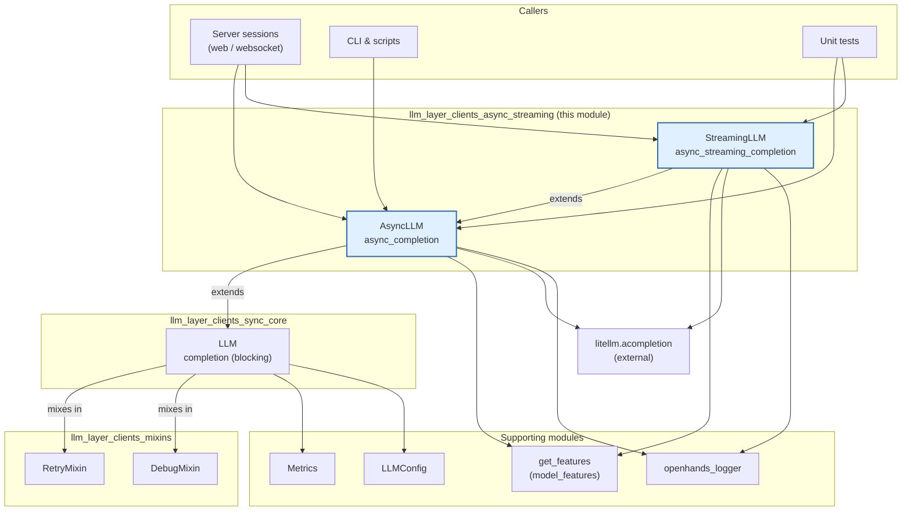
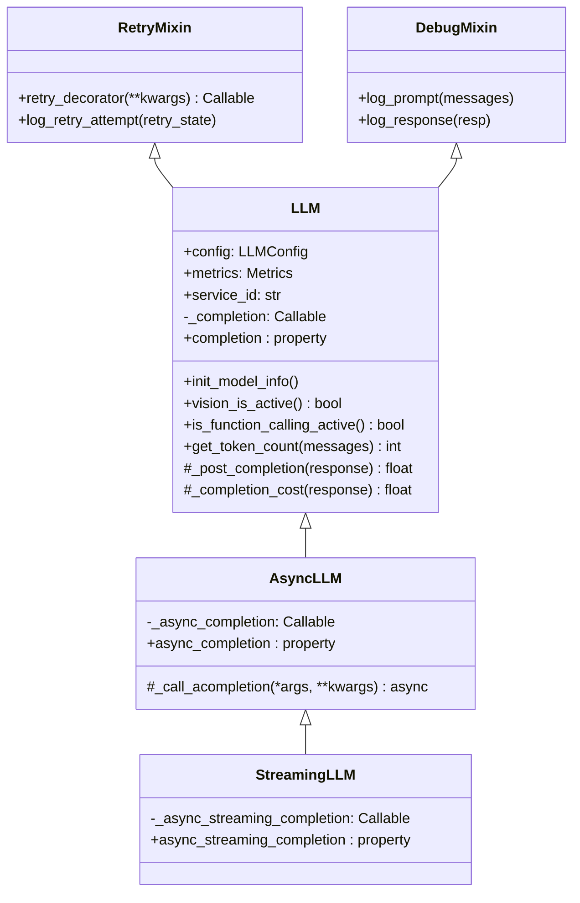
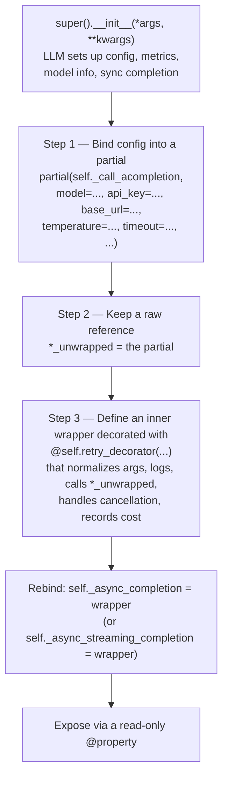
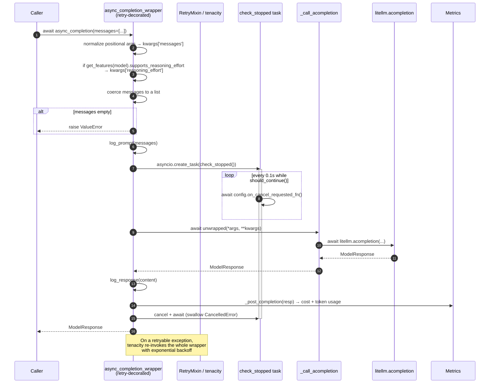
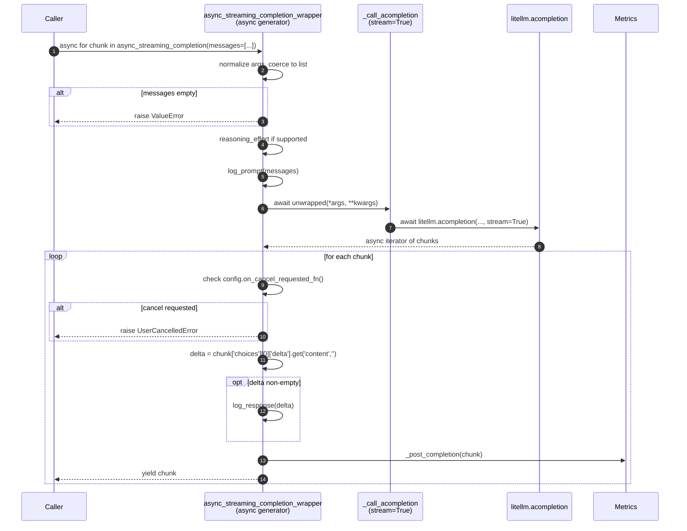
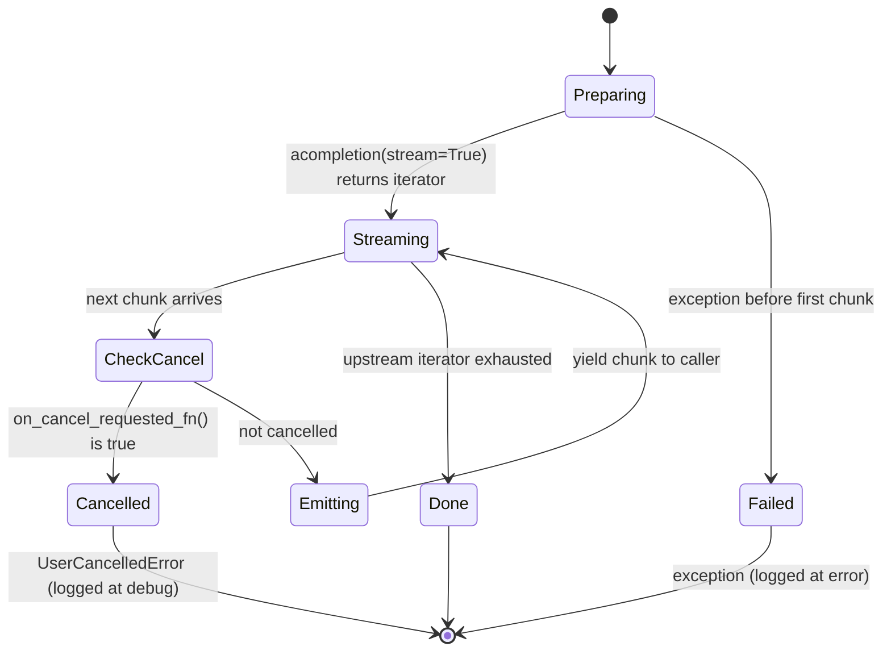
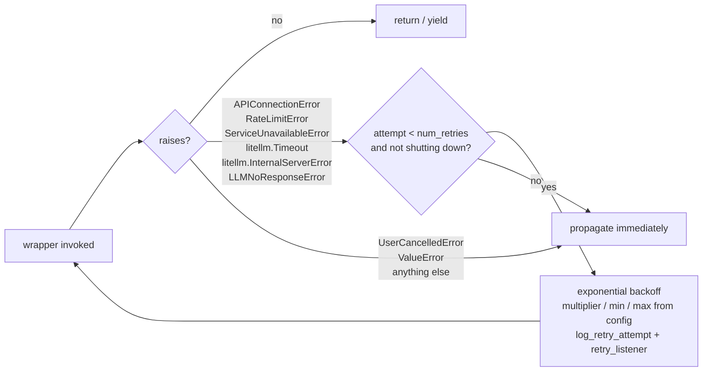
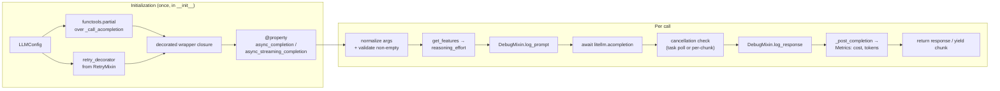

# LLM Clients: Async & Streaming

## Introduction

Most of OpenHands talks to a model through the blocking `LLM.completion()` call described in [llm_layer_clients_sync_core](llm_layer_clients_sync_core.md). That works well for the agent loop, which is a strict "ask, wait, act" cycle. But some callers cannot block:

- A web request handler that must stay responsive while the model thinks.
- A UI that wants to show text token-by-token instead of waiting for the whole answer.
- Any caller that must be able to **cancel** a request that is already in flight.

This module provides the two client classes that cover those cases:

| Class | File | What it gives you |
|---|---|---|
| `AsyncLLM` | `openhands/llm/async_llm.py` | `await llm.async_completion(...)` — one awaitable call, one full response |
| `StreamingLLM` | `openhands/llm/streaming_llm.py` | `async for chunk in llm.async_streaming_completion(...)` — chunks as they arrive |

Both are thin subclasses of `LLM`. They reuse everything the base class already set up — config parsing, model info lookup, token counting, cost accounting, retry policy, debug logging — and swap only one thing: **how the underlying LiteLLM call is made and awaited**.

---

## Where This Module Sits



Related reading:

- [llm_layer_clients_sync_core](llm_layer_clients_sync_core.md) — the `LLM` base class these two extend
- [llm_layer_clients_mixins](llm_layer_clients_mixins.md) — `RetryMixin` (tenacity policy) and `DebugMixin` (prompt/response logging)
- [llm_layer_clients_model_features](llm_layer_clients_model_features.md) — `get_features()`, used here for reasoning-effort support
- [llm_layer_metrics](llm_layer_metrics.md) — `Metrics`, where cost and token counts land
- [llm_layer_registry](llm_layer_registry.md) — `LLMRegistry`, the normal way sync `LLM` instances are created and shared
- [core_configuration](core_configuration.md) — `LLMConfig` fields consumed below
- [logging](logging.md) — where prompt/response debug output goes

---

## Class Hierarchy



Two consequences of this shape are worth stating plainly:

1. **`StreamingLLM` is also an `AsyncLLM`.** A `StreamingLLM` instance exposes `completion` (blocking), `async_completion` (awaitable), *and* `async_streaming_completion` (chunked). You can pick per call site.
2. **Each subclass builds an *additional* call path; it does not replace the parent's.** `LLM.__init__` still builds `self._completion`; `AsyncLLM.__init__` then builds `self._async_completion`; `StreamingLLM.__init__` then builds `self._async_streaming_completion`. Three independent wrapped callables live on the same object.

---

## The Construction Pattern

Both classes are built the same way in `__init__`, in three steps. Understanding this pattern makes both files easy to read.



Why a closure rather than a method? The retry decorator needs concrete values from `self.config` (`num_retries`, `retry_min_wait`, …) at decoration time. Building the wrapper inside `__init__` is the simplest way to bake per-instance config into a per-instance decorated function.

### Baked-in parameters

Both partials pin the same connection and sampling settings so that callers cannot silently override them:

`model`, `api_key` (unwrapped from the pydantic `SecretStr`), `base_url`, `api_version`, `custom_llm_provider`, `max_tokens` (from `config.max_output_tokens`), `timeout`, `temperature`, `top_p`, `drop_params`.

Then they diverge:

| Parameter | `AsyncLLM` | `StreamingLLM` |
|---|---|---|
| `seed` | passed from `config.seed` | **not passed** |
| `stream` | not set (defaults to non-streaming) | `stream=True`, hard-coded |

> **Note:** `seed` is not forwarded in the streaming partial. If deterministic sampling matters for a streaming call site, that is a gap to be aware of.

Note also that these partials are **flatter** than the sync `LLM` partial. The base class does a lot of provider-specific massaging (Azure `max_tokens` rewrite, Gemini thinking budgets, Bedrock credentials, Mistral/Gemini safety settings, Anthropic Opus quirks, `openhands/` → `litellm_proxy/` rewrite). The async and streaming partials skip all of it except the reasoning-effort flag. See [Behavioral Gaps vs. the Sync Path](#behavioral-gaps-vs-the-sync-path).

---

## `AsyncLLM` — Awaitable Single-Shot Completion

### Request flow



### Argument normalization

LiteLLM allows positional calls like `completion(model, messages, **kwargs)`. The wrapper accepts that shape and rewrites it:

```python
if len(args) > 1:
    messages = args[1]
    kwargs['messages'] = messages
    args = args[2:]        # drop model + messages from positional args
elif 'messages' in kwargs:
    messages = kwargs['messages']
```

The first positional argument (the model) is deliberately **discarded** — the partial already pinned the configured model. A single non-list message is wrapped into a list. An empty list raises `ValueError` immediately, before any network call, because an empty prompt always means a bug upstream.

### Reasoning effort

```python
if get_features(self.config.model).supports_reasoning_effort:
    kwargs['reasoning_effort'] = self.config.reasoning_effort
```

This is the one piece of model-capability logic the async path keeps. `get_features()` is a pure pattern match over the model name — see [llm_layer_clients_model_features](llm_layer_clients_model_features.md).

### The cancellation watchdog

```python
async def check_stopped() -> None:
    while should_continue():
        if (hasattr(self.config, 'on_cancel_requested_fn')
                and self.config.on_cancel_requested_fn is not None
                and await self.config.on_cancel_requested_fn()):
            return
        await asyncio.sleep(0.1)

stop_check_task = asyncio.create_task(check_stopped())
```

`check_stopped` polls two signals every 100 ms:

- `should_continue()` from `openhands.utils.shutdown_listener` — process-wide shutdown (SIGINT/SIGTERM).
- `config.on_cancel_requested_fn` — an optional async predicate the caller can attach for per-request cancellation.

The `hasattr` guard exists because `on_cancel_requested_fn` is **not a declared field on `LLMConfig`**. It is attached dynamically by callers who want cancellation. Code reading this attribute must always guard for its absence.

The `finally` block always runs, so the watchdog is cancelled on success, on error, and on cancellation alike:

```python
finally:
    await asyncio.sleep(0.1)
    stop_check_task.cancel()
    try:
        await stop_check_task
    except asyncio.CancelledError:
        pass
```

Awaiting the cancelled task and swallowing `CancelledError` is what prevents "Task exception was never retrieved" warnings from leaking into the logs.

> **Behavioural caveat:** the watchdog *observes* cancellation but does not *act* on it. When `check_stopped` sees a cancel request it simply `return`s; the awaited `litellm.acompletion` call keeps running to completion. In `AsyncLLM`, `UserCancelledError` is caught and re-raised but nothing in this file raises it. Effective cancellation therefore depends on the caller raising it, or on `StreamingLLM`, which does check per chunk (below).

### `_call_acompletion` as a test seam

```python
async def _call_acompletion(self, *args, **kwargs):
    return await litellm_acompletion(*args, **kwargs)
```

This one-line indirection exists so tests can patch a single method instead of the external library. `tests/unit/llm/test_acompletion.py` patches `AsyncLLM._call_acompletion` for both the async and the streaming suites — note that `StreamingLLM` inherits this method rather than defining its own.

---

## `StreamingLLM` — Chunked Async Generator

### Stream flow



### Per-chunk cancellation

This is the real difference from `AsyncLLM`. Instead of a background poller, the check sits inside the iteration loop:

```python
async for chunk in resp:
    if (hasattr(self.config, 'on_cancel_requested_fn')
            and self.config.on_cancel_requested_fn is not None
            and await self.config.on_cancel_requested_fn()):
        raise UserCancelledError('LLM request cancelled due to CANCELLED state')
    ...
    yield chunk
```

Because the check runs **before** each yield, cancellation is honoured within roughly one chunk's latency — typically tens of milliseconds — and the generator stops pulling from the upstream stream. This is genuinely responsive cancellation, unlike the observational watchdog in `AsyncLLM`.



### `delta`, not `message`

Streaming responses carry incremental text under `choices[0].delta.content`, whereas a complete response uses `choices[0].message.content`. The code comments this explicitly, and guards with `.get('content', '')` because role-only and finish-reason chunks carry no content at all. Empty deltas are skipped for logging but still passed to `_post_completion` and still yielded.

### Cost accounting per chunk

`self._post_completion(chunk)` is called for **every** chunk, not once at the end. In practice most providers only attach a `usage` block to the final chunk (and only when explicitly requested), so intermediate calls compute a cost of `0` and record nothing. The base class wraps cost computation in a `try/except`, so malformed chunks cannot break the stream. If accurate per-request cost is required for a streaming call site, verify that the provider actually emits usage data — do not assume the totals in [llm_layer_metrics](llm_layer_metrics.md) are complete for streamed requests.

### The trailing sleep

```python
finally:
    if kwargs.get('stream', False):
        await asyncio.sleep(0.1)
```

`stream=True` was set in the **partial**, not in the caller's `kwargs`, so this condition is normally `False` and the sleep does not run. It fires only if a caller happens to pass `stream=True` explicitly.

---

## Side-by-Side Comparison

| Aspect | `AsyncLLM` | `StreamingLLM` |
|---|---|---|
| Public entry point | `async_completion` (property) | `async_streaming_completion` (property); also inherits `async_completion` |
| Call shape | coroutine — `await` once | async generator — `async for` |
| Return value | full `ModelResponse` | successive chunks |
| Text location | `choices[0].message.content` | `choices[0].delta.content` |
| `stream` flag | unset | `True` (baked into the partial) |
| `seed` forwarded | yes | no |
| Cancellation mechanism | background `check_stopped()` task, 100 ms poll | inline check before every `yield` |
| Reacts to shutdown (`should_continue`) | yes, inside the watchdog | no explicit check |
| Raises `UserCancelledError` | no (catches and re-raises only) | yes |
| `_post_completion` calls | once, on the full response | once per chunk |
| `_call_acompletion` | defined here | inherited |
| Retry effectiveness | full (see below) | limited (see below) |

---

## Error Handling and Retries

Both wrappers use the same three-branch handler:

```python
except UserCancelledError:
    logger.debug('LLM request cancelled by user.')
    raise
except Exception as e:
    logger.error(f'Completion Error occurred:\n{e}')
    raise
finally:
    ...cleanup...
```

Cancellation is an expected outcome, so it is logged at `debug`. Everything else is logged at `error`. Neither branch swallows the exception — both re-raise so the retry layer and the caller can see it.

### Retry policy



The exception tuple is `LLM_RETRY_EXCEPTIONS`, imported from `openhands/llm/llm.py` (`StreamingLLM` re-imports it *through* `async_llm`). The stop condition is `stop_after_attempt(num_retries) | stop_if_should_exit()`, so a shutdown signal aborts the retry loop rather than waiting out the backoff. `RetryMixin` also special-cases `LLMNoResponseError` by bumping `temperature` from `0` to `1.0` before the next attempt. Details in [llm_layer_clients_mixins](llm_layer_clients_mixins.md).

> **Important caveat for streaming.** `@retry` is applied to `async_streaming_completion_wrapper`, which is an **async generator function**. Tenacity selects its async retry strategy via `iscoroutinefunction()`, which is `False` for async generator functions — so it uses the synchronous wrapper, which merely calls the function and returns the generator object. Creating a generator never raises. Every real error (connection drop, rate limit, mid-stream failure) surfaces later, during `async for` in the caller's frame, outside tenacity's control. **In practice, streaming calls are not retried.** Callers that need resilience around `async_streaming_completion` must implement their own retry, and must be prepared to restart the stream from the beginning. `AsyncLLM.async_completion` is a plain coroutine function and does not have this problem.

Note also that a retry of `async_completion` re-runs the **entire** wrapper body — including `log_prompt` and the creation of a fresh `check_stopped` task. Duplicate prompt entries in the debug log are expected on retried requests.

---

## Behavioral Gaps vs. the Sync Path

These two classes deliberately bypass `LLM`'s `wrapper`, so several base-class behaviors do **not** apply. This matters when choosing a client.

| Base-class behavior | Present in async/streaming? |
|---|---|
| Non-native function calling (prompt-based tool-call mocking, `STOP_WORDS`, response re-conversion) | **No** — tools are passed through raw |
| `Message` object → dict formatting via `format_messages_for_llm` | **No** — callers must pass dicts |
| `log_completions` JSON dumps to disk | **No** |
| Response latency recorded via `metrics.add_response_latency` | **No** |
| Empty-`choices` guard raising `LLMNoResponseError` | **No** |
| `litellm.modify_params` set from config | **No** |
| Azure / Gemini / Bedrock / Anthropic parameter fixes | **No** |
| `extra_body` stripping for non-proxy models | **No** |
| Cost + token usage via `_post_completion` | **Yes** |
| Retry policy | Yes for `AsyncLLM`; effectively no for `StreamingLLM` |
| Prompt/response debug logging | Yes (with the caveat below) |

> **Known rough edge:** `AsyncLLM` calls `self.log_response(message_back)` where `message_back` is a **string**, but `DebugMixin.log_response` expects a `ModelResponse` and indexes it as `resp['choices'][0]['message']['content']`. `StreamingLLM` does the same with the delta string. `log_response` returns early unless the logger is enabled for `DEBUG`, so this is invisible at normal log levels — but it will fail under debug logging. Treat it as a bug rather than a contract.

**Rule of thumb:** use the sync `LLM` for anything that involves tools, `Message` objects, or completion logging. Reach for `AsyncLLM`/`StreamingLLM` only for plain text-in/text-out calls where non-blocking behavior or incremental output is the point.

---

## Construction and Usage

Neither class is produced by [`LLMRegistry`](llm_layer_registry.md) — the registry only ever instantiates the base `LLM`. Async and streaming clients are constructed directly, with the same signature as `LLM`:

```python
from openhands.core.config import LLMConfig
from openhands.llm import AsyncLLM, StreamingLLM

config = LLMConfig(model='gpt-4o', api_key='...')

# --- awaitable single-shot ---
llm = AsyncLLM(config, service_id='my-service')
resp = await llm.async_completion(messages=[{'role': 'user', 'content': 'hi'}])
text = resp['choices'][0]['message']['content']

# --- token-by-token ---
sllm = StreamingLLM(config, service_id='my-service')
async for chunk in sllm.async_streaming_completion(
    messages=[{'role': 'user', 'content': 'hi'}]
):
    delta = chunk['choices'][0]['delta'].get('content', '')
    if delta:
        print(delta, end='', flush=True)
```

Both are re-exported from the package root:

```python
# openhands/llm/__init__.py
__all__ = ['LLM', 'AsyncLLM', 'StreamingLLM']
```

### Opting into cancellation

Attach an async predicate to the config before issuing the call:

```python
async def is_cancelled() -> bool:
    return session.state == 'CANCELLED'

llm.config.on_cancel_requested_fn = is_cancelled
```

`StreamingLLM` will then raise `UserCancelledError` at the next chunk boundary. Remember that this attribute is set dynamically and is not part of the `LLMConfig` schema in [core_configuration](core_configuration.md).

---

## Configuration Reference

Fields of `LLMConfig` that this module reads:

| Field | Used for |
|---|---|
| `model` | pinned into the partial; also drives `get_features()` |
| `api_key` | unwrapped via `get_secret_value()`, `None` if unset |
| `base_url`, `api_version`, `custom_llm_provider` | endpoint/provider routing |
| `max_output_tokens` | passed as `max_tokens` |
| `timeout` | per-request timeout |
| `temperature`, `top_p` | sampling |
| `drop_params` | let LiteLLM drop params the provider rejects |
| `seed` | `AsyncLLM` only |
| `reasoning_effort` | applied when `get_features(model).supports_reasoning_effort` |
| `num_retries`, `retry_min_wait`, `retry_max_wait`, `retry_multiplier` | retry decorator |
| `on_cancel_requested_fn` | **dynamic**, not declared on the schema — cancellation predicate |

---

## Component Interaction Summary



---

## Testing

The behavior of this module is covered by:

- `tests/unit/llm/test_acompletion.py` — happy-path async and streaming calls, plus parameterized cancellation tests (`cancel_delay` for `AsyncLLM`, `cancel_after_chunks` for `StreamingLLM`). Both suites patch `AsyncLLM._call_acompletion`.
- `tests/unit/llm/test_llm.py` — construction and parameter-forwarding checks; the streaming test patches `openhands.llm.streaming_llm.AsyncLLM._call_acompletion`.

When adding tests, patch `_call_acompletion` rather than `litellm.acompletion` — that is exactly what the seam is for.
