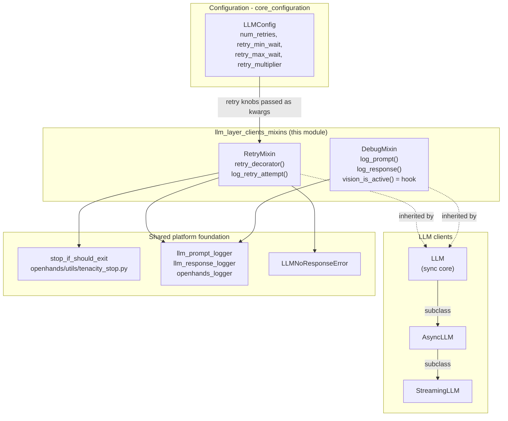
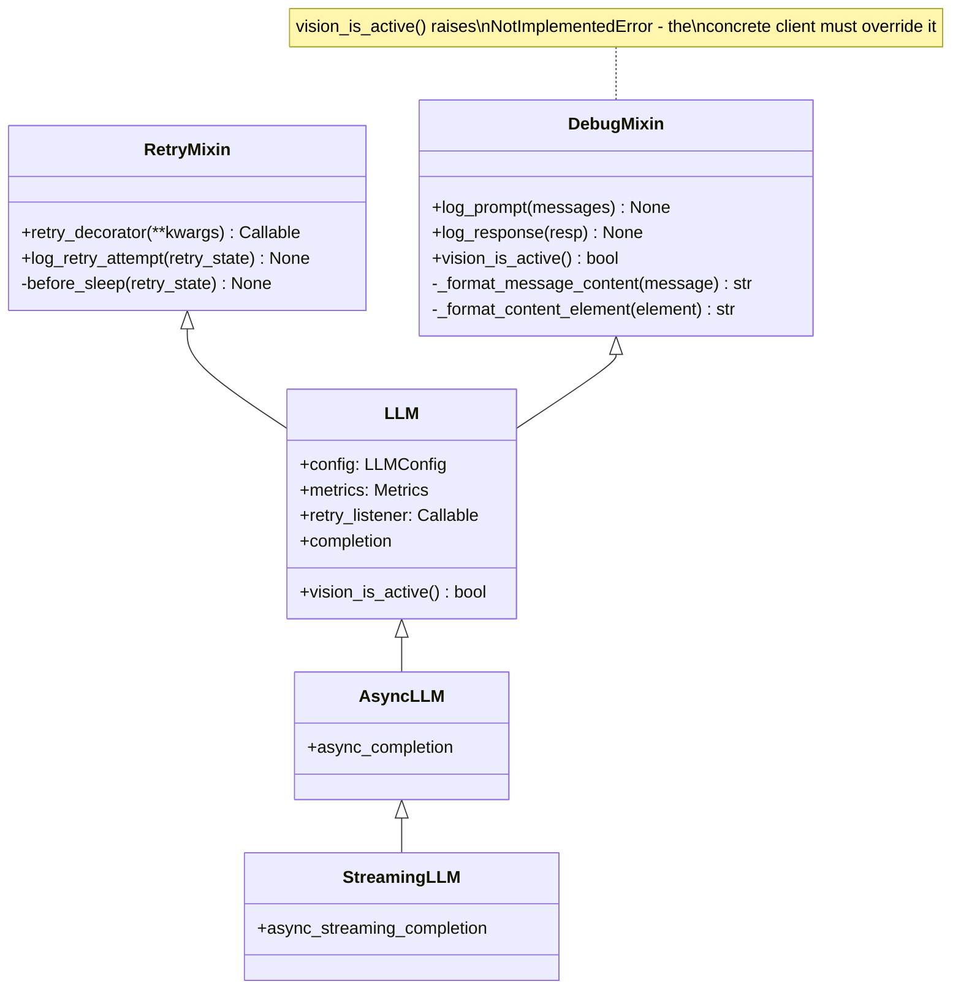
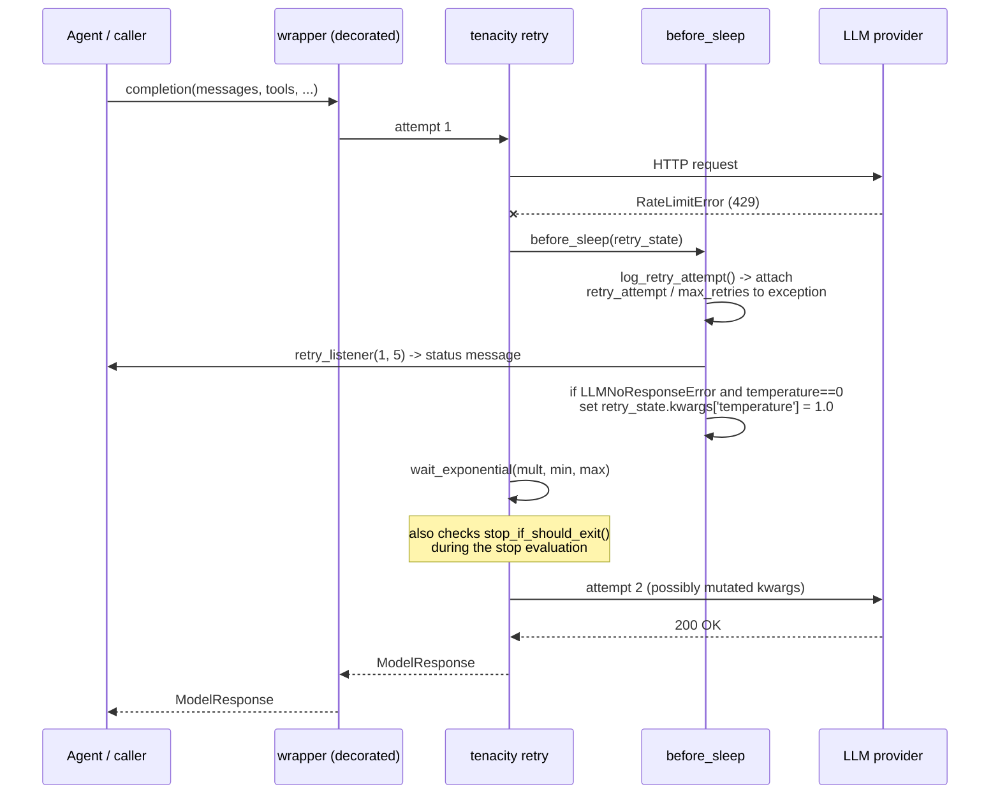
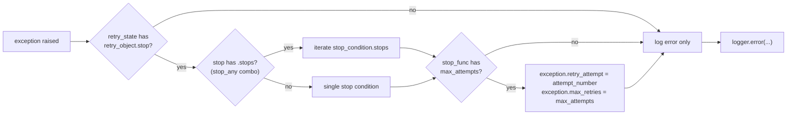
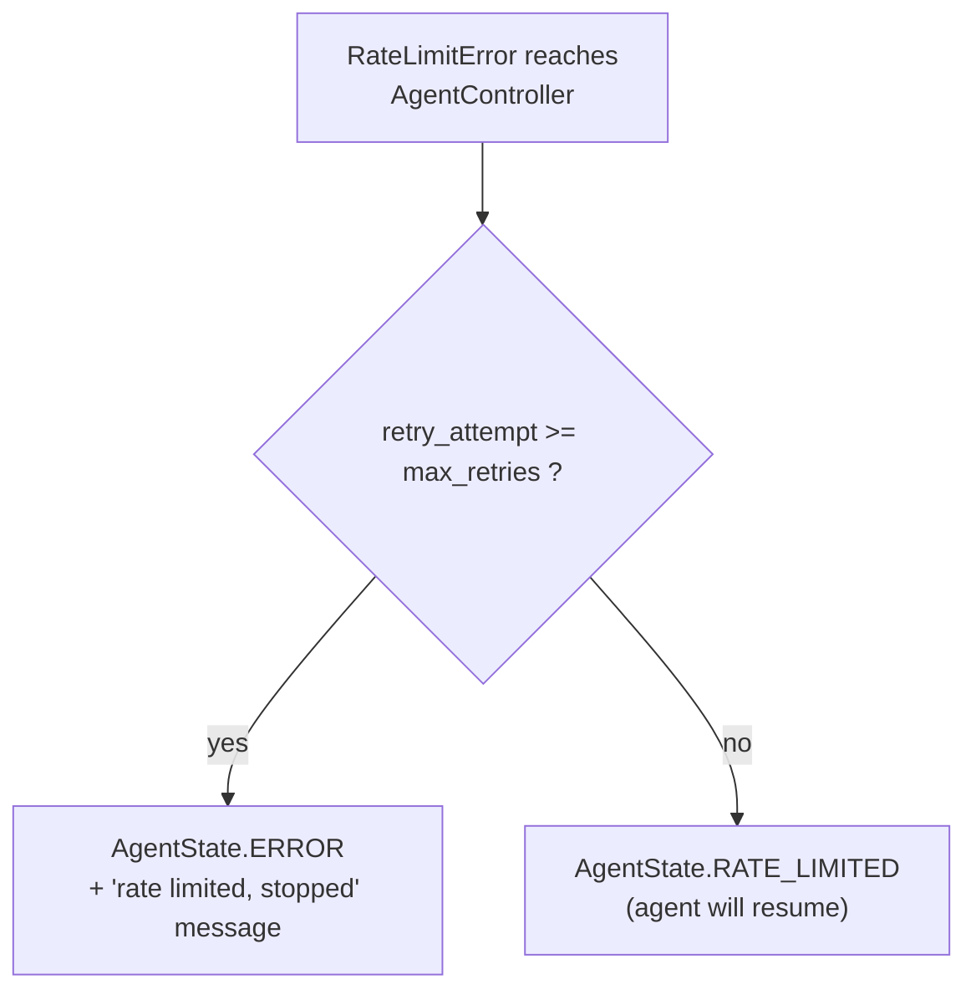
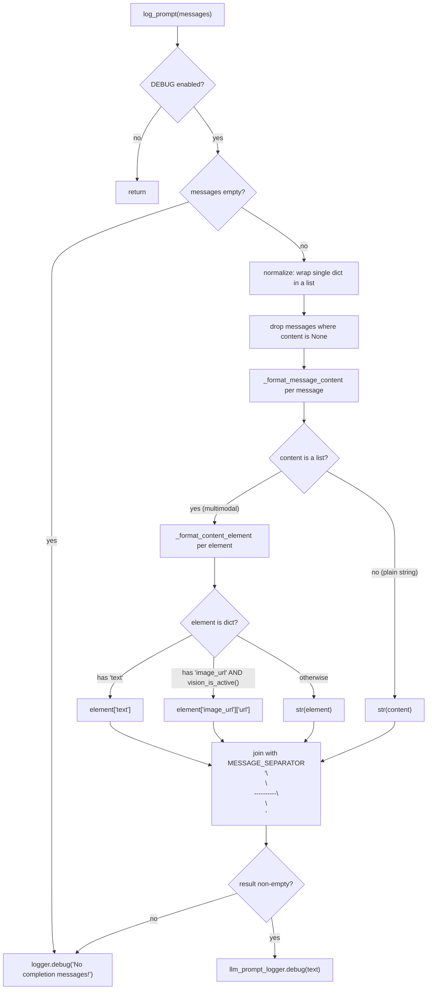
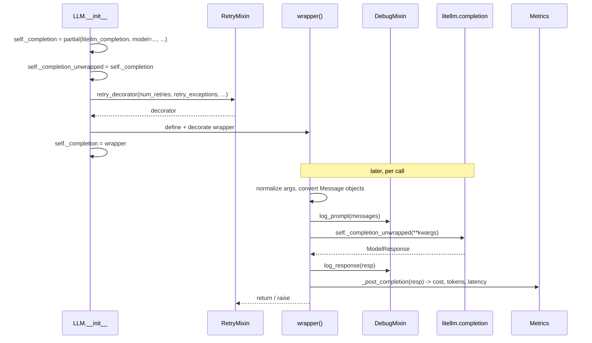

# LLM Client Mixins (`llm_layer_clients_mixins`)

## Introduction

Every call OpenHands makes to a language model needs two things that have nothing to do with the model itself:

1. **Survive bad networks and rate limits** — providers return 429s, time out, and sometimes send back an empty response. The call must be retried with backoff instead of killing the agent run.
2. **Be inspectable** — when an agent behaves strangely, a developer needs to see the exact prompt that was sent and the exact text that came back.

This module holds the two small classes that provide those behaviors:

| Component | File | Job |
|---|---|---|
| `RetryMixin` | `openhands/llm/retry_mixin.py` | Builds a configurable [tenacity](https://tenacity.readthedocs.io/) retry decorator for LLM calls, with exponential backoff, shutdown awareness, and a special recovery path for empty responses. |
| `DebugMixin` | `openhands/llm/debug_mixin.py` | Writes prompts and responses to dedicated debug log files, formatting multimodal content into readable text. |

Neither class can be used alone. They are **mixins**: they are mixed into the LLM client classes and rely on the client for configuration and for one hook method (`vision_is_active()`). The concrete clients live in [`llm_layer_clients_sync_core`](llm_layer_clients_sync_core.md) (`LLM`) and [`llm_layer_clients_async_streaming`](llm_layer_clients_async_streaming.md) (`AsyncLLM`, `StreamingLLM`).

---

## Where the module sits



The mixins are **leaf-level utilities**: they depend only on configuration, logging, and the shutdown flag. Nothing in the codebase imports them except the LLM clients, and they never import the clients back — so the dependency graph stays acyclic.

Related modules:

- [`llm_layer_clients_sync_core`](llm_layer_clients_sync_core.md) — the `LLM` class that inherits both mixins and supplies `vision_is_active()`.
- [`llm_layer_clients_async_streaming`](llm_layer_clients_async_streaming.md) — async and streaming clients that reuse the same decorator.
- [`llm_layer_registry`](llm_layer_registry.md) — creates clients and injects the `retry_listener` callback.
- [`llm_layer_clients_model_features`](llm_layer_clients_model_features.md) — separate capability lookup (`get_features`), not used by the mixins themselves.
- [`logging`](logging.md) — defines `llm_prompt_logger`, `llm_response_logger`, and `LlmFileHandler`.
- [`agent_controller_core`](agent_controller_core.md) — reads the retry metadata that `RetryMixin` attaches to exceptions.
- [`server_sessions`](server_sessions.md) — supplies the retry listener that pushes "Retrying LLM request" to the UI.

---

## Class relationships

`LLM` is declared as `class LLM(RetryMixin, DebugMixin)`. Because Python resolves methods along the MRO, every subclass down the chain gets `retry_decorator`, `log_prompt`, and `log_response` for free.



`DebugMixin` declares `vision_is_active()` only to document the contract; it raises `NotImplementedError`. `LLM` overrides it with the real check (config flag plus litellm capability lookup). This is the one place where the mixin depends on its host class.

---

## `RetryMixin`

### What it produces

`retry_decorator(**kwargs)` returns a ready-made tenacity `retry` decorator. It takes no positional arguments — everything comes through keyword arguments, so a caller can build different retry policies from different configs:

| Keyword | Source | Meaning |
|---|---|---|
| `num_retries` | `LLMConfig.num_retries` (default 5) | Max attempts before giving up. |
| `retry_exceptions` | `LLM_RETRY_EXCEPTIONS` in `llm.py` | Tuple of exception types worth retrying. |
| `retry_min_wait` | `LLMConfig.retry_min_wait` (default 8s) | Floor for exponential backoff. |
| `retry_max_wait` | `LLMConfig.retry_max_wait` (default 64s) | Ceiling for exponential backoff. |
| `retry_multiplier` | `LLMConfig.retry_multiplier` (default 8) | Growth factor for backoff. |
| `retry_listener` | Injected by `LLMRegistry` / `WebSession` | Called as `listener(attempt_number, num_retries)` on every retry, so the UI can show progress. |

The retryable exception set (defined in the sync core, not here) is:

`APIConnectionError`, `RateLimitError`, `ServiceUnavailableError`, `litellm.Timeout`, `litellm.InternalServerError`, `LLMNoResponseError`.

Anything else — a bad API key, a content-policy rejection, a malformed request — fails immediately, which is correct: retrying would only waste time and money.

### The retry loop



### Three design details worth knowing

**1. Two stop conditions, OR-ed together.**

```python
stop=stop_after_attempt(num_retries) | stop_if_should_exit()
```

`stop_if_should_exit` (from `openhands/utils/tenacity_stop.py`) reads the global shutdown flag set by the signal handlers. Without it, a `Ctrl+C` during a 64-second backoff would leave the process hanging until the sleep finished. With it, the retry loop gives up as soon as the process is shutting down. A near-identical class exists under `openhands/runtime/utils/` for runtime code — see [`runtime_utils`](runtime_utils.md).

**2. `reraise=True` — the caller sees the real exception.**

By default tenacity wraps the last failure in a `RetryError`. Setting `reraise=True` lets the original `RateLimitError` or `APIConnectionError` propagate untouched. This matters because `AgentController` inspects the exception *type* to decide which status to show the user.

**3. Empty-response recovery by nudging temperature.**

Some models (notably Gemini) occasionally return a response with zero choices. The sync client raises `LLMNoResponseError` for this. Since a greedy, deterministic call (`temperature=0`) will likely produce the same empty result again, `before_sleep` rewrites the pending call's arguments:

```python
if isinstance(exception, LLMNoResponseError):
    current_temp = retry_state.kwargs.get('temperature', 0)
    if current_temp == 0:
        retry_state.kwargs['temperature'] = 1.0
```

Mutating `retry_state.kwargs` works because tenacity re-invokes the wrapped function with those same args and kwargs. If the temperature was already non-zero, it is left alone and only a warning is logged — repeating a sampled call is fine.

### Retry metadata handed to the controller

`log_retry_attempt` does more than log. It walks the stop condition to find the configured maximum, then **attaches two attributes onto the exception object**:



The `.stops` branch exists precisely because this module OR-es two stop conditions together — tenacity wraps them in a `stop_any` object, so the code has to look one level deeper to find `stop_after_attempt.max_attempts`.

Downstream, `AgentController._react_to_exception` uses those attributes to distinguish "still retrying" from "gave up":



This is a deliberate, if implicit, contract between two modules: `RetryMixin` writes the attributes, [`agent_controller_core`](agent_controller_core.md) reads them with `hasattr` guards.

### The listener path to the user's screen


Note that only the **sync** `LLM` client forwards `retry_listener` into the decorator. `AsyncLLM` and `StreamingLLM` build their decorators without it, so their retries are logged but not surfaced in the UI.

---

## `DebugMixin`

### Purpose

`DebugMixin` gives every client a cheap, uniform way to dump prompts and responses. The output does **not** go to the normal application log. It goes to two dedicated loggers, `llm_prompt_logger` and `llm_response_logger`, which write numbered files under `logs/llm/<session>/` through `LlmFileHandler` (see [`logging`](logging.md)). Keeping them separate means a full prompt — often tens of thousands of tokens — never floods the console log.

### Cost control comes first

Both public methods begin with the same guard:

```python
if not logger.isEnabledFor(DEBUG):
    return
```

The comment in the source explains why: *"Don't use memory building message string if not logging."* Joining every message body into one giant string on every LLM call would be a real waste of memory and CPU in production, where debug logging is off. The guard makes both methods effectively free unless someone turned on `DEBUG`.

### `log_prompt` — formatting pipeline



Two things the formatter handles that a naive `str(messages)` would not:

- **Multimodal content.** A message body can be a list of parts (`{'type': 'text', ...}`, `{'type': 'image_url', ...}`). Each part is flattened to a line of text.
- **Vision gating.** Image URLs are only printed when `vision_is_active()` is true. If the model does not support vision, the image parts are stringified instead of having their URL pulled out — an honest reflection of the fact that those parts would not be usefully consumed anyway.

The `MESSAGE_SEPARATOR` (`\n\n----------\n\n`) makes the resulting log file easy to read and to split back into turns.

### `log_response` — response and tool calls

`log_response` pulls `choices[0].message.content`, then appends a readable line for every tool call:

```
<assistant text>
Function call: execute_bash({"command": "ls -la"})
```

Because function-calling responses often have empty `content` and carry all their meaning in `tool_calls`, this rendering is what makes agent tool decisions visible in the debug log at all.

### A caveat in the async clients

`log_response` is typed to receive a `ModelResponse` and indexes it as `resp['choices'][0]['message']`. The sync `LLM` passes the full response object, which is correct. `AsyncLLM` and `StreamingLLM` instead pass an already-extracted **string** (`message_back`). Because of the `isEnabledFor(DEBUG)` early return, this never surfaces at normal log levels — but with `DEBUG` enabled, subscripting a string with `'choices'` will raise a `TypeError` inside the async and streaming paths. Anyone debugging those clients should be aware of the mismatch; see [`llm_layer_clients_async_streaming`](llm_layer_clients_async_streaming.md).

---

## How a client wires both mixins together

The composition pattern is the same in all three clients: build an *unwrapped* partial of the litellm function, define a `wrapper` that adds logging and bookkeeping, and stack the retry decorator on top.



The layering order matters: **retry sits outside the logging**. So a call that fails twice and succeeds on the third attempt writes three prompt entries and one response entry to the debug logs — you can see every attempt, not just the winner.

Cost and token accounting happens in `_post_completion` and belongs to [`llm_layer_metrics`](llm_layer_metrics.md), not to these mixins. The mixins deliberately know nothing about money or tokens.

---

## Extending or reusing the mixins

**Adding a retryable exception.** Append it to `LLM_RETRY_EXCEPTIONS` in `openhands/llm/llm.py`. No change to `RetryMixin` is needed — it takes the tuple as a parameter.

**Adding special recovery for a new failure mode.** Follow the `LLMNoResponseError` precedent: add a branch in `before_sleep` that inspects `retry_state.outcome.exception()` and mutates `retry_state.kwargs` before the next attempt. Keep the mutation idempotent-safe (the existing code only bumps temperature when it is still 0) so repeated retries do not compound the change.

**Using the mixins on a new client class.** Inherit `RetryMixin` and/or `DebugMixin`, and — if you inherit `DebugMixin` — override `vision_is_active()`. Router classes such as `RouterLLM` in [`llm_layer_routing`](llm_layer_routing.md) do not inherit the mixins directly; they delegate to underlying `LLM` instances that already have them, which keeps a single retry policy per real provider call.

**Per-request retry policies.** Because `retry_decorator` reads everything from kwargs rather than from `self.config`, one host object can build several decorators with different policies — useful if a fast, cheap model should give up sooner than an expensive one.

---

## Summary

| Concern | Handled here | Handled elsewhere |
|---|---|---|
| Backoff, attempt limits, shutdown-aware stop | `RetryMixin.retry_decorator` | — |
| Which exceptions are retryable | — | `LLM_RETRY_EXCEPTIONS`, [sync core](llm_layer_clients_sync_core.md) |
| Retry progress shown to the user | `retry_listener` invocation | [`server_sessions`](server_sessions.md), [`llm_layer_registry`](llm_layer_registry.md) |
| "Gave up vs. still trying" decision | attaches `retry_attempt` / `max_retries` | [`agent_controller_core`](agent_controller_core.md) |
| Prompt / response debug dumps | `DebugMixin.log_prompt`, `log_response` | file handlers in [`logging`](logging.md) |
| Vision capability check | hook declaration only | [sync core](llm_layer_clients_sync_core.md), [`llm_layer_clients_model_features`](llm_layer_clients_model_features.md) |
| Cost, tokens, latency | — | [`llm_layer_metrics`](llm_layer_metrics.md) |

Both classes are small on purpose. They are pure cross-cutting concerns lifted out of the client classes so that the sync, async, and streaming clients cannot drift apart in how they retry or how they log.
