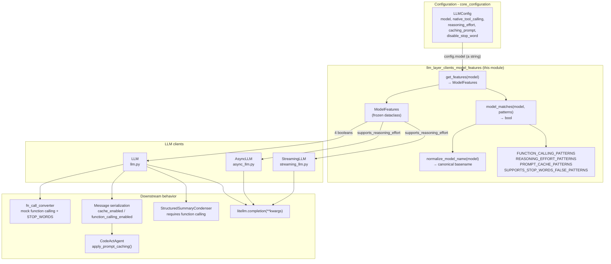
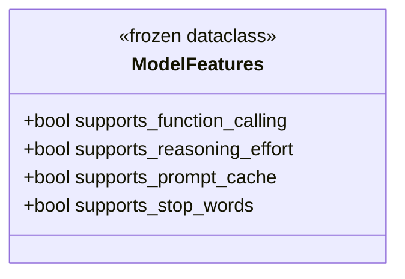
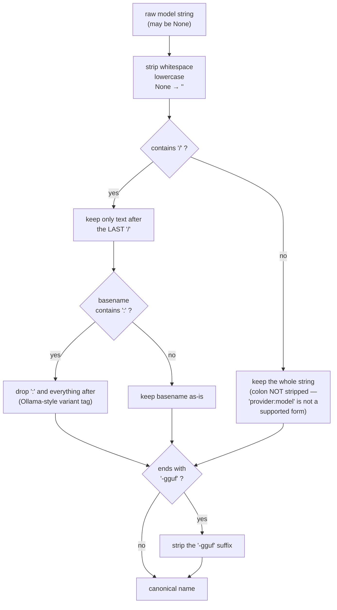
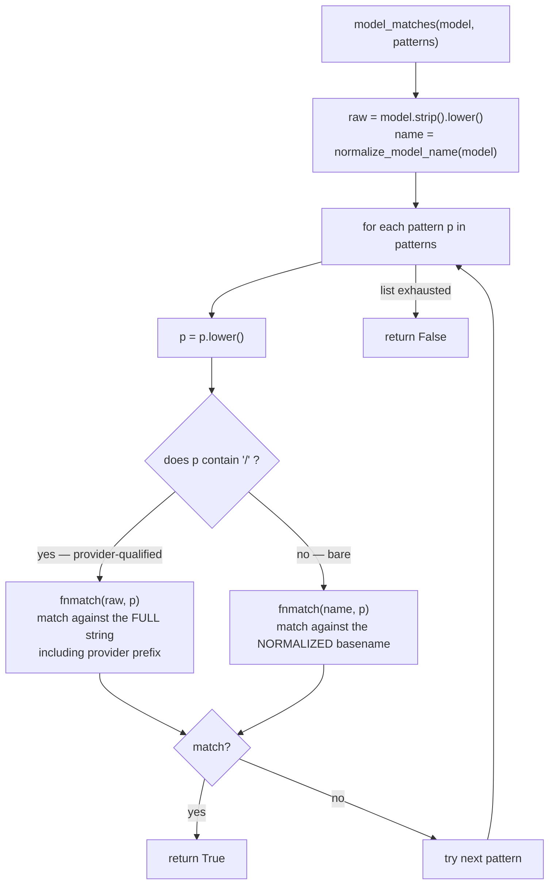
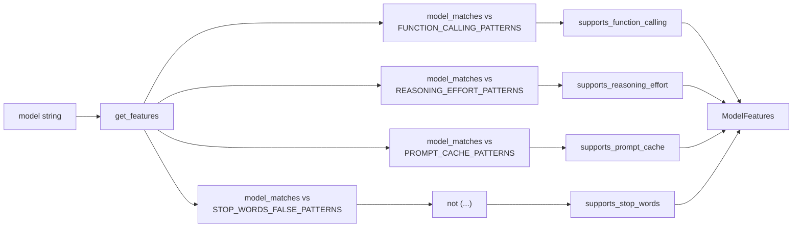
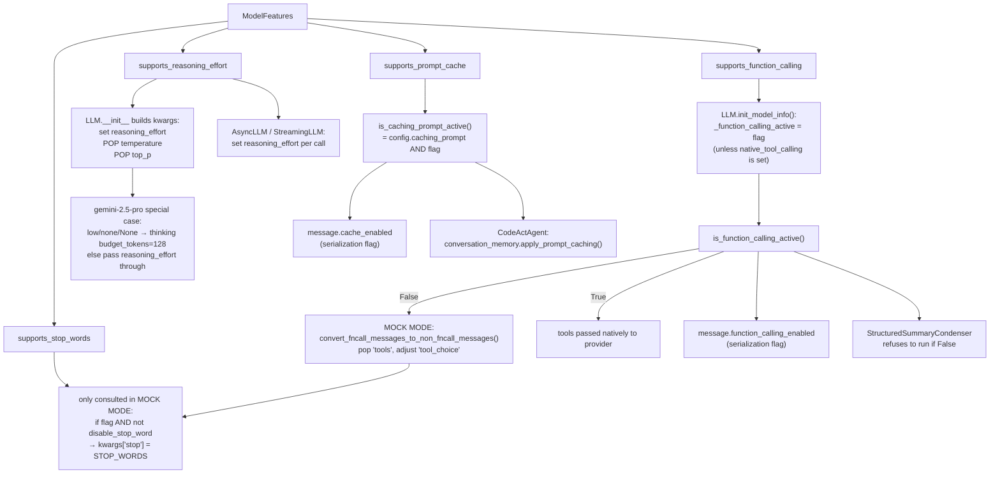
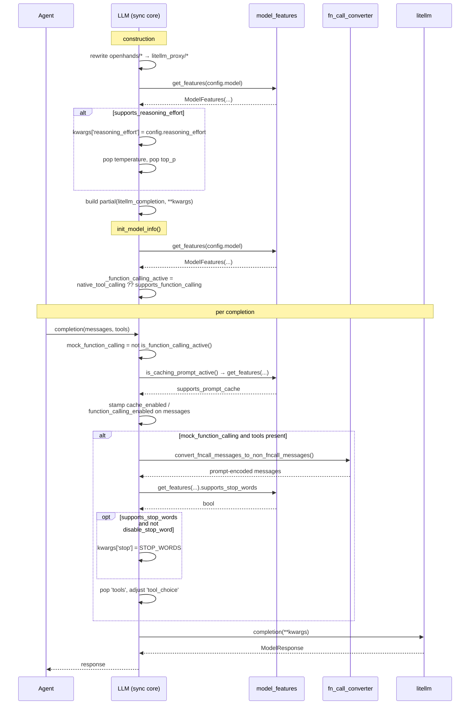
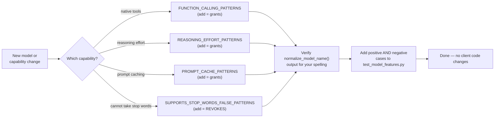

# Model Feature Detection (`llm_layer_clients_model_features`)

## Introduction

OpenHands talks to dozens of language models through one shared client. But models are not interchangeable. Some accept native tool calls, some do not. Some accept a `reasoning_effort` parameter, some reject the request if you send it. Some support Anthropic prompt caching. Some crash if you send `stop` words.

Before this module existed, those checks were scattered through the client code as ad-hoc string tests (`if 'claude-3-5' in model`, `if model.startswith('o1')`, and so on). This module collects all of them into **one file with one entry point**.

| Component | File | Job |
|---|---|---|
| `get_features` | `openhands/llm/model_features.py` | The single public entry point. Takes a model string, returns a `ModelFeatures` record of four capability booleans. |
| `ModelFeatures` | `openhands/llm/model_features.py` | Frozen dataclass holding the four booleans. |
| `normalize_model_name` | `openhands/llm/model_features.py` | Turns a messy model string into a canonical, comparable basename. |
| `model_matches` | `openhands/llm/model_features.py` | Glob-matches a model string against a list of patterns. |
| Pattern tables | `openhands/llm/model_features.py` | Four module-level lists that encode *which* models have *which* capability. |

The module is **pure and stateless**. No I/O, no network, no LiteLLM lookup, no cache, no configuration object. Give it a string, get back four booleans. That makes it trivially testable and safe to call from anywhere, including inside a hot per-request code path.

Its consumers are the LLM clients: [`llm_layer_clients_sync_core`](llm_layer_clients_sync_core.md) (`LLM`) and [`llm_layer_clients_async_streaming`](llm_layer_clients_async_streaming.md) (`AsyncLLM`, `StreamingLLM`).

---

## Where the module sits



---

## The four features

`ModelFeatures` is a frozen dataclass with exactly four fields. Frozen means an instance cannot be mutated after creation — callers can pass it around without worrying that someone flipped a flag.



| Field | Meaning | Backing table | Polarity |
|---|---|---|---|
| `supports_function_calling` | Model accepts native tool/function-call requests, so OpenHands does not have to fake tools through prompt text. | `FUNCTION_CALLING_PATTERNS` | **Allow list** — match ⇒ `True` |
| `supports_reasoning_effort` | Model accepts a `reasoning_effort` (or thinking-budget) parameter. | `REASONING_EFFORT_PATTERNS` | **Allow list** — match ⇒ `True` |
| `supports_prompt_cache` | Model needs and honors explicit Anthropic-style cache breakpoints. | `PROMPT_CACHE_PATTERNS` | **Allow list** — match ⇒ `True` |
| `supports_stop_words` | Model accepts a `stop` parameter. | `SUPPORTS_STOP_WORDS_FALSE_PATTERNS` | **Deny list** — match ⇒ `False` |

The polarity difference matters and is easy to get wrong when editing the file. Three of the tables list models that *have* the feature. The fourth lists models that *lack* it, and `get_features` negates the result:

```python
supports_stop_words=not model_matches(model, SUPPORTS_STOP_WORDS_FALSE_PATTERNS)
```

The reason is practical: almost every model supports stop words, so listing the exceptions is much shorter than listing the supporters. It also means an **unknown model defaults to `True` for stop words and `False` for the other three** — a conservative default in each case, since sending `stop` is usually harmless while sending `reasoning_effort` to a model that does not understand it is not.

---

## Step 1 — Normalizing the model name

Model strings arrive in many shapes. The same underlying Claude model can be spelled `claude-3-5-sonnet-20241022`, `anthropic/claude-3-5-sonnet-20241022`, `openrouter/anthropic/claude-3-5-sonnet`, or `litellm_proxy/claude-3-5-sonnet`. Writing a pattern for every spelling would be hopeless, so `normalize_model_name` reduces the string to a canonical basename first.



Worked examples (all taken from the module's unit tests):

| Input | Output | What happened |
|---|---|---|
| `  OPENAI/gpt-4o  ` | `gpt-4o` | trimmed, lowercased, provider prefix dropped |
| `anthropic/claude-3-7-sonnet` | `claude-3-7-sonnet` | provider prefix dropped |
| `litellm_proxy/gemini-2.5-pro` | `gemini-2.5-pro` | proxy prefix dropped |
| `openrouter/gpt-4o-mini` | `gpt-4o-mini` | last-slash rule handles multi-segment prefixes |
| `deepseek/DeepSeek-R1-0528:671b-Q4_K_XL` | `deepseek-r1-0528` | prefix dropped, quantization tag after `:` dropped |
| `openai/GLM-4.5-GGUF` | `glm-4.5` | `-gguf` suffix stripped |
| `bedrock/anthropic.claude-3-5-sonnet-20241022-v2:0` | `anthropic.claude-3-5-sonnet-20241022-v2` | prefix dropped, `:0` version tag dropped — but the dotted `anthropic.` stays |
| `gpt-5` | `gpt-5` | nothing to do |
| `''` / `None` | `''` | empty input is handled, never raises |

Two subtleties are worth calling out because they surprise people:

- **Colon stripping only happens when a `/` is present.** The docstring is explicit: there is no `provider:model` form; providers always use `provider/model`. So a bare `llama3:8b` normalizes to `llama3:8b`, colon intact. If you want an Ollama variant tag stripped, write the model as `ollama/llama3:8b`.
- **Bedrock-style dotted names keep their vendor segment.** `bedrock/anthropic.claude-3-5-sonnet-...` normalizes to `anthropic.claude-3-5-sonnet-...`, which does *not* match the pattern `claude-3-5-sonnet*` (fnmatch anchors at both ends). Bedrock spellings therefore need their own patterns if you want them recognized. See [Gotchas](#gotchas-and-edge-cases).

---

## Step 2 — Matching against patterns

`model_matches` walks a list of glob patterns and returns `True` on the first hit. The interesting part is that it matches against **two different strings** depending on the pattern:



This two-mode design gives pattern authors a choice:

- A **bare pattern** like `gpt-4o*` is provider-agnostic. It matches `gpt-4o`, `openai/gpt-4o`, and `litellm_proxy/gpt-4o-mini` alike, because all three normalize to a basename starting with `gpt-4o`.
- A **provider-qualified pattern** like `openai/gpt-4o*` is narrow. It matches `openai/gpt-4o` but *not* `openrouter/gpt-4o`, and not a bare `gpt-4o` either (there is no prefix in the raw string to match against).

Matching uses Python's `fnmatch`, so `*` and `?` work and the pattern must match the whole string. That is why `grok-4-0709` matches only itself and not `grok-4-0801`, and why exact entries like `o1-2024-12-17` in `FUNCTION_CALLING_PATTERNS` pin one specific snapshot while `o3*` covers a whole family.

All patterns in the tables are kept **lowercase by convention**; `model_matches` also lowercases each pattern defensively before comparing, so a stray uppercase entry still works.

---

## Step 3 — `get_features`

The public function is four `model_matches` calls stitched into one record:

```python
def get_features(model: str) -> ModelFeatures:
    return ModelFeatures(
        supports_function_calling=model_matches(model, FUNCTION_CALLING_PATTERNS),
        supports_reasoning_effort=model_matches(model, REASONING_EFFORT_PATTERNS),
        supports_prompt_cache=model_matches(model, PROMPT_CACHE_PATTERNS),
        supports_stop_words=not model_matches(model, SUPPORTS_STOP_WORDS_FALSE_PATTERNS),
    )
```



There is no memoization. Each call re-runs up to a few dozen `fnmatch` comparisons, which is cheap enough that the clients call it freely — including once per request inside the async and streaming completion wrappers.

---

## How each flag changes behavior

This is the part that matters for debugging. A single boolean here can silently reshape the whole request sent to the provider.



### `supports_function_calling`

Resolved once, during `LLM.init_model_info()`, into a cached instance attribute:

```python
features = get_features(self.config.model)
if self.config.native_tool_calling is None:
    self._function_calling_active = features.supports_function_calling
else:
    self._function_calling_active = self.config.native_tool_calling
```

So the detected value is a **default that the user can override**. `native_tool_calling` in [`LLMConfig`](core_configuration.md) is a tri-state (`True` / `False` / unset); only when it is unset does this module decide.

When the result is `False`, the client enters "mock function calling" mode: tool definitions are rewritten into prompt text by `fn_call_converter`, the `tools` kwarg is removed before the request, and the model's textual reply is parsed back into tool calls afterwards. That is a large behavioral fork controlled by one boolean.

### `supports_reasoning_effort`

Consulted in three places:

1. **`LLM.__init__`**, once, while assembling the partial `litellm_completion`. If `True`, `reasoning_effort` is added to the kwargs and — importantly — `temperature` and `top_p` are **removed**, because reasoning models reject them. There is a Gemini 2.5 Pro special case that translates `None`/`low`/`none` into an explicit `thinking: {budget_tokens: 128}` instead of a `reasoning_effort` string.
2. **`AsyncLLM`**, per call, inside `async_completion_wrapper`.
3. **`StreamingLLM`**, per call, inside its streaming wrapper.

### `supports_prompt_cache`

Reached through `LLM.is_caching_prompt_active()`, which ANDs it with the user's `config.caching_prompt` toggle. The method's comment explains why no LiteLLM model-info lookup is needed: only Anthropic models require explicit cache breakpoints, and those are exactly what the pattern table lists.

Two consumers read it. `format_messages_for_llm` stamps `message.cache_enabled` so [`Message`](core_schema_and_runtime_support.md) serializes `cache_control` blocks; and [`CodeActAgent`](agents_codeact_variants.md) calls `conversation_memory.apply_prompt_caching(messages)` to place the breakpoints (see [`memory_and_condensers`](memory_and_condensers.md)).

### `supports_stop_words`

The narrowest consumer. It is read **only inside the mock-function-calling branch**, where the prompt-based tool protocol needs the model to halt at a `</function` marker:

```python
if get_features(self.config.model).supports_stop_words and not self.config.disable_stop_word:
    kwargs['stop'] = STOP_WORDS   # ['</function'] from fn_call_converter
```

If a model already supports native function calling, this flag never comes into play for it.

---

## Request-time sequence

How the flags flow through one agent step, from client construction to a provider call:



---

## Reading the pattern tables

A condensed view of what is currently encoded. Patterns are glob patterns, not substrings.

**`FUNCTION_CALLING_PATTERNS`** — Anthropic (`claude-3-7-sonnet*`, `claude-3.7-sonnet*`, `claude-sonnet-3-7-latest`, `claude-3-5-sonnet*`, `claude-3-5-haiku*`, `claude-3.5-haiku*`, `claude-sonnet-4*`, `claude-opus-4*`), OpenAI (`gpt-4o*`, `gpt-4.1`, `gpt-5*`), o-series (`o1-2024-12-17` exactly, `o3*`, `o4-mini*`), Google (`gemini-2.5-pro*`), plus `kimi-k2-0711-preview`, `kimi-k2-instruct`, `qwen3-coder*`, `deepseek-chat`.

**`REASONING_EFFORT_PATTERNS`** — an intentionally tight list: `o1-2024-12-17`, `o1`, `o3`, `o3-2025-04-16`, `o3-mini-2025-01-31`, `o3-mini`, `o4-mini`, `o4-mini-2025-04-16`, `gemini-2.5-flash`, `gemini-2.5-pro`, `gpt-5*`, `deepseek-r1-0528*`. The source comment says it mirrors prior behavior exactly "with no unintended expansion", which is why `o3` and `o3-mini` are spelled out individually rather than written as `o3*`. Tests assert the negative side too: `o1-mini` and `o1-preview` must stay `False`.

**`PROMPT_CACHE_PATTERNS`** — Anthropic only: the Claude 3.5/3.7 Sonnet and Haiku families, `claude-3-haiku-20240307`, `claude-3-opus-20240229`, `claude-sonnet-4*`, `claude-opus-4*`.

**`SUPPORTS_STOP_WORDS_FALSE_PATTERNS`** — the deny list: `o1*` (whole family), `grok-4-0709`, `grok-code-fast-1`, `deepseek-r1-0528*`.

Notice the asymmetries, which are deliberate and test-pinned:

- `o1*` denies stop words for the entire o1 family, but only the exact snapshot `o1-2024-12-17` gets function calling.
- `gpt-4.1` is exact (no `*`), while `gpt-5*` is a wildcard.
- Both hyphen and dot spellings appear for Claude (`claude-3-5-haiku*` **and** `claude-3.5-haiku*`) because providers are inconsistent about which they use.

---

## Gotchas and edge cases

| Situation | Behavior | Why |
|---|---|---|
| Unknown / brand-new model | `function_calling=False`, `reasoning_effort=False`, `prompt_cache=False`, `stop_words=True` | Allow lists default closed; the stop-words deny list defaults open. |
| `None` or `''` passed in | Normalizes to `''`, all matches fail, returns the default record above. Never raises. | `(model or '').strip().lower()` guards it. |
| Bare Ollama tag, e.g. `llama3:8b` | Colon is **kept** — normalizes to `llama3:8b` | Colon stripping only runs when a `/` is present, because `provider:model` is not a supported form. Write `ollama/llama3:8b` instead. |
| Bedrock dotted names, e.g. `bedrock/anthropic.claude-3-5-sonnet-20241022-v2:0` | Normalizes to `anthropic.claude-3-5-sonnet-20241022-v2`, which does **not** match `claude-3-5-sonnet*` | fnmatch anchors both ends; the `anthropic.` segment survives normalization. Add an explicit pattern if a Bedrock spelling needs recognizing. |
| `openhands/<model>` | Rewritten by `LLM.__init__` to `litellm_proxy/<model>` **before** `get_features` is called | Feature lookup sees the rewritten name; provider-qualified patterns must therefore target `litellm_proxy/`, not `openhands/`. |
| A provider-qualified pattern and a bare model name | No match | `openai/gpt-4o*` is tested against the raw string; a bare `gpt-4o` has no prefix to match. |
| Same model, two spellings for the same feature | Both must be listed | e.g. `claude-3-5-haiku*` and `claude-3.5-haiku*`. |

---

## Adding or changing a model

The whole point of the module is that this is a one-file change.

1. **Pick the table.** One of the four lists, matching the capability you are describing. Remember `SUPPORTS_STOP_WORDS_FALSE_PATTERNS` is inverted — adding an entry there *removes* a capability.
2. **Decide bare vs. provider-qualified.** Prefer bare (`my-model-v2*`) so the entry works across OpenRouter, LiteLLM proxy, and direct access. Use `provider/pattern` only when the capability genuinely differs by provider.
3. **Check what your name normalizes to.** Run `normalize_model_name('your/model:tag')` mentally or in a REPL first. Quantization tags, `-gguf` suffixes, and dotted vendor segments all change the string you are matching against.
4. **Choose your wildcard scope carefully.** `family*` covers every future snapshot, including ones that may not have the capability. An exact name is safer but needs updating for each release. The existing tables mix both on purpose.
5. **Add a test case.** `tests/unit/llm/test_model_features.py` covers normalization, matching, provider-qualified matching, and each feature — including explicit negative cases that guard against accidental wildcard expansion.



---

## Design notes

**Why a separate module.** Capability checks were previously inline substring tests spread across `llm.py`, `async_llm.py`, and `streaming_llm.py`. Duplicating them meant they drifted. Centralizing gives one place to audit, one place to test, and one place to fix when a provider changes.

**Why patterns instead of a LiteLLM lookup.** LiteLLM's `model_info` is used elsewhere in the client (for token limits and vision support), but it does not reliably report these four capabilities, especially through proxy prefixes. Hand-maintained tables are explicit and auditable, at the cost of needing updates when new models ship.

**Why pure and uncached.** No state means no initialization order problems and no stale results after `config.model` is rewritten (which `LLM.__init__` does for the `openhands/` prefix). Being cheap enough to call per request is what lets `AsyncLLM` and `StreamingLLM` skip caching entirely.

**Why detection is a default, not a mandate.** For function calling, `LLMConfig.native_tool_calling` overrides the detected value. Users running a local or unlisted model can force the correct behavior without editing the tables.

---

## Related documentation

- [`llm_layer_clients`](llm_layer_clients.md) — the parent module: all LLM client code.
- [`llm_layer_clients_sync_core`](llm_layer_clients_sync_core.md) — `LLM`, the largest consumer; owns `is_function_calling_active()` and `is_caching_prompt_active()`.
- [`llm_layer_clients_async_streaming`](llm_layer_clients_async_streaming.md) — `AsyncLLM` and `StreamingLLM`, which consult `supports_reasoning_effort` per call.
- [`llm_layer_clients_mixins`](llm_layer_clients_mixins.md) — retry and debug-logging mixins on the same clients.
- [`llm_layer_registry`](llm_layer_registry.md) — how `LLM` instances are created and shared.
- [`llm_layer_routing`](llm_layer_routing.md) — routers that pick between several models at runtime.
- [`llm_layer_metrics`](llm_layer_metrics.md) — cost and token accounting for completions.
- [`core_configuration`](core_configuration.md) — `LLMConfig` and the override knobs (`native_tool_calling`, `reasoning_effort`, `caching_prompt`, `disable_stop_word`).
- [`agents_codeact_variants`](agents_codeact_variants.md) — agents that act on `is_caching_prompt_active()`.
- [`memory_and_condensers`](memory_and_condensers.md) — `apply_prompt_caching` and the function-calling-dependent condensers.
