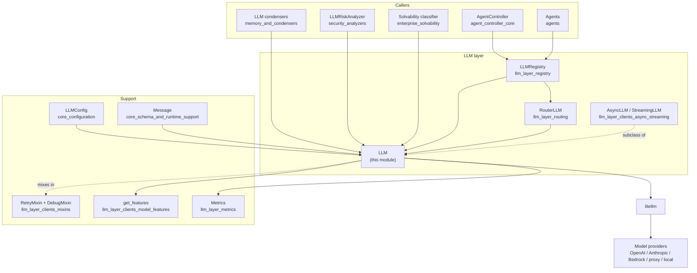
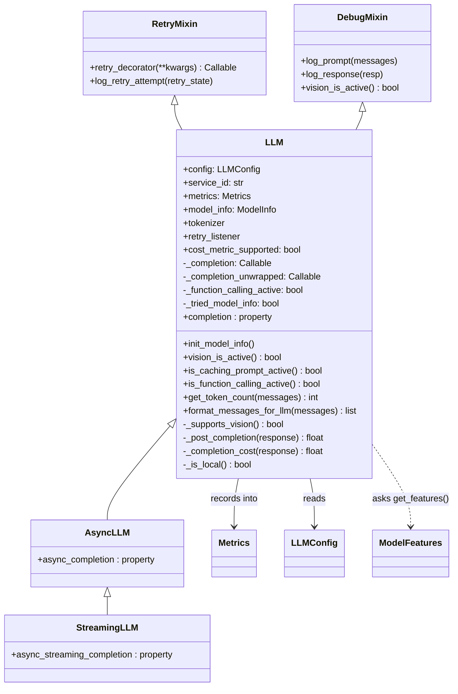
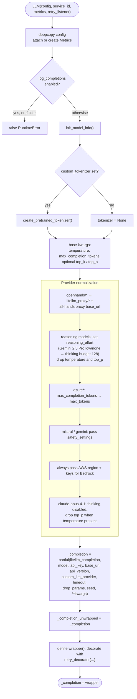
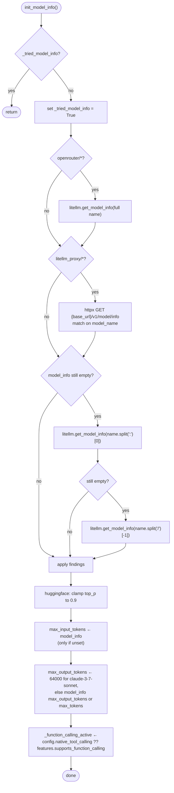
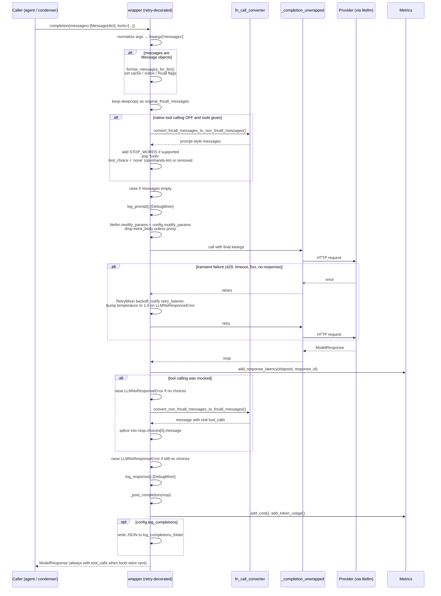
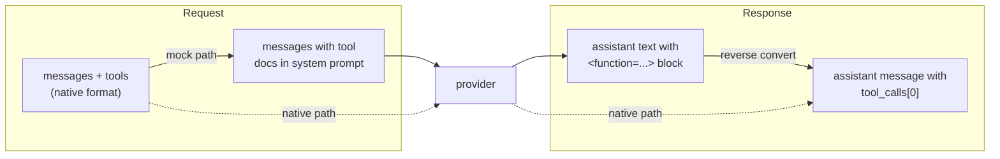
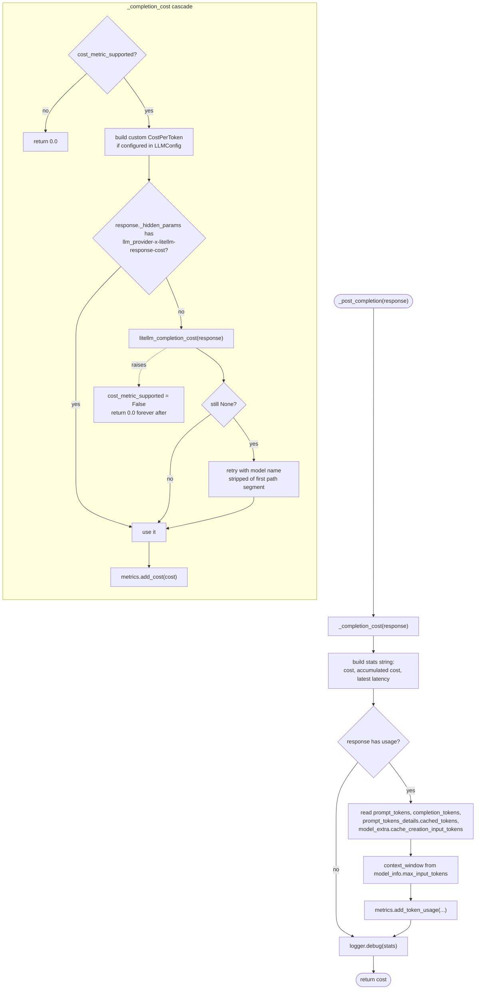
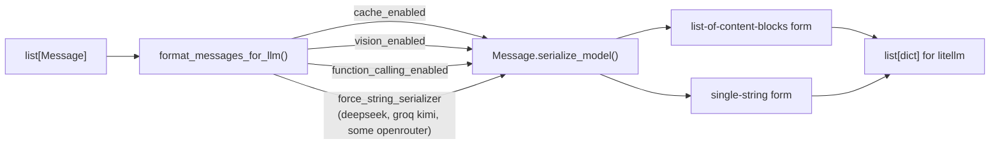
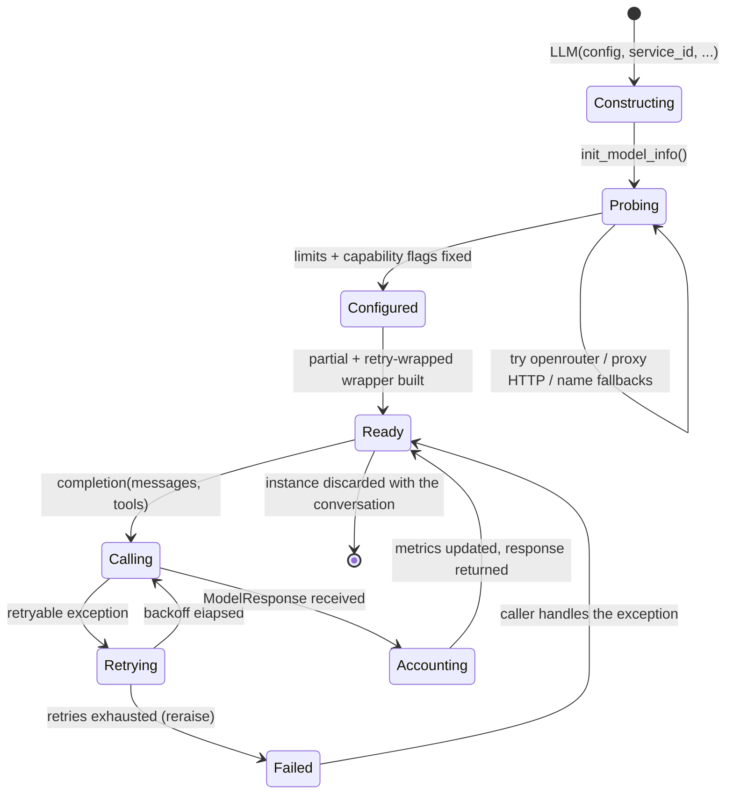

# llm_layer_sync_core: The Synchronous LLM Client

## Introduction

This module holds one class: `LLM` in `openhands/llm/llm.py`. It is the single door through which every part of OpenHands talks to a language model.

The job sounds simple — "send messages, get a reply" — but the class does much more. Model providers do not behave the same way. Some support native tool calling, some do not. Some accept `max_completion_tokens`, others want `max_tokens`. Some charge for cache writes, others do not. Some crash if you send both `temperature` and `top_p`. `LLM` hides all of that. Callers get one stable method, `llm.completion(messages=..., tools=...)`, and always get back a normal LiteLLM `ModelResponse` with tool calls in it — even when the model behind it has no idea what a tool call is.

Everything else in the LLM layer builds on this class. [`AsyncLLM` and `StreamingLLM`](llm_layer_clients_async_streaming.md) subclass it, [`RouterLLM`](llm_layer_routing.md) wraps it, and [`LLMRegistry`](llm_layer_registry.md) creates and hands out instances of it.

---

## 1. What the module is responsible for

| Responsibility | Where it happens |
| --- | --- |
| Build a pre-bound completion function for one model | `__init__` (the `partial(litellm_completion, ...)`) |
| Discover model limits and capabilities | `init_model_info()` |
| Normalize provider quirks into working kwargs | `__init__` (the long chain of `if` blocks) |
| Emulate tool calling for models that lack it | the `wrapper` closure + `fn_call_converter` |
| Retry failed calls with backoff | [`RetryMixin`](llm_layer_clients_mixins.md) |
| Log prompts and responses | [`DebugMixin`](llm_layer_clients_mixins.md) |
| Measure cost, tokens, and latency | `_post_completion()`, `_completion_cost()` → [`Metrics`](llm_layer_metrics.md) |
| Count tokens for condensers and budget checks | `get_token_count()` |
| Serialize `Message` objects with the right flags | `format_messages_for_llm()` |
| Write raw completion logs for evaluation runs | the `wrapper` closure |

What it does **not** do: it does not decide *what* to send (that is the [agent controller](agent_controller_core.md) and [memory/condensers](memory_and_condensers.md)), it does not pick *which* model to use (that is [routing](llm_layer_routing.md)), and it does not own the lifecycle of instances (that is the [registry](llm_layer_registry.md)).

---

## 2. Where it sits in the system

The key point: almost nobody constructs `LLM` directly. They ask the [registry](llm_layer_registry.md) for one by `service_id`, so the same model instance (and the same `Metrics` object) is shared across a conversation.

---

## 3. Internal structure

`LLM` is deliberately not abstract. It is a concrete, ready-to-use client, and the async and streaming variants extend it rather than replace it. That is why `DebugMixin.vision_is_active()` raises `NotImplementedError` — the mixin expects its host class to answer that question, and `LLM` does.

---

## 4. Construction: turning config into a callable

`__init__` is the most important method in the file. It runs once per instance and does five things in order.

Two details worth remembering:

- **`_completion` vs `_completion_unwrapped`.** The unwrapped one is the raw `partial` that calls LiteLLM. The wrapped one is the retrying, logging, tool-converting closure exposed through the `completion` property. Tests and subclasses patch `_completion_unwrapped` to intercept the real network call without losing the surrounding behavior.
- **Config is deep-copied and then mutated.** Rewriting `openhands/foo` to `litellm_proxy/foo`, filling in `max_input_tokens`, and forcing `top_p = 0.9` on Hugging Face all write back into `self.config`. The caller's config object is never touched, but `self.config` after construction is *not* the same as what was passed in. The [registry](llm_layer_registry.md) compares configs by equality when deciding whether to reuse a service, so this matters.

### The provider quirk table

| Condition | What changes |
| --- | --- |
| `model` starts with `openhands/` | rewritten to `litellm_proxy/<name>`, `base_url` set to the All-Hands LLM proxy |
| `get_features(model).supports_reasoning_effort` | `reasoning_effort` added; `temperature` and `top_p` removed |
| `gemini-2.5-pro` with effort in `{None, low, none}` | swapped for `thinking = {budget_tokens: 128}` plus `allowed_openai_params` |
| `model` starts with `azure` | `max_completion_tokens` replaced by `max_tokens` |
| `mistral` or `gemini` in name, and `safety_settings` set | `safety_settings` forwarded |
| always | `aws_region_name`, and AWS keys if present, forwarded for Bedrock |
| `claude-opus-4-1` | `thinking = {type: disabled}`; `top_p` dropped when `temperature` is present |
| `huggingface*` (in `init_model_info`) | `top_p` of 1 lowered to 0.9 |

The capability checks come from [`get_features`](llm_layer_clients_model_features.md) rather than from string matching scattered here, so adding a new model family is mostly a change in that module — the string checks left in `llm.py` are the per-model exceptions that do not generalize.

---

## 5. Model discovery: `init_model_info()`

Before `LLM` can build kwargs it needs to know the model's limits. `init_model_info` guards itself with `_tried_model_info` so it only ever runs once, and it tries several sources in order until something answers.

Every lookup is wrapped in a bare `except` — an unknown model must not stop the client from working. It just means `model_info` stays `None`, cost calculation may fall back or give up, and context-window reporting is 0.

Note that the LiteLLM-proxy branch makes a **blocking HTTP request inside `__init__`**. Constructing an `LLM` against a proxy is not free, which is another reason instances are cached in the registry.

---

## 6. The completion path

This is what happens on every `llm.completion(...)` call.

### Argument normalization

Callers are inconsistent, so the wrapper accepts several shapes:

- `completion(messages=[...])` — the normal case.
- `completion(model, messages, ...)` positionally — the first positional argument is **deliberately ignored**, because the model is already bound in the `partial`. Callers cannot override the configured model here.
- A single `Message` instead of a list — wrapped into a list.

If the first list item is a `Message`, the whole list goes through `format_messages_for_llm()`; otherwise it is assumed to already be dicts.

### Function-call emulation

This is the module's most valuable trick. When `is_function_calling_active()` is `False` but the caller passed `tools`, the wrapper:

1. Converts tool definitions into a system-prompt suffix and rewrites the conversation into plain text (`tool` messages become `user` messages prefixed with `EXECUTION RESULT of [name]:`).
2. Optionally prepends an in-context learning example — skipped for `openhands-lm` and `devstral`, which are already trained on the format.
3. Adds `STOP_WORDS` so the model stops after emitting one call, unless the model does not support stop words or `disable_stop_word` is set.
4. Removes `tools` from the request entirely.
5. After the response comes back, parses the `<function=...>` block out of the text and rebuilds a real `tool_calls` structure on `resp.choices[0].message`.

The caller never sees the difference. Only one tool call per message is supported by this path.

### Failure handling

`LLM_RETRY_EXCEPTIONS` is the retry set: `APIConnectionError`, `RateLimitError`, `ServiceUnavailableError`, `litellm.Timeout`, `litellm.InternalServerError`, and OpenHands' own `LLMNoResponseError`. Everything else propagates straight to the caller.

`LLMNoResponseError` is raised by `LLM` itself in two places — after mock-fncall conversion, and again on the final `choices` check — for the case where a provider (mostly Gemini) returns a response with no choices. Because it is in the retry set, [`RetryMixin`](llm_layer_clients_mixins.md) catches it and, if `temperature` was 0, nudges it to 1.0 before retrying. A deterministic empty response often becomes a real one with a little randomness.

The `retry_listener` callback, passed in by the [registry](llm_layer_registry.md), is how retry attempts surface to the UI as status updates.

---

## 7. Accounting: cost, tokens, latency

Every successful call ends in `_post_completion()`, which is the only place metrics are written.

Points to know:

- **Cache reads and cache writes are tracked separately.** Anthropic charges differently for writing to the prompt cache than for reading from it, but LiteLLM does not split them in `usage`. `LLM` reads `cached_tokens` from `prompt_tokens_details` and digs `cache_creation_input_tokens` out of the provider-specific `model_extra` to get both numbers.
- **`cost_metric_supported` is a one-way latch.** The first time cost calculation throws, it flips to `False` and no further cost work is attempted for this instance. Local and unknown models silently report zero cost instead of spamming errors.
- **Latency is measured around the unwrapped call only**, so it excludes conversion and logging overhead but includes the whole retry-free network round trip. It is recorded even for calls that later fail the `choices` check.
- The `Metrics` object may be **shared**. The registry passes a conversation-wide instance so cost across agent, condenser, and delegate calls accumulates in one place — see [llm_layer_metrics](llm_layer_metrics.md) and [server_sessions](server_sessions.md) (`ConversationStats`).

`_is_local()` exists to identify locally-served models (a `localhost`/`127.0.0.1`/`0.0.0.0` base URL, or an `ollama` model) so they can be treated as free.

---

## 8. Capability flags and message serialization

Four small predicates drive most conditional behavior:

| Method | Answer comes from | Cached? |
| --- | --- | --- |
| `vision_is_active()` | `not config.disable_vision and _supports_vision()` | no |
| `_supports_vision()` | `OPENHANDS_FORCE_VISION` env var, or `litellm.supports_vision` on the full name **or** the suffix after the last `/`, or `model_info['supports_vision']` | no |
| `is_caching_prompt_active()` | `config.caching_prompt and get_features(model).supports_prompt_cache` | no |
| `is_function_calling_active()` | `_function_calling_active`, set once in `init_model_info` | yes |

The double vision check exists because LiteLLM returns `False` for prefixed names like `openai/gpt-4o` even when the model does support images.

`format_messages_for_llm()` is where these flags reach the [`Message`](core_schema_and_runtime_support.md) model. It stamps `cache_enabled`, `vision_enabled`, and `function_calling_enabled` on every message, then lets Pydantic serialize. Those flags decide whether a message becomes a single string or a list of content blocks. A few models need the string form even though they support other features, so `force_string_serializer` is set for `deepseek`, `kimi-k2-instruct` on `groq`, and `openrouter/anthropic/claude-sonnet-4`.

`get_token_count()` reuses the same serialization, then calls `litellm.token_counter` with the custom tokenizer if one was loaded. On any error it logs and returns `0` — a deliberate choice, since a token-count failure should not break a condenser or a budget check. Callers should treat `0` as "unknown", not "empty". This method is the main entry point used by [condensers](memory_and_condensers.md) to decide when history must be shrunk.

---

## 9. Lifecycle summary

After construction the instance is effectively immutable in configuration: model, kwargs, capability flags, and the bound completion function are all fixed. This is exactly why [`LLMRegistry.get_llm`](llm_layer_registry.md) refuses to hand back an existing `service_id` under a different `LLMConfig` — it would have to rebuild everything, so it makes you use a new service ID instead.

---

## 10. Extending it

If you are adding a new model or provider, work through this order:

1. **Is it a capability?** (function calling, reasoning effort, prompt cache, stop words) → add a pattern in [`model_features`](llm_layer_clients_model_features.md). Nothing in `llm.py` changes.
2. **Is it a parameter rename or an incompatible combination?** → add a narrow `if` in `__init__`, scoped as tightly as possible. The existing blocks all name a specific model family on purpose, to avoid changing behavior for siblings.
3. **Is it a serialization shape?** → set `force_string_serializer` in `format_messages_for_llm()`.
4. **Is it a new transient error worth retrying?** → add it to `LLM_RETRY_EXCEPTIONS`.
5. **Does it need async or streaming?** → the subclasses in [llm_layer_clients_async_streaming](llm_layer_clients_async_streaming.md) rebuild their own `partial`, so provider quirks added only to `__init__`'s kwargs may need mirroring there.

That last point is the sharpest edge in the module. `AsyncLLM` builds its own completion partial with a much shorter parameter list (`max_tokens`, `temperature`, `top_p`, and so on) and re-derives `reasoning_effort` itself. The careful quirk normalization in `LLM.__init__` applies to the **synchronous path only**.

---

## Related modules

| Module | Relationship |
| --- | --- |
| [llm_layer_clients_mixins](llm_layer_clients_mixins.md) | `RetryMixin` and `DebugMixin` — the retry and logging behavior mixed into `LLM` |
| [llm_layer_clients_model_features](llm_layer_clients_model_features.md) | `get_features` — the capability table `LLM` consults |
| [llm_layer_clients_async_streaming](llm_layer_clients_async_streaming.md) | `AsyncLLM` and `StreamingLLM` subclasses |
| [llm_layer_registry](llm_layer_registry.md) | Creates, caches, and shares `LLM` instances by `service_id` |
| [llm_layer_routing](llm_layer_routing.md) | `RouterLLM` / `MultimodalRouter` — picks among several `LLM` instances |
| [llm_layer_metrics](llm_layer_metrics.md) | `Metrics` — where cost, tokens, and latency land |
| [core_configuration](core_configuration.md) | `LLMConfig` and the wider config system |
| [core_schema_and_runtime_support](core_schema_and_runtime_support.md) | `Message`, `TextContent`, `ImageContent` |
| [logging](logging.md) | `llm_prompt_logger` / `llm_response_logger` sinks used by `DebugMixin` |
| [agent_controller_core](agent_controller_core.md) | Main consumer of the completion loop |
| [memory_and_condensers](memory_and_condensers.md) | Uses `get_token_count()` and `completion()` for summarization |
| [server_sessions](server_sessions.md) | `ConversationStats` aggregates per-service metrics |
