# LLM Layer — Metrics

## 1. What this module is for

Every call to a model costs money, burns tokens and takes time. `openhands/llm/metrics.py`
is the **single ledger** where those three numbers are written down.

It is a tiny module — one file, four classes, no dependencies beyond `pydantic` and the
standard library — but almost every other part of OpenHands reads from it:

- the **budget guard** stops a conversation when the accumulated cost passes a limit,
- the **frontend** shows a cost figure and a context-usage bar,
- the **CLI** prints a token/cost summary on `/status` and on exit,
- **delegate accounting** reports "this sub-agent cost $0.04" by subtracting two ledgers,
- **evaluation harnesses** dump the ledger into `output.jsonl` for every benchmark run,
- the **conversation list** shows total spend per conversation.

**Core components**

| Component | File | Role |
| --- | --- | --- |
| `Metrics` | `openhands/llm/metrics.py` | The ledger. Holds totals plus per-call history, and the four combinators (`copy`, `merge`, `diff`, `get`). |
| `TokenUsage` | `openhands/llm/metrics.py` | One completion call's token counts. A pydantic model with a `+` operator. |
| `Cost` | `openhands/llm/metrics.py` | One completion call's dollar cost, with a wall-clock `timestamp`. |
| `ResponseLatency` | `openhands/llm/metrics.py` | One completion call's round-trip time. |

This module is a **leaf**: it imports nothing from OpenHands. That is deliberate — it can be
pickled, deep-copied and shipped across process and network boundaries without dragging the
rest of the system with it.

See [llm_layer.md](llm_layer.md) for how metrics sits next to clients, the registry and
routing.

## 2. Position in the system

Metrics has one producer side (the LLM clients) and many consumer sides.

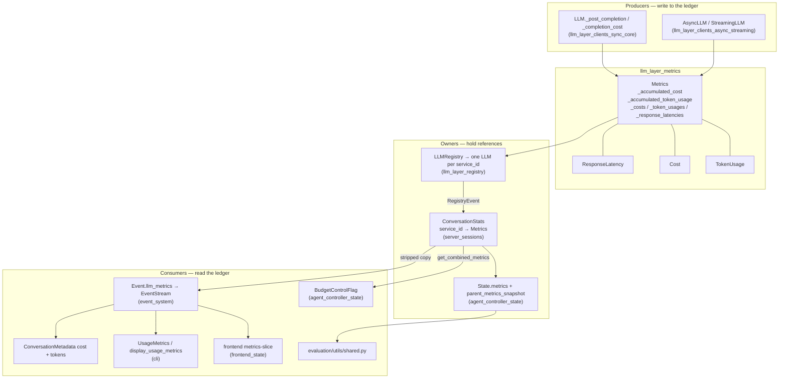

## 3. The data model

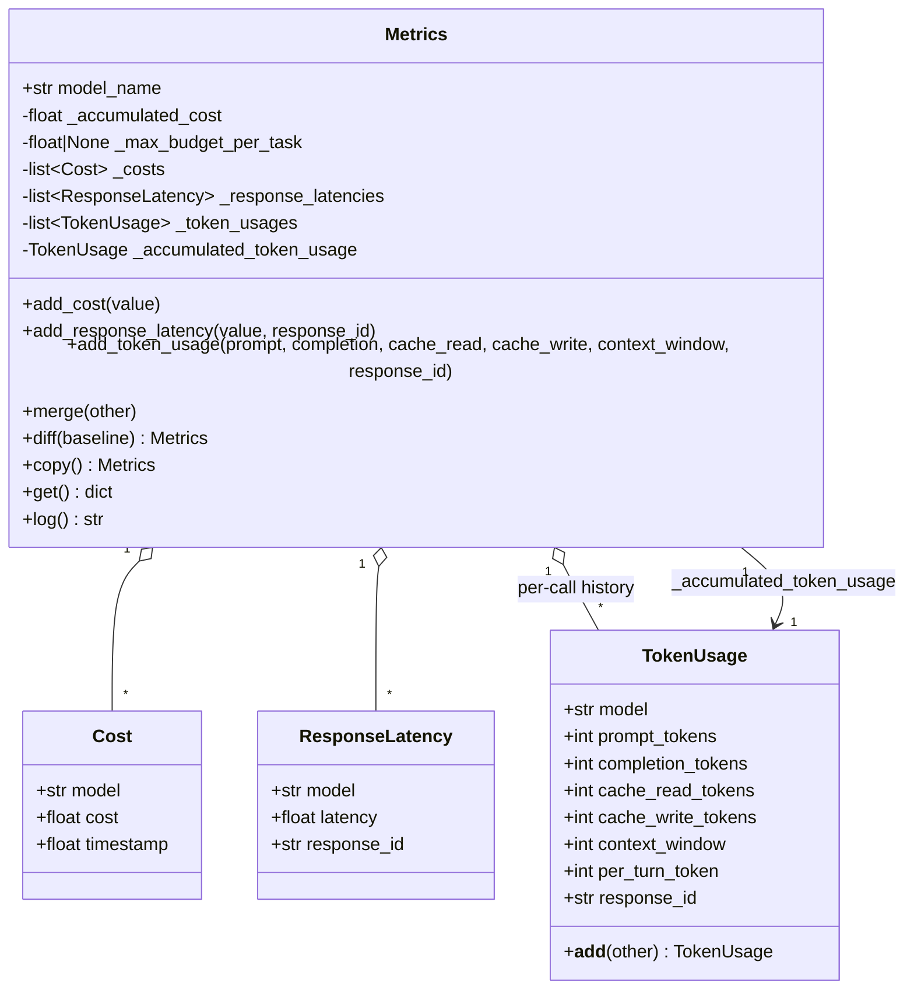

### 3.1 Two views of the same data

Every `Metrics` object keeps the same facts twice:

| View | Fields | Why |
| --- | --- | --- |
| **Rolling totals** | `_accumulated_cost`, `_accumulated_token_usage` | Cheap to read. This is what budget checks, the frontend and the CLI use. |
| **Per-call history** | `_costs`, `_token_usages`, `_response_latencies` | Needed to answer "what did *this* call cost?", to slice out a delegate's share (`diff`), and for offline analysis in benchmarks. |

The two views are updated together in `add_cost` and `add_token_usage`, so they never drift.
The history lists are **append-only** — nothing in the module ever removes or reorders an
entry. `diff` depends on that (see §7).

### 3.2 Why the private fields and `hasattr` guards

Almost every field is `_`-prefixed and exposed through a property. Two reasons:

1. **Validation.** `accumulated_cost` and `add_cost` reject negative values
   (`ValueError('Added cost cannot be negative.')`), so a provider returning a nonsense
   figure cannot silently reduce the running total.
2. **Pickle compatibility.** `Metrics` is a plain class, not a pydantic model, and it is
   persisted by `pickle` (see §9). When a new field is added, old pickles lack it. The
   getters for `response_latencies`, `token_usages` and `accumulated_token_usage` therefore
   do:

   ```python
   if not hasattr(self, '_token_usages'):
       self._token_usages = []
   return self._token_usages
   ```

   `merge` deliberately goes through those properties for exactly this reason — the source
   comment says *"use the property so older picked objects that lack the field won't crash"*.
   The direct `self._costs` / `self._accumulated_cost` accesses are safe because those
   fields have existed from the start.

### 3.3 `TokenUsage.__add__` — the odd field out

`TokenUsage` is both a *record* (one call) and an *accumulator* (all calls). Its `+`
operator encodes that dual role:

| Field | Combination rule | Reason |
| --- | --- | --- |
| `prompt_tokens`, `completion_tokens`, `cache_read_tokens`, `cache_write_tokens` | **sum** | Genuine running totals. |
| `context_window` | **max** | It is a *model capability*, not a quantity. Taking the max keeps the largest window seen (models can change mid-conversation via routing). |
| `per_turn_token` | **take `other`'s** | It is "how big was the *last* prompt+completion". The frontend divides it by `context_window` to draw the context-usage bar, so it must be the latest turn, not a sum. |
| `model`, `response_id` | **keep `self`'s** | The accumulator's identity wins; a per-call `response_id` is meaningless on a total. |

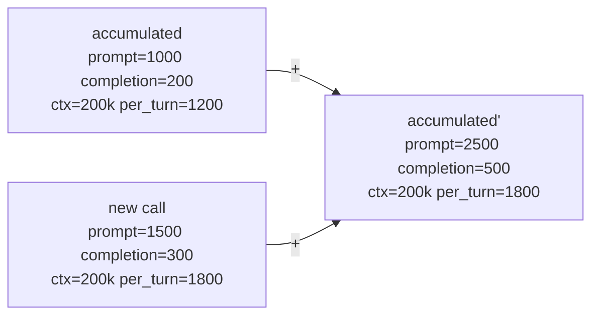

`per_turn_token` is never passed in by the caller — `add_token_usage` derives it as
`prompt_tokens + completion_tokens`.

## 4. The write path

Only the LLM clients write to a ledger. There are exactly three entry points, and they are
called from different places in
[llm_layer_clients_sync_core](llm_layer_clients_sync_core.md).

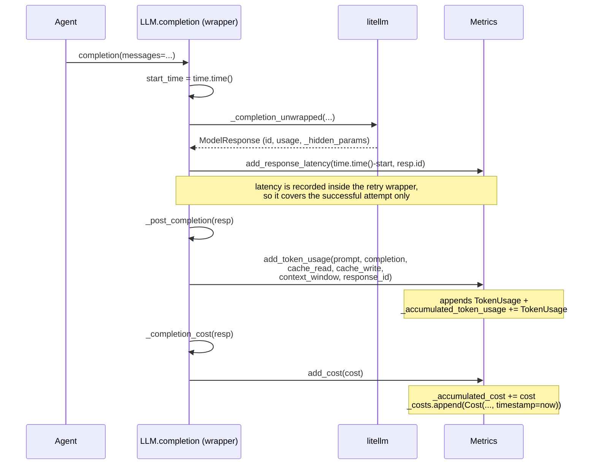

Where the inputs come from:

| Metrics input | Source in `LLM` |
| --- | --- |
| `prompt_tokens`, `completion_tokens` | `response['usage']` |
| `cache_read_tokens` | `usage.prompt_tokens_details.cached_tokens` |
| `cache_write_tokens` | `usage.model_extra['cache_creation_input_tokens']` (Anthropic-style prompt caching; see [llm_layer_clients_model_features](llm_layer_clients_model_features.md)) |
| `context_window` | `self.model_info['max_input_tokens']`, else `0` |
| `response_id` | `response.get('id', 'unknown')` — the join key used later by `message_utils` |
| `cost` | Proxy-reported `llm_provider-x-litellm-response-cost` header if present, else `litellm.completion_cost(...)`. `add_cost` is called *inside* `_completion_cost`. |

Notes that matter when reading the numbers:

- **Cost may be zero and still correct.** If the provider does not publish pricing, `LLM`
  sets `cost_metric_supported = False` and returns `0.0` forever after. Token counts keep
  working. A `$0.00` conversation is not proof that nothing ran.
- **`context_window` may be `0`** for models with no `model_info` entry. The frontend's
  usage bar guards against dividing by zero.
- **Streaming** (`StreamingLLM`, see [llm_layer_clients_async_streaming](llm_layer_clients_async_streaming.md))
  calls `_post_completion` per chunk, so a streamed response may produce several history
  entries rather than one.
- **`Metrics` has no `reset()`.** Once written, numbers only ever go up. `Agent.reset()`
  explicitly leaves them alone. To get "the numbers since X" you take a `copy()` and later
  `diff()` against it.

## 5. Who owns a ledger

This is the part most likely to confuse. There is **not** one `Metrics` object per
conversation. There is one per *LLM service*, plus derived and snapshot copies.

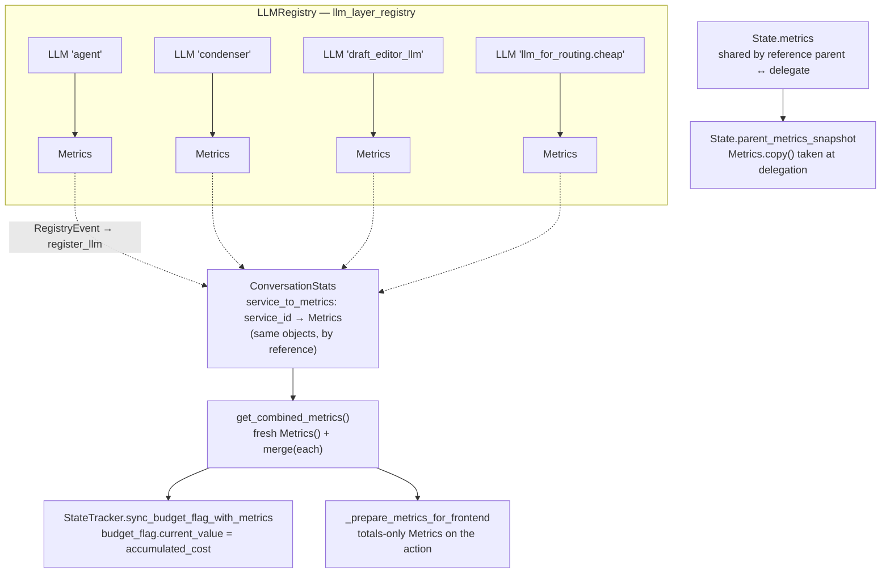

| Holder | Which object | Lifetime |
| --- | --- | --- |
| `LLM.metrics` | The live per-service ledger. A plain attribute, so an owner can rebind it. | Lives as long as the client. |
| `ConversationStats.service_to_metrics[service_id]` | **The same object** as `LLM.metrics` — aliased, not copied. Registered when `LLMRegistry` fires a `RegistryEvent`. | Whole conversation, across restarts (§9). |
| `ConversationStats.restored_metrics[service_id]` | A ledger read back from disk whose LLM has not been created yet this process. | Until the matching `register_llm` claims it. |
| `State.metrics` | A dataclass field, **shared by reference** between a parent controller and its delegates. See [agent_controller_state](agent_controller_state.md). | Whole task. |
| `State.parent_metrics_snapshot` | A `Metrics.copy()` (deep copy) frozen at the moment a delegate started. | Until the delegate ends. |
| `Event.llm_metrics` | A **stripped** `Metrics` carrying only totals, attached to outgoing actions. | Serialized into the event stream forever. |

### 5.1 Restore-then-accumulate

`ConversationStats.register_llm` is where a resumed conversation gets its history back:

```python
if service_id in self.restored_metrics:
    llm.metrics = self.restored_metrics[service_id].copy()
    del self.restored_metrics[service_id]
self.service_to_metrics[service_id] = llm.metrics
```

The restored ledger is transplanted **into the new client**, so later `add_cost` calls keep
counting on top of the old total instead of restarting at zero. The `del` guarantees the
same service is never counted twice.

### 5.2 Routing and the empty router ledger

`RouterLLM` subclasses `LLM`, so it has its own `Metrics` — but
`router_completion` ends with `return selected_llm.completion(...)`. All cost and tokens
therefore land on the **selected** client's ledger, and the router's own stays empty.
Aggregation is left to `get_combined_metrics()`. Details in
[llm_layer_routing](llm_layer_routing.md).

**Practical rule: never read `llm.metrics` to answer "what did this conversation cost".**
Read `ConversationStats.get_combined_metrics()`.

## 6. The four combinators

`Metrics` exposes four ways to relate two ledgers. Each answers a different question.

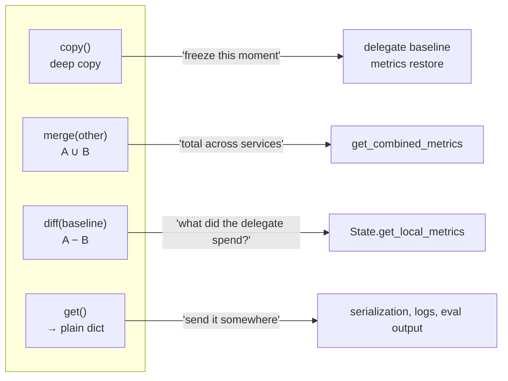

### 6.1 `merge(other)` — union

Used by `ConversationStats.get_combined_metrics()` to roll several services into one figure.

| Field | Rule |
| --- | --- |
| `_accumulated_cost` | `+=` |
| `_costs`, `token_usages`, `response_latencies` | list concatenation |
| `_accumulated_token_usage` | `TokenUsage.__add__` (sum, max-window, latest per-turn) |
| `_max_budget_per_task` | adopted from `other` **only if** this one is `None` |

Two consequences worth knowing:

- **Order matters for `per_turn_token`.** Merging is not commutative on that field: the
  last-merged service's per-turn value wins. Since `service_to_metrics` iteration order is
  dict insertion order, the context bar reflects whichever service merged last. This is
  benign in practice because non-agent services (title creation, condensers) are far
  smaller, but it is not a mathematically clean total.
- **Lists grow without bound.** A long conversation accumulates one `TokenUsage`,
  one `Cost` and one `ResponseLatency` per call, and `merge` concatenates all of them. This
  is exactly why the controller does not put a merged ledger on the wire (§8).

### 6.2 `diff(baseline)` — subtraction

Returns a *new* `Metrics` holding only what happened after `baseline` was snapshotted.

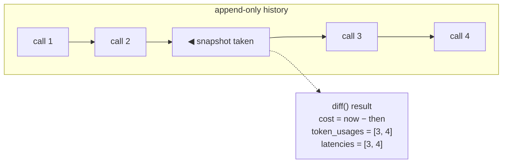

The three slicing rules differ, which is a real subtlety:

| Field | How the cut is made |
| --- | --- |
| `_accumulated_cost`, token totals | plain arithmetic subtraction |
| `_costs` | by **timestamp**: keep entries with `timestamp > baseline._costs[-1].timestamp`. If the baseline had no costs, keep everything. |
| `_response_latencies`, `_token_usages` | by **position**: `self._list[len(baseline._list):]` |
| `context_window` | current value, not a difference |
| `per_turn_token` | forced to `0` — a "difference of last turns" has no meaning |

Both rules assume the baseline is a genuine **prefix** of the current history. That holds
because history is append-only and the baseline is always a `copy()` of the same object.
Diffing two unrelated ledgers (or one that has been `merge`d in the meantime) will produce
nonsense, not an error.

## 7. Delegate accounting

`diff` exists for one primary caller: reporting what a sub-agent spent. The parent and the
delegate deliberately **share one `State.metrics` object**, so the global total stays whole;
the delegate's share is recovered by subtraction. See
[agent_controller_core](agent_controller_core.md) for the delegation machinery.

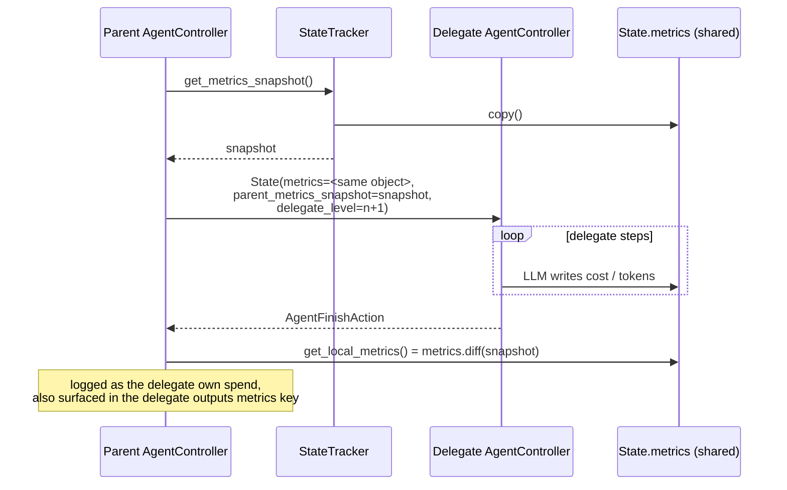

`State.get_local_step()` mirrors this for iteration counts using
`parent_iteration` — same idea, integers instead of a ledger.

## 8. Budget enforcement

The budget limit is **not** enforced by `Metrics`. `Metrics.max_budget_per_task` is only a
carried value; the actual stop is done by `BudgetControlFlag` in
[agent_controller_state](agent_controller_state.md).

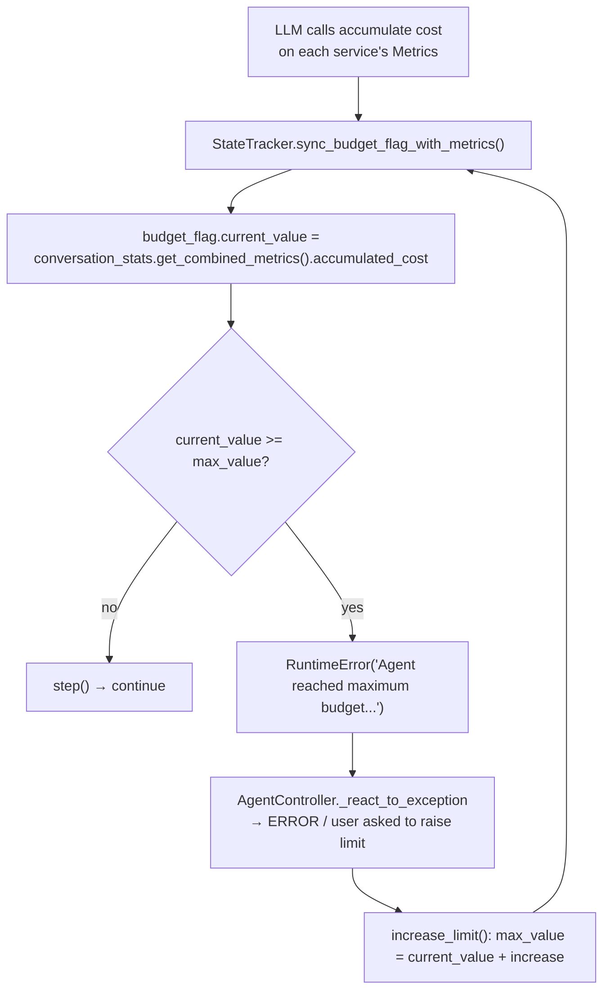

Two things follow:

- The budget is checked against the **combined** cost of *all* LLM services, not just the
  agent's. A costly condenser counts against the same allowance.
- `BudgetControlFlag` never increments itself (unlike `IterationControlFlag`); its
  `current_value` is always pushed in from the metrics ledger. The ledger is the source of
  truth, the flag is just the comparator.

## 9. Persistence and serialization

The same ledger travels three different ways, in three different encodings.

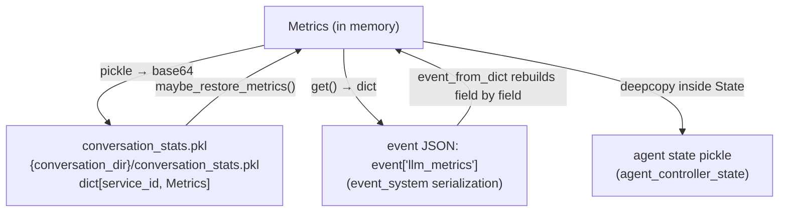

| Channel | Mechanism | Caveats |
| --- | --- | --- |
| `ConversationStats` | `base64(pickle(dict[service_id, Metrics]))` via the file store ([storage_backends](storage_backends.md)) | Pickle is why `Metrics` stays dependency-free and why the `hasattr` guards exist. `save_metrics` writes `restored_metrics` *plus* `service_to_metrics`, so services that never woke up this session are not lost. |
| Event stream | `event_to_dict` does `d['llm_metrics'] = d['llm_metrics'].get()`; `event_from_dict` rebuilds `Cost`, `ResponseLatency`, `TokenUsage` and `_accumulated_token_usage` by hand. | `Metrics` is not a pydantic model, hence the manual rebuild. `model_name` is **not** round-tripped — a rehydrated ledger reports `'default'`. |
| Agent state pickle | `Metrics` rides inside `State` | `State.save_to_session` nulls out `conversation_stats` before pickling (it persists itself) and restores the reference afterwards. |

`get()` is the canonical dict shape, and the contract every downstream consumer codes
against:

```python
{
  'accumulated_cost': float,
  'max_budget_per_task': float | None,
  'accumulated_token_usage': {...},   # TokenUsage.model_dump()
  'costs': [...],                     # Cost.model_dump()
  'response_latencies': [...],
  'token_usages': [...],
}
```

## 10. Reaching the user

### 10.1 Web UI

The controller does **not** put a full ledger on an action — history lists would bloat every
event in a long conversation. `AgentController._prepare_metrics_for_frontend` builds a
totals-only ledger instead:

```python
metrics = self.conversation_stats.get_combined_metrics()
clean_metrics = Metrics()
clean_metrics.accumulated_cost = metrics.accumulated_cost
clean_metrics._accumulated_token_usage = copy.deepcopy(metrics.accumulated_token_usage)
if self.state.budget_flag:
    clean_metrics.max_budget_per_task = self.state.budget_flag.max_value
action.llm_metrics = clean_metrics
```

Note `max_budget_per_task` on the wire comes from the **budget flag**, not from
`Metrics.max_budget_per_task` — the flag is the live limit, including any user increase.

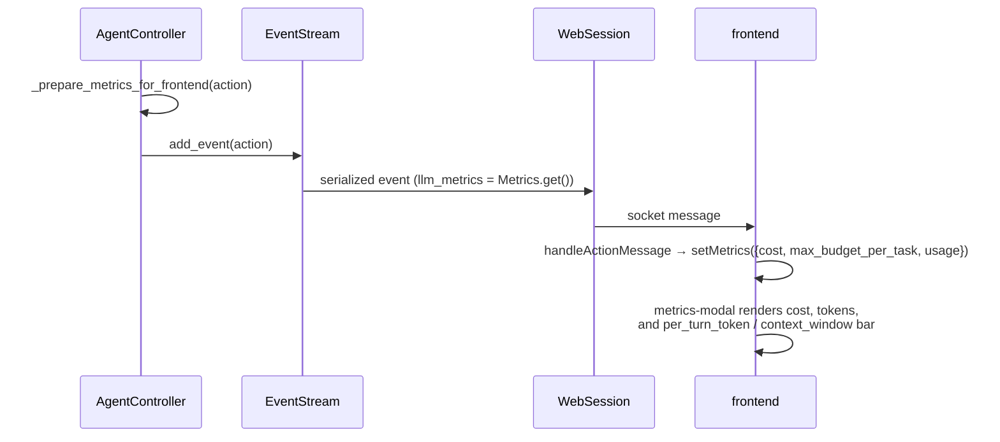

`MetricsState` in [frontend_state](frontend_state.md) holds only
`{cost, max_budget_per_task, usage}` and **overwrites** on every action — no client-side
accumulation, because the server already sends running totals. The context-usage bar is the
only consumer of `per_turn_token` and `context_window`, which explains their unusual
combination rules in §3.3.

### 10.2 CLI

`UsageMetrics` in [cli](cli.md) wraps a `Metrics` plus a session start time.
`update_usage_metrics` **replaces** the whole object whenever an event carries one — again
safe because the attached values are already totals. `display_usage_metrics` prints cost at
six decimal places and the four token counters, plus a derived
`prompt + completion` total.

### 10.3 Conversation list and evaluation

- `standalone_conversation_manager` copies `accumulated_cost` and the accumulated
  prompt/completion tokens off events into `ConversationMetadata`, so the conversation list
  can show spend without loading a ledger.
- `evaluation/utils/shared.py` prefers
  `state.conversation_stats.get_combined_metrics().get()` and falls back to
  `state.metrics.get()`, then writes the dict into `EvalOutput.metrics` → `output.jsonl`.
  The fallback path misses non-agent services' cost, which is why the `ConversationStats`
  route is tried first.

## 11. Invariants and gotchas

| Invariant | Why it matters |
| --- | --- |
| History lists are append-only, never reordered | `diff`'s positional slicing depends on it. |
| A `diff` baseline must be a `copy()` of the same ledger | Diffing unrelated ledgers silently yields garbage. |
| Costs and totals are updated together | Reading `accumulated_cost` never needs to re-sum `_costs`. |
| `add_cost` rejects negatives | A bad provider figure cannot lower the running total. |
| One ledger per `service_id`, aliased into `ConversationStats` | Mutating through `LLM.metrics` is immediately visible to budget checks. |
| No `reset()` anywhere | "Metrics since X" is always `copy()` + `diff()`. |

Common surprises:

- **`llm.metrics` is not the conversation total.** Use `get_combined_metrics()`.
- **A router's own metrics is empty.** The selected client holds the numbers.
- **`$0.00` may mean "pricing unknown"**, not "no calls".
- **`context_window == 0`** for models without a `model_info` entry.
- **`model_name` is lost** when a ledger is rebuilt from event JSON.
- **`merge` is not commutative on `per_turn_token`**; treat that field as "latest turn,
  roughly", not as an exact total.
- **`Metrics.max_budget_per_task` is not the enforcement point** — `BudgetControlFlag` is.

## 12. Extending the module

Adding a new measurement is mechanical, but touches several files:

1. **Add the field.** A new `TokenUsage` field, or a new record type next to `Cost` /
   `ResponseLatency` plus its list and property on `Metrics`.
2. **Guard the getter** with `hasattr` if it is a list or accumulator, so old pickles keep
   loading.
3. **Define combination.** Extend `TokenUsage.__add__` (sum? max? latest?), then handle the
   field in `merge` *and* `diff` — both must agree, or delegate reporting drifts from the
   totals.
4. **Write it.** Add the extraction in `LLM._post_completion`
   ([llm_layer_clients_sync_core](llm_layer_clients_sync_core.md)); remember `AsyncLLM` and
   `StreamingLLM` share that method.
5. **Expose it.** `get()` picks up pydantic fields automatically, but
   `event_from_dict`'s hand-written rebuild and the frontend's `MetricsState` /
   `metrics-modal` need explicit updates.
6. **Decide if it goes on the wire.** If it is a growing list, keep it out of
   `_prepare_metrics_for_frontend` — that function exists precisely to keep events small.

## Related modules

- [llm_layer.md](llm_layer.md) — the parent module: clients, registry, routing, metrics
- [llm_layer_clients_sync_core.md](llm_layer_clients_sync_core.md) — the only writer of the ledger
- [llm_layer_clients_async_streaming.md](llm_layer_clients_async_streaming.md) — per-chunk accounting
- [llm_layer_registry.md](llm_layer_registry.md) — one client (and one ledger) per `service_id`
- [llm_layer_routing.md](llm_layer_routing.md) — why the router's own ledger stays empty
- [agent_controller_state.md](agent_controller_state.md) — `State.metrics`, snapshots, `BudgetControlFlag`
- [agent_controller_core.md](agent_controller_core.md) — delegation and the frontend metrics strip
- [server_sessions.md](server_sessions.md) — `ConversationStats` persistence and combination
- [event_system.md](event_system.md) — how `llm_metrics` rides on events
- [frontend_state.md](frontend_state.md) — `MetricsState`
- [cli.md](cli.md) — `UsageMetrics` and the terminal summary
