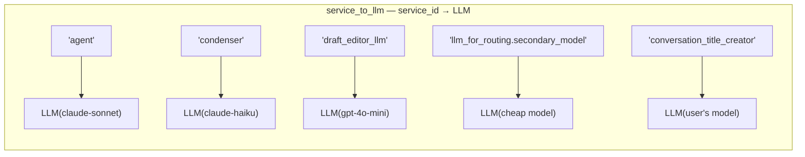
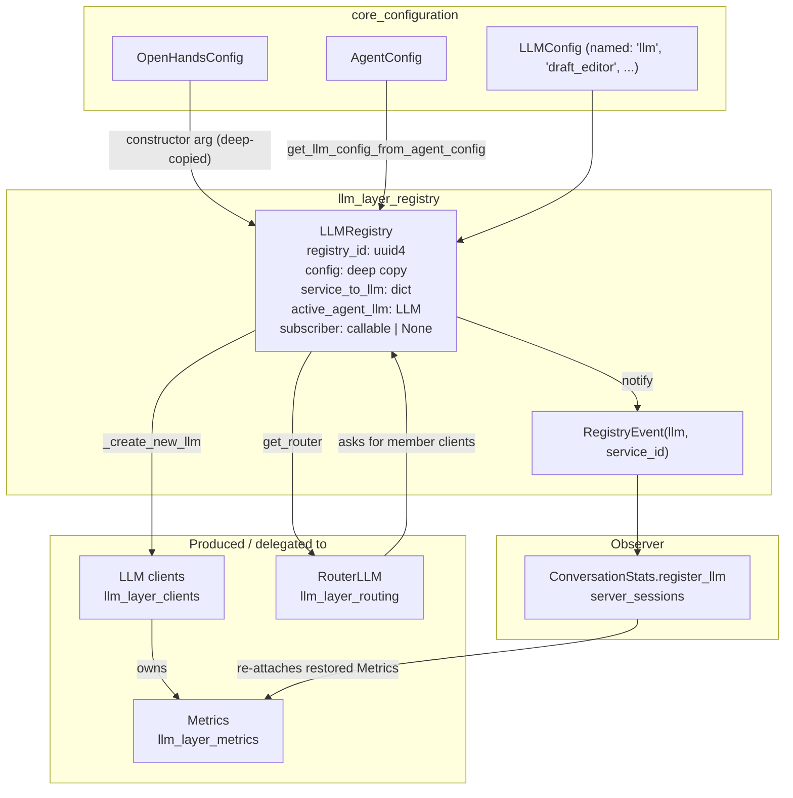
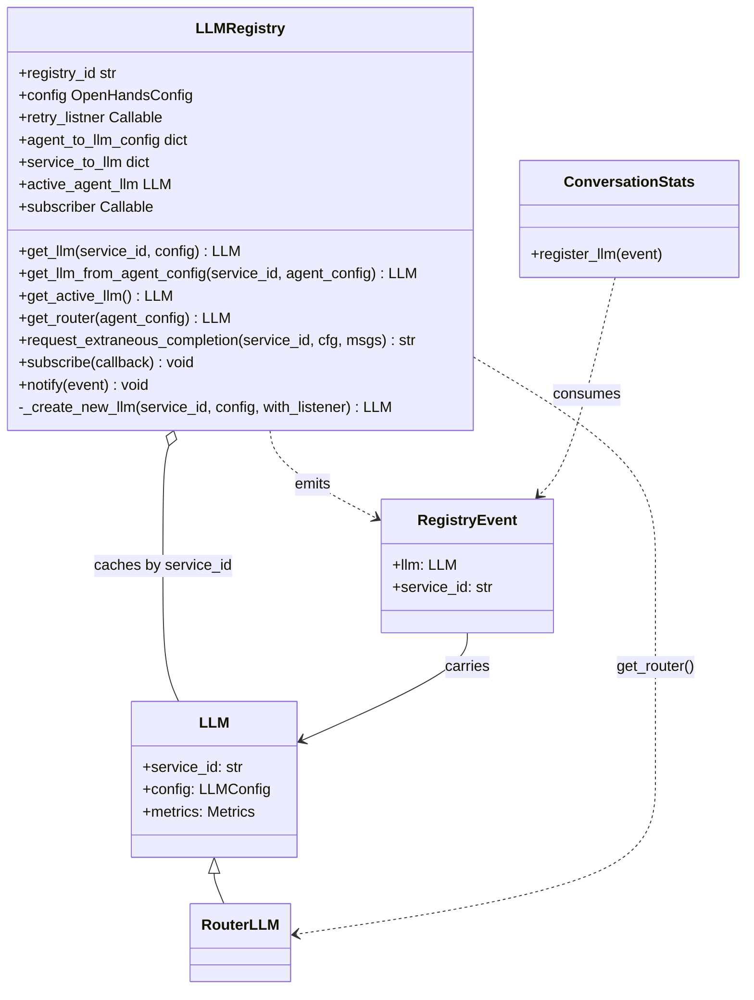
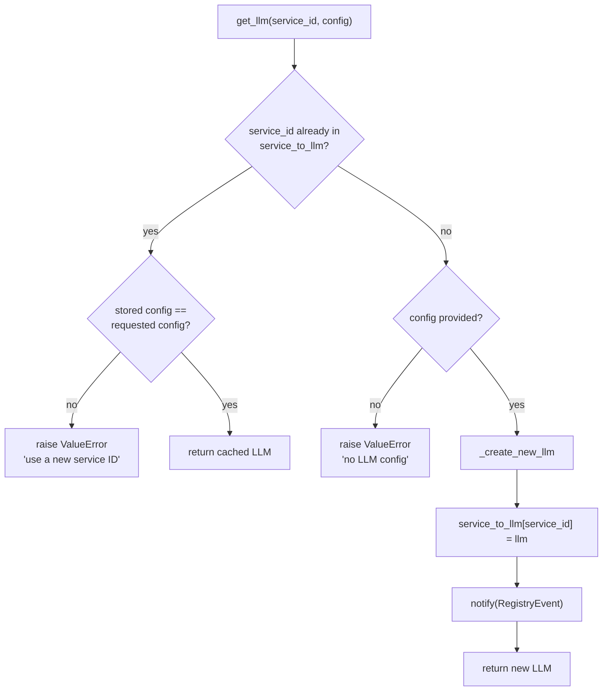
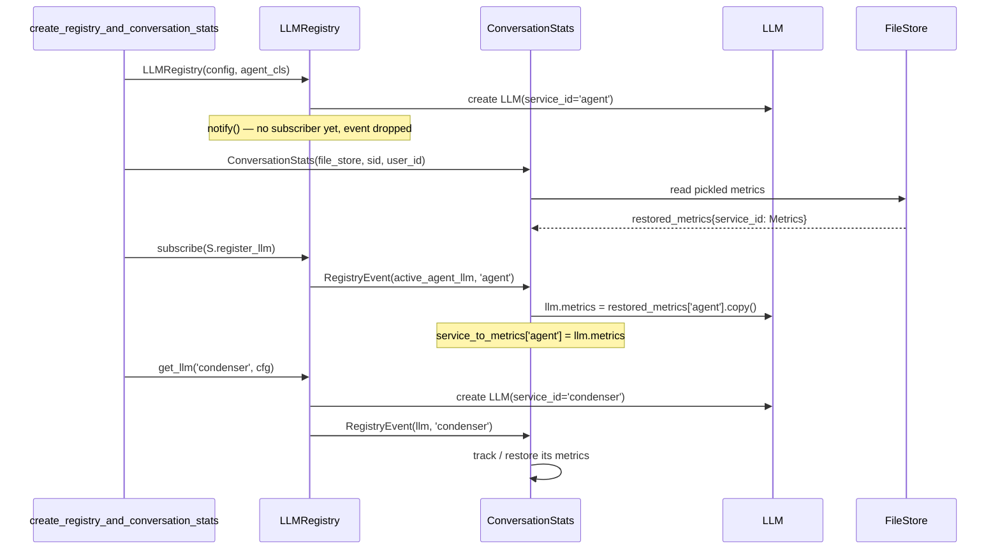
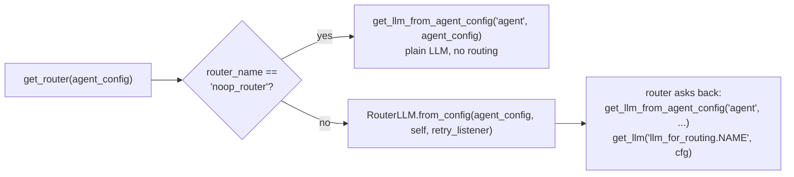
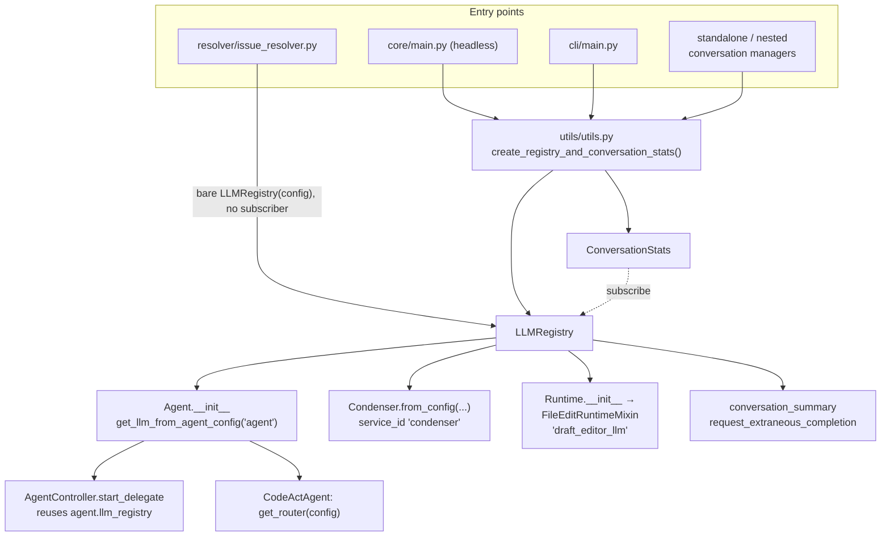

# LLM Layer — Registry

## 1. What this module is for

`LLMRegistry` is the **one place that hands out model clients**. Nothing in OpenHands
should build an `LLM` by hand. Instead a caller asks the registry:

> "Give me the client for `condenser`."

and gets back an `LLM` that already exists, or a new one that the registry then
remembers. This is a small module — one file, one class plus a tiny event model — but it
sits on the critical path of every conversation.

**Core components**

| Component | File | Role |
| --- | --- | --- |
| `LLMRegistry` | `openhands/llm/llm_registry.py` | Factory + cache + event source for `LLM` clients |
| `RegistryEvent` | `openhands/llm/llm_registry.py` | The tiny message (`llm`, `service_id`) sent when a client is born |

It solves four problems:

1. **De-duplication.** Two condensers in a pipeline should share one client, not open two.
2. **Cost accounting.** Cost lives on `LLM.metrics`. If clients were created ad-hoc, their
   numbers would be lost. One client per name keeps counters whole.
3. **Config resolution.** Callers hold an `AgentConfig`, not an `LLMConfig`. The registry
   does the lookup (`AgentConfig.llm_config` → named `LLMConfig`, falling back to `llm`).
4. **Observability.** Anything that wants to watch model usage subscribes once, instead of
   every call site remembering to report itself.

See [llm_layer.md](llm_layer.md) for how this fits with clients, routing and metrics.

## 2. The central idea: a service id

A **service id** is a short string naming the *logical caller*, not the model. It is the
key of `service_to_llm`.



Service ids actually used in the codebase:

| service id | Created by | Notes |
| --- | --- | --- |
| `agent` | `LLMRegistry.__init__`, `Agent.__init__`, `RouterLLM` | The main reasoning client. Every agent and delegate uses this id. |
| `condenser` | `LLMSummarizingCondenser`, `StructuredSummaryCondenser`, `LLMAttentionCondenser` | Shared by all LLM condensers ([memory_and_condensers](memory_and_condensers.md)) |
| `draft_editor_llm` | `FileEditRuntimeMixin` (`runtime/utils/edit.py`) | Only when `enable_llm_editor` is on ([runtime_utils](runtime_utils.md)) |
| `llm_for_routing.{config_name}` | `RouterLLM.__init__` | One per entry in `model_routing.llms_for_routing` ([llm_layer_routing](llm_layer_routing.md)) |
| `conversation_title_creator` | `utils/conversation_summary.py` | Via `request_extraneous_completion`, listener-free |
| `solvability_analysis` | `enterprise/.../github_solvability.py` | [enterprise_integrations](enterprise_integrations.md) |
| caller-supplied | conversation managers, for `request_llm_completion` | [server_sessions](server_sessions.md) |

**The hard rule.** Asking for an existing service id with a *different* `LLMConfig` raises
`ValueError`. Silently swapping models under a live cost counter would corrupt billing, so
the registry forces the caller to pick a new id instead. (`LLMConfig` is a pydantic model
with no custom `__eq__`, so the comparison is plain field-by-field equality.)

## 3. Architecture



### 3.1 Class shape



## 4. Lifecycle

### 4.1 Construction

`__init__` does more than store fields — it **eagerly creates the agent client**:

```python
self.registry_id = str(uuid4())            # for log correlation
self.config = copy.deepcopy(config)        # local edits never touch global config
self.agent_to_llm_config = self.config.get_agent_to_llm_config_map()
self.service_to_llm = {}
selected_agent_cls = agent_cls or self.config.default_agent
llm_config = self.config.get_llm_config_from_agent(selected_agent_cls or 'agent')
self.active_agent_llm = self.get_llm('agent', llm_config)   # <-- side effect
```

Two consequences worth knowing:

- The `'agent'` client exists **before** anyone can `subscribe()`. That is exactly why
  `subscribe()` replays an event for it (§4.3).
- `retry_listner` (note the spelling in the source) is normally `None` at this point.
  `WebSession` assigns it *after* the agent is built, so the main agent client has no retry
  listener while later clients do. Keep this in mind when a retry toast does not appear.

### 4.2 Getting a client



Note the order in `get_llm`: the mismatch check runs **before** the plain cache hit, so a
config change is always an error, never a silent reuse.

Three doors lead into this flow:

| Method | Caller has | Behaviour |
| --- | --- | --- |
| `get_llm(service_id, config)` | an `LLMConfig` | Strict. Config mismatch → `ValueError`. |
| `get_llm_from_agent_config(service_id, agent_config)` | an `AgentConfig` | Resolves the config first, then **tolerates** a mismatch (returns the cached client, `pass` + TODO). |
| `request_extraneous_completion(...)` | a one-off prompt | Creates without a retry listener if needed, calls `completion`, returns the stripped text. |

The asymmetry in row 2 is deliberate: `AgentController.start_delegate` passes the
delegate's `AgentConfig`, and delegates always use `service_id='agent'`. Raising there
would break delegation, so a delegate with its own `llm_config` currently **reuses the
parent's client**. That is the meaning of the `TODO: update llm config internally`.

### 4.3 Subscription and events

There is a **single** subscriber slot (`self.subscriber`), not a list — calling
`subscribe()` twice replaces the first callback.



Because `subscribe()` replays the agent event, cost accumulated before a browser refresh
is re-attached to the new client and a resumed conversation keeps its running total. See
[server_sessions](server_sessions.md) for the persistence side.

`notify()` wraps the callback in `try/except` and only logs a warning on failure — a bad
observer can never break model access.

### 4.4 Routing entry point

`get_router(agent_config)` is the seam between this module and
[llm_layer_routing](llm_layer_routing.md):



The router is itself an `LLM` subclass, so callers see one uniform object. Note the
router instance is created with `service_id='router_llm'` but is **not** inserted into
`service_to_llm` and is never notified — its own `Metrics` object is therefore invisible
to `ConversationStats`; the member clients it wraps are the ones that get tracked.

## 5. Who uses the registry



`create_registry_and_conversation_stats()` in `openhands/utils/utils.py` is the **only
correct way** to build a registry for a real conversation. It applies user settings to the
config, builds the registry, builds `ConversationStats`, and wires the subscription in the
right order. Paths that construct `LLMRegistry(config)` directly (`create_runtime`'s
fallback, `ServerConversation`, `IssueResolver`) get a working registry whose metrics
nobody records.

Threading, in words:

- **[agents](agents.md)** — `Agent.__init__(config, llm_registry)` stores the registry and
  immediately resolves `self.llm`. `CodeActAgent` then replaces it with `get_router(...)`
  and builds its condenser from the same registry.
- **[agent_controller](agent_controller.md)** — never imports the registry; it reaches it
  as `self.agent.llm_registry` when spawning a delegate, and reads cost through
  `ConversationStats.get_combined_metrics()`.
- **[memory_and_condensers](memory_and_condensers.md)** — `Condenser.from_config` takes the
  registry and passes it to every implementation; non-LLM condensers accept and ignore it,
  which keeps the factory uniform.
- **[runtime_implementations](runtime_implementations.md)** — every `Runtime` takes a
  registry as a required argument purely to forward it to the file-edit mixin.
- **[server_sessions](server_sessions.md)** — `WebSession` holds the registry, hands it to
  `AgentSession` and the agent, and sets `retry_listner` to push retry notices to the UI.
- **[hosted_saas_overlay](enterprise_server.md)** — SaaS conversation managers repeat the
  same create-subscribe-forward pattern.

## 6. Behaviour notes and sharp edges

| Topic | What actually happens |
| --- | --- |
| Config isolation | `__init__` deep-copies `OpenHandsConfig`, and `LLM.__init__` deep-copies `LLMConfig` again. Runtime fixups (e.g. `openhands/x` → `litellm_proxy/x`) stay local. |
| Config mutation after creation | `LLM` rewrites its own `config.model` in place, so a later `get_llm` with the original config can compare unequal and raise. Reuse the same config object per service id. |
| `get_active_llm()` | Public accessor for `active_agent_llm`. No production caller today; the field's real job is the replay inside `subscribe()`. |
| `agent_to_llm_config` | Built once at construction and never read inside this class. The controller obtains the same map straight from config. Effectively vestigial. |
| Shared `'condenser'` id | A `CondenserPipeline` containing two differently-configured LLM condensers will raise `ValueError` from `get_llm`. |
| `request_extraneous_completion` cache | Keyed on service id only, with no config check. If a user changes their model, a cached `conversation_title_creator` client keeps the old one for the session. |
| Failure isolation | `notify()` swallows subscriber exceptions (warning only). |
| Thread safety | No locking. `service_to_llm` is written from whatever task calls `get_llm`; safe in practice because creation happens during single-threaded setup. |
| Multiple registries | `registry_id` (a UUID) is logged on every `get_llm`, which is how you tell overlapping registries apart in logs. |

## 7. Related documentation

- [llm_layer.md](llm_layer.md) — the parent layer and its four pieces
- [llm_layer_clients.md](llm_layer_clients.md) — what an `LLM` does once you have one
- [llm_layer_routing.md](llm_layer_routing.md) — `RouterLLM`, reached via `get_router()`
- [llm_layer_metrics.md](llm_layer_metrics.md) — the `Metrics` objects observers collect
- [core_configuration.md](core_configuration.md) — `OpenHandsConfig`, `AgentConfig`, `LLMConfig`
- [server_sessions.md](server_sessions.md) — `ConversationStats`, the canonical subscriber
- [agents.md](agents.md) / [agent_controller.md](agent_controller.md) — the main consumers
