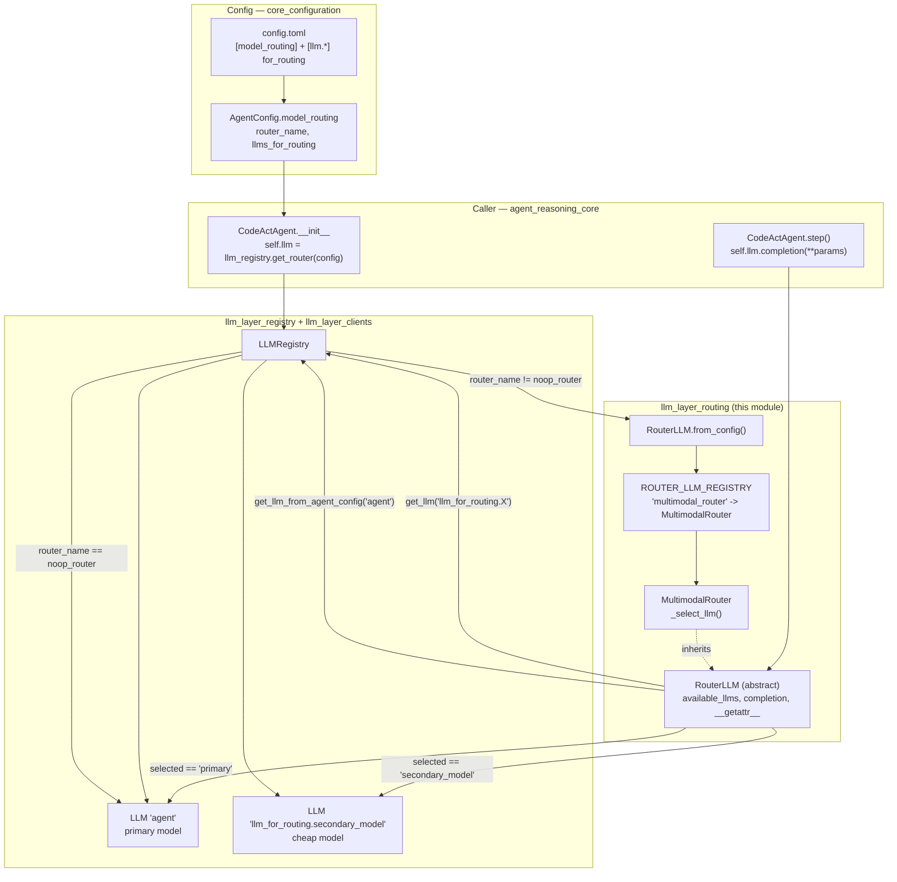
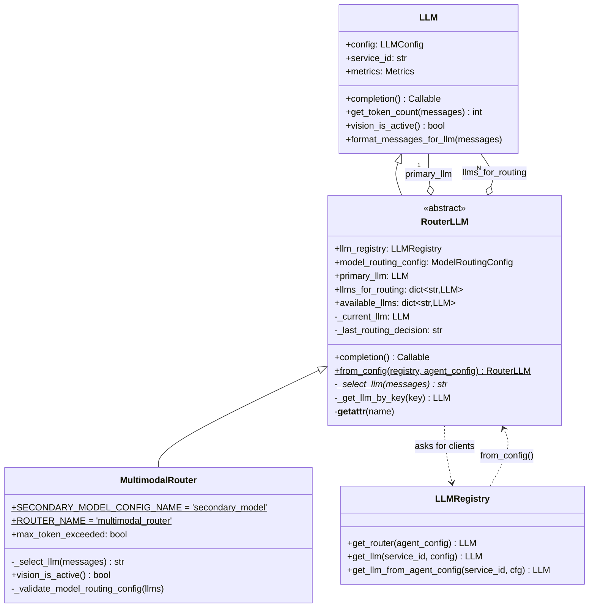
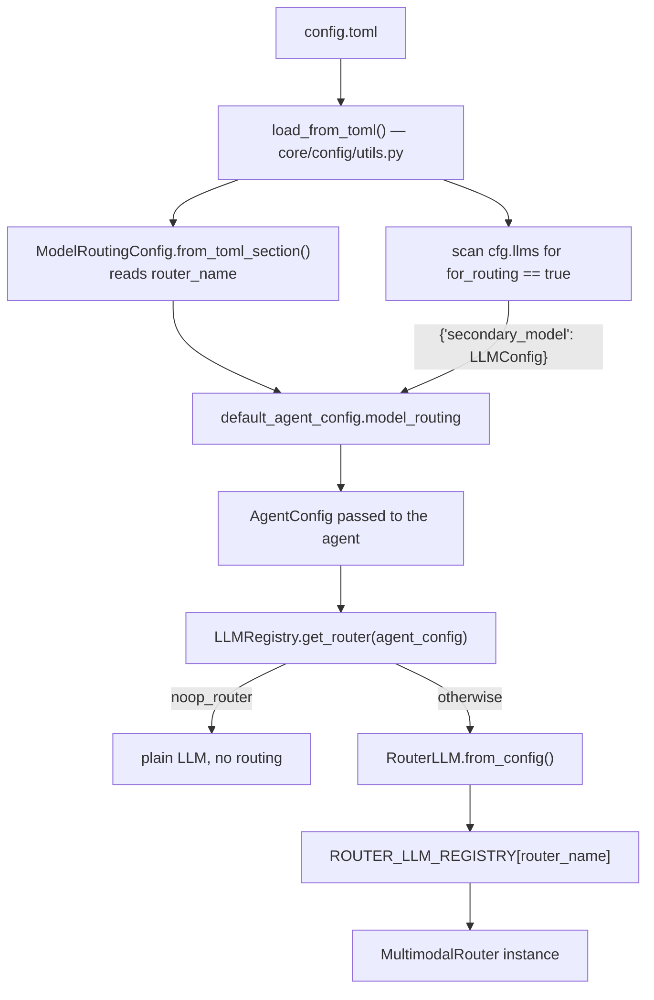
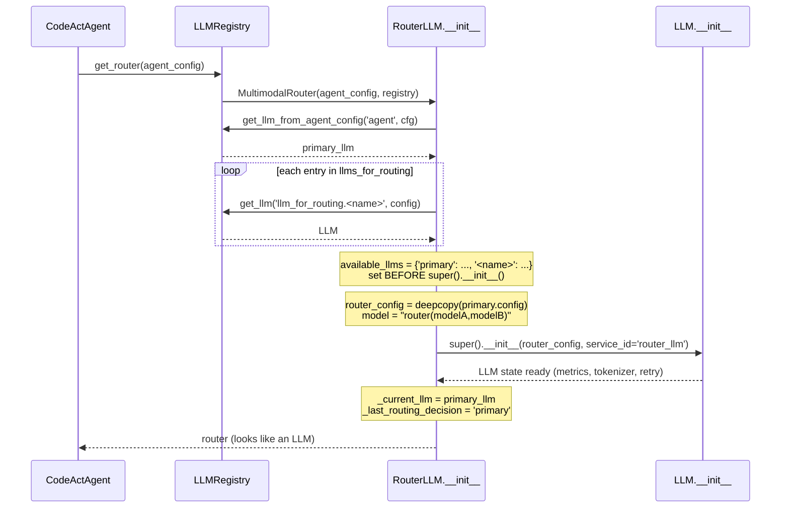
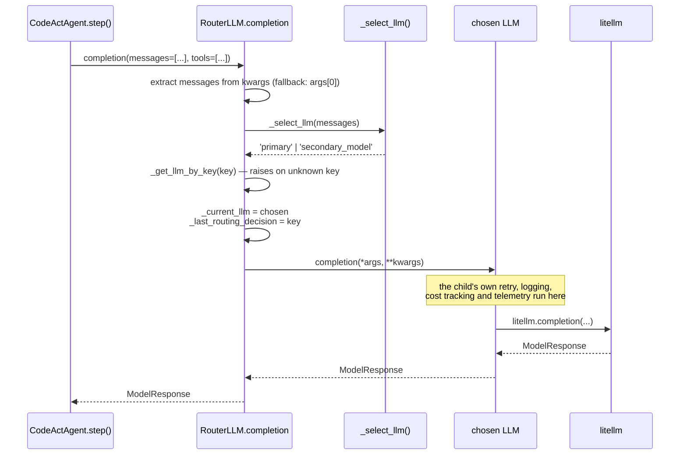
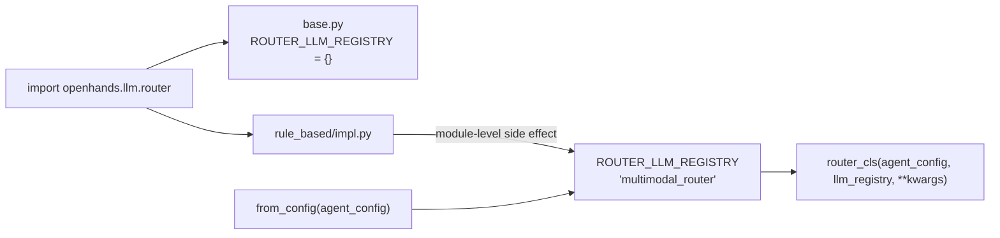
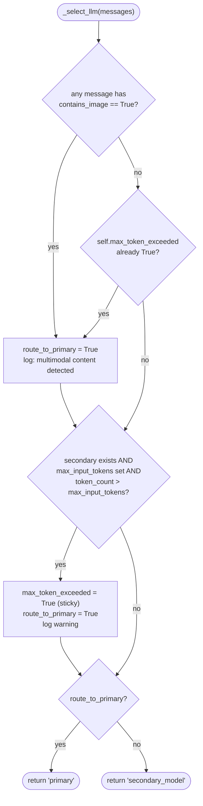
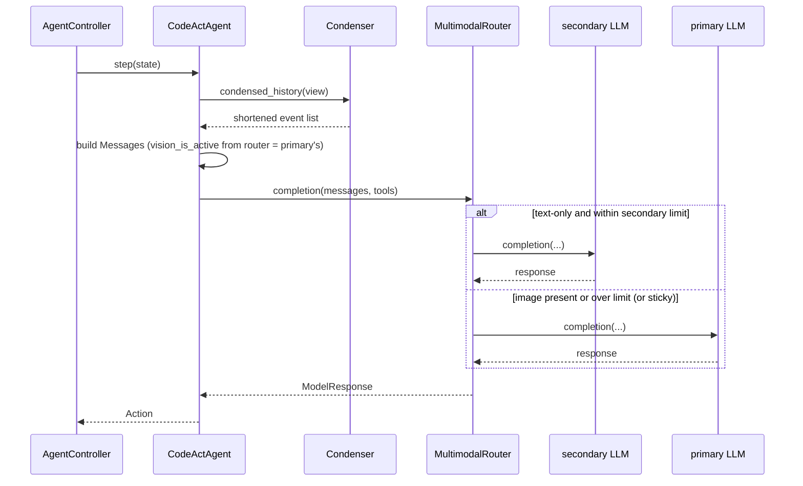
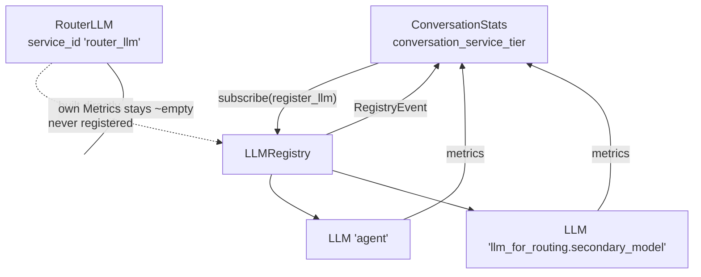

# LLM Layer — Routing

> **Status: experimental.** The router package ships with OpenHands but is off by default
> (`router_name = "noop_router"`). Expect the API to move.

## 1. What this module is for

Most conversations do not need the best model for every single turn. Reading a file,
running `ls`, checking a diff — a cheap text-only model can do that. But the moment the
agent looks at a screenshot, or the history grows past what the cheap model can hold, you
need the big model again.

**Model routing** is the piece that makes that choice, once per LLM call, without the
agent knowing anything about it.

The trick is simple: **a router *is* an `LLM`.** `RouterLLM` subclasses `LLM`, so
[CodeActAgent](agents_codeact_variants.md) just calls `self.llm.completion(...)` as
always. Underneath, the router picks one of several real clients and forwards the call.

**Core components**

| Component | File | Role |
| --- | --- | --- |
| `RouterLLM` | `openhands/llm/router/base.py` | Abstract base. Holds many `LLM`s, presents one. Intercepts `completion`. |
| `ROUTER_LLM_REGISTRY` | `openhands/llm/router/base.py` | `str -> RouterLLM subclass` name table used by the factory |
| `RouterLLM.from_config` | `openhands/llm/router/base.py` | Factory: config name → concrete router instance |
| `MultimodalRouter` | `openhands/llm/router/rule_based/impl.py` | The one shipped rule-based policy: images / context overflow → primary |

Supporting pieces from other modules:

| Piece | Where | Why it matters here |
| --- | --- | --- |
| `LLMRegistry.get_router()` | [llm_layer_registry](llm_layer_registry.md) | The only entry point; also decides "no routing at all" |
| `LLM` | [llm_layer_clients_sync_core](llm_layer_clients_sync_core.md) | Base class *and* the thing being routed to |
| `ModelRoutingConfig` / `LLMConfig.for_routing` | [core_configuration](core_configuration.md) | How a user turns routing on |
| `Message.contains_image` | [core_schema_and_runtime_support](core_schema_and_runtime_support.md) | The signal `MultimodalRouter` reads |

See [llm_layer](llm_layer.md) for how routing sits next to clients, the registry and
metrics.

## 2. Architecture



Two things to read off this picture:

1. The router **never builds an `LLM` itself**. It asks `LLMRegistry`, so every routed
   model is a normal registered service with its own cached instance and its own metrics.
2. `noop_router` never reaches this module at all. `LLMRegistry.get_router()` short-circuits
   and returns the plain agent `LLM`. So "routing off" costs nothing.

### 2.1 Class relationships



The inheritance line `LLM <|-- RouterLLM` is the whole design. It means a router can be
dropped anywhere an `LLM` is expected — agent, condenser, anything — with no call-site
change.

## 3. Configuration

Routing is driven entirely by `config.toml`. Nothing in code needs editing to turn it on.

```toml
# The primary (expensive, multimodal) model
[llm]
model = "claude-sonnet-4"
api_key = "your-api-key"

# A secondary (cheap, text-only) model. The name after `llm.` becomes the routing key.
[llm.secondary_model]
model = "kimi-k2"
api_key = "your-api-key"
max_input_tokens = 120000   # used by MultimodalRouter's overflow check
for_routing = true          # <- this flag is what makes it a routing candidate

[model_routing]
router_name = "multimodal_router"
```

How that becomes a live router:



| Setting | Meaning |
| --- | --- |
| `[model_routing].router_name` | Key into `ROUTER_LLM_REGISTRY`. Default `noop_router` (routing off). |
| `[llm.<name>].for_routing` | Marks an `LLMConfig` as a routing candidate. `<name>` is the routing key. |
| `[llm.<name>].max_input_tokens` | `MultimodalRouter` uses the **secondary** model's value as the overflow threshold. Leave it unset and the overflow check is skipped. |

Two config traps worth knowing:

- The routing key must be **exactly** `secondary_model` for `MultimodalRouter`. Any other
  name and `_validate_model_routing_config` raises `ValueError` at construction time —
  loud and early, which is the intent.
- Only the **default agent config** gets the `model_routing` section. Per-agent
  `[agent.SomeAgent]` sections do not currently carry their own routing setup.

## 4. `RouterLLM` — the base class

### 4.1 Construction

The constructor does five things, in an order that matters:



Key points:

- **`available_llms` is populated before `super().__init__()`.** This is not style — it is
  required. `RouterLLM.__getattr__` falls back to `self._current_llm`, and any attribute
  miss during the parent constructor would try to read `_current_llm`, which does not exist
  yet, and recurse. Setting the children first keeps that path safe.
- **The router's own config is a deep copy of the primary's**, with only `model` rewritten
  to `router(claude-sonnet-4,kimi-k2)`. Everything else — `max_input_tokens`, caching
  flags, temperature, `max_message_chars` — is the **primary model's** values. See
  §7 for what that implies.
- The router registers itself under `service_id='router_llm'`, but it is built directly
  rather than through `LLMRegistry._create_new_llm`, so it is **not** in
  `service_to_llm` and never fires a `RegistryEvent`.

### 4.2 The `completion` interception

`LLM.completion` is a property returning a callable. `RouterLLM` overrides that property
and returns its own closure:



Because the router delegates the *whole* call, all the machinery in
[llm_layer_clients_mixins](llm_layer_clients_mixins.md) — retries, prompt/response
logging — and the cost accounting in [llm_layer_metrics](llm_layer_metrics.md) belong to
the **child** client, not the router. The router adds only the choice.

### 4.3 Attribute delegation and its edge

```python
def __getattr__(self, name):
    return getattr(self._current_llm, name)
```

Python calls `__getattr__` **only when normal lookup fails**. Since `RouterLLM` inherits
from `LLM`, almost nothing fails. So the delegation is narrower than it looks:

| Access | Resolves to |
| --- | --- |
| `router.config` | The **router's own** config (copy of primary, `model="router(...)"`) |
| `router.metrics` | The **router's own** `Metrics` — stays near-empty; real numbers live on children |
| `router.get_token_count(...)` | `LLM` method bound to the **router**, i.e. primary's tokenizer |
| `router.completion` | The overridden property — routes |
| `router.vision_is_active()` | On `MultimodalRouter`, explicitly the **primary's** answer |
| Something only a subclass of `LLM` defines (e.g. `AsyncLLM.async_completion`) | Delegated to `_current_llm` |

Practical consequence: **only `completion` is truly routed.** Async and streaming paths
(`AsyncLLM`, `StreamingLLM` — see
[llm_layer_clients_async_streaming](llm_layer_clients_async_streaming.md)) are not
intercepted, and everything the agent reads off `self.llm.config` reflects the primary
model.

### 4.4 The factory and the name table

```python
ROUTER_LLM_REGISTRY: dict[str, type['RouterLLM']] = {}
```

A plain module-level dict. Concrete routers self-register at import time — the last line
of `rule_based/impl.py` is:

```python
ROUTER_LLM_REGISTRY[MultimodalRouter.ROUTER_NAME] = MultimodalRouter
```

`openhands/llm/router/__init__.py` imports `MultimodalRouter`, which is what makes the
registration happen. `RouterLLM.from_config` then does a dict lookup on
`agent_config.model_routing.router_name` and raises a clear `ValueError` if the name is
unknown.



## 5. `MultimodalRouter` — the shipped policy

One concrete rule set. It answers a single question per call: *can the cheap model handle
this?*



Three rules, in words:

1. **Images go to the primary model.** The secondary is assumed text-only. Checked per
   call over every message in the list.
2. **Context overflow goes to the primary model.** Token count is measured with the
   *secondary's* own tokenizer (`secondary_llm.get_token_count(messages)`) against the
   secondary's `max_input_tokens`. If `max_input_tokens` is unset, this check is skipped
   entirely.
3. **Overflow is sticky.** Once `max_token_exceeded` flips to `True`, it never resets.
   Every later call goes to the primary model, even if a condenser shrinks history back
   down.

### 5.1 Why sticky?

Conversation history mostly grows. Flapping between models mid-conversation would wreck
prompt caching on both sides and make cost unpredictable. So the router treats "we
outgrew the cheap model" as a one-way door. It is a deliberate simplification, not an
oversight — but it does mean a single large observation early on pins the whole rest of
the conversation to the expensive model. If that matters, pair routing with an aggressive
condenser from [memory_and_condensers](memory_and_condensers.md).

Note also that the token check runs *even when* the image rule already chose primary —
so an image-heavy turn that is also long will set the sticky flag as a side effect.

### 5.2 Interaction with condensers



The condenser runs **before** the router sees anything, so the router always judges the
already-condensed message list. The two features compose: the condenser controls *how
big*, the router controls *which model*.

### 5.3 `vision_is_active` override

```python
def vision_is_active(self):
    return self.primary_llm.vision_is_active()
```

The agent asks this once per step to decide whether to attach images to messages
(`conversation_memory.process_events(vision_is_active=self.llm.vision_is_active())`).
Answering from the primary means images are always produced — which is exactly right,
because producing an image is also what *causes* the router to pick the primary model. If
this returned the secondary's answer, images would be stripped and the routing rule would
never fire.

## 6. Metrics and cost

Cost tracking works, but not on the object you might expect.



- Each child was created through `LLMRegistry`, so it fired a `RegistryEvent` and
  `ConversationStats.register_llm` is holding a reference to its `Metrics`.
- Every `completion` runs `_post_completion` on the **child**, so cost, tokens and latency
  land in the child's `Metrics`.
- `get_combined_metrics()` therefore sums primary + secondary correctly, and you can read
  them apart with `get_metrics_for_service('agent')` vs
  `get_metrics_for_service('llm_for_routing.secondary_model')` — which is the number you
  actually want when evaluating whether routing saved money.
- The router's own `Metrics` object exists (created by `LLM.__init__` with
  `model_name='router(...)'`) but nothing writes to it. Do not read it.

See [llm_layer_metrics](llm_layer_metrics.md) for the `Metrics` shape and
[server_sessions](server_sessions.md) for how stats are persisted.

## 7. Known sharp edges

Collected in one place, because most of them come from the same root cause: the router
borrows the primary model's config.

| Edge | Effect | Where it bites |
| --- | --- | --- |
| `config` is the primary's copy | `max_input_tokens`, `max_message_chars`, caching and temperature applied to a secondary-bound call are the **primary's** | Message truncation in `ConversationMemory`; `check_tools(self.tools, self.llm.config)` |
| `config.model` is `"router(a,b)"` | Any code matching on model name sees a synthetic string | `CodeActAgent`'s short-tool-description substring check; log lines; `init_model_info()` on a non-existent model |
| Only `completion` is routed | Async / streaming calls bypass routing and hit `_current_llm` (initially primary) | [llm_layer_clients_async_streaming](llm_layer_clients_async_streaming.md) consumers |
| Router is not in the registry | `service_to_llm['router_llm']` is absent; router metrics are dead | Anything looking up the router by service id |
| `max_token_exceeded` is one-way | Cost stays high after a single overflow | Long sessions with a strong condenser |
| Routing key hardcoded to `secondary_model` | Renaming the `[llm.*]` section breaks startup | Config authoring |
| Only the default agent config carries `model_routing` | Delegates and per-agent sections do not get their own policy | Multi-agent setups ([agents](agents.md)) |

## 8. Writing a new router

The extension surface is deliberately tiny — subclass, implement one method, register.

```python
# openhands/llm/router/rule_based/cheap_first.py
from openhands.core.config import AgentConfig
from openhands.core.message import Message
from openhands.llm.llm_registry import LLMRegistry
from openhands.llm.router.base import ROUTER_LLM_REGISTRY, RouterLLM


class CheapFirstRouter(RouterLLM):
    ROUTER_NAME = 'cheap_first_router'
    DRAFT = 'draft_model'

    def __init__(self, agent_config: AgentConfig, llm_registry: LLMRegistry, **kwargs):
        super().__init__(agent_config, llm_registry, **kwargs)
        if self.DRAFT not in self.llms_for_routing:
            raise ValueError(f'Missing routing LLM config: {self.DRAFT}')
        self.turns = 0

    def _select_llm(self, messages: list[Message]) -> str:
        self.turns += 1
        # First few turns are usually orientation — use the cheap model.
        return self.DRAFT if self.turns <= 3 else 'primary'


ROUTER_LLM_REGISTRY[CheapFirstRouter.ROUTER_NAME] = CheapFirstRouter
```

Checklist:

1. **Subclass `RouterLLM`** and implement `_select_llm(messages) -> str`. Return a key from
   `self.available_llms` — `'primary'` or a config name. An unknown key raises in
   `_get_llm_by_key`.
2. **Validate config in `__init__`, after `super().__init__()`.** Fail loudly at
   construction, not at the first completion.
3. **Set your own state after `super().__init__()`**, and never read a not-yet-assigned
   attribute inside the constructor — `__getattr__` will send it to `_current_llm`.
4. **Register the class** in `ROUTER_LLM_REGISTRY` at module level, and make sure the
   module is imported (add it to `openhands/llm/router/__init__.py`).
5. **Keep `_select_llm` cheap and side-effect-light.** It runs on every completion, in the
   hot path. `get_token_count` is the most expensive thing `MultimodalRouter` does; avoid
   anything heavier, and never make a network call here.
6. **Override `vision_is_active()`** if your candidate models differ in vision support, so
   the agent builds messages the routed model can accept.

## 9. Related documentation

| Topic | Document |
| --- | --- |
| The layer as a whole | [llm_layer](llm_layer.md) |
| Where routers get their clients | [llm_layer_registry](llm_layer_registry.md) |
| The `LLM` base class being subclassed | [llm_layer_clients_sync_core](llm_layer_clients_sync_core.md) |
| Async / streaming clients (not routed) | [llm_layer_clients_async_streaming](llm_layer_clients_async_streaming.md) |
| Retry and debug behaviour on the child call | [llm_layer_clients_mixins](llm_layer_clients_mixins.md) |
| Model capability detection | [llm_layer_clients_model_features](llm_layer_clients_model_features.md) |
| Cost and token accounting | [llm_layer_metrics](llm_layer_metrics.md) |
| The main consumer of `get_router()` | [agents_codeact_variants](agents_codeact_variants.md) |
| History shrinking, which pairs with routing | [memory_and_condensers](memory_and_condensers.md) |
| `ModelRoutingConfig`, `LLMConfig.for_routing` | [core_configuration](core_configuration.md) |
| `Message` and `contains_image` | [core_schema_and_runtime_support](core_schema_and_runtime_support.md) |
| Per-service metric reporting to the UI | [server_sessions](server_sessions.md) |
