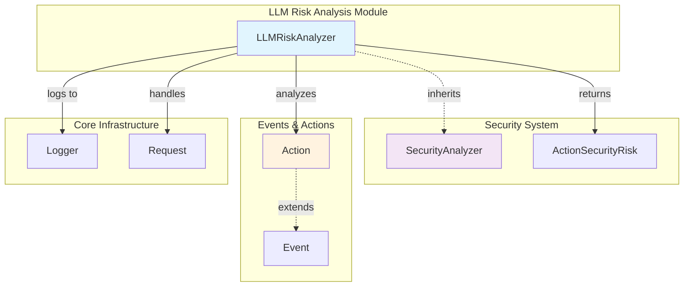
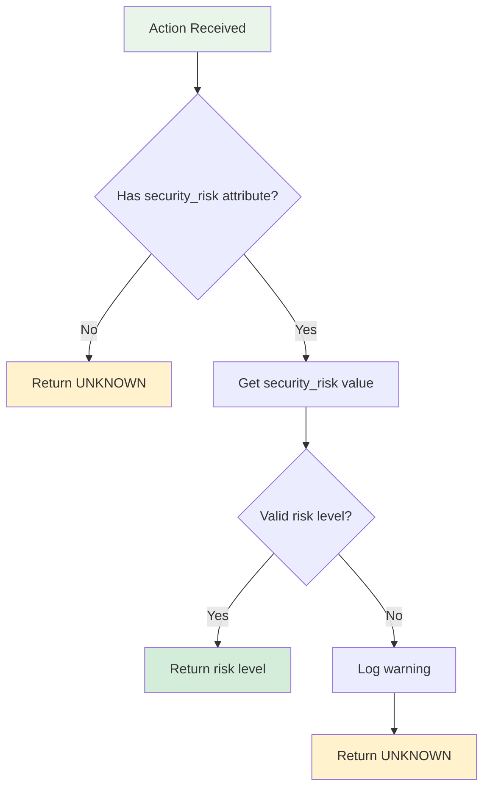
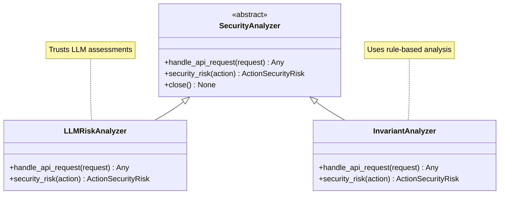
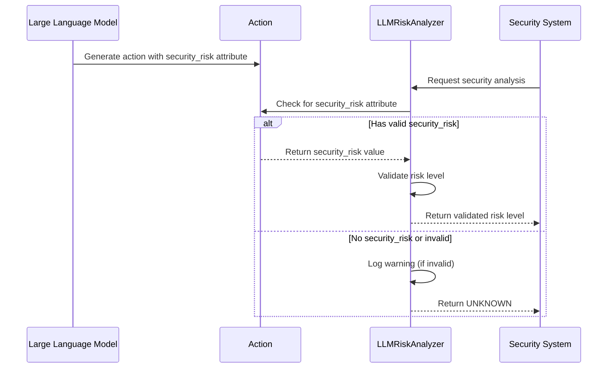

# LLM Risk Analysis Module

## Overview

The LLM Risk Analysis module provides a specialized security analyzer that leverages Large Language Model (LLM) assessments to evaluate the security risks of agent actions. This module is part of the broader [security_system](security_system.md) and implements a trust-based approach where the LLM's own risk assessments are respected and utilized for security decision-making.

## Core Purpose

The module serves as a bridge between AI-driven risk assessment and the OpenHands security framework, allowing the system to:

- **Trust LLM Judgments**: Respect security risk assessments provided directly by the LLM
- **Fallback Handling**: Provide appropriate defaults when LLM assessments are unavailable
- **Integration Point**: Seamlessly integrate with the broader security analysis pipeline
- **API Compatibility**: Maintain compatibility with the security analyzer interface

## Architecture



## Component Details

### LLMRiskAnalyzer

The `LLMRiskAnalyzer` is the core component that implements the `SecurityAnalyzer` interface with LLM-specific logic.

#### Key Responsibilities

1. **LLM Risk Assessment Processing**: Extracts and validates security risk assessments from LLM-generated actions
2. **Risk Level Validation**: Ensures risk levels conform to the `ActionSecurityRisk` enumeration
3. **Fallback Logic**: Provides `UNKNOWN` risk level when assessments are unavailable or invalid
4. **API Request Handling**: Implements the required API interface for security analyzers

#### Risk Assessment Flow



## Integration with Security System

The module integrates with the broader security system through several key relationships:

### Security Analyzer Hierarchy



### Risk Level Enumeration

The module utilizes the `ActionSecurityRisk` enumeration to standardize risk assessments:

- **UNKNOWN (-1)**: Default when no assessment is available or invalid
- **LOW (0)**: Minimal security risk
- **MEDIUM (1)**: Moderate security risk requiring attention
- **HIGH (2)**: Significant security risk requiring immediate action

## Data Flow



## API Interface

### Security Risk Assessment

```python
async def security_risk(self, action: Action) -> ActionSecurityRisk
```

**Purpose**: Evaluates an action for security risks based on LLM assessments

**Parameters**:
- `action`: The action to analyze for security risks

**Returns**: `ActionSecurityRisk` enumeration value

**Logic**:
1. Check if action has `security_risk` attribute
2. Validate the risk level against known values
3. Return the risk level or `UNKNOWN` with appropriate logging

### API Request Handling

```python
async def handle_api_request(self, request: Request) -> Any
```

**Purpose**: Handles incoming API requests for the security analyzer

**Parameters**:
- `request`: FastAPI request object

**Returns**: Status response indicating successful handling

## Error Handling and Logging

The module implements robust error handling:

### Warning Scenarios
- **Unrecognized Risk Values**: When an action contains a `security_risk` attribute with an invalid value
- **Attribute Validation**: Ensures type safety and value validation

### Logging Strategy
```python
logger.warning(f'Unrecognized security_risk value: {security_risk}')
```

The module uses the OpenHands logger to track:
- Invalid security risk values
- Unexpected attribute states
- Processing anomalies

## Dependencies

### Internal Dependencies
- **[security_system](security_system.md)**: Base `SecurityAnalyzer` class
- **[events_and_actions](events_and_actions.md)**: `Action` and `ActionSecurityRisk` types
- **Core Infrastructure**: Logging and request handling utilities

### External Dependencies
- **FastAPI**: For request handling interface
- **Python Standard Library**: Enum and typing support

## Usage Patterns

### Basic Implementation
```python
from openhands.security.llm.analyzer import LLMRiskAnalyzer

# Initialize the analyzer
analyzer = LLMRiskAnalyzer()

# Analyze an action
risk_level = await analyzer.security_risk(action)

# Handle API requests
response = await analyzer.handle_api_request(request)
```

### Integration with Security Pipeline
The analyzer is typically used as part of a broader security analysis pipeline where multiple analyzers may be chained or used in parallel to provide comprehensive security assessment.

## Configuration and Deployment

The module requires no specific configuration and can be deployed as part of the broader OpenHands security system. It automatically integrates with:

- **Logging System**: Uses the standard OpenHands logger
- **Security Framework**: Implements the required `SecurityAnalyzer` interface
- **Action Processing**: Works with any `Action` object in the system

## Future Considerations

### Potential Enhancements
1. **Confidence Scoring**: Add confidence levels to LLM assessments
2. **Risk Reasoning**: Capture and log the reasoning behind risk assessments
3. **Threshold Configuration**: Allow customizable risk thresholds
4. **Audit Trail**: Enhanced logging for security audit purposes

### Scalability Considerations
- The module is designed to be stateless and can handle concurrent requests
- Memory footprint is minimal as it doesn't maintain persistent state
- Performance is primarily dependent on the underlying action processing pipeline

## Related Documentation

- **[security_system](security_system.md)**: Overall security architecture and analyzer framework
- **[events_and_actions](events_and_actions.md)**: Action types and event system
- **[core_agent_system](core_agent_system.md)**: Agent architecture and action processing
- **[llm_integration](llm_integration.md)**: LLM system integration and interfaces