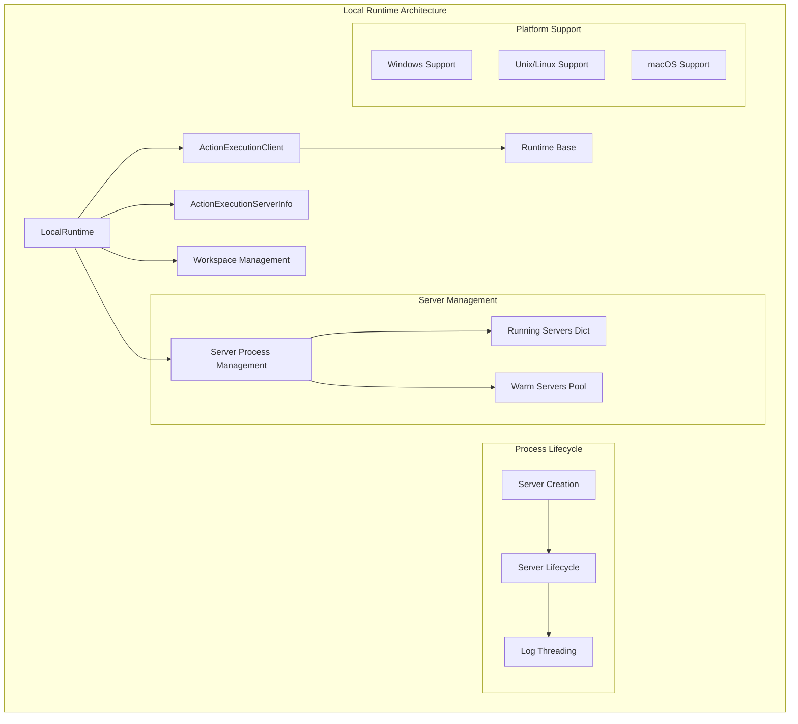
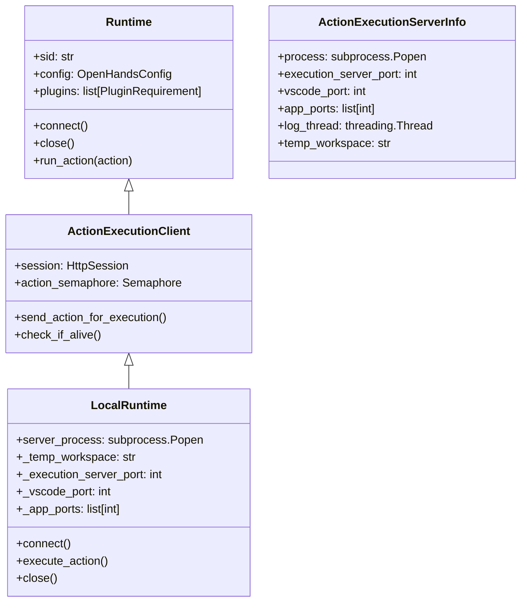
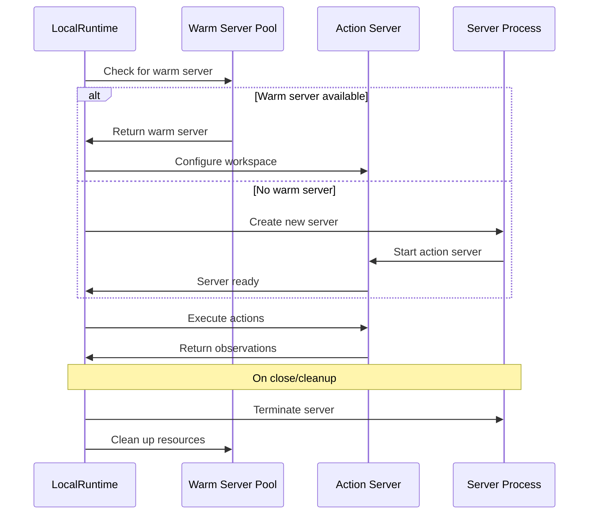
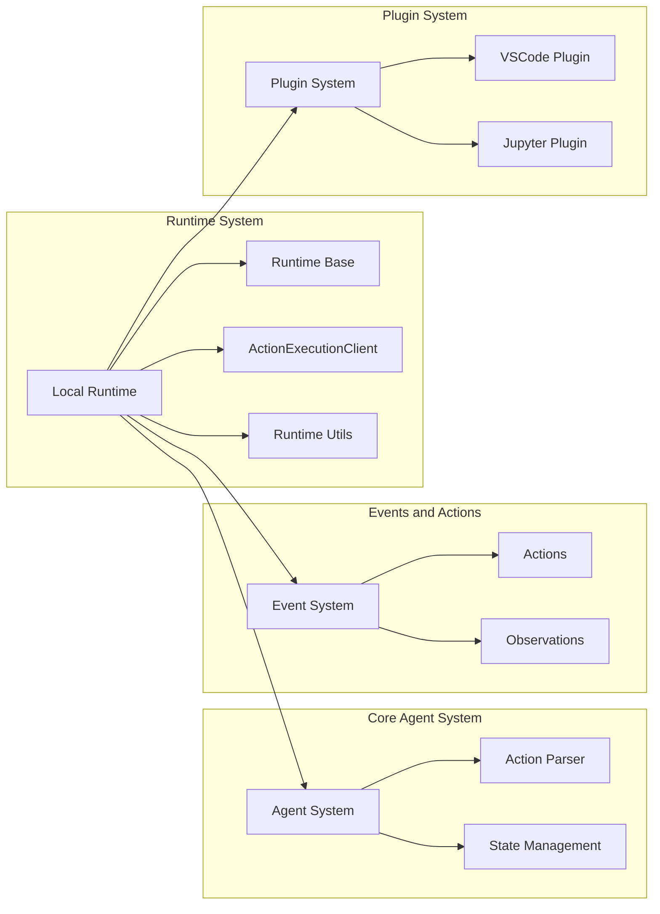
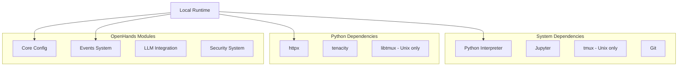
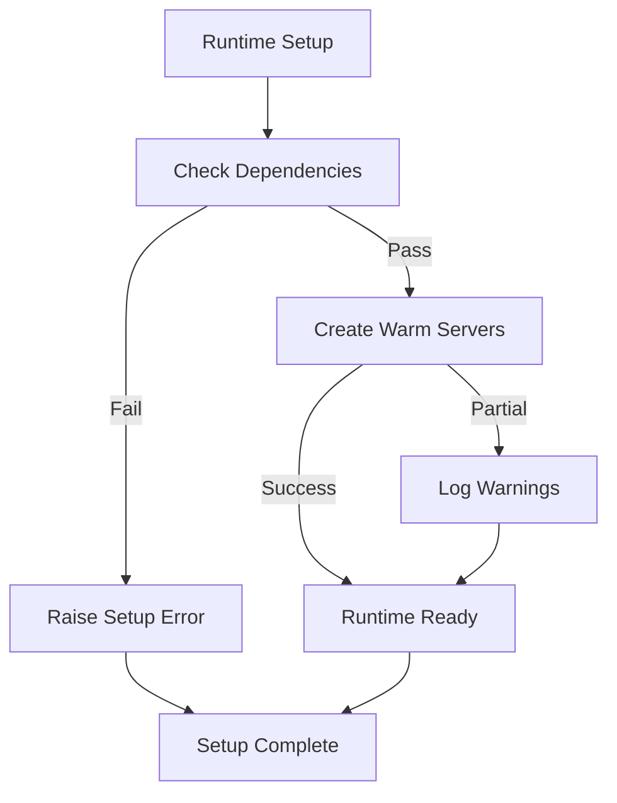
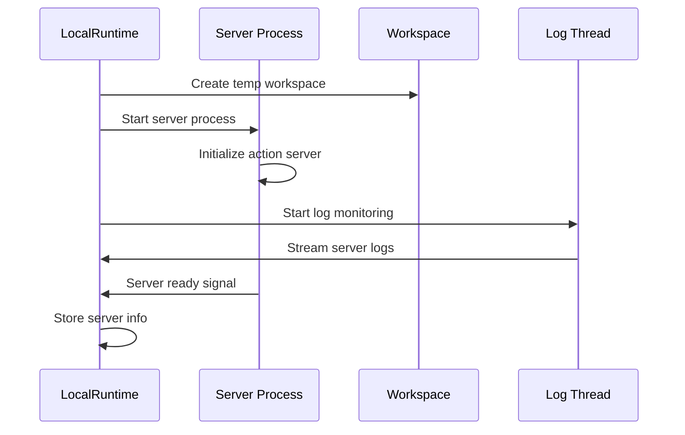
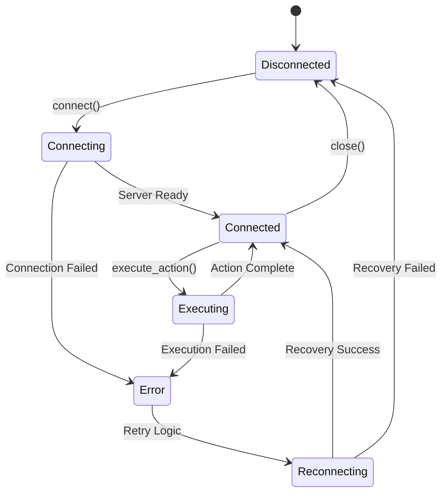
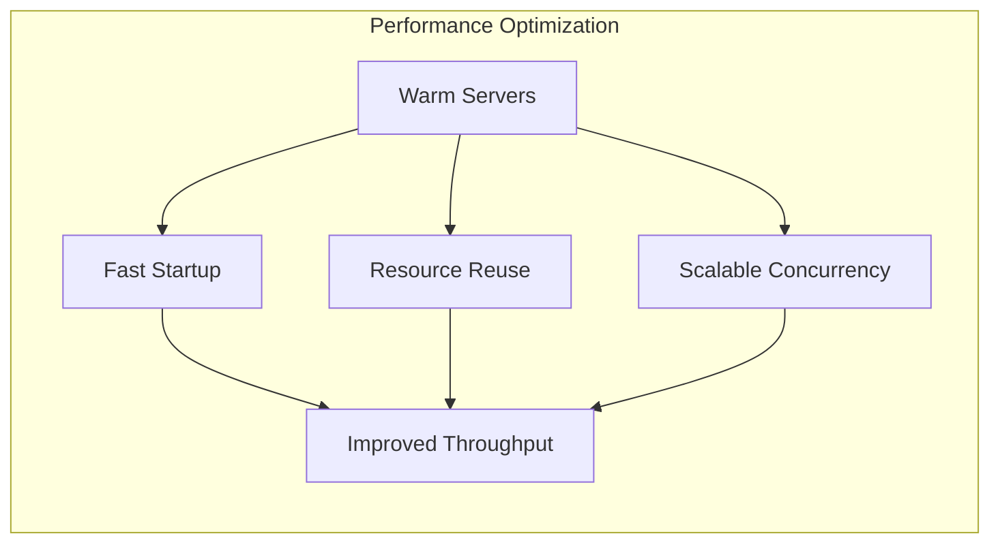

# Local Runtime Module

## Overview

The Local Runtime module provides a development-focused runtime implementation that executes the action execution server directly on the local machine without containerization. This runtime is designed for development environments where Docker may not be available or desired, offering direct access to the host system while maintaining the OpenHands runtime interface.

**Key Features:**
- Direct local execution without Docker containers
- Cross-platform support (Windows, macOS, Linux) with platform-specific adaptations
- Warm server pooling for improved performance
- Session-based server management
- Integration with local development tools (VSCode, tmux)
- Workspace isolation through temporary directories

**Warning:** This runtime provides **NO SANDBOX ISOLATION** and should only be used in controlled development environments.

## Architecture

### Core Components



### Class Hierarchy



## Core Functionality

### Server Management

The Local Runtime implements a sophisticated server management system:

#### Global Server Tracking
- **Running Servers**: Dictionary mapping session IDs to active server processes
- **Warm Servers**: Pool of pre-initialized servers for faster startup
- **Session Isolation**: Each conversation gets its own server instance

#### Server Lifecycle



### Workspace Management

#### Workspace Isolation
- **Temporary Workspaces**: Created per session when no base path specified
- **Mounted Workspaces**: Use existing directories when `workspace_base` configured
- **Cross-Platform Paths**: Handles Windows and Unix path differences

#### Directory Structure
```
workspace/
├── .openhands/
│   ├── microagents/
│   ├── setup.sh
│   └── pre-commit.sh
├── project_files/
└── temp_session_data/
```

### Platform-Specific Adaptations

#### Windows Support
- **PowerShell Integration**: Uses PowerShell for environment variable management
- **Limited tmux**: Warns about tmux limitations on Windows
- **Path Handling**: Adapts to Windows path conventions
- **User ID Handling**: Uses default values for Windows compatibility

#### Unix/Linux Support
- **tmux Integration**: Full terminal multiplexer support
- **Bash Environment**: Native bash shell integration
- **User Management**: Proper UID/username handling
- **Git Configuration**: Full git integration support

## Dependencies and Integration

### Runtime System Integration



### External Dependencies



## Configuration and Setup

### Environment Variables

| Variable | Description | Default |
|----------|-------------|---------|
| `INITIAL_NUM_WARM_SERVERS` | Number of warm servers to create on startup | `0` |
| `DESIRED_NUM_WARM_SERVERS` | Target number of warm servers to maintain | `0` |
| `SKIP_DEPENDENCY_CHECK` | Skip dependency validation | `false` |
| `LOCAL_RUNTIME_MODE` | Enable local runtime mode | `1` |
| `VSCODE_PORT` | VSCode server port | Auto-assigned |
| `SESSION_API_KEY` | API key for session authentication | None |

### Dependency Requirements

#### Required Dependencies
- **Python**: Compatible Python interpreter
- **Jupyter**: For IPython cell execution
- **Git**: For repository operations
- **httpx**: For HTTP client operations
- **tenacity**: For retry logic

#### Platform-Specific Dependencies
- **Unix/Linux**: `tmux`, `libtmux`
- **Windows**: PowerShell (built-in)

### Setup Process



## Process Management

### Server Creation Process



### Warm Server Management

The runtime maintains a pool of pre-initialized servers for improved performance:

#### Warm Server Lifecycle
1. **Creation**: Servers created during setup or after action execution
2. **Pooling**: Stored in global `_WARM_SERVERS` list
3. **Assignment**: Assigned to new sessions on demand
4. **Cleanup**: Terminated when no active sessions remain

#### Benefits
- **Faster Startup**: Eliminates server initialization time
- **Resource Efficiency**: Reuses initialized processes
- **Scalability**: Maintains desired server count automatically

## Error Handling and Recovery

### Connection Management



### Error Types and Handling

| Error Type | Cause | Recovery Strategy |
|------------|-------|------------------|
| `AgentRuntimeDisconnectedError` | Server process died | Restart server process |
| `RuntimeError` | Server startup failure | Clean up and retry |
| `TimeoutError` | Action execution timeout | Cancel action, maintain connection |
| `PermissionError` | File system access denied | Convert to ErrorObservation |
| `NetworkError` | HTTP communication failure | Retry with exponential backoff |

## Security Considerations

### Sandbox Limitations

**⚠️ CRITICAL WARNING**: Local Runtime provides **NO SANDBOXING**

- **Direct Host Access**: Actions execute directly on the host system
- **File System Access**: Full access to user's file system
- **Network Access**: Unrestricted network connectivity
- **Process Execution**: Can execute arbitrary system commands

### Recommended Usage

- **Development Only**: Use only in controlled development environments
- **Trusted Code**: Only execute trusted agent code
- **Isolated Environment**: Consider using virtual machines or containers
- **Regular Backups**: Maintain backups of important data

### Security Analyzer Integration

The runtime integrates with the [Security System](security_system.md) when configured:

```python
# Security analyzer initialization
if self.config.security.security_analyzer:
    analyzer_cls = options.SecurityAnalyzers.get(
        self.config.security.security_analyzer, SecurityAnalyzer
    )
    self.security_analyzer = analyzer_cls()
```

## Performance Optimization

### Warm Server Strategy



### Resource Management

- **Memory Efficiency**: Reuses server processes
- **CPU Optimization**: Minimizes process creation overhead
- **I/O Optimization**: Streams logs asynchronously
- **Network Efficiency**: Maintains persistent HTTP connections

## Integration Examples

### Basic Usage

```python
from openhands.runtime.impl.local.local_runtime import LocalRuntime
from openhands.core.config import OpenHandsConfig

# Initialize runtime
config = OpenHandsConfig()
runtime = LocalRuntime(
    config=config,
    event_stream=event_stream,
    llm_registry=llm_registry,
    sid='development-session'
)

# Connect and execute
await runtime.connect()
observation = await runtime.execute_action(action)
runtime.close()
```

### With Warm Servers

```python
import os

# Configure warm servers
os.environ['INITIAL_NUM_WARM_SERVERS'] = '2'
os.environ['DESIRED_NUM_WARM_SERVERS'] = '3'

# Setup runtime class
LocalRuntime.setup(config, headless_mode=False)

# Create runtime instances - will use warm servers
runtime = LocalRuntime(config, event_stream, llm_registry)
```

## Related Documentation

- **[Runtime System](runtime_system.md)**: Overall runtime architecture and base classes
- **[CLI Runtime](cli_runtime.md)**: Command-line interface runtime implementation  
- **[Kubernetes Runtime](kubernetes_runtime.md)**: Container orchestration runtime
- **[Core Agent System](core_agent_system.md)**: Agent execution and control
- **[Events and Actions](events_and_actions.md)**: Event-driven action execution
- **[Plugin System](plugin_system.md)**: Runtime plugin architecture
- **[Security System](security_system.md)**: Security analysis and protection

## Troubleshooting

### Common Issues

1. **Dependency Missing**: Ensure all required dependencies are installed
2. **Port Conflicts**: Check for port availability in configured ranges
3. **Permission Errors**: Verify file system permissions
4. **Process Cleanup**: Ensure proper server process termination
5. **Windows Limitations**: Some features require WSL or alternative solutions

### Debug Configuration

```python
# Enable debug logging
import logging
logging.getLogger('openhands.runtime.impl.local').setLevel(logging.DEBUG)

# Skip dependency checks for testing
os.environ['SKIP_DEPENDENCY_CHECK'] = '1'
```

### Monitoring

- **Server Logs**: Monitor action execution server output
- **Process Status**: Check server process health
- **Resource Usage**: Monitor memory and CPU consumption
- **Connection Status**: Verify HTTP client connectivity