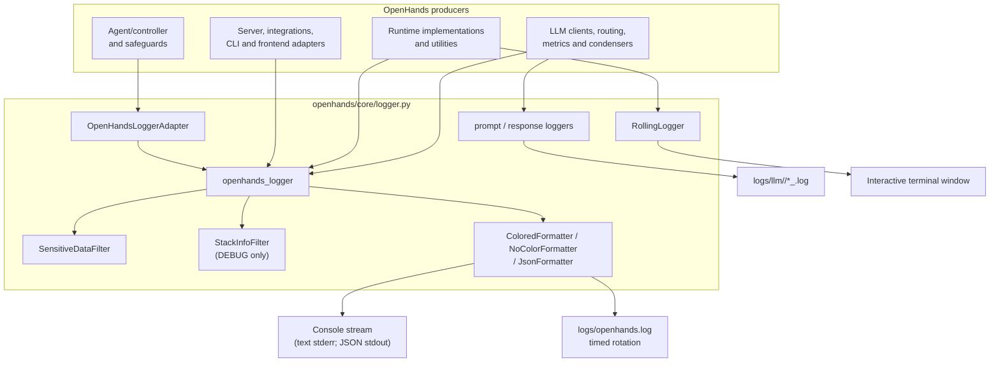
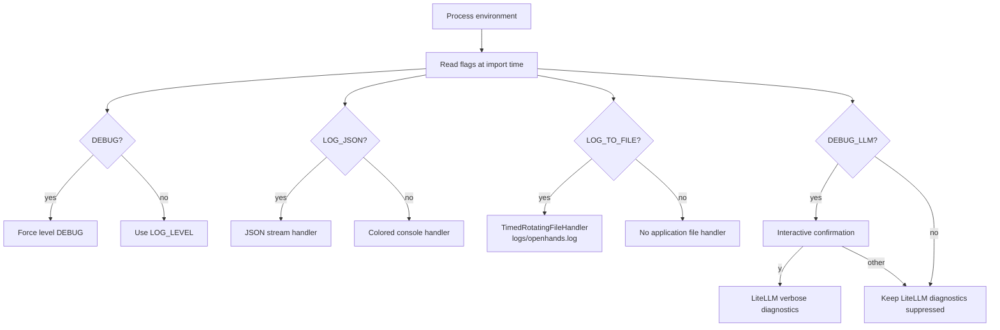
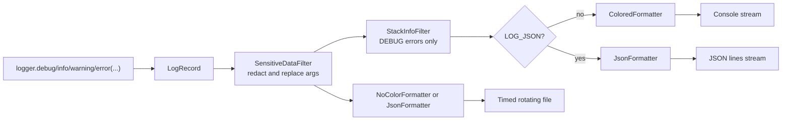
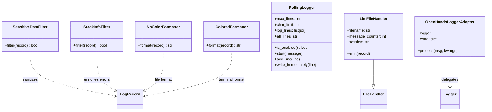
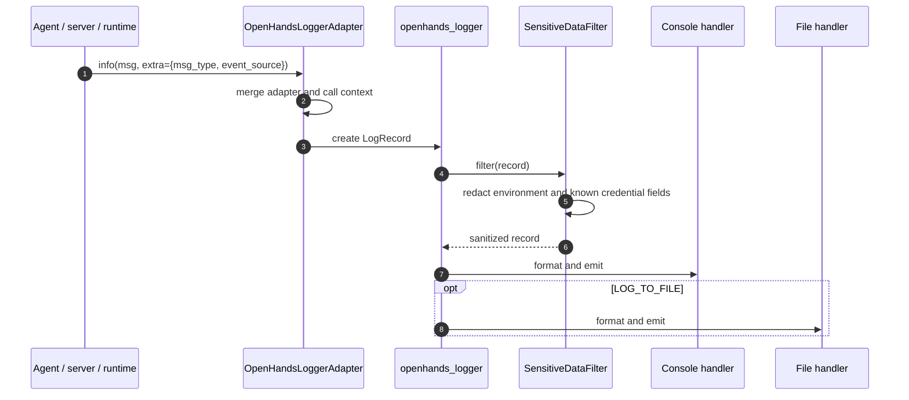
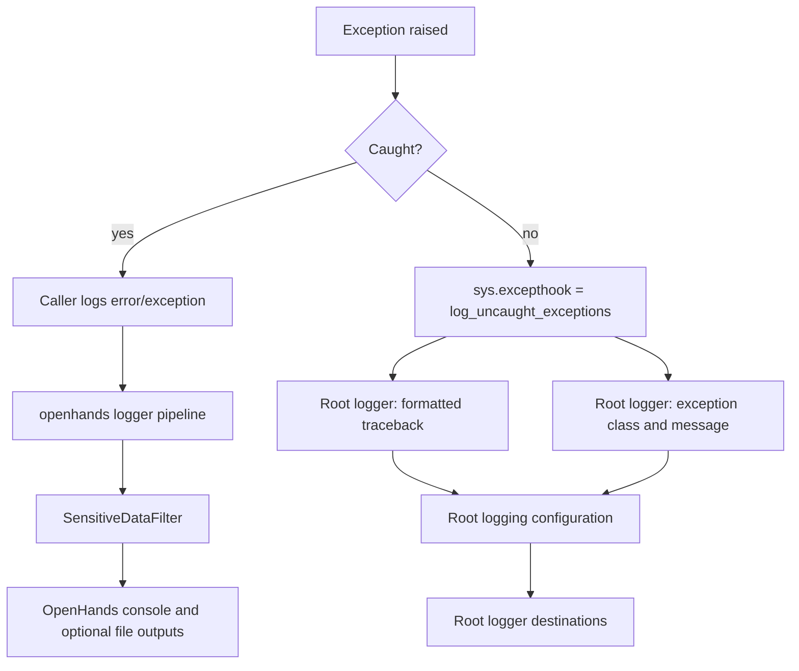

# Logging (`logging`)

## Introduction

The logging module is OpenHands’ shared observability and diagnostic boundary. It
configures the Python logging system, chooses human-readable or JSON output,
protects log records from common credentials, writes application and LLM traces to
files, and provides a small terminal-only rolling display for long-running runtime
operations.

The implementation is concentrated in
`openhands/core/logger.py`. Most application components use the module-level
`openhands_logger` (directly or through `OpenHandsLoggerAdapter`), while the LLM
layer uses the dedicated `prompt` and `response` loggers. Runtime image building
uses `RollingLogger` as a terminal display helper; it is not a `logging.Handler`.
See [LLM layer](llm_layer.md), [runtime image builders](runtime_image_builders.md),
[Docker builder](runtime_image_builders_docker_builder.md), and
[runtime utilities](runtime_utils.md) for the behavior of those consumers.

---

## Purpose and responsibilities

The module has five closely related responsibilities:

1. **Application logging** — initialize the `openhands` logger with the configured
   level and a console or JSON-lines handler.
2. **File logging** — optionally create a daily rotating `openhands.log` under the
   repository’s `logs/` directory.
3. **LLM trace logging** — write each prompt and response to a separate numbered
   file under `logs/llm/<session>/` when file logging is enabled.
4. **Safety and readability** — redact environment-derived secrets, suppress noisy
   or credential-leaking third-party loggers, color terminal event output, and add
   exception context in debug mode.
5. **Interactive progress output** — maintain a fixed-height terminal window for
   runtime build output through `RollingLogger`.

It is initialized at import time. Importing `openhands.core.logger` therefore reads
environment variables, configures LiteLLM, creates logger objects, installs the
uncaught-exception hook, and attaches handlers. Configuration must be present before
the first import if startup behavior is important.

## Position in the system

Logging is a shared foundation used by the agent/controller, LLM, runtime, server,
storage, integration, and client-facing layers. It does not own events, state, or
business workflows. Instead, those modules emit records and this module decides how
records are filtered, formatted, and delivered.



The event system remains a separate concern: event objects and subscriptions are
documented in [event system](event_system.md). Logging may describe event activity,
but it is not the event transport or event store.

---

## Initialization and configuration

At import time the module evaluates these environment variables:

| Variable | Default | Effect |
|---|---:|---|
| `LOG_LEVEL` | `INFO` | Base Python logging level. Invalid names fall back to `INFO`. |
| `DEBUG` | `False` | Enables debug logging; also forces `LOG_LEVEL=DEBUG`, enables stack context, and enables timestamped LLM sessions. |
| `DEBUG_LLM` | `False` | Requests verbose LiteLLM diagnostics. The process asks for an interactive `y` confirmation because output can contain API keys or other sensitive data. |
| `LOG_JSON` | `False` | Uses JSON formatting for the main console handler and rotating file handler. |
| `LOG_JSON_LEVEL_KEY` | `level` | Renames the JSON `levelname` field. |
| `LOG_TO_FILE` | `DEBUG == True` | Enables the rotating application file and LLM trace files. |
| `LOG_ALL_EVENTS` | `False` | Makes `STEP` records render as visible event separators; otherwise `STEP` returns the raw message. |
| `DEBUG_RUNTIME` | `False` | A shared runtime flag indicating whether Docker/container logs should be streamed. The logger module defines it; runtime code consumes it. |

`DISABLE_COLOR_PRINTING` is a module constant, currently `False`; it can be changed
by code before formatting to suppress color. Terminal formatting also respects the
record’s `msg_type` and optional `event_source` fields.



### Handler topology

The global `logging.basicConfig(level=logging.ERROR)` establishes a conservative
fallback for the root logger. The module then configures a separate `openhands`
logger:

- `openhands_logger.setLevel(current_log_level)` applies the selected level.
- JSON mode attaches `json_log_handler(current_log_level)` to stdout.
- Text mode attaches `get_console_handler(current_log_level)` to stderr through
  Python’s default `StreamHandler` stream.
- `LOG_TO_FILE` additionally attaches a `TimedRotatingFileHandler` for
  `openhands.log`, with daily rotation (`when='d'`) and seven backups by default.
- `propagate=False` prevents application records from being duplicated by the root
  logger.
- `SensitiveDataFilter` is attached to the `openhands` logger and runs before its
  handlers.



The filters are logger-level filters, so the same mutated record is available to
all attached handlers. This is important for redaction: file output does not bypass
the safety filter merely because it has a different formatter.

---

## Components

### `StackInfoFilter`

`StackInfoFilter.filter(record)` always returns `True`, but for records at
`ERROR` or above it checks `sys.exc_info()`. If an active exception exists, it adds:

- `stack_info`: a formatted current stack, with the final three logging-related
  frames removed; and
- `exc_info`: the active exception tuple.

The filter is attached only when `DEBUG` is enabled. It does not manufacture a
traceback for an ordinary error log outside an exception handler. As a result,
`logger.error("...")` and `logger.exception("...")` have different diagnostic
value depending on whether an exception is currently active.

### `NoColorFormatter` and formatting helpers

`NoColorFormatter` makes a shallow copy of the record through `_fix_record`, strips
ANSI color sequences from the copied message, and then applies the configured file
format. Copying prevents file formatting from modifying the record used by the
console handler.

`_fix_record` also handles Python logging’s special `exc_info=True` form. It replaces
that boolean with `sys.exc_info()` and clears `stack_info` so formatters receive a
proper exception tuple rather than a boolean.

`strip_ansi` removes ANSI SGR sequences matching the module’s regular expression.
It is intended for terminal color codes generated by application messages; unusual
ANSI control sequences outside that pattern are not removed.

`ColoredFormatter` selects colors using `msg_type` and, when present,
`event_source`. For example, an `ACTION` from a user source can resolve to a more
specific `USER_ACTION` color. In normal text mode it emits compact event-oriented
messages. Errors and all debug records include time, logger, level, source filename,
and line number. A `STEP` record is either returned as-is or wrapped in a visible
separator when `LOG_ALL_EVENTS=True`.

### `SensitiveDataFilter`

The filter performs two redaction passes:

1. It collects environment values from variables whose names contain `SECRET`,
   `_KEY`, `_CODE`, or `_TOKEN`, excluding values of length two or less and the
   literal `default`, then replaces exact occurrences with `******`.
2. It masks values assigned to a list of known credential field names, including
   `api_key`, AWS access keys, GitHub tokens, JWT secrets, E2B, Modal, Runloop, and
   Daytona credentials. Uppercase versions of those names are also recognized.

After redaction, the filter assigns the sanitized text to `record.msg` and clears
`record.args`. This means formatting arguments are resolved before redaction and
cannot reintroduce the original values through a later handler.

This is a defensive measure, not a guarantee that arbitrary secrets are safe to log.
Callers should avoid logging credentials, full authorization headers, or raw provider
responses. In particular, enabling `DEBUG_LLM` is explicitly treated as unsafe for
production because LiteLLM diagnostics may contain sensitive request data.

### `RollingLogger`

`RollingLogger` is a fixed-size terminal buffer with two histories:

- `log_lines` contains exactly `max_lines` display rows. `add_line` drops the oldest
  row, truncates the new row to `char_limit`, and repaints the block using ANSI cursor
  movement.
- `all_lines` retains every untruncated line, separated by newlines, so callers can
  include the complete build output in an error report.

Output is enabled only when both `DEBUG` is true and `sys.stdout.isatty()` is true.
When disabled, `_write` and `_flush` are no-ops. `start` still prints its optional
banner through ordinary `print`, so callers should not assume the entire object is
silent in non-interactive environments.

The helper is composed by `DockerRuntimeBuilder` for build and pull progress. See
[Docker builder rolling logger](runtime_image_builders_docker_builder_rolling_logger.md)
for its detailed terminal algorithm and class relationship.



### `LlmFileHandler` and dedicated LLM loggers

`_setup_llm_logger` creates non-propagating loggers named `prompt` and `response`.
When `LOG_TO_FILE` is enabled, each receives an `LlmFileHandler` with the plain
`'%(message)s'` formatter.

`LlmFileHandler` creates its directory as follows:

- non-debug mode: `logs/llm/default/`; existing files in that directory are removed
  during handler initialization;
- debug mode: `logs/llm/YY-MM-DD_HH-MM/`; the timestamp separates sessions.

Each emitted record opens a file named `<logger-name>_<counter>.log`, writes one
record, closes the file, and increments the counter. Consequently, each prompt or
response is isolated in its own file rather than appended to one continuous trace.
The handler itself does not add `SensitiveDataFilter`; callers should treat LLM
prompt/response logging as sensitive and ensure the content is appropriate before
emitting it.

```mermaid
sequenceDiagram
    participant Client as LLM client
    participant P as prompt logger
    participant R as response logger
    participant H as LlmFileHandler
    participant FS as logs/llm/<session>

    Client->>P: log(prompt)
    P->>H: emit(LogRecord)
    H->>FS: open prompt_001.log
    H->>FS: write message
    H->>FS: close; counter = 2
    Client->>R: log(response)
    R->>H: emit(LogRecord)
    H->>FS: open response_001.log
    H->>FS: write message
    H->>FS: close; counter = 2
```

### `OpenHandsLoggerAdapter`

The adapter preserves a base `extra` dictionary and merges per-call `extra` values
into it in `process`. Per-call fields win when keys overlap. This gives producers a
simple way to attach fields such as `msg_type` and `event_source`, which are consumed
by `ColoredFormatter`, without manually rebuilding logger context for every call.

The implementation provides the same behavior that Python 3.13’s
`LoggerAdapter(merge_extra=True)` offers, while remaining compatible with earlier
Python versions.

---

## End-to-end flows

### Normal application record



### Error and uncaught-exception flow

The module replaces `sys.excepthook` with `log_uncaught_exceptions`. For an uncaught
exception, it calls the root `logging.error` function to log the traceback (when a
traceback object is available) and then the exception type and message. Because this
uses the root logger rather than `openhands_logger`, those records do not pass through
`SensitiveDataFilter` or the debug-only `StackInfoFilter`; exception handlers should
still avoid placing secrets in exception text.



### Runtime progress flow

This flow is intentionally separate from Python logging. A runtime builder receives
subprocess or Docker progress, sends it to `RollingLogger`, and may use
`all_lines` for failure diagnostics. See [sandboxed execution layer](sandboxed_execution_layer.md)
for the runtime abstraction and [runtime image builder](runtime_image_builders.md)
for the build pipeline.

```mermaid
flowchart LR
    BUILD["Docker build/pull output"] --> BUILDER["DockerRuntimeBuilder"]
    BUILDER --> ROLL["RollingLogger.add_line()"]
    ROLL --> TTY{DEBUG and stdout.isatty()?}
    TTY -->|yes| WINDOW["Rewrite fixed terminal window"]
    TTY -->|no| SILENT["No ANSI writes"]
    ROLL --> HISTORY["all_lines: complete untruncated history"]
    HISTORY --> FAILURE["Failure diagnostics"]
```

---

## Output formats and destinations

### Human-readable console output

`get_console_handler` installs `ColoredFormatter` with a default format containing
time, logger name, level, source filename, line number, and message. Event-like
records with recognized `msg_type` values use color-specific compact output. Error
and debug records include source location to make diagnosis faster.

### JSON lines

`json_formatter()` uses `python-json-logger` with the message and level fields,
renames `levelname` to `LOG_JSON_LEVEL_KEY`, and includes a timestamp. JSON mode is
useful for log collectors, but the exact schema is intentionally small; contextual
fields supplied in `extra` may also appear depending on formatter behavior and
record contents.

### Rotating application file

`get_file_handler` creates the requested directory and a `TimedRotatingFileHandler`
named `openhands.log`. The default rotation is daily with seven backups. Text files
use `NoColorFormatter`; JSON files use `JsonFormatter`. `utc` and rotation interval
are parameters of the helper and can be changed by callers that construct their own
handler.

### LLM traces

Prompt and response files use the message-only formatter. They are designed for
debugging LLM interactions, not for general application aggregation. File logging
must be enabled for these handlers to emit anything.

---

## Operational guidance

### Recommended settings

- Development diagnosis: `DEBUG=true LOG_TO_FILE=true`.
- Structured collection: `LOG_JSON=true LOG_TO_FILE=true`.
- Production: use an appropriate `LOG_LEVEL`, keep `DEBUG_LLM=false`, and avoid raw
  prompt/response logging unless the data handling policy permits it.
- Runtime build debugging: set `DEBUG_RUNTIME=true` according to the runtime
  consumer’s needs; it does not itself change the standard logger level.

### Important behavior and pitfalls

- Configuration is import-time global state. Changing environment variables after
  importing the module does not rebuild existing handlers.
- `DEBUG` overrides `LOG_LEVEL` to `DEBUG` and defaults `LOG_TO_FILE` to enabled.
  An explicit `LOG_TO_FILE=false` still disables file logging.
- `DEBUG_LLM` requires an interactive confirmation. In a non-interactive process,
  startup may block or fail depending on stdin behavior; it should not be enabled by
  default in automation.
- LiteLLM logger names `LiteLLM`, `LiteLLM Router`, and `LiteLLM Proxy` are disabled
  to reduce the risk of leaking keys. Verbose provider diagnostics are therefore not
  available through ordinary logger configuration alone.
- Chatty `engineio` and `socketio` loggers are limited to `WARNING`.
- `RollingLogger` is a terminal presentation utility. It should not be treated as a
  durable log sink, and its `all_lines` field can grow without bound during a very
  long operation.
- `LlmFileHandler` clears the non-debug `logs/llm/default/` directory on
  initialization. Operators should not place unrelated files there.
- Redaction is pattern-based. It masks known fields and exact environment values,
  but it cannot recognize every possible secret encoding or secret embedded in a
  transformed value.

### Testing considerations

Tests that import the module should isolate environment variables and avoid assuming
that handlers can be added repeatedly without duplication. Useful behavioral checks
include:

- text versus JSON handler selection;
- `DEBUG` overriding the selected level;
- redaction of environment values and known credential fields;
- stack enrichment only while an exception is active;
- ANSI removal in file formatting;
- rolling-buffer truncation versus complete `all_lines` history;
- LLM file numbering and session directory selection.

---

## API summary

| Symbol | Kind | Primary use |
|---|---|---|
| `openhands_logger` | `logging.Logger` | Main application logger |
| `OpenHandsLoggerAdapter` | adapter class | Add and merge structured context |
| `llm_prompt_logger` | logger | Prompt trace records |
| `llm_response_logger` | logger | Response trace records |
| `RollingLogger` | helper class | Fixed-height interactive progress display |
| `LlmFileHandler` | handler class | One-file-per-LLM-message output |
| `SensitiveDataFilter` | filter class | Credential redaction |
| `StackInfoFilter` | filter class | Debug-time exception stack enrichment |
| `get_console_handler` | factory | Colored console handler |
| `get_file_handler` | factory | Timed rotating application file handler |
| `json_log_handler` | factory | JSON-lines stream handler |
| `json_formatter` | factory | Structured formatter |
| `log_uncaught_exceptions` | hook function | Uncaught exception logging |

## Related modules

- [Core schema and runtime support](core_schema_and_runtime_support.md) — shared
  schema and utility types that may be attached to or represented by log context.
- [Event system](event_system.md) — event stream and event object lifecycle; logging
  is an observability side channel rather than the event transport.
- [LLM layer](llm_layer.md) — LLM clients and routing that can emit prompt,
  response, metrics, and diagnostic records.
- [Runtime utilities](runtime_utils.md) — command, Git, memory, and log-streaming
  helpers that operate near the logging boundary.
- [Sandboxed execution layer](sandboxed_execution_layer.md) — runtime abstractions
  and execution backends whose progress and failures may be logged.
- [Runtime image builders](runtime_image_builders.md) — image construction pipeline
  using runtime logging facilities.
- [Docker builder](runtime_image_builders_docker_builder.md) — concrete consumer of
  `RollingLogger` and build diagnostics.
