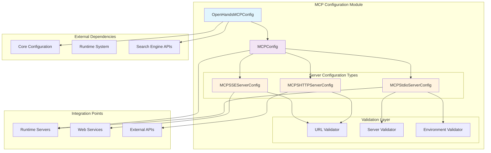
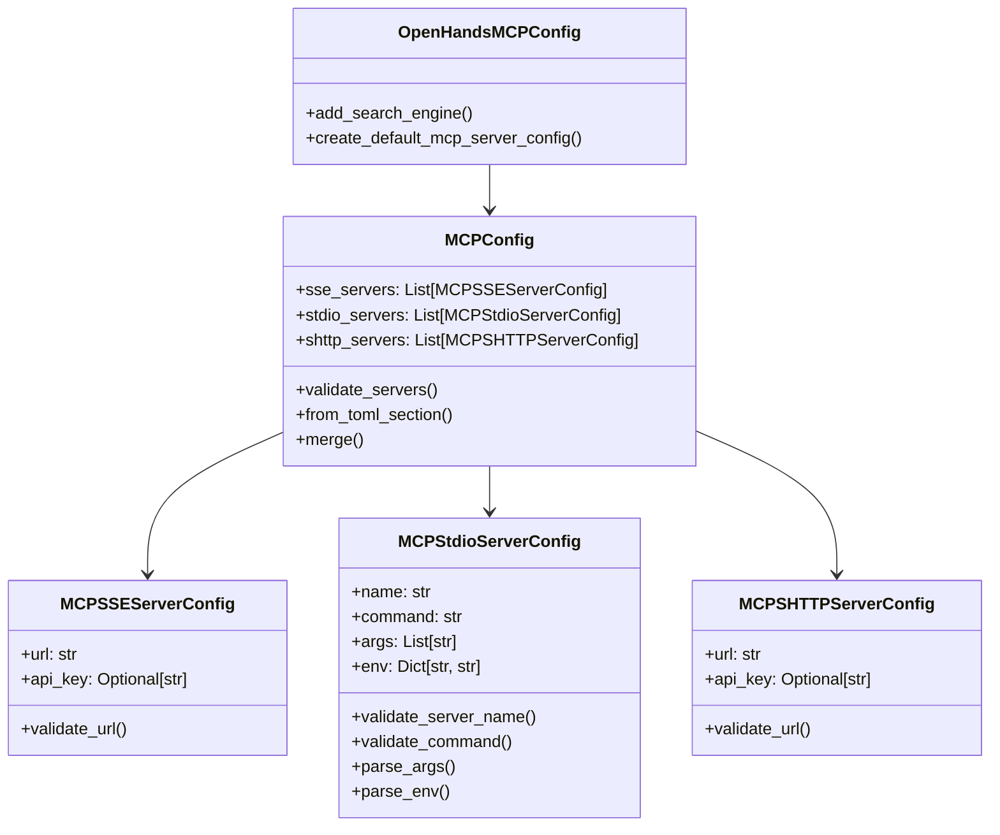
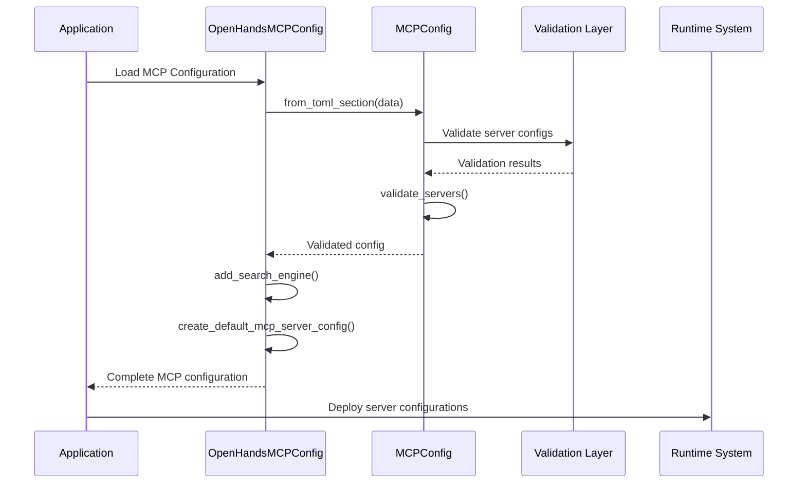
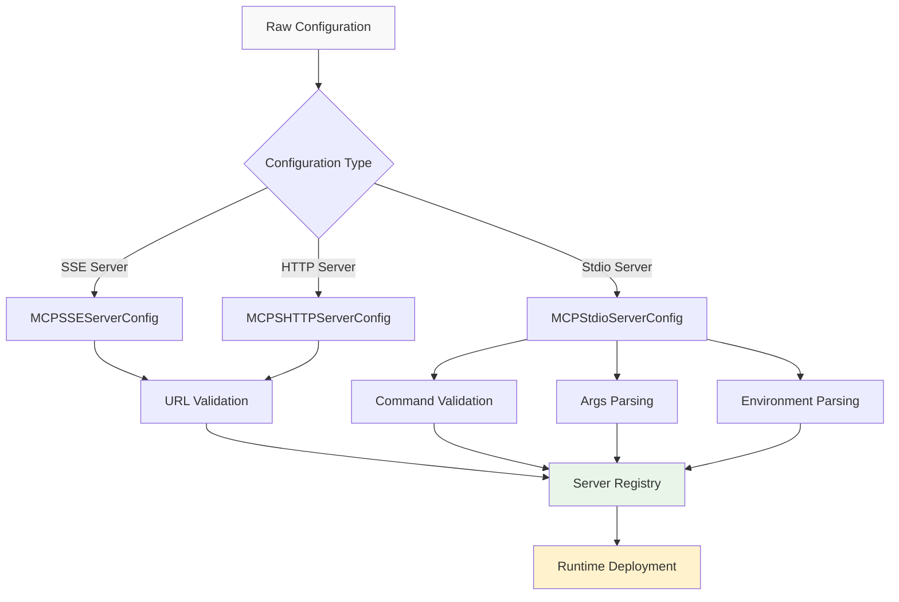
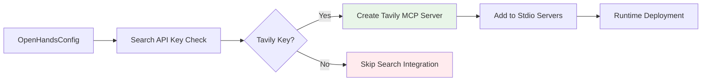

# MCP Configuration Module

## Overview

The MCP Configuration module provides comprehensive configuration management for the Model Context Protocol (MCP) within the OpenHands system. This module enables seamless integration with external MCP servers through multiple communication protocols including Server-Sent Events (SSE), Standard I/O (stdio), and HTTP connections. It serves as the central configuration hub for managing MCP server connections, validation, and runtime integration.

## Core Purpose

The module facilitates:
- **Multi-Protocol MCP Integration**: Support for SSE, stdio, and HTTP-based MCP servers
- **Configuration Validation**: Robust validation of server configurations and connection parameters  
- **Runtime Server Management**: Dynamic server configuration for different runtime environments
- **Search Engine Integration**: Automatic integration with search engines like Tavily
- **Enterprise Extensibility**: Pluggable configuration system for custom MCP implementations

## Architecture Overview



## Component Architecture

### Core Configuration Classes

#### OpenHandsMCPConfig
The main configuration orchestrator that provides factory methods and integration logic.

**Key Responsibilities:**
- Search engine integration management
- Default server configuration creation
- Runtime-specific configuration adaptation
- Extensible implementation loading

#### MCPConfig
Central configuration container that manages all MCP server types and provides validation.

**Key Features:**
- Multi-server type management (SSE, stdio, HTTP)
- TOML configuration parsing
- Server validation and deduplication
- Configuration merging capabilities

#### Server Configuration Types



## Data Flow and Processing

### Configuration Loading Flow



### Server Configuration Processing



## Integration with System Components

### Core Configuration Integration
The module integrates with the [core_configuration](core_configuration.md) system to:
- Access application-wide configuration settings
- Retrieve API keys and authentication credentials
- Coordinate with other configuration modules

### Runtime System Integration
Works closely with the [runtime_system](runtime_system.md) to:
- Deploy stdio servers within runtime containers
- Manage server lifecycle and health monitoring
- Coordinate with different runtime implementations (Local, CLI, Kubernetes)

### Server and API Integration
Connects with [server_and_api](server_and_api.md) components for:
- HTTP-based MCP server management
- API endpoint configuration
- Authentication and authorization handling

## Configuration Validation

### URL Validation
```python
def _validate_mcp_url(url: str) -> str:
    """Comprehensive URL validation for MCP servers"""
    # Validates scheme, netloc, and protocol compatibility
    # Supports: http, https, ws, wss protocols
```

### Server Name Validation
```python
@field_validator('name', mode='before')
def validate_server_name(cls, v: str) -> str:
    """Validates stdio server names"""
    # Ensures alphanumeric characters, hyphens, underscores only
    # Prevents empty or invalid server names
```

### Environment Variable Validation
```python
@field_validator('env', mode='before')
def parse_env(cls, v) -> dict[str, str]:
    """Parses and validates environment variables"""
    # Supports KEY=VALUE format
    # Validates environment variable naming conventions
```

## Search Engine Integration

The module provides automatic search engine integration through the Tavily MCP server:



## Configuration Examples

### TOML Configuration
```toml
[mcp]
# SSE Servers
sse_servers = [
    "https://mcp-server.example.com/sse",
    { url = "https://secure-mcp.example.com/sse", api_key = "secret-key" }
]

# Stdio Servers
[[mcp.stdio_servers]]
name = "file-manager"
command = "python"
args = ["-m", "mcp_file_manager"]
env = { "DEBUG=1", "LOG_LEVEL=info" }

# HTTP Servers
shttp_servers = [
    { url = "http://localhost:8080/mcp", api_key = "local-key" }
]
```

### Programmatic Configuration
```python
from openhands.core.config.mcp_config import MCPConfig, MCPStdioServerConfig

# Create stdio server configuration
stdio_server = MCPStdioServerConfig(
    name="custom-tool",
    command="node",
    args=["--experimental-modules", "tool-server.js"],
    env={"NODE_ENV": "production"}
)

# Create complete MCP configuration
mcp_config = MCPConfig(
    stdio_servers=[stdio_server],
    sse_servers=[],
    shttp_servers=[]
)
```

## Error Handling and Validation

### Common Validation Errors
- **Invalid URL Format**: Malformed URLs or unsupported protocols
- **Duplicate Server URLs**: Multiple servers with identical URLs
- **Invalid Server Names**: Names containing invalid characters
- **Malformed Environment Variables**: Incorrect KEY=VALUE format
- **Empty Required Fields**: Missing essential configuration parameters

### Error Recovery Strategies
- **Graceful Degradation**: Continue with valid servers when some fail validation
- **Default Fallbacks**: Provide sensible defaults for optional parameters
- **Clear Error Messages**: Detailed validation error reporting
- **Configuration Suggestions**: Helpful hints for fixing common issues

## Extensibility and Customization

### Custom MCP Configuration Implementation
The module supports custom implementations through environment variable configuration:

```python
# Set custom implementation class
os.environ['OPENHANDS_MCP_CONFIG_CLS'] = 'custom.mcp.CustomMCPConfig'

# Implementation will be loaded dynamically
OpenHandsMCPConfigImpl = get_impl(OpenHandsMCPConfig, openhands_mcp_config_cls)
```

### Enterprise Extensions
For enterprise deployments, the module can be extended to support:
- Custom authentication mechanisms
- Enterprise-specific MCP servers
- Advanced security configurations
- Compliance and audit logging

## Performance Considerations

### Configuration Loading
- **Lazy Validation**: Validation occurs only when needed
- **Caching**: Validated configurations are cached for reuse
- **Parallel Processing**: Multiple server validations can run concurrently

### Runtime Optimization
- **Connection Pooling**: Efficient management of MCP server connections
- **Health Monitoring**: Automatic detection and handling of server failures
- **Load Balancing**: Distribution of requests across multiple servers

## Security Features

### API Key Management
- **Secure Storage**: API keys are handled as SecretStr objects
- **Environment Variable Support**: Keys can be loaded from environment
- **Validation**: API key format validation for known providers

### URL Security
- **Protocol Validation**: Only secure protocols are allowed
- **Domain Validation**: Comprehensive URL structure validation
- **Injection Prevention**: Protection against URL injection attacks

## Monitoring and Debugging

### Configuration Validation Logging
```python
logger.info('Adding search engine to MCP config')
logger.warning('No search engine API key found, skipping search engine')
```

### Server Health Monitoring
The module provides hooks for monitoring MCP server health and performance:
- Connection status tracking
- Response time monitoring
- Error rate analysis
- Automatic failover capabilities

## Future Enhancements

### Planned Features
- **Dynamic Server Discovery**: Automatic detection of available MCP servers
- **Configuration Hot Reloading**: Runtime configuration updates without restart
- **Advanced Load Balancing**: Intelligent request routing based on server capabilities
- **Metrics Integration**: Comprehensive monitoring and analytics

### API Evolution
- **GraphQL Support**: Enhanced query capabilities for MCP servers
- **WebSocket Improvements**: Better real-time communication support
- **Protocol Extensions**: Support for emerging MCP protocol features

## Related Documentation

- [Core Configuration](core_configuration.md) - Overall configuration system architecture
- [Runtime System](runtime_system.md) - Runtime environment integration
- [Server and API](server_and_api.md) - Web server and API management
- [Security System](security_system.md) - Security and validation frameworks

---

*This documentation covers the MCP Configuration module's architecture, components, and integration patterns within the OpenHands system. For implementation details and API references, consult the source code and related module documentation.*