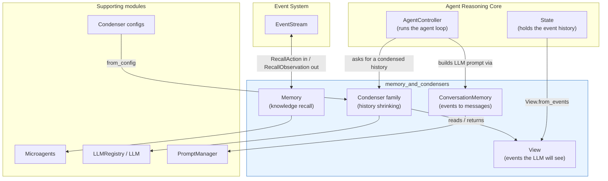
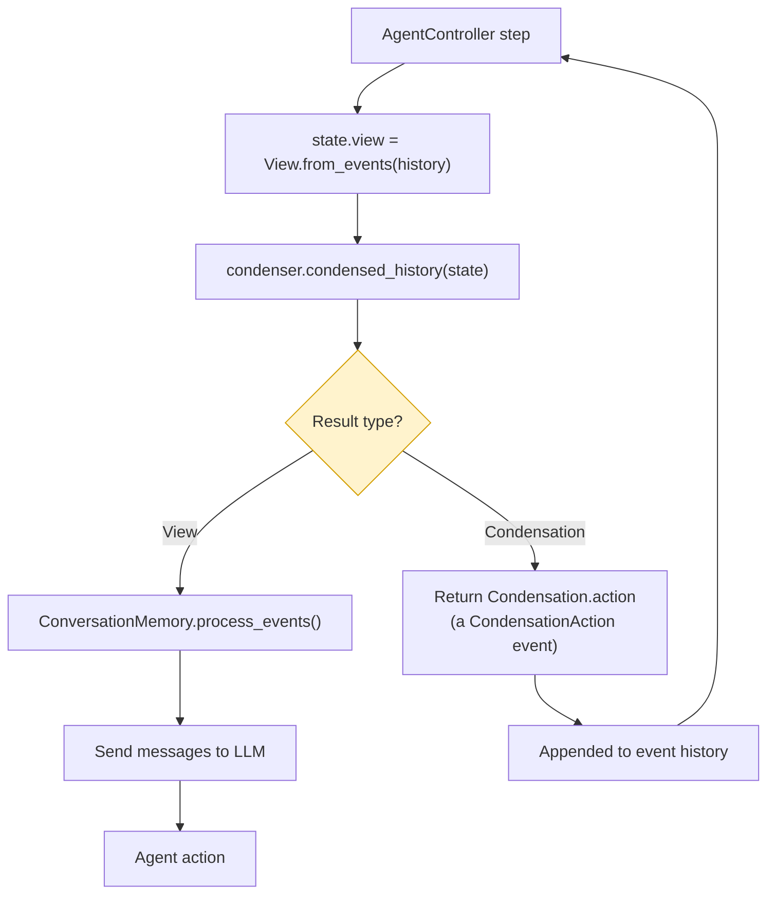
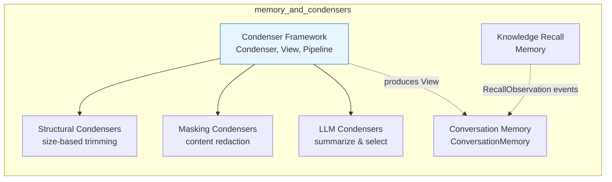
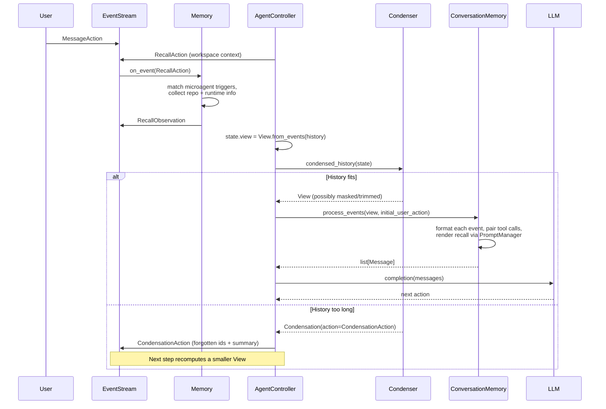
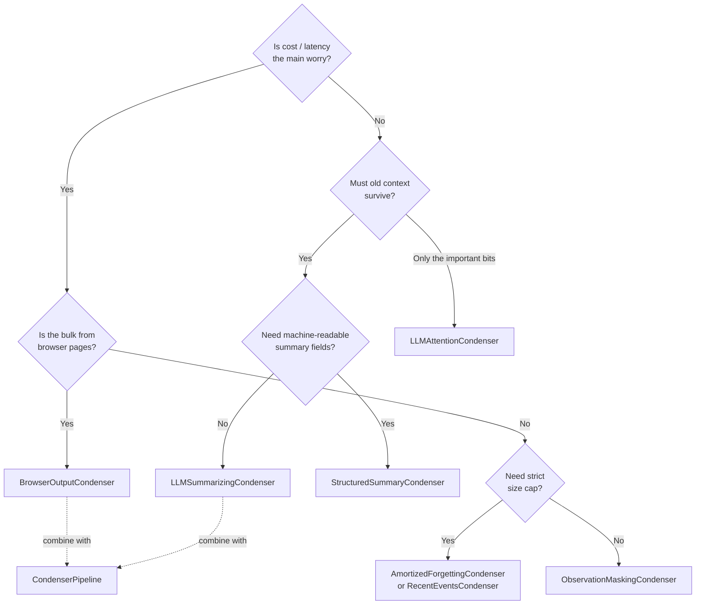

# Memory and Condensers

## 1. Purpose

An OpenHands agent works by looking at everything that happened so far and deciding what to do next. Two problems come out of this:

1. **The agent needs extra knowledge that is not in the event history.** What repository am I in? What ports are open? Are there project-specific rules I should follow?
2. **The history grows without limit.** Every command, every file read, every browser page adds events. Sooner or later the history no longer fits in the LLM context window.

The `memory_and_condensers` module solves both problems.

| Problem | Answer in this module |
| --- | --- |
| Agent needs extra knowledge | `Memory` — listens for recall requests and answers them with repo info, runtime info, and microagent knowledge |
| History must become LLM messages | `ConversationMemory` — turns events into `Message` objects the LLM understands |
| History is too long | **Condensers** — a family of strategies that shrink, mask, or summarize the history |

In short: **this module owns everything between "raw events" and "what the LLM actually sees."**

---

## 2. Where the module sits in the system



Related modules:

- [Agent Controller](agent_controller.md) — drives the loop and calls into this module every step.
- [Event System](event_system.md) — defines `Event`, `RecallAction`, `CondensationAction`, and the `EventStream`.
- [Microagents](microagents.md) — the knowledge files `Memory` loads and matches.
- [LLM Layer](llm_layer.md) — supplies the `LLM` objects that LLM-based condensers call.
- [Core Configuration](core_configuration.md) — the `*CondenserConfig` classes that select and tune each condenser.

---

## 3. The two core ideas

### 3.1 The `View`

A `View` is a plain, ordered list of events that is ready to be shown to the LLM. It is built by `View.from_events(events)`, which walks the raw history and applies the meaning of any condensation events it finds:

- Events listed in a `CondensationAction` as "forgotten" are dropped.
- If a condensation carried a `summary`, an `AgentCondensationObservation` holding that summary is inserted at `summary_offset`.
- A flag `unhandled_condensation_request` is set if the user asked for condensation and no condenser has answered yet.

This design is important: **condensers never delete events.** They append a `CondensationAction` to the history saying what should be forgotten. The real history stays intact on disk, and the `View` is recomputed from it every time. That makes condensation replayable and auditable.

### 3.2 The `Condenser` contract

Every condenser implements one method:

```python
def condense(self, view: View) -> View | Condensation
```

Two possible answers:

- **`View`** — "here is a smaller/edited list, go ahead and use it."
- **`Condensation`** — "stop; emit this `CondensationAction` as the agent's action instead. The next `View` will already be smaller."

`RollingCondenser` is a helper base class that splits this into two easier questions: `should_condense(view)` and `get_condensation(view)`.



---

## 4. Sub-modules

The module splits into six areas. Each has its own document.



### 4.1 Knowledge Recall — `Memory`

**File:** `openhands/memory/memory.py`

`Memory` is an event-stream subscriber. It waits for a `RecallAction` and answers it with a `RecallObservation`.

Two kinds of recall:

- **`WORKSPACE_CONTEXT`** — fired once, on the first user message. Returns repository name/directory/branch, runtime hosts and dates, repo microagent instructions, and conversation instructions.
- **`KNOWLEDGE`** — fired on later user or agent messages. Scans knowledge microagents for trigger keywords in the message and returns the matching content.

It also loads microagents from three places (global `microagents/`, user `~/.openhands/microagents/`, and the cloned workspace) and can hand back MCP tool configs declared by repo microagents.

→ **[memory_and_condensers_recall.md](memory_and_condensers_recall.md)**

### 4.2 Conversation Memory — `ConversationMemory`

**File:** `openhands/memory/conversation_memory.py`

Takes the condensed list of events and turns it into `list[Message]` for the LLM. This is where the many event types (`CmdRunAction`, `IPythonRunCellObservation`, `BrowserOutputObservation`, `RecallObservation`, …) each get their own formatting rule.

Key responsibilities:

- Pair tool-call actions with their tool-result observations, and drop any that end up unmatched.
- Guarantee the message list starts with a system message and then a user message.
- Truncate oversized observation content.
- Attach images only when vision is on and the URL is valid.
- Render `RecallObservation` through the `PromptManager` templates.
- Mark prompt-cache breakpoints for Anthropic models.

→ **[memory_and_condensers_conversation_memory.md](memory_and_condensers_conversation_memory.md)**

### 4.3 Condenser Framework and Pipeline

**Files:** `openhands/memory/condenser/condenser.py`, `openhands/memory/view.py`, `openhands/memory/condenser/impl/pipeline.py`

The shared machinery: the `Condenser` abstract base, `RollingCondenser`, the `Condensation` result, the `View`, the config-to-class registry (`register_config` / `from_config`), and per-condensation metadata batching into `State.extra_data`.

`CondenserPipeline` chains several condensers together. Each one feeds its output `View` into the next; the chain stops early as soon as one returns a `Condensation`. This lets you combine, say, browser-output masking with LLM summarizing.

→ **[memory_and_condensers_condenser_framework.md](memory_and_condensers_condenser_framework.md)**

### 4.4 Structural Condensers

**Files:** `amortized_forgetting_condenser.py`, `recent_events_condenser.py`, `conversation_window_condenser.py`

These shrink history by **position and count only** — no LLM call, no content inspection. Cheap and predictable.

| Condenser | Trigger | Behaviour |
| --- | --- | --- |
| `AmortizedForgettingCondenser` | `len(view) > max_size` | Drops down to `max_size // 2`, keeping the first `keep_first` events plus the most recent tail |
| `RecentEventsCondenser` | Every call | Returns `keep_first` head events plus the last events up to `max_events` |
| `ConversationWindowCondenser` | An unhandled condensation request | Keeps system message, first user message, its recall pair, plus roughly the newer half — and repairs dangling observations |

→ **[memory_and_condensers_structural_condensers.md](memory_and_condensers_structural_condensers.md)**

### 4.5 Masking Condensers

**Files:** `observation_masking_condenser.py`, `browser_output_condenser.py`

These keep the **shape** of the history but blank out bulky content outside a recent attention window. The event count stays the same; only tokens go down.

- `ObservationMaskingCondenser` — replaces every `Observation` older than the window with `<MASKED>`.
- `BrowserOutputCondenser` — targets only `BrowserOutputObservation` (screenshots and accessibility trees are enormous), replacing older ones with `Visited URL … / Content omitted`.

→ **[memory_and_condensers_masking_condensers.md](memory_and_condensers_masking_condensers.md)**

### 4.6 LLM-Based Condensers

**Files:** `llm_summarizing_condenser.py`, `structured_summary_condenser.py`, `llm_attention_condenser.py`

These call an LLM to decide what matters. They are the most capable and the most expensive.

- `LLMSummarizingCondenser` — prompts for a free-text state summary covering user context, completed/pending tasks, code state, tests, and version control. The summary is carried forward and re-summarized each round.
- `StructuredSummaryCondenser` — same idea, but forces a function call into the `StateSummary` Pydantic model, so the result has fixed fields. Requires a function-calling LLM.
- `LLMAttentionCondenser` — asks the LLM to *rank* event IDs by importance and keeps the top ones. Requires `response_schema` support; uses the `ImportantEventSelection` model.

All three disable prompt caching on their condenser LLM (a cache write would never be read back) and record token metrics into condensation metadata.

→ **[memory_and_condensers_llm_condensers.md](memory_and_condensers_llm_condensers.md)**

---

## 5. Data flow end to end



---

## 6. Choosing a condenser



`CondenserPipeline` is the usual production answer: mask the cheap bulk first, then apply an LLM summarizer only if the history is still too long.

---

## 7. Design notes worth remembering

- **Append-only history.** Condensers add `CondensationAction` events rather than mutating the stored history. Views are always derived, never cached as truth.
- **Config-driven wiring.** Each condenser calls `register_config(SomeCondenserConfig)` at import time. `Condenser.from_config(config, llm_registry)` then resolves any config object to the right class. Adding a condenser means adding a class plus a config type — no switch statement to edit. See [Core Configuration](core_configuration.md).
- **`keep_first` guard rails.** Every size-based condenser rejects `keep_first >= max_size // 2`, so the "always keep" prefix can never crowd out the recent tail.
- **Metadata batching.** `add_metadata` collects diagnostics (LLM response, token metrics) during a condensation; `write_metadata` flushes them into `State.extra_data`. `CondenserPipeline` overrides the batching context manager to walk each child condenser, since the child never sees the `State`.
- **Memory runs off-loop.** `Memory` subscribes to the `EventStream` and answers asynchronously. Setting `_cause` on the returned observation is what unblocks the controller that is waiting on the recall.

---

## 8. Sub-module index

Every sub-module below has its own document in this same folder. Read the framework document first if you are new to condensers — the other three condenser documents assume it.

| Document | Covers | Core components |
| --- | --- | --- |
| [memory_and_condensers_recall.md](memory_and_condensers_recall.md) | Microagent loading, trigger matching, workspace context recall | `Memory` |
| [memory_and_condensers_conversation_memory.md](memory_and_condensers_conversation_memory.md) | Event → LLM message conversion, tool-call pairing, prompt caching | `ConversationMemory` |
| [memory_and_condensers_condenser_framework.md](memory_and_condensers_condenser_framework.md) | The condenser contract, view derivation, config registry, chaining | `Condenser`, `RollingCondenser`, `Condensation`, `View`, `CondenserPipeline` |
| [memory_and_condensers_structural_condensers.md](memory_and_condensers_structural_condensers.md) | Size- and position-based trimming with no LLM call | `AmortizedForgettingCondenser`, `RecentEventsCondenser`, `ConversationWindowCondenser` |
| [memory_and_condensers_masking_condensers.md](memory_and_condensers_masking_condensers.md) | Content redaction outside a recent attention window | `ObservationMaskingCondenser`, `BrowserOutputCondenser` |
| [memory_and_condensers_llm_condensers.md](memory_and_condensers_llm_condensers.md) | LLM-driven summarization and importance ranking | `LLMSummarizingCondenser`, `StructuredSummaryCondenser`, `LLMAttentionCondenser`, `ImportantEventSelection` |
