# Condenser Framework

## Introduction

An OpenHands agent works by reading its whole conversation history and deciding what to do next. That history grows with every action and observation, and LLMs have a limited context window. The **condenser framework** is the layer that shrinks the history before it reaches the LLM.

This module holds the three pieces that every condensation strategy builds on:

| Component | File | Role |
| --- | --- | --- |
| `View` | `openhands/memory/view.py` | A linear, LLM-ready list of events, rebuilt from raw history. |
| `Condensation` | `openhands/memory/condenser/condenser.py` | A wrapper around a `CondensationAction` — the "I shrank the history" event. |
| `Condenser` | `openhands/memory/condenser/condenser.py` | Abstract base class + config registry + metadata plumbing. |
| `RollingCondenser` | `openhands/memory/condenser/condenser.py` | Base class for strategies that condense a *rolling* window. |
| `CondenserPipeline` | `openhands/memory/condenser/impl/pipeline.py` | Chains several condensers into one. |

The concrete strategies live in sibling modules and are documented separately:

- [Structural condensers](memory_and_condensers_structural_condensers.md) — drop events by position/count.
- [Masking condensers](memory_and_condensers_masking_condensers.md) — blank out old observation bodies.
- [LLM condensers](memory_and_condensers_llm_condensers.md) — summarize or re-rank with an LLM.

---

## The Central Idea: History vs. View

The key design choice is that **condensation is itself an event**. A condenser never mutates the event stream. Instead it emits a `CondensationAction` that says "forget events 12–48, and here is a summary to put at offset 4". That action is appended to history like any other event.

`View.from_events` then *replays* history and applies those instructions to produce the list the LLM actually sees.

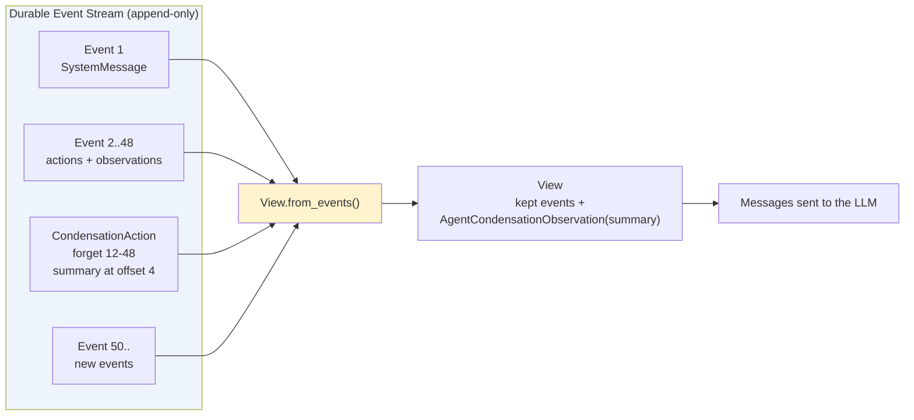

Why this matters:

- **Nothing is lost.** The raw stream is intact, so replay, debugging, and the UI still see everything.
- **Condensation is reproducible.** Restore a session from disk, rebuild the view, get the same result.
- **Condensers stay stateless.** All the state they need is encoded in the events themselves.

---

## Architecture

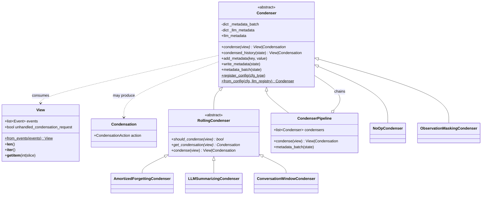

### Two return types, two meanings

`Condenser.condense` returns either a `View` or a `Condensation`. The agent must handle both:

- **`View`** — "here are the events, go ahead and think." The agent builds messages and calls the LLM.
- **`Condensation`** — "stop; I need to shrink the history first." The agent returns `Condensation.action` as its action for this step. The controller writes it to the stream, which triggers another agent step, and this time `View.from_events` produces the smaller view.

This is what makes an expensive condensation (like an LLM summarization) visible to the user and recorded in the event log, instead of happening invisibly inside a single step.

---

## `View` in Detail

`View` is a Pydantic model that behaves like a list — it supports `len()`, iteration, integer indexing, and slicing (via `@overload`-typed `__getitem__`), so condenser code can write `view[:keep_first]` and `view[-n:]` naturally.

### `View.from_events` algorithm

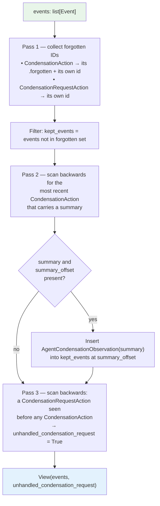

Three behaviors worth calling out:

1. **Condensation bookkeeping erases itself.** A `CondensationAction` adds its *own* id to the forgotten set, so the agent never sees the plumbing events — only their effect.
2. **Only the newest summary survives.** Summaries are cumulative by construction: each new summarizing condensation writes a summary that already covers the previous one, so `from_events` keeps just the last.
3. **`unhandled_condensation_request` is a flag, not a queue.** It is `True` only when a request came *after* the last condensation — i.e. somebody asked for a condensation and nobody has done one yet.

### `CondensationAction` shape

The action (defined in the [event system](event_system.md), `openhands/events/action/agent.py`) can specify forgotten events two ways, and validates that exactly one is used:

| Field set | Meaning |
| --- | --- |
| `forgotten_event_ids: [3, 7, 9]` | Forget exactly these ids (sparse). |
| `forgotten_events_start_id` + `forgotten_events_end_id` | Forget the whole inclusive range (dense). |
| `summary` + `summary_offset` | Optional, must be supplied together. |

The `forgotten` property normalizes both forms into a plain list of ids.

---

## `Condenser`: The Base Class

`Condenser` gives every strategy four things.

### 1. The `condense` contract

Subclasses implement one method:

```python
@abstractmethod
def condense(self, view: View) -> View | Condensation: ...
```

### 2. The entry point used by agents

`condensed_history(state)` is what agents actually call. It wires up LLM tracing metadata and guarantees diagnostic metadata gets flushed:

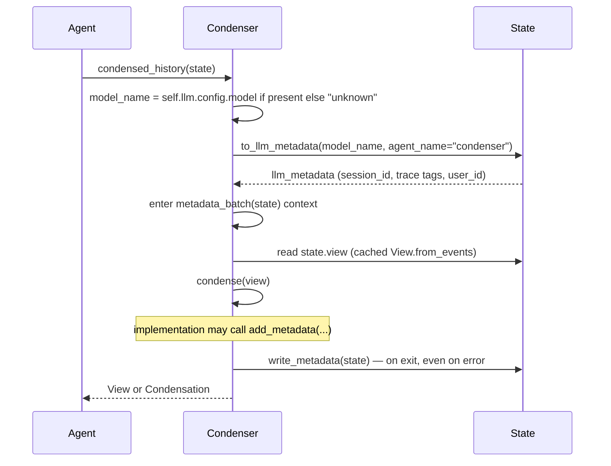

`state.view` is itself cached on the `State` object, keyed by a cheap `len(history)` checksum, so repeated access in a step does not re-run `from_events`. See [agent controller state](agent_controller_state.md).

### 3. Per-condensation metadata

Condensers record diagnostics without knowing anything about persistence:

- `add_metadata(key, value)` puts a key into the current batch.
- `write_metadata(state)` appends the batch to `state.extra_data['condenser_meta']` and clears it.
- `metadata_batch(state)` is a `@contextmanager` wrapping the two, so the write happens in a `finally`.
- The free function `get_condensation_metadata(state)` reads the accumulated list back out.

LLM-backed condensers use this to log the raw response and token metrics per condensation, e.g. `LLMSummarizingCondenser` calls `add_metadata('response', ...)` and `add_metadata('metrics', ...)`.

The `llm_metadata` property exposes the trace metadata that condensers pass to their LLM call as `extra_body={'metadata': self.llm_metadata}`, which tags the request as coming from `agent:condenser` rather than the main agent. It logs a warning if it is read before `condensed_history` populated it.

### 4. Config-driven construction (the registry)

Condensers are never constructed directly by callers. A module-level dict maps config classes to condenser classes:

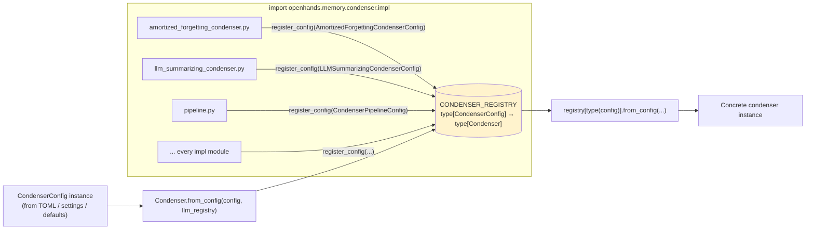

Each impl module calls `<Class>.register_config(<ConfigClass>)` at import time, and `openhands/memory/condenser/impl/__init__.py` imports every module so the registry is fully populated. `register_config` raises `ValueError` on a duplicate registration; `from_config` raises `ValueError` for an unknown config type.

Note the double dispatch in the base `from_config`: it looks up the concrete class, then calls *that class's* `from_config`, which knows how to unpack its own config fields (usually `config.model_dump(exclude={'type'})`) and pull an LLM from the `LLMRegistry`. See [LLM registry](llm_layer_registry.md) and [core configuration](core_configuration.md) for the `CondenserConfig` union.

---

## `RollingCondenser`: The Common Strategy Shape

Most useful condensers follow the same pattern: watch a growing view, and when it crosses a threshold, emit a condensation. `RollingCondenser` factors that out into two hooks.

```python
def condense(self, view: View) -> View | Condensation:
    if self.should_condense(view):
        return self.get_condensation(view)
    return view
```

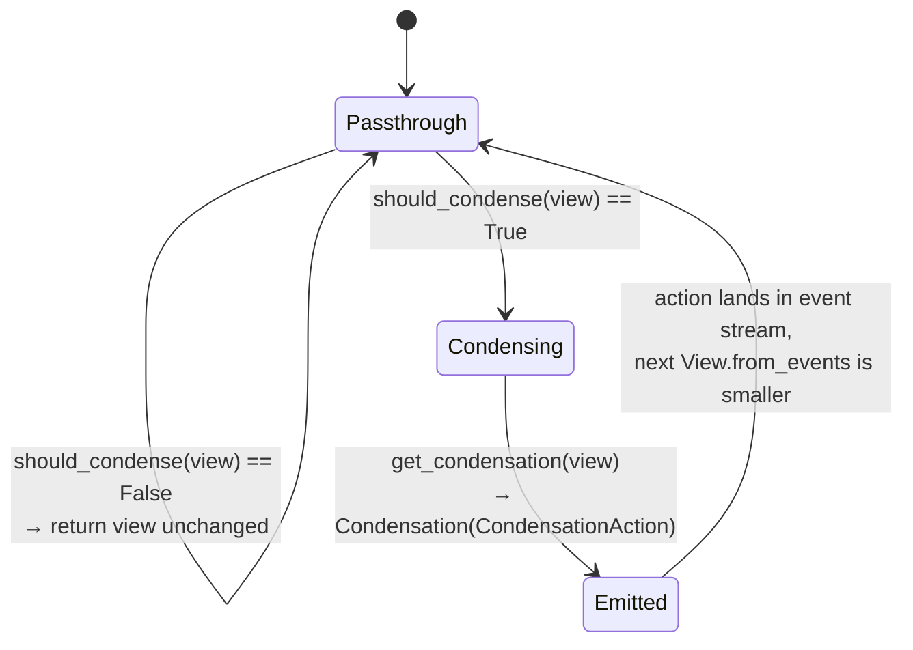

Subclasses only decide *when* and *what*:

| Condenser | `should_condense` trigger | `get_condensation` output |
| --- | --- | --- |
| `AmortizedForgettingCondenser` | `len(view) > max_size` | Forget the middle; keep `keep_first` head + tail down to `max_size // 2`. |
| `LLMSummarizingCondenser` | `len(view) > max_size` | LLM-written summary + forget range, summary at `keep_first`. |
| `ConversationWindowCondenser` | `view.unhandled_condensation_request` | Keep system msg, first user msg, recall pair, and ~half the tail. |

Not every condenser is rolling. `ObservationMaskingCondenser` and `NoOpCondenser` subclass `Condenser` directly and always return a `View` — masking rewrites observation bodies to `<MASKED>` in-place for the view only, which never needs an event.

---

## `CondenserPipeline`: Composition

Real deployments rarely want a single strategy. `CondenserPipeline` chains condensers, feeding each one the previous one's `View`:

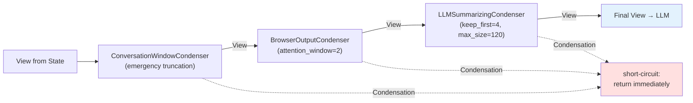

Two rules govern the loop:

1. **Views flow forward.** Each condenser's output view is the next one's input.
2. **A `Condensation` breaks the chain.** The moment any stage returns a `Condensation`, the pipeline stops and returns it — later stages never run on this step. They will run on the next step, against the freshly shrunk view.

Ordering therefore matters. The default server pipeline (`openhands/server/session/session.py`) puts browser-output masking *before* LLM summarizing so the summarizer only ever sees the two most recent browser dumps, which keeps summarization cheap.

### Metadata override

The pipeline overrides `metadata_batch` for a subtle reason: `Condenser.condense` receives only a `View`, not a `State`, so the pipeline cannot hand a `State` to its children. Instead, after the pipeline's own condensation finishes, it walks its child list and calls `child.write_metadata(state)` on each — collecting metadata that the children accumulated in their own batches.

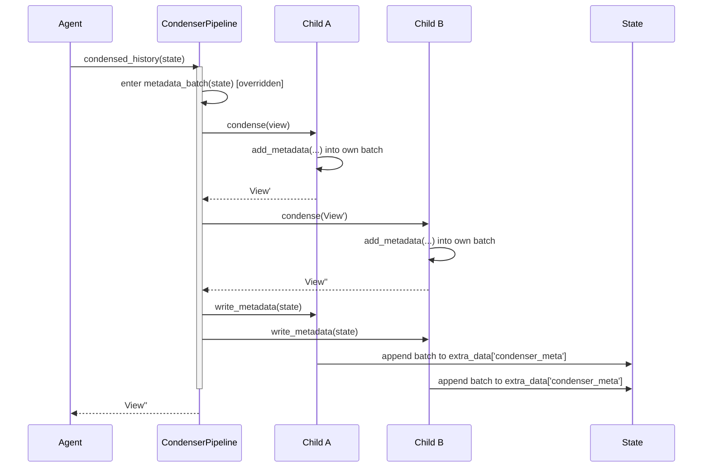

---

## End-to-End Flow

Here is a full agent step showing both the fast path and the condensation path. The agent side is documented in [agents](agents.md) / [agent controller core](agent_controller_core.md).

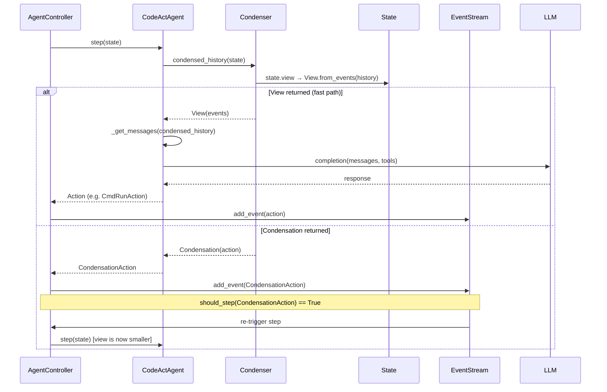

### The context-window overflow path

The framework also handles the case where the LLM call itself fails because the prompt is too long. This closes the loop between the runtime error and the `unhandled_condensation_request` flag:

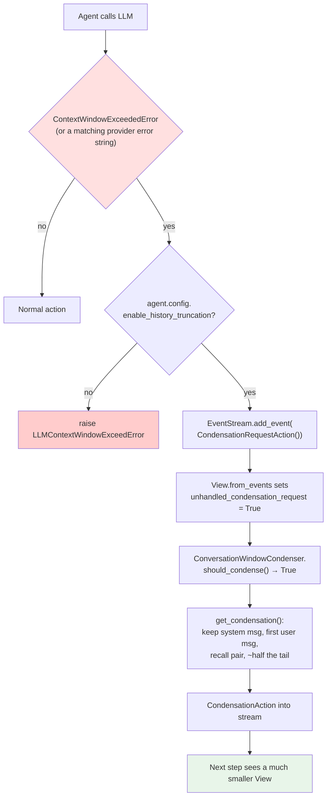

The agent can also raise a `CondensationRequestAction` itself via the `CondensationRequestTool` when `enable_condensation_request` is on — the same flag and the same condenser handle it.

---

## Dependencies

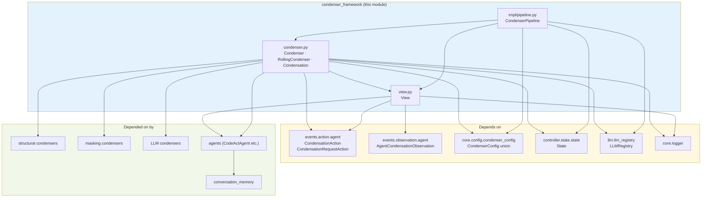

| Dependency | Why |
| --- | --- |
| [event system](event_system.md) | `CondensationAction`, `CondensationRequestAction`, `AgentCondensationObservation`, `Event`. |
| [agent controller state](agent_controller_state.md) | `State.view` (cached), `State.extra_data`, `State.to_llm_metadata`. |
| [core configuration](core_configuration.md) | The `CondenserConfig` union and TOML parsing. |
| [LLM registry](llm_layer_registry.md) | Handed to `from_config` so LLM-backed condensers can obtain a client. |
| [conversation memory](memory_and_condensers_conversation_memory.md) | Turns the resulting `View` events into LLM `Message` objects. |

There is a notable **circular-ish** relationship worth understanding: the condenser framework imports `State`, and `State` imports `View`. Python handles this because `state.py` imports only `openhands.memory.view` (which has no controller dependency), while `condenser.py` imports `State` — the cycle is broken by keeping `View` in its own leaf module. This is a real constraint: do not add controller imports to `view.py`.

---

## Extending the Framework

To add a new strategy:

1. **Define a config** in `openhands/core/config/condenser_config.py` as a Pydantic model with a unique `type: Literal[...]`, add it to the `CondenserConfig` union and to the `condenser_classes` map in `create_condenser_config`.
2. **Pick a base class.** Subclass `RollingCondenser` if you drop/summarize events past a threshold; subclass `Condenser` directly if you always return a rewritten `View`.
3. **Implement the hooks** — `should_condense` + `get_condensation`, or `condense`.
4. **Implement `from_config`** as a classmethod taking `(config, llm_registry)`.
5. **Register at module scope**: `MyCondenser.register_config(MyCondenserConfig)`.
6. **Export it** from `openhands/memory/condenser/impl/__init__.py`, otherwise the registration never runs.

Guidelines that fall out of the design:

- **Never mutate `view.events` in place.** Build a new list; other code holds the same `Event` objects.
- **Emit ranges, not sparse lists, when you can.** `forgotten_events_start_id`/`end_id` keeps the action small; `ConversationWindowCondenser` checks for contiguity and picks the compact form.
- **Keep `should_condense` cheap.** It runs on every single agent step.
- **Do expensive work only in `get_condensation`.** That is the step the agent surfaces as a real action, so the cost is visible and recorded.
- **Always pair `summary` with `summary_offset`.** `CondensationAction.__post_init__` rejects one without the other.
- **Use `add_metadata` for anything you would otherwise log.** It lands in `state.extra_data['condenser_meta']` and is readable afterwards via `get_condensation_metadata`, which evaluation harnesses rely on.
