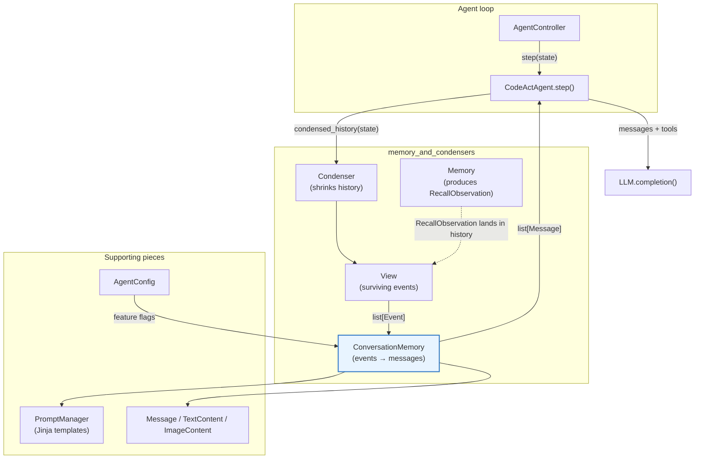
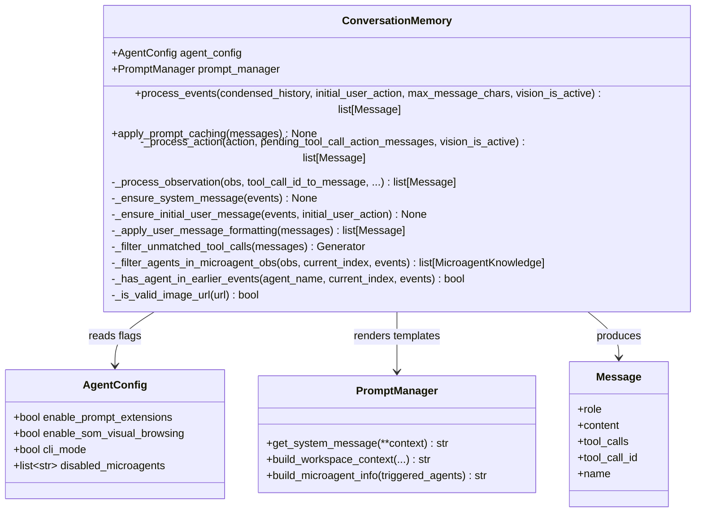
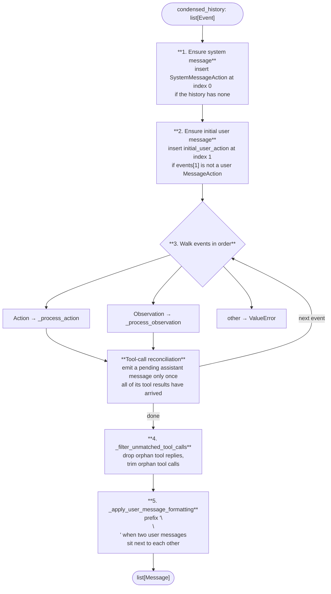
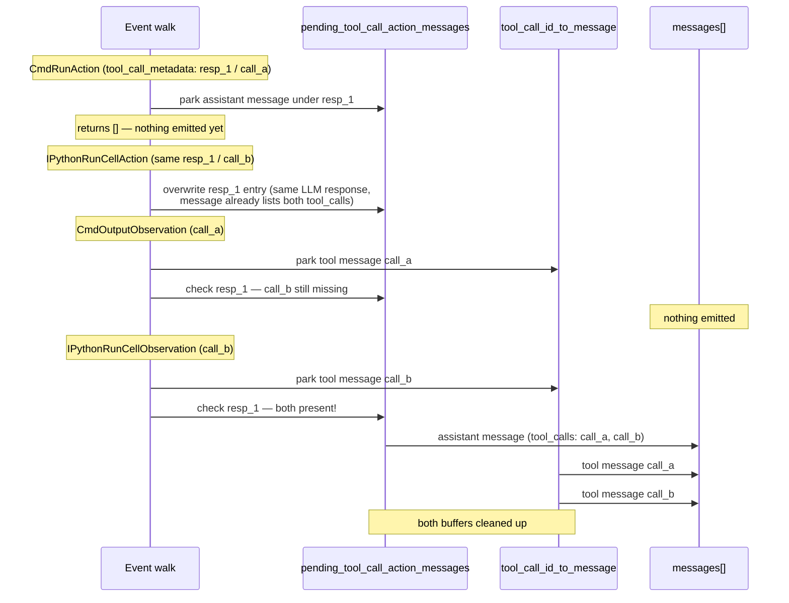
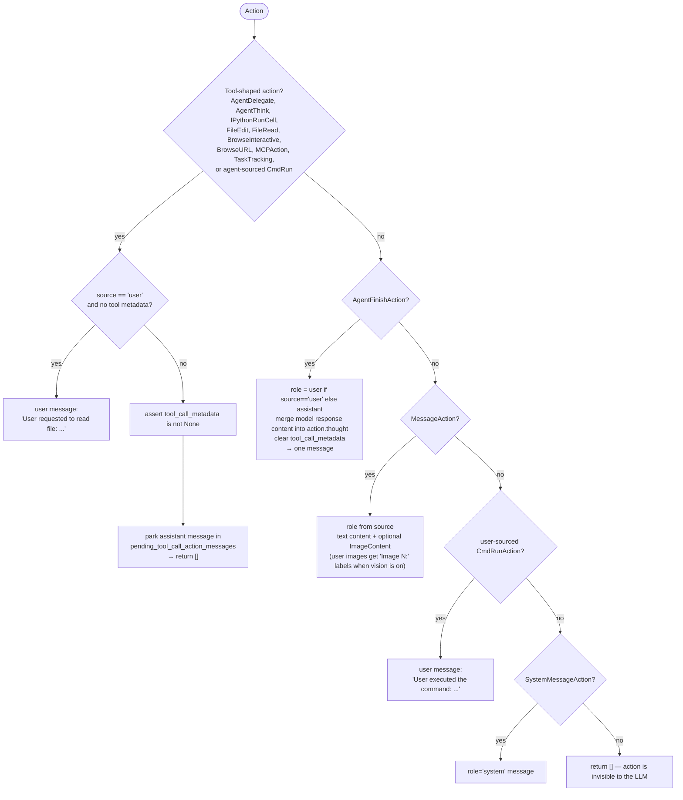
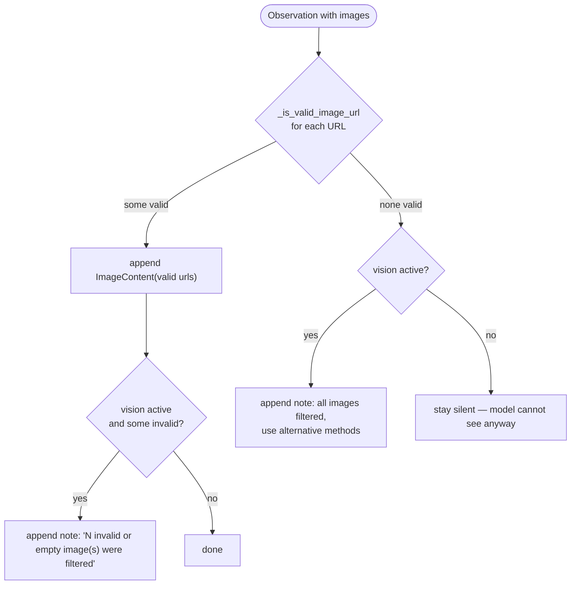
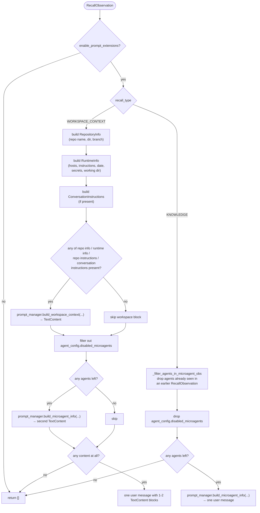
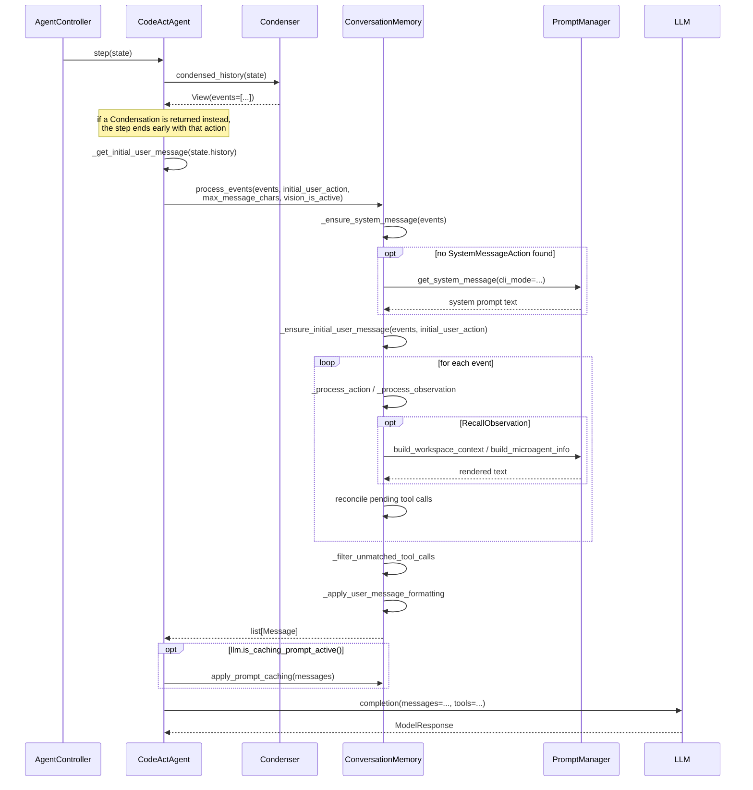

# Conversation Memory

## 1. Purpose

An LLM does not understand OpenHands events. It understands a flat list of chat
messages with roles (`system`, `user`, `assistant`, `tool`).

`ConversationMemory` is the translator between those two worlds. It takes the
event history — `CmdRunAction`, `CmdOutputObservation`, `RecallObservation`,
`BrowserOutputObservation`, and so on — and produces a list of `Message`
objects that can be handed straight to the LLM.

It is a small class with a big job, because the translation has many rules:

| Job | Why it matters |
| --- | --- |
| Map each event type to a message | Each action and observation has its own text format |
| Pair tool calls with tool results | LLM APIs reject an assistant tool call with no matching `tool` reply |
| Repair a broken history | The list must start with a system message, then a user message |
| Truncate long content | A 5 MB command output would blow the context window |
| Handle images | Only send image content when the model can actually see it |
| Render recalled knowledge | Repo info and microagent knowledge become readable prompt text |
| Mark cache breakpoints | Anthropic prompt caching needs explicit markers |
| Drop duplicates | The same microagent should not be injected twice |

In one line: **`ConversationMemory` is the last step before the LLM call, and it
must produce a message list that is valid, complete, and not too big.**

This document covers the `memory_and_condensers_conversation_memory` module,
whose only core component is
`openhands/memory/conversation_memory.py::ConversationMemory`.

---

## 2. Where it sits in the system

`ConversationMemory` is owned by the agent, not by the controller. `CodeActAgent`
creates one in its constructor and calls it once per step, after the condenser
has already decided which events survive.

Related modules:

- [Memory and Condensers](memory_and_condensers.md) — the parent module and the big picture.
- [Condenser Framework](memory_and_condensers_condenser_framework.md) — produces the `View` that becomes the input here.
- [Memory / Recall](memory_and_condensers_recall.md) — produces the `RecallObservation` events this module renders.
- [Agent Controller](agent_controller.md) — drives the loop that calls this module.
- [CodeAct Variants](agents_codeact_variants.md) — `ReadOnlyAgent` and `LocAgent` inherit this behaviour from `CodeActAgent`.
- [LLM Clients](llm_layer_clients.md) — supplies `vision_is_active()`, `is_caching_prompt_active()`, and `max_message_chars`.
- [Event System](event_system.md) — defines every `Action` and `Observation` type handled here.
- [Core Configuration](core_configuration.md) — `AgentConfig` and its feature flags.

---

## 3. Public surface

`ConversationMemory` has only two public methods. Everything else is a private
helper.

### `process_events(...)`

| Parameter | Meaning |
| --- | --- |
| `condensed_history` | The events that survived condensation. **Mutated in place** by the repair steps. |
| `initial_user_action` | The very first user `MessageAction` from the *full* history. Used to repair the start of the list. |
| `max_message_chars` | Per-observation character budget; longer content is truncated in the middle. |
| `vision_is_active` | Whether the LLM can see images. Controls extra descriptive text around images. |

Returns a `list[Message]` ready for `LLM.completion()`.

### `apply_prompt_caching(messages)`

Mutates the messages in place. Sets `cache_prompt = True` on the last content
item of the system message and on the last content item of the **last** `user`
or `tool` message. This is the Anthropic prompt-caching breakpoint scheme:
everything before the last breakpoint can be reused across turns.

---

## 4. The processing pipeline

`process_events` runs five stages in a fixed order. Stages 1 and 2 fix the
*input*; stage 3 does the conversion; stages 4 and 5 fix the *output*.

### Why the repair stages exist

Every LLM chat API expects the conversation to open with a system prompt and
then a user turn. A history can violate that in two ways:

- **Legacy conversations** were saved before `SystemMessageAction` existed, so
  there is no system event at all. Stage 1 rebuilds one by calling
  `prompt_manager.get_system_message(cli_mode=...)`.
- **Aggressive condensation** can forget the original user request. Stage 2
  re-inserts the `initial_user_action` that the agent pulled from the *full*
  history (see `CodeActAgent._get_initial_user_message`), so the LLM always
  knows what the task was.

Both stages mutate the `events` list that was passed in, so the indexes used
later for microagent de-duplication stay consistent.

---

## 5. Tool-call reconciliation

This is the most delicate part of the module. In function-calling mode, one LLM
response can request several tool calls at once. The API requires that an
assistant message with `tool_calls` be immediately followed by one `tool`
message per call — no gaps, no strays.

But OpenHands stores those pieces as separate events, and they can be far apart
in the history. So `ConversationMemory` buffers them:

- `pending_tool_call_action_messages: dict[response_id → Message]` — assistant
  messages waiting for their results.
- `tool_call_id_to_message: dict[tool_call_id → Message]` — results waiting for
  their assistant message.

An action that carries `tool_call_metadata` is **not** emitted right away; it is
parked in the pending dict keyed by the LLM response id. An observation that
carries `tool_call_metadata` is likewise parked as a `role='tool'` message keyed
by its `tool_call_id`. After each event, the loop checks every pending assistant
message: once *all* of its `tool_calls` have a matching result, the assistant
message and then its results are appended together, and both buffer entries are
removed.

### The safety net: `_filter_unmatched_tool_calls`

Condensation can delete an observation while keeping its action, or the other
way round. That would leave the message list invalid, and the LLM API would
return a hard error. The final filter walks the list and:

- keeps a `tool` message only if some assistant message actually declares that
  `tool_call_id`;
- keeps an assistant message unchanged if *all* of its tool calls have replies;
- otherwise **copies** the message (`model_copy`) with only the matched tool
  calls kept, and drops it entirely if none matched.

The original messages are never mutated — a copy is made whenever `tool_calls`
has to change.

---

## 6. Action handling

`_process_action` splits actions into five groups.

Notes worth remembering:

- **`AgentFinishAction` is rewritten.** Its tool metadata has already been
  executed and has no pending response, so the content of the LLM response is
  folded into `action.thought` and the metadata is cleared. This mutates the
  action object.
- **Unknown actions are silently skipped** (`return []`). This is deliberate —
  new internal action types should not break existing conversations.
- **A user-sourced tool-shaped action with no metadata** still produces a
  message, so manual `/read`-style user commands are not lost.

---

## 7. Observation handling

`_process_observation` is a long `isinstance` chain. Most branches follow the
same shape: take the content, truncate it, wrap it in a `user` message.

| Observation | Formatting rule |
| --- | --- |
| `CmdOutputObservation` | `to_agent_observation()`; if there is no tool metadata, prefix "Observed result of command executed by user" |
| `MCPObservation` | plain truncated content |
| `IPythonRunCellObservation` | replaces inline base64 PNGs with a placeholder line, then attaches valid image URLs |
| `FileEditObservation` | `str(obs)`, truncated |
| `FileReadObservation` | content used as-is (already truncated by `openhands-aci`) |
| `BrowserOutputObservation` | text plus a set-of-marks or screenshot image, gated by `enable_som_visual_browsing` |
| `AgentDelegateObservation` | `outputs['content']`, falling back to `content` |
| `AgentThinkObservation` | plain truncated content |
| `TaskTrackingObservation` | plain truncated content |
| `ErrorObservation` | content + `"[Error occurred in processing last action]"` |
| `UserRejectObservation` | `"OBSERVATION:"` header + `"[Last action has been rejected by the user]"` |
| `AgentCondensationObservation` | plain truncated content — this is how a condenser's summary reaches the LLM |
| `FileDownloadObservation` | plain truncated content |
| `RecallObservation` | rendered through `PromptManager` — see section 8 |
| anything else | **raises `ValueError`** |

The strict `ValueError` at the end is intentional: a silently dropped
observation would leave a tool call unanswered and break the next LLM call, so
failing loudly is safer.

### Truncation

`truncate_content(content, max_chars)` from
`openhands/events/serialization/event.py` cuts the **middle** out and inserts
`[... Observation truncated due to length ...]`. Keeping both ends means the
agent still sees the command it ran and the final error line.

### Image handling

Images are only useful if the model can see them, so every image path is guarded
twice: by `_is_valid_image_url` (non-empty after strip) and by
`vision_is_active`.

The explanatory notes exist so a vision-capable agent understands *why* it sees
no picture and can fall back to text. When vision is off, adding such a note
would only waste tokens, so it is skipped.

For `BrowserOutputObservation` the image is chosen by preference:
`set_of_marks` first (annotated screenshot, better for clicking), then
`screenshot`. Images are attached only when the observation was triggered by
`ActionType.BROWSE_INTERACTIVE` **and** `enable_som_visual_browsing` is on. See
[Visual Browsing Agent](agents_browsing_visual_agent.md) for the consumer side.

---

## 8. Rendering recalled knowledge

`RecallObservation` is different from every other observation: it holds
structured data, not text. `ConversationMemory` turns it into prose using
`PromptManager`'s Jinja templates.

The whole branch is gated by `agent_config.enable_prompt_extensions`. When that
flag is off, every `RecallObservation` renders to `[]` — the agent runs with a
bare system prompt.

### De-duplicating microagent knowledge

Microagents are triggered by keywords. If the user says "python" three times,
`Memory` emits three `RecallObservation`s all carrying the same
`python_best_practices` knowledge. Injecting it three times wastes context and
adds no information.

`_has_agent_in_earlier_events(agent_name, current_index, events)` scans
`events[:current_index]` for any `RecallObservation` (including
`WORKSPACE_CONTEXT` ones) that already mentions that agent name. Only the
**first** occurrence survives.

This is why `_process_observation` receives `current_index` and the whole
`events` list — the decision is positional, not local to one observation. It
also explains why the repair stages must run *before* the walk: inserting events
afterwards would shift the indexes.

---

## 9. Consecutive user messages

Because almost every observation becomes a `user` message, real conversations
produce long runs of user turns. `_apply_user_message_formatting` walks the
final list and, whenever a `user` message directly follows another `user`
message, prepends `\n\n` to that message's first `TextContent`.

This is a purely cosmetic-but-important step: without the blank line, a command
output and the next observation would visually run together in the prompt, and
models read the boundary less reliably.

Note that this mutates the `TextContent` objects in place.

---

## 10. End-to-end example

One agent step, from controller to LLM call:

---

## 11. Design notes and gotchas

**It mutates its inputs.** `process_events` inserts events into
`condensed_history`; `_process_action` rewrites `AgentFinishAction.thought` and
clears its `tool_call_metadata`; `_apply_user_message_formatting` edits
`TextContent.text`; `apply_prompt_caching` sets `cache_prompt`. Callers should
not assume the lists they pass in are untouched.

**Strict on observations, lenient on actions.** Unknown observations raise;
unknown actions are ignored. The asymmetry is on purpose: an unanswered tool
call is a hard API error, while an extra internal action is harmless.

**Order of the five stages is load-bearing.** Repair must precede the walk
(microagent de-duplication uses indexes), and the tool-call filter must follow
the walk (it needs the complete set of ids).

**Stateless between calls.** The instance holds only `agent_config` and
`prompt_manager`. Both buffers are local to a single `process_events` call, so
the whole message list is rebuilt from scratch every step. That costs a little
CPU but means a re-condensed history can never leave stale state behind.

**Feature flags that change the output:**

| Flag | Effect when off |
| --- | --- |
| `enable_prompt_extensions` | all `RecallObservation`s render to nothing |
| `enable_som_visual_browsing` | browser screenshots are never attached |
| `cli_mode` | changes which system prompt template is rendered |
| `disabled_microagents` | named microagents are stripped from both recall types |

**Who else uses it.** `CodeActAgent` owns the only instantiation, so every agent
that inherits from it — `ReadOnlyAgent`, `LocAgent`, and the enterprise variants
— shares this exact behaviour. `BrowsingAgent` and `VisualBrowsingAgent` build
their prompts differently and do not use this module; see
[Browsing Agents](agents_browsing.md).
