# LLM Condensers

## Introduction

An agent's conversation history grows with every action and observation. Left alone, it will
eventually blow past the model's context window. **Condensers** stop that from happening by
shrinking the history before it is sent to the LLM.

This module holds the three condensers that use an **LLM itself** to decide what to keep:

| Condenser | Strategy | What it produces |
| --- | --- | --- |
| `LLMSummarizingCondenser` | Ask the model to write a free-text state summary of the dropped events | A range of forgotten event IDs + a text summary |
| `StructuredSummaryCondenser` | Same idea, but force the model to fill in a fixed set of fields via function calling | A range of forgotten event IDs + a rendered Markdown summary |
| `LLMAttentionCondenser` | Ask the model to *rank* events by importance, then keep the top ones | A list of forgotten event IDs, no summary |

The first two are **lossy-but-remembering**: they throw events away and leave a written summary
behind. The third is **lossy-and-forgetting**: it keeps the events the model thinks matter and
silently drops the rest.

All three are thin strategy implementations on top of the shared machinery described in
[Condenser Framework](memory_and_condensers_condenser_framework.md). Read that document first if
you are unfamiliar with `Condenser`, `RollingCondenser`, `View`, or `Condensation`.

**Files in this module**

- `openhands/memory/condenser/impl/llm_summarizing_condenser.py` — `LLMSummarizingCondenser`
- `openhands/memory/condenser/impl/structured_summary_condenser.py` — `StructuredSummaryCondenser`, `StateSummary`
- `openhands/memory/condenser/impl/llm_attention_condenser.py` — `LLMAttentionCondenser`, `ImportantEventSelection`

---

## Where this module sits

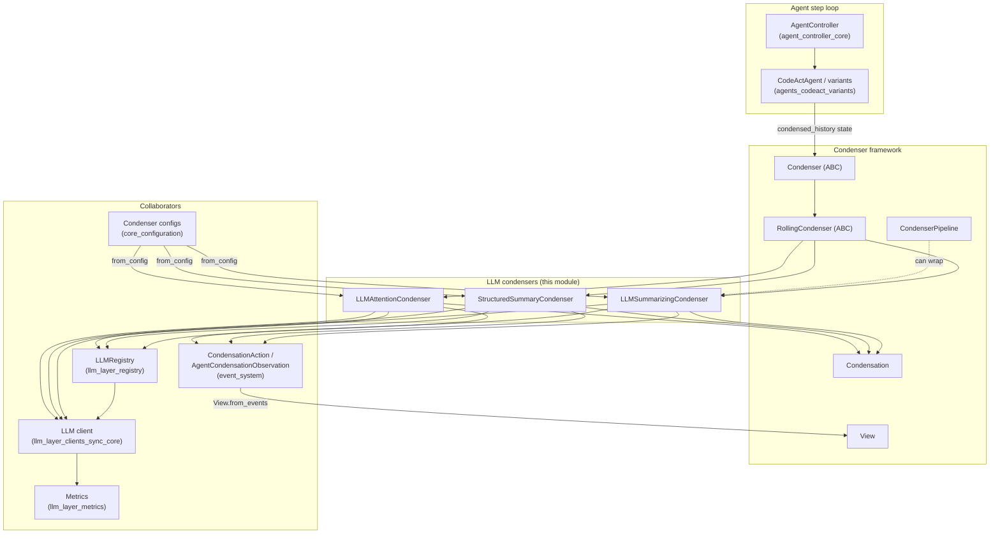

Related modules:

- [Condenser Framework](memory_and_condensers_condenser_framework.md) — `Condenser`, `RollingCondenser`, `View`, `Condensation`, `CondenserPipeline`
- [Structural Condensers](memory_and_condensers_structural_condensers.md) — no-LLM alternatives (`RecentEventsCondenser`, `AmortizedForgettingCondenser`, `ConversationWindowCondenser`)
- [Masking Condensers](memory_and_condensers_masking_condensers.md) — condensers that shrink *content* rather than drop events
- [Conversation Memory](memory_and_condensers_conversation_memory.md) — turns the resulting `View` into LLM messages
- [LLM Registry](llm_layer_registry.md) and [LLM Clients](llm_layer_clients_sync_core.md) — where the condenser LLM comes from
- [Core Configuration](core_configuration.md) — the `*CondenserConfig` Pydantic models
- [Event System](event_system.md) — `CondensationAction`, `AgentCondensationObservation`

---

## Class structure

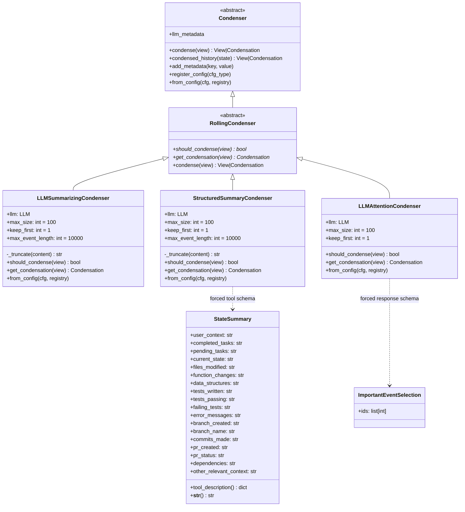

`StateSummary` and `ImportantEventSelection` are both Pydantic models used for one purpose: to
force the LLM to answer in a shape the code can parse without guessing.

---

## The shared rolling contract

Every condenser here inherits `RollingCondenser.condense`, which is a simple two-branch decision:

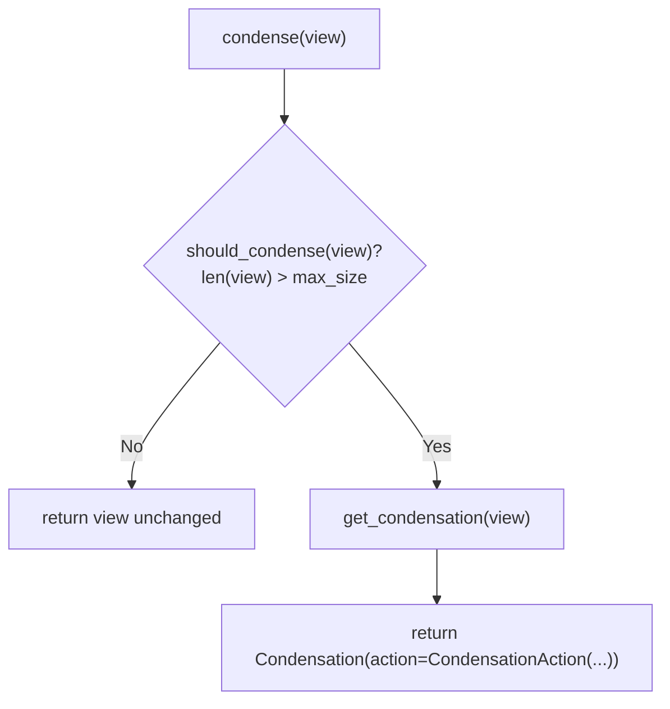

The agent does not apply the condensation itself. It returns the `CondensationAction` as its
action for that step. The action lands in the event stream, and on the *next* step
`View.from_events` rebuilds the history with the forgotten events removed and the summary spliced
back in. That is the whole trick: **condensation is an event, not a mutation.**

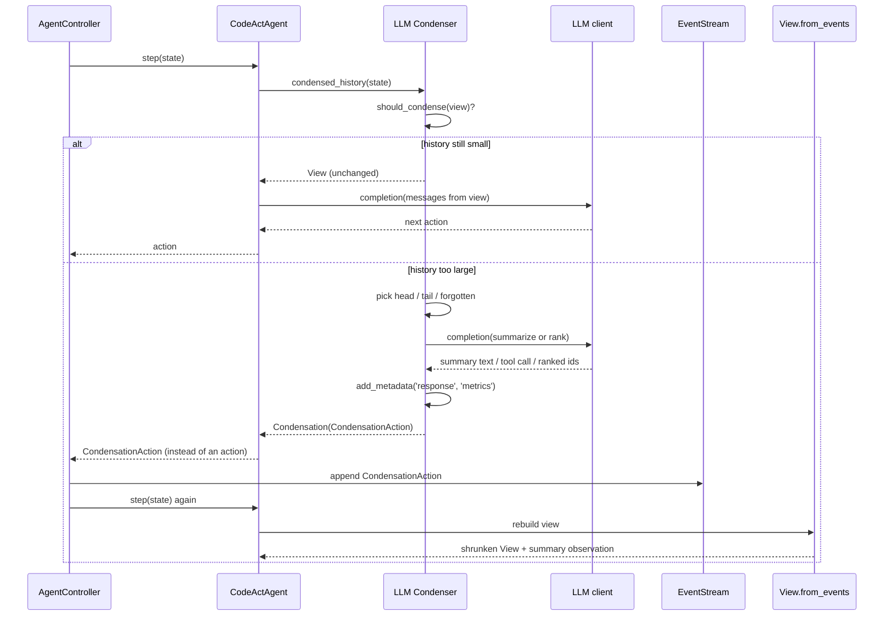

Metadata added with `add_metadata` (`response`, `metrics`) is flushed into
`state.extra_data` by the framework's `metadata_batch` context manager, so every condensation is
traceable after the fact.

### Sizing arithmetic (shared by the two summarizing condensers)

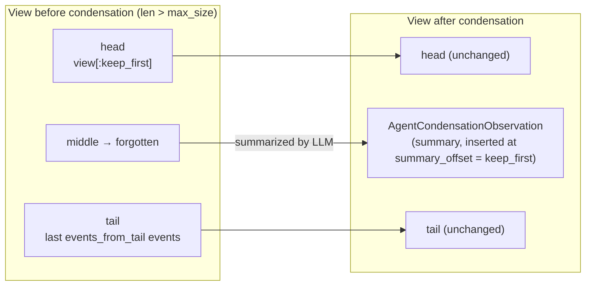

The numbers:

```
target_size      = max_size // 2
events_from_tail = target_size - len(head) - 1     # the -1 reserves a slot for the summary
forgotten        = view[keep_first : -events_from_tail]
                   (minus any AgentCondensationObservation already in there)
```

So a condenser with `max_size=100, keep_first=1` fires at 101 events and cuts back to roughly
50: 1 head event + 1 summary + 48 tail events.

The constructor guards keep this arithmetic sane:

- `keep_first >= max_size // 2` → `ValueError`. Without this, `events_from_tail` could reach zero
  or go negative and the `view[keep_first:-events_from_tail]` slice would silently mean the wrong
  thing.
- `keep_first < 0` → `ValueError`
- `max_size < 1` → `ValueError`

### Recursive summarization

The summary from the previous condensation is not thrown away. `View.from_events` inserts it as an
`AgentCondensationObservation` at `summary_offset`, which is exactly `keep_first` — so on the next
condensation, `view[keep_first]` *is* the old summary. Both summarizing condensers read it, feed it
to the model as `<PREVIOUS SUMMARY>`, and ask for an updated one. If the slot does not hold a
summary observation (first condensation), they substitute
`AgentCondensationObservation('No events summarized')`.

Any `AgentCondensationObservation` found in the middle range is excluded from `forgotten_events` —
the old summary is superseded by the new one, not re-summarized as raw content.

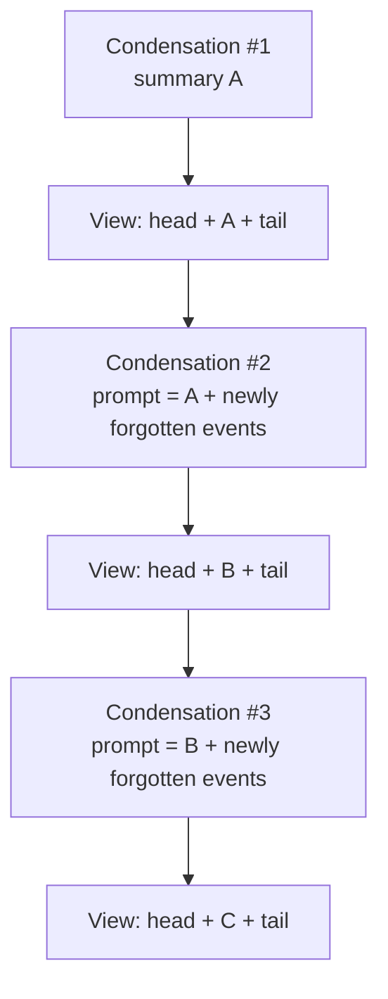

Because each summary folds in the one before it, context survives an unbounded number of
condensations — at the cost of gradual detail loss, like a photocopy of a photocopy.

---

## `LLMSummarizingCondenser`

The default LLM-based strategy: ask a model to keep a **free-text, sectioned state summary**
up to date.

### Behaviour

1. `should_condense` → `len(view) > max_size`.
2. Split the view into head / forgotten / tail using the arithmetic above.
3. Build one long user prompt:
   - a fixed instruction block telling the model to track `USER_CONTEXT`, `TASK_TRACKING`,
     `COMPLETED`, `PENDING`, `CURRENT_STATE`, and — for code work — `CODE_STATE`, `TESTS`,
     `CHANGES`, `DEPS`, `VERSION_CONTROL_STATUS`, plus two worked examples;
   - the previous summary wrapped in `<PREVIOUS SUMMARY>…</PREVIOUS SUMMARY>`;
   - each forgotten event as `<EVENT id=N>…</EVENT>`, using `str(event)`;
   - a closing `Now summarize the events using the rules above.`
4. Every piece of content passes through `_truncate`, which calls `truncate_content` with
   `max_chars=max_event_length` (default 10,000). This stops one enormous observation — a giant
   file read or command dump — from filling the whole summarization prompt.
5. Call `self.llm.completion(...)` with `extra_body={'metadata': self.llm_metadata}` so the
   request is attributable to the condenser rather than the agent.
6. Record `response` and `metrics` metadata.
7. Return a `Condensation` whose `CondensationAction` carries
   `forgotten_events_start_id` / `forgotten_events_end_id` (a *range*), `summary`, and
   `summary_offset=keep_first`.

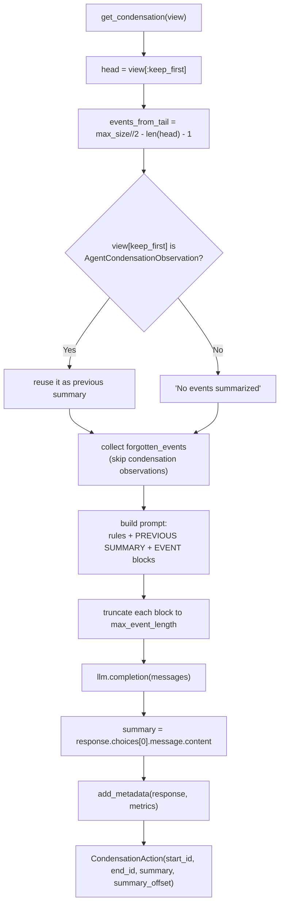

### Notes on the prompt design

The instruction block is deliberately opinionated. It insists that task IDs and statuses are
preserved verbatim, so that a task-tracker running across a condensation boundary does not lose
its handle on open work. It also tells the model to *adapt* the section list to the task type,
which is why the examples show both a code task and a non-code task.

---

## `StructuredSummaryCondenser`

Same lifecycle as `LLMSummarizingCondenser`, but the summary is not free text. The model is forced
to call a synthetic tool and fill in the fields of `StateSummary`.

### `StateSummary`

An 18-field Pydantic model, every field a `str` defaulting to `''`, grouped into:

- **Core** — `user_context`, `completed_tasks`, `pending_tasks`, `current_state`
- **Code state** — `files_modified`, `function_changes`, `data_structures`
- **Tests** — `tests_written`, `tests_passing`, `failing_tests`, `error_messages`
- **Version control** — `branch_created`, `branch_name`, `commits_made`, `pr_created`, `pr_status`
- **Other** — `dependencies`, `other_relevant_context`

Two methods matter:

- `tool_description()` walks `model_fields` and generates an OpenAI-style function schema named
  `create_state_summary`, using each field's `description` as the parameter description. Only
  `user_context`, `completed_tasks`, and `pending_tasks` are marked required. Because the schema is
  derived from the model, adding a field to `StateSummary` automatically extends the tool — there
  is no second place to update.
- `__str__()` renders the fields as a Markdown document (`# State Summary` with
  `## Core Information`, `## Code Changes`, `## Testing Status`, `## Version Control`,
  `## Additional Context`). That rendered string — not JSON — is what goes into
  `CondensationAction.summary`, so the next condensation reads it back as readable prose.

### Flow and error handling

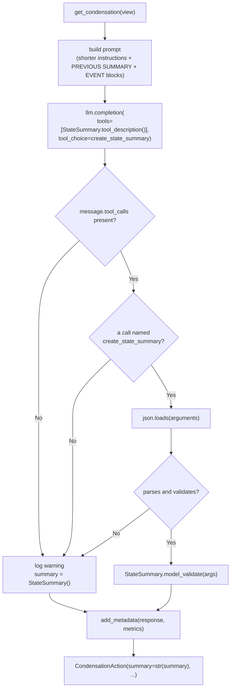

`ValueError`, `AttributeError`, `KeyError`, and `json.JSONDecodeError` are all caught. On failure
the condenser logs a warning and falls back to an **empty** `StateSummary`. This is a deliberate
trade-off: condensation always succeeds and the agent keeps running, but a parse failure means the
forgotten events are replaced by a summary full of blank fields — real context loss that only shows
up as a log line. Watch for `Failed to parse summary tool call` in logs.

### Extra requirement

The constructor rejects an LLM that cannot do function calling:

```python
if not self.llm.is_function_calling_active():
    raise ValueError('LLM must support function calling to use StructuredSummaryCondenser')
```

### Choosing between the two summarizers

| | `LLMSummarizingCondenser` | `StructuredSummaryCondenser` |
| --- | --- | --- |
| Output shape | Whatever the model writes | Fixed 18 fields, rendered to Markdown |
| Model requirement | Any chat model | Must support function calling |
| Prompt size | Large (rules + 2 examples) | Smaller instruction block |
| Failure mode | Malformed prose, still usable | Silent empty summary on parse failure |
| `llm_metadata` forwarded | Yes (`extra_body`) | No |
| Best when | Model is weak at tool use, or you want the model to pick its own sections | You want machine-comparable, predictable summaries |

---

## `LLMAttentionCondenser`

A different philosophy: do not write anything down, just decide **which events to keep**.

### Behaviour

1. `should_condense` → `len(view) > max_size`.
2. `target_size = max_size // 2`; `head_event_ids = ids of view[:keep_first]`;
   `events_from_tail = target_size - len(head_event_ids)` (no `-1`, because there is no summary to
   make room for).
3. Send the model a ranking instruction, then **one message per event in the whole view**,
   formatted `<ID>{id}</ID>\n<CONTENT>{message}</CONTENT>`, and ask it to sort the identifiers
   from most to least important for the next step.
4. Constrain the reply with `response_format={'type': 'json_schema', ...}` built from
   `ImportantEventSelection.model_json_schema()`, then parse with
   `ImportantEventSelection.model_validate_json`.
5. Post-process the returned IDs:
   - drop any ID already in the head (the head is kept unconditionally, so re-listing it would
     waste keep-slots);
   - truncate to `events_from_tail`;
   - **backfill**: if the model returned too few IDs, walk the view in reverse and append unseen
     IDs until the quota is met. Recency is the tie-breaker, and it also protects against a model
     that returns a short or partial list.
6. Everything not in the kept set and not in the head becomes `forgotten_event_ids` — a *list*,
   not a range, since kept events can be scattered anywhere in the history.
7. Record `metrics` metadata (note: unlike the summarizers, it does **not** record the raw
   `response`).

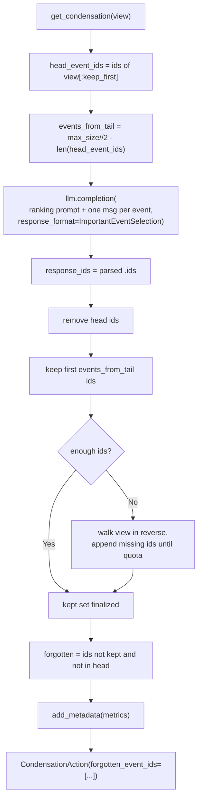

### Extra requirement

The constructor checks LiteLLM's capability table:

```python
if not supports_response_schema(model=self.llm.config.model,
                                custom_llm_provider=self.llm.config.custom_llm_provider):
    raise ValueError("The LLM model must support the 'response_schema' parameter ...")
```

### Cost characteristics

This condenser sends the **entire current view** to the model on every condensation, one message
per event, and it does not truncate event content (there is no `max_event_length` knob). On a long
history with large observations that is an expensive call. In exchange, no summarization work is
duplicated across condensations — but also, nothing is retained about the dropped events. If an
event is forgotten here, its information is gone from the view for good.

---

## Configuration and construction

Each class ends with a `register_config(...)` call, which adds an entry to the framework's
`CONDENSER_REGISTRY` keyed by config type. `Condenser.from_config` then dispatches on
`type(config)` and delegates to the matching class's `from_config`.

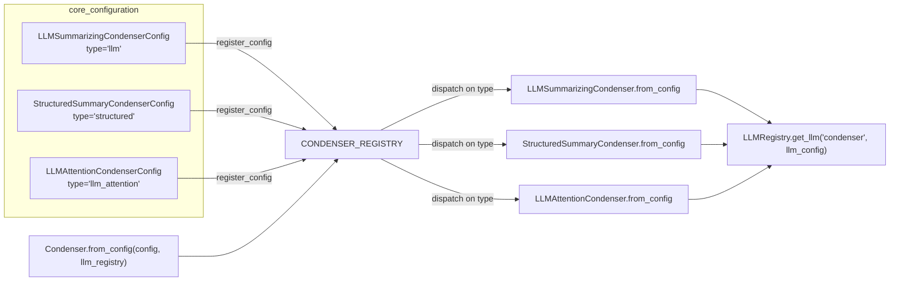

### Config fields

| Field | `llm` | `structured` | `llm_attention` | Default |
| --- | :---: | :---: | :---: | --- |
| `llm_config` | ✅ | ✅ | ✅ | required |
| `keep_first` | ✅ | ✅ | ✅ | `1` (≥ 0) |
| `max_size` | ✅ | ✅ | ✅ | `100` (≥ 2) |
| `max_event_length` | ✅ | ✅ | — | `10_000` |

All three configs set `model_config = ConfigDict(extra='forbid')`, so a typo'd key is a startup
error rather than a silently ignored setting.

### The prompt-caching detail

All three `from_config` methods do the same thing before asking for an LLM:

```python
llm_config = config.llm_config.model_copy()
llm_config.caching_prompt = False
llm = llm_registry.get_llm('condenser', llm_config)
```

The reasoning, quoted from the source: *"This condenser cannot take advantage of prompt caching.
If it happens to be set, we'll pay for the cache writes but never get a chance to save on a read."*
Each condensation prompt is different — new events, new previous summary — so no cache entry is
ever read twice. Copying the config first (`model_copy()`) keeps the agent's own LLM config
untouched.

Note the shared service ID `'condenser'`. `LLMRegistry.get_llm` returns the existing instance if
the ID is already registered with an identical config, and raises `ValueError` if the same ID is
requested with a *different* config. Two condensers with different LLM settings in the same
registry will therefore conflict — something to be aware of when composing a
[`CondenserPipeline`](memory_and_condensers_condenser_framework.md).

### Example (TOML)

```toml
[condenser]
type = "llm"
keep_first = 1
max_size = 80
max_event_length = 8000

[condenser.llm_config]
model = "anthropic/claude-sonnet-4-5"
```

---

## Choosing a strategy

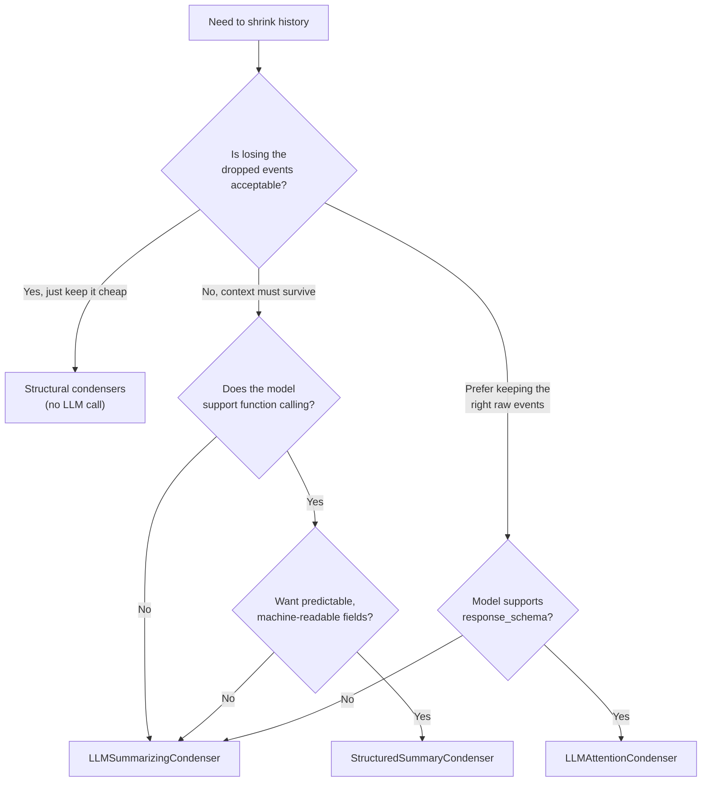

Every strategy in this module costs an extra LLM call at each condensation, on the critical path of
an agent step. If cost or latency matters more than fidelity, prefer the
[structural condensers](memory_and_condensers_structural_condensers.md) or combine a cheap
structural condenser with a masking one via `CondenserPipeline`.

---

## Operational notes and edge cases

- **Empty `forgotten_events`.** Both summarizing condensers call
  `min(event.id for event in forgotten_events)`. If the middle slice happens to contain nothing but
  `AgentCondensationObservation`s, `forgotten_events` is empty and `min()` raises `ValueError`. In
  practice the `keep_first < max_size // 2` guard plus the `len(view) > max_size` trigger keep the
  slice non-empty, but unusual `keep_first`/`max_size` pairs are worth testing.
- **Range vs. list semantics.** The summarizers emit `forgotten_events_start_id` /
  `forgotten_events_end_id`, which `CondensationAction.forgotten` expands into every ID in that
  inclusive range — including any IDs never seen by the condenser. `LLMAttentionCondenser` emits an
  explicit ID list. `CondensationAction` validates that exactly one of the two forms is used, and
  that `summary` and `summary_offset` are either both set or both unset.
- **Attention condenser leaves no trace.** It produces no summary, so `View.from_events` inserts no
  `AgentCondensationObservation`. Whatever was forgotten is unrecoverable from the view.
- **`llm_metadata`.** Only `LLMSummarizingCondenser` forwards it via `extra_body`. If you rely on
  per-request attribution or observability tagging, the other two condensers' calls will not carry
  it.
- **Cost accounting.** All three push `self.llm.metrics.get()` into condensation metadata, so token
  and dollar cost of condensation is visible in `state.extra_data` alongside the agent's own
  spend. See [Metrics](llm_layer_metrics.md).
- **Truncation is per-event, not per-prompt.** `max_event_length` bounds each event's rendered
  string, but a large number of medium events can still produce a very large summarization prompt.
  Tune `max_size` together with `max_event_length`.

---

## Summary

| Aspect | `LLMSummarizingCondenser` | `StructuredSummaryCondenser` | `LLMAttentionCondenser` |
| --- | --- | --- | --- |
| Config type | `llm` | `structured` | `llm_attention` |
| Trigger | `len(view) > max_size` | `len(view) > max_size` | `len(view) > max_size` |
| Target size | `max_size // 2` | `max_size // 2` | `max_size // 2` |
| LLM mechanism | Plain completion | Forced tool call | JSON response schema |
| Model capability needed | none | function calling | `response_schema` |
| Forgotten events specified as | ID range | ID range | ID list |
| Leaves a summary | Yes (free text) | Yes (rendered Markdown) | No |
| Recursive over prior summary | Yes | Yes | n/a |
| Event truncation | `max_event_length` | `max_event_length` | none |
| Failure fallback | LLM/parse errors propagate | Empty `StateSummary` + warning | Parse errors propagate; short lists backfilled by recency |

All three plug into the same contract — `should_condense` + `get_condensation` — so they are
interchangeable at configuration time and composable inside a `CondenserPipeline`. The choice comes
down to what the target model can do and whether you would rather **remember a compressed version
of everything** or **keep a subset of things exactly as they were**.
